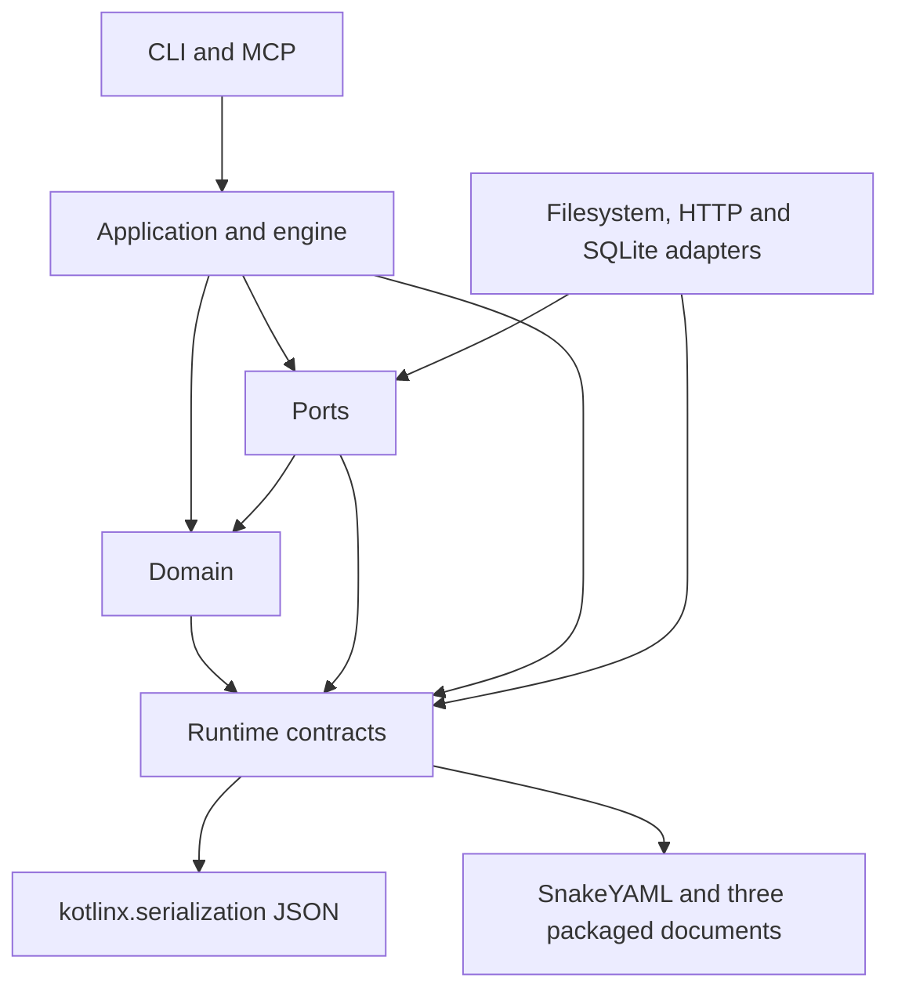

# Runtime-contracts architectural investigation

## Assessment

Keep the module. Its dependency direction and most of its types are appropriate for a shared contract library. Repair input interpretation and delete redundant helpers. A new module hierarchy, a port for every parser, or a serialization framework would increase maintenance without addressing the findings.

The module does not yet meet its own loud-fail and single-owner requirements consistently. This investigation found eight bounded issues. The highest priorities are parsers that silently change input and JSON helpers that erase the difference between malformed data and absence.

Reviewed on 2026-09-16, starting at `97c48855dae9777e95c172502b6a1687e25f0d79` on `main`. Scope includes all 78 production Kotlin files, 3,349 lines, all six module test files, the module build script, associated canonical schemas, and selected consumers in domain, application, adapters, and composition. This is an architectural investigation of the current module, not a diff review or a governed review-driver verdict.

## Structure and ownership

`runtime-contracts/build.gradle.kts` has no project dependencies. The two production libraries are kotlinx.serialization JSON and SnakeYAML. The module has two interfaces, `JsonPayloadContract` and `FailureWireCode`. Both describe narrow operations used across modules. There is no repository/service hierarchy, dependency injection graph, process launcher, database connection, or network client here.

Most files declare area-specific wire keys, versions, schema locations, DTOs, or typed exceptions. Their small size is not evidence of over-engineering. Typed failures and schema parity are explicit product requirements. Application models reach payloads through application-owned mapping, as required by the declared architecture.

The module also owns three lazy classpath loaders, JSON value conversion, the ambient clock, schema-failure logging, and an unused mutable diagnostic binding. Classpath loading here is a limited effect boundary, not a pure domain operation. Keep the packaged inputs and existing libraries for this scope. Moving every loader behind a new port would create a much larger dependency change for three static resources. Document this ownership accurately and make its validation reliable. The architecture text at `runtime-kotlin/ARCHITECTURE.md:266` correctly places the clock here, but its broad statement about resource copy tasks omits the three tasks still present in this module.

## Principles assessment

| Principle | Assessment and evidence |
| --- | --- |
| Clean and hexagonal architecture | The Gradle graph points inward and JSON-Schema validators live in filesystem infrastructure. Contracts are a shared wire library, not the application core. Keep real adapter ports; do not manufacture ports around DTOs. Packaged resource parsing needs an explicit documented exception to any claim of effect purity. |
| Single responsibility | Area DTOs and error families are cohesive. `WorkflowContracts` duplicates application mapping ownership, F-006. `JsonCodec` also mixes conversion with recovery decisions, F-003. |
| Open/closed | Contract DTOs do not hard-code platform lists. Open telemetry and pack payloads should stay open. Adding a generic plugin registry or an enum for every string would weaken this property. |
| Liskov substitution | `JvmSystemClock.withZone` violates the live-clock behavior of its parent type, F-005. The exception taxonomy has deliberate differences that must remain, especially database failures outside terminal domain errors. |
| Interface segregation | The two interfaces are narrow. No interface split is justified. Single-adapter ports outside this module remain valid where they isolate effects or permit useful test substitutes. |
| Dependency inversion | No upward project dependency. The two libraries support this module's stated wire responsibilities. Domain imports are checked separately. Avoid relocating a contract into domain if contracts must read it. F-007 identifies one split owner that should move inward. |
| YAGNI and simplicity | Delete the unused diagnostic object and unused helpers, F-008. Merge the map-copying pass into its existing application owner, F-006. Use the JDK clock implementation, F-005. Do not replace useful DTOs with raw maps to lower the class count. |
| Failure and state ownership | Typed errors and lazy initialization are useful. Numeric coercion, defaulting of malformed fields, and silent JSON fallback break the intended contract, F-001 through F-004. No current cross-run contamination is claimed for the unused diagnostic object. |
| Testing | Existing module and selected architecture tests pass, but executable probes reproduce the reported gaps. Import scans and version parity do not prove value-level parser correctness. |

## Findings

Paths below are repository-relative and refer to the recorded source snapshot.

- [F-001] Major | High | `runtime-kotlin/runtime-contracts/src/main/kotlin/skillbill/contracts/goalplanning/GoalVerificationBoundaryCaps.kt:89` | Canonical document readers coerce invalid numbers and only partially enforce their schemas.
- [F-002] Major | High | `runtime-kotlin/runtime-contracts/src/main/kotlin/skillbill/contracts/decomposition/DecompositionPlanningContracts.kt:220` | Present malformed planning and scaffold fields become omission or defaults.
- [F-003] Minor | High | `runtime-kotlin/runtime-contracts/src/main/kotlin/skillbill/contracts/JsonCodec.kt:37` | Array parsing makes malformed input indistinguishable from an empty result, and consumers reconstruct that distinction incorrectly or lose it.
- [F-004] Minor | High | `runtime-kotlin/runtime-contracts/src/main/kotlin/skillbill/contracts/JsonCodec.kt:120` | Generic JSON conversion silently rounds numbers and drops map entries.
- [F-005] Minor | High | `runtime-kotlin/runtime-contracts/src/main/kotlin/skillbill/contracts/time/JvmSystemClock.kt:11` | Changing the zone of the ambient clock freezes its time source.
- [F-006] Minor | High | `runtime-kotlin/runtime-contracts/src/main/kotlin/skillbill/contracts/workflow/WorkflowContracts.kt:4` | A second map-building layer repeats the application mapper's closed field list and wire vocabulary.
- [F-007] Minor | High | `runtime-kotlin/runtime-contracts/src/main/kotlin/skillbill/error/FailureWireCodeContract.kt:16` | Phase-output failure classification has two owners across contracts and domain.
- [F-008] Minor | High | `runtime-kotlin/runtime-contracts/src/main/kotlin/skillbill/contracts/diagnostics/RecordingNullObjectDiagnostics.kt:3` | An unreachable global binding and unused parser/constant forwarders remain in the published module.

### F-001. Enforce canonical document values without coercion

`GoalVerificationBoundaryCaps.requiredPositiveInt` accepts any `Number` and calls `toInt`. The probe shows `1.9` and `4294967297` both becoming `1`, and YAML `.inf` becoming `2147483647`. `IssueKeyShape.kt:91` has the same conversion, accepting `maxLength: 1.9` as `1`. The cap controls how much verification discovery reads. A malformed packaged document can therefore change a safety budget instead of stopping initialization.

`GoalPlanningDiscoveryExclusions.kt:93` accepts duplicate roots and directory names despite both canonical schema arrays declaring `uniqueItems: true`. All three readers parse YAML themselves; version checks do not establish schema parity. Caps and issue-key readers use `runCatching` around YAML loading, which catches every throwable before replacing it with a schema error. That broad classification is unnecessary even though normal parsing is synchronous and no cancellation failure was reproduced.

Use exact finite integer validation with explicit representable bounds. Keep `maxBoundaryFileBytes` consistent with its declared Long API rather than routing it through Int. Reject schema-forbidden duplicate entries. Give consumed governed document keys one owner. Narrow parse catches, preserve causes where the existing error family can carry them, and preserve cancellation or VM failures. Test malformed documents alongside the shipped happy path. Do not add a general schema interpreter to this module.

### F-002. Default only absent or explicitly allowed empty input

The planning decoder's `listValue` casts then calls `orEmpty`. The probe supplies `stack_branches: "invalid"` and receives an empty list. CLI and MCP workflow updates call this decoder before the application builds and validates a manifest. A later validator may reject missing branches for stacked execution, but it cannot recover the discarded input or reliably identify the original field. Preserve existing non-decomposition mode behavior and documented aliases; do not turn this repair into a new planning language.

`scaffold/wire/ScaffoldPayloadParsing.kt:32` defaults a present wrong-type string. `optionalString` at line 49 has the same ambiguity. Both CLI and MCP scaffold request parsers call these functions for description and content. The probe shows `description: 123` becoming an empty description. A malformed content body can similarly become absence and select generated content. `optionalList` already distinguishes absence from wrong type, so the inconsistency has a small local remedy.

Reject present wrong-type values with the existing field-specific error family before a write. Preserve documented omitted, null, blank, and alias behavior individually. Do not repair unused `requireInt`; delete it under F-008.

### F-003. Make JSON parse failure distinguishable at the caller boundary

`parseArrayOrEmpty` returns the same value for `[]`, `[ ]`, `{}`, and `broken`. `parseObjectOrNull` similarly collapses wrong-root and syntax failure. Some callers report failure, others discard it. `UpdateCheckService.kt:93` tries to identify invalid arrays by comparing the original text with `[]`, so a valid whitespace-formatted empty array is classified as malformed. `GoalTelemetryPayloads.kt:26` uses the same comparison and logs a false parse failure. `LifecycleTelemetryPayloads.kt:115` can report malformed agent/model arrays as `UNAVAILABLE_NO_DURABLE_STATE`. `WorkflowStateJson.kt:5` drops malformed array entries while reading spec input metadata.

Provide a strict array parse boundary using the existing typed JSON failure approach. Migrate the current array consumers together so each decides whether to fail or emit a bounded degradation record. Retain legitimate absence and the existing tolerant object helper where callers intentionally probe optional or external text. Do not globally make every external stdout probe fatal. Remove broad catches that could swallow cancellation. A library-level global logging callback is not the remedy.

### F-004. Define and preserve the supported JSON value representation

The `Number` fallback converts through Double. Encoding `BigInteger("9007199254740993")` produces `9.007199254740992E15`. Decoding `9223372036854775809` produces a Double with different integer value. Mixed-key maps silently lose non-string keys in both conversion directions. Unknown objects serialize through `toString`, which can turn an accidental object leak into plausible wire text.

These are reproduced public helper behaviors, not a claim that a production record with those numbers was found. Contracts accept open payload values and the runtime persists and transports them through this codec, so accepted values must survive conversion or fail explicitly. Preserve integral precision, support exact BigInteger and BigDecimal encoding, and define the supported value set. Reject unsupported keys and values with a typed, payload-free reason. Keep Int/Long and ordinary JSON string/boolean/null behavior compatible. Keep standard floating point use where a caller already models a floating point quantity; this is not a request to replace every Double in the runtime.

Use `JsonPrimitive.isString` rather than serializing a primitive to infer whether it is a string. This local simplification belongs with the codec repair.

### F-005. Use a live JDK clock across zone changes

`JvmSystemClock` extends `Clock`, but `withZone` returns `Clock.fixed(instant(), zone)`. The probe confirms the returned object is a fixed clock without relying on sleeps. The composition root supplies this object as `Clock`, so its behavior must remain substitutable. No current production caller of this clock's `withZone` was found; severity is therefore Minor.

Keep one named ambient seam and existing injected `Clock` consumers. Back it with the JDK implementation, preserving the current millisecond precision, for example `Clock.tickMillis(ZoneOffset.UTC)`. Keep zone conversion delegated to that clock. Do not spread ambient clock calls through domain or add another clock port. The JDK defines `withZone` as retaining similar clock properties with another zone. [Java Clock documentation](https://docs.oracle.com/en/java/javase/21/docs/api/java.base/java/time/Clock.html)

### F-006. Build workflow payloads once at their existing owner

`application/workflow/WorkflowWireProjections.kt:18` already maps typed views to ordered wire fields. It then sends those maps to `WorkflowContracts`, which selects and copies the same fields using inline strings. Resume and continue repeat this handoff. One schema change needs edits in two places, and the second pass can discard a field the first pass just added. `WorkflowWirePayloadKeys` already owns these strings. There is one production caller object and one direct test caller.

Fold the second pass into the existing application mapper and remove `WorkflowContracts.kt`. Preserve omission of null mode, insertion order, continuation mode, and the existing extra-field overwrite order. Check actual CLI/MCP output and the schema fixture rather than testing the deleted helper. No intermediate DTO layer is needed.

### F-007. Own phase-output failure vocabulary in contracts

`coarseFailureKindForPhaseOutputWireCode` repeats eleven wire strings and their coarse classification. `runtime-domain/.../FeatureTaskRuntimePhaseOutputValidationModels.kt:50` declares the same eleven tokens and repeats their classification. `FailureWireCodeConformanceTest` currently checks parity, which protects against drift but leaves two mapping implementations to maintain.

Move this closed wire enum and its classification to its owning contract family, then reference it from domain and the typed exception. Preserve all wire values, coarse kinds, unknown-token errors, and current external exception behavior. Keep useful conformance tests for uniqueness and decoding. Do not invert the dependency or make a global failure registry. This is a maintenance finding with existing test protection, not a current classification failure.

### F-008. Remove code with no callers

Repository-wide Kotlin, Java, and build-script reference searches found no consumer of `RecordingNullObjectDiagnostics`; only its declaration remains. The SKILL-233 decision log already says it was deleted. There is no reason to retain its process-global mutable sink or test-reset method.

The same search found no consumer of `requireScalar`, scaffold `requireInt`, the three top-level functions in `InstallPlanContract.kt`, or `failureWireByValueOrNull`. Keep `InstallPlanContract` itself, which `InstallPlanWireMap` uses. Keep the throwing Array and EnumEntries failure decoders until their own callers prove otherwise. Recheck references at implementation time, including tests and generated API use.

## Over-engineering cuts

These are estimates of net production-line reduction, not implementation acceptance quotas. They exclude tests and do not count required validators, typed errors, or schema constants as bloat.

- `runtime-kotlin/runtime-contracts/src/main/kotlin/skillbill/contracts/workflow/WorkflowContracts.kt:L4`: shrink: remove the second map assembly pass. Build each payload once in `WorkflowWireProjections`, preserving output behavior. Estimated 60 net lines.
- `runtime-kotlin/runtime-contracts/src/main/kotlin/skillbill/contracts/diagnostics/RecordingNullObjectDiagnostics.kt:L3`: delete: remove the unused binding and test reset. Nothing replaces them. 18 lines.
- `runtime-kotlin/runtime-contracts/src/main/kotlin/skillbill/contracts/scaffold/wire/ScaffoldPayloadParsing.kt:L5`: delete: remove unused `requireScalar` and `requireInt`. Nothing replaces them. About 28 lines.
- `runtime-kotlin/runtime-contracts/src/main/kotlin/skillbill/error/FailureWireCodeContract.kt:L16`: shrink: remove duplicate classification after moving the enum to contracts. One enum owns the mapping. About 18 net lines.
- `runtime-kotlin/runtime-contracts/src/main/kotlin/skillbill/contracts/install/InstallPlanContract.kt:L16`: delete: remove the three unused convenience functions and now-unused import. Existing consumers already use the class or constants. About 6 lines.
- `runtime-kotlin/runtime-contracts/src/main/kotlin/skillbill/error/FailureWireCodeContract.kt:L42`: delete: remove unused nullable Array decoding. Nothing replaces it. About 3 lines.

net: -133 lines possible, -0 deps possible.

## Public engineering comparisons

Reddit's published gRPC migration work gives a useful standard for this library. Sean Rees describes challenging an assumption that direct caller changes would take too long because the call sites were discoverable and changes small. Marco Ferrer's later account separates transport changes from model types and preserves client compatibility. That supports tracing real consumers and removing unnecessary translation passes while retaining stable contracts. It does not establish a company-wide requirement to use Clean Architecture. [Reddit client migration design](https://www.reddit.com/r/RedditEng/comments/rdfbin), [Reddit Core transport and model separation](https://www.reddit.com/r/RedditEng/comments/xivl8d)

Microsoft's architecture guidance places abstractions inward, separates responsibilities, and keeps persistence details away from business rules. The existing module graph fits that direction. Adding layers solely to match a diagram would not improve it. [Microsoft architectural principles](https://learn.microsoft.com/en-us/dotnet/architecture/modern-web-apps-azure/architectural-principles)

Meta's Messenger LightSpeed account favors existing platform facilities and reducing redundant implementations. The useful application here is the JDK clock and one payload mapper per boundary. Its rewrite was justified by prototyping and measured gains; this investigation provides no comparable reason to rewrite runtime-contracts. [Meta Project LightSpeed](https://engineering.fb.com/2020/03/02/data-infrastructure/messenger/)

These are specific public examples used as engineering comparisons. This report does not certify compliance with private Reddit, Microsoft, or Meta review standards.

## Validation and limits

Focused module and architecture tests passed (24 runtime-contracts tests and 14 selected architecture tests, zero failures). All source files were read; consumer tracing focuses on the findings and does not claim execution of every CLI/MCP path. No full repository gate, dependency vulnerability audit, load test, installed-runtime launch, or governed review-driver pass ran. No production source was changed.

The review skill describes a revision/diff driver and defaults to a reduced-depth pass. This whole-module investigation follows the user's requested scope directly and makes no claim to that driver's verdict. The quality-check skill was consulted for command ownership; focused tests supplied investigation evidence, without entering its repair loop. The feature-spec skill supplies the bundle shape. The user's instruction to use the next available key resolves its normal key intake requirement.

Unrelated CI and version-build edits appeared during the run and were left untouched. Re-read the current owning documents before implementation.
