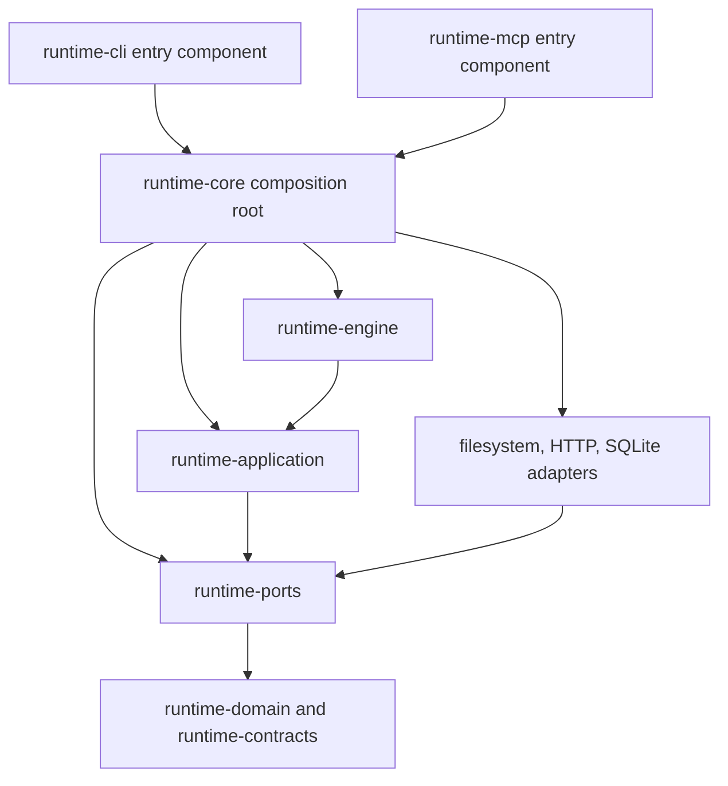

# Runtime-core architectural investigation

## Assessment

Keep the existing composition root. Its dependencies and most of its abstractions are justified. The useful work is to fix component lifetime and dependency substitution, then correct the checks that currently overstate what they enforce.

The production module is small. All 21 production Kotlin files, 967 lines, live in `skillbill.di`. RuntimeComponent combines 19 internal provider interfaces, declares 47 abstract service or port properties, and participates in 120 provider declarations. Most providers select a concrete adapter for an inward-facing port. Deleting those interfaces because they have one implementation would weaken dependency inversion.

I found two reproducible runtime defects, two reproducible enforcement gaps, and one group of unnecessary declarations. Neither production defect requires a new abstraction. The module does not need a rewrite, another layer, or a replacement DI framework.

## Scope and evidence

The investigation read every authored production file in runtime-core, its build configuration, generated RuntimeComponent wiring, and relevant generated CLI/MCP consumers. It traced bootstrap, HTTP requester creation, database context ownership, launcher construction, scoped worker state, and the architecture checks named below into their direct owners.

The test census contains 79 Kotlin test and support files with 18,495 lines, plus one 17-line test fixture. I reviewed the composition tests and relevant architecture checks and support code, surveyed the remaining test families, and executed the complete runtime-core test task. This is a complete production-module architecture review, not a claim that every assertion in the broader cross-module test suite received an individual test-value review.

The baseline test run completed 442 tests. 441 passed. InlineFqnArchitectureTest failed on two runtime-contracts test files changed by concurrent SKILL-349 work. All other tests in that invocation passed. No production source changed as part of this investigation.

[evidence/validation.md](evidence/validation.md) records commands and results. [evidence/source-hashes.json](evidence/source-hashes.json) identifies the reviewed core files. [evidence/CoreProbe.kt](evidence/CoreProbe.kt) and [evidence/GuardProbe.kt](evidence/GuardProbe.kt) contain the isolated probes. They are investigation fixtures, not proposed regression-test implementations.

## Dependency and ownership model

This diagram shows the principal composition relationships, not every transitive Gradle edge. The public project dependencies of runtime-core are application, engine, and ports. Domain, contracts, and concrete adapters are implementation dependencies. The documented public type closure reaches domain and contracts through those inward APIs. There is no authored entry-framework or workflow policy implementation in the root.

| Area | Inspected ownership | Assessment |
| --- | --- | --- |
| Bootstrap and diagnostics | RuntimeComponent, RuntimeBootstrapBindings, RuntimeDiagnosticsProvides | Correct location for ambient defaults and adapter choice. Resolved context lifetime is wrong, F-001. |
| Agent and goal launch | RuntimeGoalRunnerLaunchProvides, RuntimeGoalRunnerStoreProvides, RuntimeInstallerProvides | Small bindings with current consumers. Executable lookup substitution breaks at the launcher constructor, F-002. |
| Feature-task and goal planning | RuntimeFeatureTaskProvides, RuntimeFeatureTaskValidatorProvides, RuntimeFeatureSpecProvides, RuntimeGoalPlanningProvides, RuntimeGoalPlanningSweepProvides | Existing ports and deliberate stateful scopes. No new business-policy owner needed. |
| Workflow and validators | RuntimeWorkflowProvides, RuntimeWorkflowValidatorProvides | Adapter selection and caller-supplied git operations belong here. Concrete git factory is also Kotlin-visible, F-003. |
| Install and scaffold | RuntimeInstallPlanProvides, RuntimeInstallTargetProvides, RuntimeScaffoldProvides, RuntimeScaffoldValidationProvides | Current filesystem adapter bindings. Manifest policy remains outside composition. |
| Review | RuntimeReviewLaunchProvides, RuntimeReviewAddonCatalogProvides, RuntimeReviewEvidenceProvides | Endpoint and broker construction are valid composition responsibilities. Factory lambda serves a per-binding input. |
| Telemetry | RuntimeTelemetryProvides | Binding shape is reasonable. Repeated context resolution creates distinct configured transports, F-001. |
| Architecture governance | Module catalogs, API check, composition scanner, related tests | Useful rejection coverage, but two false-negative paths and duplicated expected topology need repair. |

## Design principles

| Principle | Judgment | Evidence and qualification |
| --- | --- | --- |
| Clean Architecture | Substantially aligned | Concrete dependencies stay at composition. Do not treat the module name `core` as proof that it must be the innermost domain module. |
| Hexagonal architecture | Substantially aligned | Providers bind filesystem, HTTP, and database adapters to consumer ports. F-002 breaks substitution at one actual adapter construction seam. |
| Single responsibility | Mostly aligned | Provider groups wire current areas. Bootstrap resolves invocation dependencies. A large number of root dependencies is expected here and does not prove a god object. |
| Open/closed principle | Appropriate for this module | New adapters require deliberate wiring changes. Composition roots do not need a registration framework to avoid those edits. Pack routing stays manifest-driven outside the root. |
| Liskov substitution | Concrete failure at F-002 | A supplied ExecutableLookup influences preflight but does not influence the default launcher. Root-level substitution must reach the consumer. This review does not certify every port implementation elsewhere. |
| Interface segregation | Reasonable logical service surface, incomplete enforcement | Consumers receive service and port types. Provider methods form an additional Kotlin-visible surface beyond the 47 property names. |
| Dependency inversion | Mostly aligned | Root knows implementations; inner services do not import the root. The launcher default reconstructs a dependency that the root already selects. |
| YAGNI | Production bindings are mostly justified | No reason to delete provider mixins, adapter ports, or stateful scopes wholesale. F-005 removes duplicate expectations and narrows one dependency scope. |
| State and resource ownership | Component snapshot needs repair | Database factory is scoped, but ambient context and transport resolution are not. Existing database operations use bounded per-operation connection ownership; no component connection leak was established. |
| Test design | Useful behavior tests, incomplete composition coverage | Full suite covers contract failures and persistence. Existing identity test checks one coordinator; optional-port tests call providers directly. Neither reproduces the split context or ignored lookup. |

## Findings

Severity describes the demonstrated consequence. Medium findings need correction but are not claims of a universal startup failure or exploitable security boundary. Low findings reduce maintenance cost.

### F-001. Medium. One component can resolve inconsistent invocation inputs and recreate HTTP clients

Source anchors:

- [RuntimeComponent.kt](../../runtime-kotlin/runtime-core/src/main/kotlin/skillbill/di/RuntimeComponent.kt), lines 85-106.
- [RuntimeBootstrapBindings.kt](../../runtime-kotlin/runtime-core/src/main/kotlin/skillbill/di/RuntimeBootstrapBindings.kt), lines 18-55.
- [JdkHttpRemoteTransport.kt](../../runtime-kotlin/runtime-infra-http/src/main/kotlin/skillbill/infrastructure/http/JdkHttpRemoteTransport.kt), lines 40-62.
- Generated InjectRuntimeComponent resolves `runtimeContext()` through environment, transport, callback, and workflow providers. Generated CLI and MCP code also calls parent providers directly.

`runtimeContext()` calls the bootstrap resolver each time. The resolver reads an unspecified home and environment, resolves the repository path, and selects a requester. The component annotation does not scope every provider automatically. The database factory has its own explicit scope and retains the earlier EnvironmentContext.

The probe created one component with an unspecified home. Its first telemetry status used home A for both database and config. After changing the JVM home property, the next status kept the database under home A and read config under home B. This is an observable inconsistency within one graph, not just different object identity.

A second probe used a three-second connect timeout. Two telemetry service resolutions received distinct requesters backed by distinct HttpClient instances. The default JdkHttpRequester singleton avoids that client duplication on the default timeout path. No network call, latency benchmark, or permanent resource leak claim is involved.

Resolve invocation facts once per component and reuse the selected requester. Preserve caller-supplied objects. Keep separate components independent. Verify generated child access, because a provider annotation must actually control the call paths those components generate. Do not solve this by scoping every application service or caching mutable telemetry settings.

### F-002. Medium. The default launcher bypasses the executable lookup selected by composition

Source anchors:

- [RuntimeGoalRunnerLaunchProvides.kt](../../runtime-kotlin/runtime-core/src/main/kotlin/skillbill/di/RuntimeGoalRunnerLaunchProvides.kt), lines 22-28.
- [FileSystemAgentRunLauncher.kt](../../runtime-kotlin/runtime-infra-fs/src/main/kotlin/skillbill/infrastructure/fs/launcher/agentrun/FileSystemAgentRunLauncher.kt), lines 15-30.
- [PathExecutableLookup.kt](../../runtime-kotlin/runtime-infra-fs/src/main/kotlin/skillbill/infrastructure/fs/launcher/agentrun/PathExecutableLookup.kt), lines 8-21.
- [AgentRunServiceRuntimeComponentTest.kt](../../runtime-kotlin/runtime-core/src/test/kotlin/skillbill/application/AgentRunServiceRuntimeComponentTest.kt), lines 19-46.

The root selects OptionalCallbacks.executableLookup for consumers such as CLI preflight. The launcher's injected constructor accepts only the process runner and database factory. Delegation to its internal constructor therefore uses a fresh PathExecutableLookup and ignores the selected lookup.

The isolated probe supplied a lookup that always returned false, then put a harmless Junie fixture on the probe process PATH. The injected lookup received zero calls. The fixture ran and returned `SKILL350_CONTROLLED_EXECUTABLE`. No installed agent ran.

This breaks controlled substitution and allows preflight and launch to use different availability decisions. It also explains why the existing component test depends on Junie being absent from the host PATH despite supplying an empty environment map. ExecutableLookup is not a process sandbox, and this finding does not recast it as one.

Pass the existing lookup into the injected launcher constructor. Test the real generated graph with a controlled executable present and refusal supplied. Keep current launcher aliases and the explicit AgentRunLauncher override.

### F-003. Medium. The property inventory does not describe the complete component API

Source anchors:

- [RuntimeComponentInboundApiArchitectureTest.kt](../../runtime-kotlin/runtime-core/src/test/kotlin/skillbill/architecture/RuntimeComponentInboundApiArchitectureTest.kt), lines 9-18.
- [ArchitectureScanSupport.kt](../../runtime-kotlin/runtime-core/src/test/kotlin/skillbill/architecture/ArchitectureScanSupport.kt), lines 428-429.
- [RuntimeWorkflowProvides.kt](../../runtime-kotlin/runtime-core/src/main/kotlin/skillbill/di/RuntimeWorkflowProvides.kt), lines 20-24.
- [PrincipleEnforcementInventory.kt](../../runtime-kotlin/runtime-core/src/test/kotlin/skillbill/architecture/PrincipleEnforcementInventory.kt), line 260 and the following service-property inventory.

The check compares abstract property names only. Public functions and inherited provider methods do not participate. A separately compiled Kotlin probe called `component.gitWorkflowGitOperations()` and received the concrete filesystem adapter. `@JvmSynthetic` does not hide that member from Kotlin callers.

The guard probe added a public concrete-adapter helper without changing the abstract properties. Both scans returned the same set. The current failure message calls the property list the runtime's inbound API, which is broader than the evidence establishes.

Some extra callables are necessary. Generated CLI and MCP classes call runtimeContext, runtimeClock, transportContext, databaseSessionFactory, and other providers. Removing all inherited methods or deleting properties without handwritten references would break working integration.

Keep the curated logical service API. Classify legitimate generated wiring methods under an explicit rule, reject ordinary unclassified public helpers on the component and mixins, and document the distinction. Verify the child graphs. Do not create a second handwritten inventory of all 120 provider signatures or add a facade solely to make the diagram look stricter.

### F-004. Medium. The composition guard loses bindings on parameter renames and misses alias construction

Source anchors:

- [ArchitectureScanGuardSupport.kt](../../runtime-kotlin/runtime-core/src/test/kotlin/skillbill/architecture/ArchitectureScanGuardSupport.kt), lines 335-405.
- [RuntimeCompositionGuardArchitectureTest.kt](../../runtime-kotlin/runtime-core/src/test/kotlin/skillbill/architecture/RuntimeCompositionGuardArchitectureTest.kt), lines 8-43.

The binding census recognizes parameter types only when parameter names match a hardcoded vocabulary such as adapter, store, service, or runner. Renaming `adapter: ExampleAdapter` to `implementation: ExampleAdapter` changes no dependency, but the real census drops ExampleAdapter.

Construction checks search unqualified class names. The real scanner reported direct construction of the bound TelemetryLevelMutationService in application code. Importing the same type as Mutation and calling Mutation produced no finding. This same-layer example does not need an otherwise-banned infrastructure import, so the module-layer rules do not repair the missed composition boundary.

Base the census on provider type information and resolve import aliases before matching bound constructions. Exercise actual discovery and matching entry points, not a duplicate regex in the test. Include negative cases for unrelated functions, comments, and strings. Keep the scope bounded to the module's supported source forms and document the remaining limits. A general Kotlin parser is not justified by these findings.

### F-005. Low. Architecture expectations repeat the same topology, and a test dependency has production scope

Source anchors:

- [RuntimeCoreCompositionOnlyTest.kt](../../runtime-kotlin/runtime-core/src/test/kotlin/skillbill/architecture/RuntimeCoreCompositionOnlyTest.kt), line 134 and the per-configuration module edge table.
- [RuntimeAdapterDependencyAllowlistTest.kt](../../runtime-kotlin/runtime-core/src/test/kotlin/skillbill/architecture/RuntimeAdapterDependencyAllowlistTest.kt), lines 157-207.
- [RuntimeGradleModuleLayeringTest.kt](../../runtime-kotlin/runtime-core/src/test/kotlin/skillbill/architecture/RuntimeGradleModuleLayeringTest.kt), lines 21-36.
- [RuntimeModuleCatalog.kt](../../runtime-kotlin/runtime-core/src/test/kotlin/skillbill/architecture/RuntimeModuleCatalog.kt), lines 3-17.
- [runtime-core/build.gradle.kts](../../runtime-kotlin/runtime-core/build.gradle.kts), line 15.

The exact API and implementation edge table already defines the aggregate main project dependencies that another test restates. The module names are also repeated. An intentional edge change requires multiple edits to expected policy, which can drift without representing a distinct architectural decision.

Keep one test-owned expected topology with configuration-specific edges. Derive the aggregate views and module set. Continue reading actual Gradle declarations independently, so an accidental build change cannot approve itself. Test fixture policy stays separate. Preserve rejection tests for added, removed, and reclassified edges.

The serialization JSON dependency has no authored production import or generated production use in this module. Tests access its types through JsonCodec.json. Move it to testImplementation after compile verification. This does not remove JSON serialization from the runtime distribution, which still needs it in other modules.

Over-engineering findings, largest cut first:

- `RuntimeAdapterDependencyAllowlistTest.kt:L157-L207: shrink:` remove the duplicate main dependency table. Derive unions from the existing per-configuration expected graph.
- `RuntimeGradleModuleLayeringTest.kt:L21-L36: shrink:` remove the duplicate expected module-name list. Read the shared test-owned topology.
- `runtime-core/build.gradle.kts:L15: shrink:` remove the test-only JSON declaration from production scope. Replace it with testImplementation.

Estimated net: -50 lines possible, -0 dependencies possible. This is a source estimate before implementation, not a target or a reason to delete useful rejection coverage. Moving a dependency's scope does not count as removing it from the distribution.

## Changes deliberately rejected

- Replacing Kotlin-Inject with manual wiring or another container. The existing graph compiles and has current consumers. The defects are fixable with existing lifetime and constructor mechanisms.
- Removing single-implementation ports or one-line provides methods. These are actual adapter boundaries and Kotlin-Inject bindings, not unused future flexibility.
- Turning every service into a singleton. Only dependencies with identity or shared state requirements need that lifetime. Doing this globally could retain operation state.
- Splitting runtime-core into more modules, or merging provider files to satisfy a cosmetic file-count preference. Its 967 production lines do not justify either change.
- Deleting required validators, typed failures, schema parity, lease checks, or persistence tests to reduce test volume. Those protect observable contracts.
- Moving all architecture and integration tests out of core. The module is an existing composition integration point. A separate test module adds build structure without fixing the demonstrated failures.
- Treating the scoped database factory as a permanently open connection. The adapter opens and closes connections per operation. The existing identity test's wording is not evidence of a leak.
- Removing the burst schedule or review broker factory. The schedule feeds current planning behavior; the broker factory receives per-review binding input. Their shape alone is insufficient evidence of unused generalization.
- Adding benchmarks, HTTP pooling, or caches before measuring a remaining performance problem. The requester identity failure is already reproducible without performance thresholds.

## Public engineering references

The user asked for the rigor associated with Reddit, Microsoft, and Facebook. Public sources support specific engineering practices, not a company-wide certification. These references informed the criteria below; the source findings stand on local evidence.

- Microsoft documents a composition root that wires concrete infrastructure to inward-facing abstractions. That supports keeping concrete adapters in runtime-core while keeping them out of inner policy. [Common web application architectures](https://learn.microsoft.com/en-us/dotnet/architecture/modern-web-apps-azure/common-web-application-architectures).
- Microsoft's DI guidance discusses service lifetime, disposal ownership, and avoiding service-locator usage. The application here is to make component lifetime explicit and avoid a global registry as a fix. Its .NET mechanisms are not a prescription for Kotlin. [Dependency injection guidelines](https://learn.microsoft.com/en-us/dotnet/core/extensions/dependency-injection/guidelines).
- Meta's account of Facebook iOS architecture describes dependency management, modularity, and the cost of sharing infrastructure across applications. The applicable lesson is to justify dependencies and abstractions with actual consumers, not copy mobile architecture into a JVM tool. [The evolution of Facebook's iOS app architecture](https://engineering.fb.com/2023/02/06/ios/facebook-ios-app-architecture/).
- Reddit's public Devvit testing guidance recommends isolated test worlds, production-like service calls, and limited mocks. The application here is to reproduce real graph behavior with temporary state and controlled external boundaries. This is Devvit guidance, not a statement of Reddit's private JVM standards. [Testing your app](https://developers.reddit.com/docs/guides/tools/devvit_test).

## Limits and handoff

The shared checkout advanced during the investigation. All 21 core production files and the reviewed composition guard files remained unchanged. Concurrent SKILL-349 work later changed FailureCodeTotalityArchitectureTest, an unrelated core test, along with contracts and application files. See evidence/final-source-check.txt. The retained test receipt belongs to its recorded invocation, not every later checkout state.

The investigation did not audit every implementation behind every port, benchmark production startup, conduct a penetration test, or certify all other modules against SOLID. The isolated probes demonstrate the listed failures without external agent execution or network traffic.

[spec.md](spec.md) contains the acceptance criteria and two executable subtask specs. Runtime composition repairs and architecture-check repairs can ship separately. Implementation should preserve the useful existing design and close these specific gaps.
