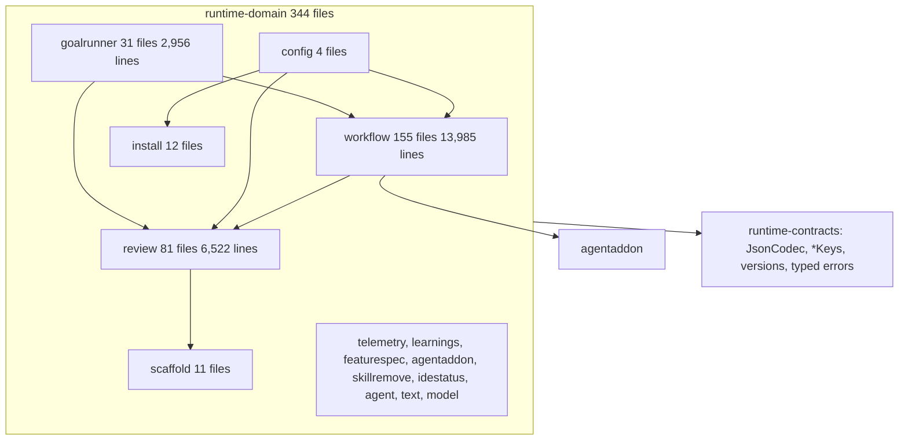

# Runtime-domain architectural investigation

## Assessment

Keep the module, its package layout, and its dependency direction. `runtime-domain` imports nothing from ports, application, infrastructure, DI, or any serialization or IO library; its only JDK surface is `MessageDigest`, `BigInteger`/`BigDecimal`, and `java.time` value types. That is the hexagonal core the architecture documents describe, and no new module, layer, or framework is needed to improve it.

The problems are inside the boundary. The module still models most durable state as `Map<String, Any?>` behind nominal wrappers, re-implements map-field reading and numeric coercion at least nine times with different semantics, and reports the same class of malformed durable input through four different failure vocabularies. A hand-written JSON codec, several `runCatching`/`catch → null` seams, one dead constant that disables a canonicalization branch, and 163 public declarations with no consumer outside the module are the concrete symptoms. File fragmentation from thresholds retired on 2026-09-04 remains in place.

Reviewed on 2026-09-16 at `3f6aaff18318483771900c96b5e7cd854e7e8259` on `main` with a clean tree. Scope: all 344 production Kotlin files (27,544 lines), 110 test files (16,697 lines, 805 tests), one `repoTest` file (2 tests), six test fixtures, the module build script, the architecture guards in `runtime-core`, and the consumers named under each finding. SHA-256 of the sorted production-file digest list is `69c26255ac9675da036840d6cf655a0a65aaa347b95ce5ee29afc8f384511083`. This is a whole-module architectural investigation, not a diff review and not a governed review-driver verdict.

## Structure and ownership

Area-level dependencies are acyclic and `ApplicationPackageAcyclicityArchitectureTest` records an empty cycle census for the module. Cycles exist one level down and are not scanned: `workflow.taskruntime` ↔ `workflow.goal` (10 and 3 import edges), `workflow.engine` ↔ `workflow.taskruntime` (2 and 5), and `review.model` ↔ `review.context` (4 and 4). The generic engine names the concrete feature-task workflow at `WorkflowEngineContinuationAssembly.kt:120` and `WorkflowEngineContinuationPrompts.kt:77` (`definition.workflowName == FeatureTaskRuntimePhaseWorkflowDefinition.definition.workflowName`).

The module declares 33 interfaces. Twenty are sealed result or alternative types, which is the intended closed-type modelling. Thirteen are validator ports implemented once each in `runtime-infra-fs` (`*ValidatorAdapter`, `*ValidatorInfraAdapter`; 495 adapter lines, eleven of them 13 to 17 line forwarders). Six `Noop*` substitutes live in `testFixtures`, as the 2026-09-06 decision requires.

Consumers: `runtime-ports`, `runtime-application`, and `runtime-engine` expose the module as `api(...)`, so every public declaration here is transitive ABI for CLI and MCP. `runtime-infra-*` and `runtime-core` consume it as `implementation`.

## Principles assessment

| Principle | Assessment and evidence |
| --- | --- |
| Clean and hexagonal architecture | Dependency direction is correct and enforced (`RuntimeLayerBoundaryArchitectureTest`, `RuntimeImplementationImportRulesTest`). Two effect leaks: `SkillBillVersion` reads a classpath resource at class init, and `learnings/LearningEntry.kt` maps domain models into `runtime-contracts` DTOs and JSON, which `ARCHITECTURE.md` assigns to application or adapters. F-008. |
| Single responsibility | Area clusters are cohesive. `WorkflowBoundaryCollections.kt` is a type-kind bucket for telemetry, review, decomposition, and scaffold wrappers inside `workflow.engine.model`. The canonicalizer, handoff-projection, engine, and observability-parsing families are one responsibility each spread over 3 to 8 files. F-006, F-008. |
| Open/closed | Closed sets are enums or sealed types in most places. Workflow status stays `String` through `WorkflowStateSnapshot`, `WorkflowUpdateInput`, and `WorkflowDefinition` even though `WorkflowStatus` and `WorkflowStepStatus` exist in the same module. F-009. |
| Liskov substitution | Nine `Map<String, Any?> by delegate` wrappers do not delegate `equals`/`hashCode`; only `TelemetryOpenDocument` overrides them. Data classes that hold the other eight (`WorkflowUpdateInput`, `WorkflowInputProjection`, `WorkflowContinueView`) therefore compare by identity. F-002. |
| Interface segregation | Ports are narrow. Seven of them are the same one-method shape `(Any, String) -> Unit`, and two carry production logic in default bodies so test doubles stay source-compatible. `Any` parameters erase the payload type the port exists to validate. F-005. |
| Dependency inversion | Ports live in domain and infrastructure implements them. `IdeStatusValidator` lives in `runtime-ports`; `ARCHITECTURE.md` says `skillbill.ports.*` owns validation ports. Two homes for one concept. F-005. |
| YAGNI and simplicity | `FEATURE_TASK_RUNTIME_CLOSED_PROJECTION_OBJECT_KEYS` is `emptyMap()`, so `discardUnknownTopLevelKeys` never discards and the `repoTest` that iterates it asserts nothing. `TelemetryRemoteStatsRuntime` forwards to an identical top-level function. 24 declarations have no reference anywhere. `build.gradle.kts` declares `kotlinx-serialization-json` with zero imports. F-006, F-007. |
| Failure and state ownership | Durable decoders throw `InvalidWorkflowStateSchemaError`, `error()`, `IllegalArgumentException`, and `require` in `init` for the same class of malformed row; callers catch two of the four. `AttemptLedgerAccumulator` exposes public `var`s and mutable maps; two data classes carry `MutableList` fields; two decoders take a mutable out-parameter. F-001, F-010. |
| Observability | `goalContinuationQualityGateSelection` turns a schema violation into `null` and changes which gate phase is required. `SkillBillVersion` falls back to `0.0.0-unknown` silently. F-004. |
| Contract ownership | 26 `toArtifactMap` and 25 `fromArtifactMap` pairs mix `SharedPayloadKeys.*` with inline literals (198 literal key accesses, 402 `"key" to` pairs module-wide). `WireVocabularyArchitectureTest` covers three schema seams and only keys those schemas declare. F-011. |
| Testing | 805 tests pass. Names describe behaviour. 119 tests pin `IllegalArgumentException` at decode boundaries versus 48 for the typed error, so tests currently protect the vocabulary split. |

## Findings

Paths are repository-relative under `runtime-kotlin/runtime-domain/src/main/kotlin/skillbill/` unless another module is named.

- [F-001] Major | High | `review/model/ReviewStageState.kt:14` | Durable-row decoders report malformed input through four failure vocabularies.
- [F-002] Major | High | `workflow/taskruntime/model/FeatureTaskRuntimePersistenceMapFields.kt:7` | Raw-map field reading and numeric coercion are re-implemented nine and fourteen times with divergent semantics; nominal wrappers lack equality.
- [F-003] Minor | High | `review/model/ReviewRunLaneSegmentAccountingJson.kt:24` | A hand-written JSON encoder and parser duplicates `JsonCodec` and mis-parses valid input.
- [F-004] Minor | High | `workflow/taskruntime/FeatureTaskRuntimeRequiredArtifactPresenceResolver.kt:76` | Caught schema errors and `runCatching` become absence without a record.
- [F-005] Minor | High | `workflow/taskruntime/FeatureTaskRuntimePhaseOutputValidator.kt:14` | Thirteen validator ports repeat one shape, erase payload types, carry production default bodies, and have two documented homes.
- [F-006] Minor | High | `workflow/taskruntime/model/FeatureTaskRuntimeProjectionCanonicalizationTypes.kt:27` | Count-driven fragmentation from retired thresholds and one unreachable canonicalization branch remain.
- [F-007] Minor | High | `runtime-kotlin/runtime-domain/build.gradle.kts:18` | 163 public declarations have no consumer outside the module, 24 have none at all, and one declared dependency is unused.
- [F-008] Minor | High | `learnings/LearningEntry.kt:22` | Contract-DTO mapping, a classpath read, a cross-area wrapper bucket, and engine knowledge of one concrete workflow sit in the wrong owner.
- [F-009] Minor | High | `workflow/engine/WorkflowEngine.kt:40` | Workflow and step status stay stringly typed inside the engine while closed enums exist.
- [F-010] Minor | Medium | `goalrunner/AttemptLedgerAccumulator.kt:13` | Mutable state is exposed through public `var`s, `MutableList` fields, and out-parameters.
- [F-011] Minor | High | `workflow/taskruntime/model/FeatureTaskRuntimeGoalContinuationArtifact.kt:37` | Durable artifact encode/decode pairs inline wire keys the scanner does not govern.

### F-001. One failure vocabulary per durable decode boundary

`ReviewStage.fromWire`, `ReviewClaimVerdict.fromWire`, `ReviewScopeDisposition.fromWire`, `ReviewSeverityAdjustmentDirection.fromWire`, and `ReviewStageReached.fromWire` call `error()` on an unknown token. `runtime-infra-sqlite/.../review/ReviewStageState.kt:86-183` calls them on values read from SQLite columns, so one unrecognised durable token raises `IllegalStateException` with no typed identity. `ReviewFindingCitation.decodeList` (`ReviewStageState.kt:78`) calls `.toInt()` on the tab-separated line field and is reached from three SQLite row mappers; a non-numeric column value raises `NumberFormatException`.

`FeatureTaskRuntimeResolvedBranch.fromArtifactMap` uses the typed `requireStringField` for scalar fields and `error("... must contain only strings.")` for list elements in the same function. `GoalObservabilityRecordKind`, `GoalProgressEventKind`, `GoalProgressOutcome` (`GoalObservabilityModels.kt:23,40,54`), and `GoalAttemptLedgerAction` throw `IllegalArgumentException`. `CodeReviewExecutionMode`, `ValidationDepth`, and `FeatureTaskRuntimeQualityGateSelection` do the same, so `FeatureTaskRuntimeGoalContinuationArtifact.fromArtifactMap` wraps each in `try/catch (IllegalArgumentException)` and rethrows `InvalidWorkflowStateSchemaError` three separate times. `GoalSubtaskReviewFindingArtifacts.kt:181-184` and `:236-239` catch both exception types from the same call because the decoder can emit either. `FeatureTaskRuntimePhaseLedgerEntry` decodes with typed errors and then runs `require(attemptCount >= 1)` in `init`, so a durable row with `attempt_count: 0` fails with `IllegalArgumentException` after every field decoded cleanly.

Quarantine seams catch `InvalidWorkflowStateSchemaError` (`WorkflowServiceArtifactDecoding.kt:39`, `GoalContinuationArtifactCodec.kt:86`, `FeatureTaskRuntimeRunLoopLaunch.kt:485`). Some also catch `IllegalArgumentException`; the SQLite `ReviewStageState` reader catches neither. The same malformed record is quarantined and regenerated at one seam and crashes the read at another.

Give each durable decode family one typed error and make every decoder in that family, including enum `fromWire` companions reached from durable rows and `init` invariants on decoded values, surface through it. `TypedParseBoundaryArchitectureTest` already names some sites; extend its inventory to the decoders above so the rule is enforced rather than reviewed. Operator-input parsers reached from CLI and MCP (`TriageDecisionParser`, `ReviewParser`, `TelemetryConfigRules`, `LearningsRuntime`, `parseRemoteStatsWindow`) validate user arguments and `CliRuntime.kt:55` maps `IllegalArgumentException` to a usage error; they are not durable boundaries and stay as they are.

### F-002. One raw-map reader, and wrappers that behave as values

Domain production code contains 326 `Map<String, Any?>` references. Reading fields from them is implemented independently in at least nine families: `requireStringField`/`optionalIntField` (`FeatureTaskRuntimePersistenceMapFields.kt`), `requireReviewStateString`/`requireReviewStateInt` (`GoalSubtaskReviewStateDecoding.kt`), `requiredString`/`requiredPositiveInt` (`GoalObservabilityParsingFields.kt`), `stringValue`/`nullableStringValue`/`asInt` (`DecompositionManifestWireCodec.kt:207`), `requireTerminalStringField` (`FeatureTaskRuntimeDecomposeTerminal.kt`), `requireRepairEvidenceString` (`FeatureTaskRuntimePhaseOutputValidationModels.kt`), `requireString`/`requireDecodedString` (`FeatureTaskRuntimeHandoffEnvelope.kt`), `requiredNonBlankField` (`AttemptLedgerDecoding.kt`), and `optionalAttemptIntField` (`FeatureTaskRuntimeImplementationAttemptModels.kt`). Integer coercion exists fourteen times with at least four semantics: exact-only with `BigDecimal.longValueExact` (`FeatureTaskRuntimePersistenceMapFields.kt:86`), exact with `Float`/`Double` whole-number checks (`WorkflowEngineNumericCoercion.kt:6`), `Number.toInt()` compared by `toDouble()` (`GoalSubtaskReviewStateDecoding.kt:20`), and lenient `toInt()` (`AttemptLedgerWorkflowDecoding.kt`, recorded as a deliberate divergence in the 2026-09-06 decision (c)). The same integer literal in two artifacts can therefore decode in one and fail in the other.

`WorkflowBoundaryCollections.kt` declares nine classes of the form `class X private constructor(delegate: Map<String, Any?>) : Map<String, Any?> by delegate` with a `from(map)` copy. Kotlin delegation does not forward `equals`, `hashCode`, or `toString`; only `TelemetryOpenDocument` overrides them. `WorkflowUpdateInput.artifactsPatch`, `WorkflowInputProjection.artifacts`, and `WorkflowContinueView.stepArtifacts`/`extraFields` are data-class fields of the other types, so two structurally identical inputs are unequal. The wrappers exist so the `RuntimeRawMapArchitectureTest` scanner treats them as adapter-local carriers; they add no invariant.

Provide one internal reader for string-keyed artifact maps that takes the family's typed-error factory as its only variation, and one exact plus one documented-lenient integer coercion. Delete the other families as callers migrate. Either give the nine wrappers value semantics and the invariant their name implies, or replace them with the typed models `ARCHITECTURE.md` asks for at the port boundary. Do not add a generic schema engine, annotation processor, or serialization library to the module.

### F-003. Use the existing JSON codec for lane segment accounting

`ReviewRunLaneSegmentAccountingJson` (90 lines) appends JSON by hand and parses it with `trimmed.substring(1, length - 1).split("},{")` followed by per-field regexes, `error()` on a missing field, and `error()` on any escape other than `\\` or `\"`. Encoding does not escape control characters, so a `segmentId` or digest containing `\n` produces invalid JSON in the SQLite column; decoding rejects `\uXXXX` escapes that any conforming writer may emit. `JsonCodec` from `runtime-contracts` is imported 38 times in this module and already provides `mapToJsonString`, `parseValue`, and typed malformed-text failures. The production writer is `runtime-application/.../ParallelCodeReviewRunnerLanePlanRecording.kt:101` and the reader is the SQLite lane persistence path.

Replace the hand-written codec with `JsonCodec` and a typed failure. Keep the column shape and the `[]`/`null` empty-list behaviour so existing rows decode unchanged.

### F-004. Record every fallback or fail

`FeatureTaskRuntimeRequiredArtifactPresenceResolver.goalContinuationQualityGateSelection` catches `InvalidWorkflowStateSchemaError` and returns `null`. The caller then treats the run as having no goal quality-gate selection, which changes which of `build` or `validate` counts as the required artifact for resume. A malformed goal-continuation artifact therefore alters resume eligibility without a diagnostic and without failing.

`SkillBillVersion` (`SkillBillVersion.kt:10`) returns `0.0.0-unknown` when the packaged properties resource is missing or blank, with no record; telemetry outbox rows and MCP server identity carry that value. `parseInstantOrNull` (`AttemptLedgerAccumulator.kt:83`) and `parsePayloadMap` (`GoalRunnerWorkerSubtaskRequestParser.kt:173`) use `runCatching { … }.getOrNull()` over external text. `goalObservabilityLatestEventForLiveness` (`GoalObservabilityParsing.kt:26`) wraps validation in `runCatching` and has no caller anywhere, so it is deletion rather than repair. `ReviewSpecAdjudicationAdmission.kt:49` maps an unknown disposition token to the closed `AMBIGUOUS` reason, which is an attributed refusal and is acceptable.

Apply `docs/observability-policy.md`: the gate-selection fallback either fails typed at the resume seam or emits a bounded record naming the seam and the value used; the version fallback emits a record or becomes a loud failure at packaging; the two `runCatching` probes narrow their catch and record the substitution. Keep `parseInstantOrNull`'s two accepted formats.

### F-005. One home and one shape for schema-validation ports

Domain declares thirteen validator interfaces. Seven have the identical shape `fun validate…(payload: Any, sourceLabel: String)`: `FeatureTaskRuntimeQuarantineValidator`, `FeatureTaskRuntimeBuildReceiptValidator`, `FeatureTaskRuntimeImplementationAttemptValidator`, `FeatureTaskRuntimePlanningProjectionValidator`, `GoalProgressEventValidator`, `GoalObservabilityEventValidator`, and `GoalPlanningPreparationEnvelopeValidator`. Each has one 13 to 15 line adapter in `runtime-infra-fs` that forwards to a schema validator, and most have a `Noop` fixture. `Any` parameters mean the port cannot state which artifact it validates; the adapter re-derives that with `requireFeatureTaskRuntimeArtifactMap`.

`FeatureTaskRuntimePhaseOutputValidator` defines `validatePhaseOutput`, `validateAndReadPhaseOutput`, and `normalizePhaseOutput` as default bodies whose KDoc says they exist to keep test doubles source-compatible; `validateAndReadPhaseOutput` returns `emptyMap()` when the JSON probe returns `null` after validation passed. `DecompositionManifestValidator.validateYamlTextResult` is a default body for the same reason. `FeatureTaskRuntimeHandoffFoundationValidator.validateSharedEvidenceProjection` defaults to `= Unit`, so an adapter that forgets to override it silently validates nothing. `WorkflowSnapshotValidator` and `DecompositionManifestValidator` carry narrative KDoc naming SKILL-52.2, SKILL-52.3, SKILL-146, and SKILL-164 history, which belongs in `agent/decisions.md`.

`ARCHITECTURE.md` assigns validation ports to `skillbill.ports.*` and `IdeStatusValidator` is there; the other thirteen are in domain. One production adapter justifies a port, so the ports stay. Decide and document one home. Remove production logic and no-op defaults from port bodies. Collapse the seven identical-shape ports into one port with a closed artifact-kind vocabulary, or give each a named payload type; either removes the `Any` erasure and most of the forwarding adapters and fixtures. Do not introduce a generic schema-validation framework or a port per artifact field.

### F-006. Merge units split for retired thresholds

The 2026-09-04 decision raised the file ceiling from 500 to 1,200 lines and `TooManyFunctions` from 11 to 40 because the old values "produced fragments". The domain fragments produced under SKILL-220/221 remain: `FeatureTaskRuntimeProjectionCanonicalizer{,Entries,MapOps,Mutations,TopLevel,Keys}` plus `…CanonicalizationTypes` (7 files, 470 lines, all `internal`, calling each other by fully spelled object names; `MapOps` is 23 lines with three functions used only by its siblings), `FeatureTaskRuntimeHandoffProjection{Validator,DeclarationChecks,EnvelopeWire,FieldResolver,Finalization,SourceFields,ValueBuilder}` (7 files, 844 lines), `WorkflowEngine{,ContinuationAssembly,ContinuationCompact,ContinuationPrompts,NumericCoercion,SnapshotCodec,SnapshotCodecDurable,Validation}` (8 files), `GoalObservabilityParsing{,Collections,Fields}`, and `FeatureTaskRuntimePhaseWorkflow{Definition,Graph,ProjectionDeclarations,Queries,Transitions}`. `RuntimeSpilloverFileNameArchitectureTest` bans `Support`, `Helpers`, `Misc`, `Extras`, and numbered suffixes; `MapOps`, `Mutations`, `TopLevel`, `Entries`, `Fields`, `Collections`, and `Queries` serve the same purpose and pass.

Inside the canonicalizer, `FEATURE_TASK_RUNTIME_CLOSED_PROJECTION_OBJECT_KEYS` is declared as `emptyMap()` (`…CanonicalizationTypes.kt:27`), so `discardUnknownTopLevelKeys` (`…Canonicalizer.kt:24`) always returns its input, and `src/repoTest/.../FeatureTaskRuntimeProjectionCanonicalizationSchemaParityTest` iterates that empty map and can never fail.

Merge each family back into the units its responsibility defines where the merged unit stays under the current ceilings, naming any remaining split by responsibility rather than by kind of helper. Either populate the closed-key map from its schema authority and make the parity test able to fail, or delete the branch, the constant, and the test. Do not split by count or hide dependencies in parameter bags to satisfy a threshold.

### F-007. Shrink the exported surface and delete unused code

A word-boundary reference census over every Kotlin source root in `runtime-kotlin` finds 1,111 public top-level declarations in domain production code. Method: list every non-`private`, non-`internal` top-level `fun`, `val`, `const val`, `class`, `object`, `interface`, `enum class`, `typealias`, and `value class` under `runtime-domain/src/main`; for each simple name, count files under `*/src/*` outside `runtime-domain/src/main` that contain it as a whole word, and separately count files under `*/src/main` outside `runtime-domain`; a name with zero of the first is unreferenced outside the module, and one with zero of the second has no production consumer. Rerun at implementation time. 163 are never referenced outside `runtime-domain/src/main`: 24 are unreferenced anywhere, 53 are used only in their declaring file, and 86 only elsewhere in the module. A further 76 are referenced outside the module only from tests or fixtures. Because `runtime-ports`, `runtime-application`, and `runtime-engine` expose domain as `api(...)`, all of this is transitive ABI for CLI and MCP.

The unreferenced set includes `goalObservabilityLatestEventForLiveness`, four functions in `FeatureTaskRuntimeWorkflowArtifactWireMappings.kt`, `reviewGenerationFromWorkflowArtifacts`, `learningSummaryWire`, four scaffold command-kind aliases, four repair-receipt limits, three review budget names, `acceptanceCriterionRefsFor`, `isDeclaredAcceptanceCriterionRef`, `featureTaskRuntimeRenderOpenWorkItem`, `GoalSubtaskPauseRelease`, and `FEATURE_TASK_RUNTIME_PHASE_STATUS_COMPLETED`. `TelemetryRemoteStatsRuntime` is an object whose single method forwards to a top-level function with the same signature. `build.gradle.kts:18` declares `implementation(libs.kotlinx.serialization.json)` and no production file imports `kotlinx`; the enforceable inward-layer rule already forbids that import.

Delete the unreferenced declarations after re-running the census at implementation time, make same-file-only declarations `private` and module-only declarations `internal`, remove the forwarding object, and drop the unused dependency. The census is word-boundary text matching: overloads share a name, and generated or reflective access is not visible to it, so recheck each deletion against compilation and the full test suite.

### F-008. Put four pieces back with their owner

`learnings/LearningEntry.kt` contains no `LearningEntry` type (that is `learnings/model/LearningEntry.kt`); it holds `learningEntryDto(entry)` and `learningEntrySessionJson`, which map domain models to `runtime-contracts` DTOs and serialize them. `learnings/LearningPayloads.kt` declares a second `learningEntryDto(record)` overload and three more DTO helpers, one of which is unreferenced. `ARCHITECTURE.md` places contract-DTO mapping in application or adapter packages.

`SkillBillVersion` performs classpath IO in the module whose purity `ARCHITECTURE.md:273` cites as the reason the ambient clock lives elsewhere; `AmbientEnvironmentArchitectureTest` does not scan `getResourceAsStream`. `runtime-core` is documented as the runtime metadata module. `WorkflowBoundaryCollections.kt` in `workflow.engine.model` hosts `TelemetryOpenDocument`, `GovernedReviewJsonRpcArguments`, `CustomFieldMap`, `DecompositionManifestWireMap`, and a `typealias ReviewContextWireMap` re-export; `docs/code-principles.md` names this type-kind bucket shape as an anti-pattern. `workflow.engine` compares `definition.workflowName` to `FeatureTaskRuntimePhaseWorkflowDefinition.definition.workflowName` at two sites, so the generic engine depends on one concrete workflow and forms the `engine` ↔ `taskruntime` cycle; SKILL-200 history notes the branch was made durable-name based, which is the right key but the wrong owner for the constant.

Move DTO mapping to its application owner and delete the duplicate overload. Move the version resource read to `runtime-core` or make the fallback observable per F-004, and extend the ambient-environment scanner to classpath reads or document the exception. Relocate each wrapper to its area's `model` package or remove it under F-002. Express the engine's runtime-specific branch through a `WorkflowDefinition` field rather than a name comparison against the concrete definition. Cycles below area level should enter the acyclicity scan at the granularity the module documents, or the module should document why sub-area cycles are acceptable.

### F-009. Type workflow status inside the engine

`WorkflowEngine.openRecord` writes `workflowStatus = "running"` (`WorkflowEngine.kt:40`) and `updateAcknowledgementView` writes `status = "ok"` (`:105`); `defaultSteps` writes `"running"`, `"completed"`, `"pending"` (`WorkflowEngineSnapshotCodec.kt:44-47`). `WorkflowStateSnapshot.workflowStatus`, `WorkflowUpdateInput.workflowStatus`, `WorkflowStepState.status`, and `WorkflowDefinition.workflowStatuses/stepStatuses/terminalStatuses` are `String` or `Set<String>`. `WorkflowStatus`, `WorkflowStepStatus`, and `WorkflowResumeMode` enums with `wireValue` and `fromWire` exist in `workflow/model/ClosedStatusTypes.kt`. `isTerminalStatus` decodes the enum and then falls back to comparing the raw string when decoding fails, keeping two representations live.

Carry the enums through the engine's own models and definitions; convert to `wireValue` only at the snapshot and acknowledgement wire seams. An unknown durable status token then fails through F-001's typed error instead of flowing as a string.

### F-010. Expose read-only results, not mutable state

`AttemptLedgerAccumulator` has public `var blockedAttemptCount`, `var supervisorKillCount`, `var findingsInScope`, and three public `mutableMapOf` fields; its single consumer (`WorkflowGoalRunnerProgressRecording.kt:245`) constructs it, calls `accumulate` in a loop, and reads `toSummary()`. `InstallTransaction(val createdSymlinks: MutableList<FileLocation>)` is a data class whose equality and `copy` share the list. `RejectedVerificationFindingInput.truncationRecords: MutableList<String>?` and `FeatureTaskRuntimeRepairReceiptDecodeObservations.truncationRecords: MutableList<String>` are out-parameters that decoders append to.

Fold `accumulate` into a pure reduction over the ledger entries that returns `GoalRunnerAttemptLedgerSummary`. Return truncation records as part of the decode result. Give `InstallTransaction` an immutable list and a named transition. These are `ARCHITECTURE.md` State Ownership requirements, not style preferences.

### F-011. Declare artifact wire keys once per encode/decode pair

Domain has 26 `toArtifactMap` and 25 `fromArtifactMap` functions. `FeatureTaskRuntimeGoalContinuationArtifact` writes `SharedPayloadKeys.ISSUE_KEY` and `"goal_branch"` in the same map (`:37-48`) and repeats `"goal_branch"`, `"suppress_pr"`, `"code_review_mode"`, and eight more literals in its `goalContinuationKeys` allow-list and decoder. `FeatureTaskRuntimePhaseLedgerEntry`, `FeatureTaskRuntimeResolvedBranch`, `FeatureTaskRuntimeRepairReceipt`, and the canonicalizer family (30 distinct literal keys) follow the same mixed pattern. Module-wide there are 198 literal-key `[]`/`get`/`put` accesses and 402 `"key" to` pairs. `AGENTS.md` forbids inlining governed keys; `WireVocabularyGovernedSeamInventory` covers three schema seams and reports only keys those schemas declare, so artifact keys outside them are unguarded. An encoder and its decoder can drift by one character with no test noticing until a durable read fails.

For each durable artifact family, declare its keys once in the owning `*Keys` object (existing `runtime-contracts` owners where the artifact has a schema, an area-owned object beside the artifact otherwise) and reference that object from both `toArtifactMap` and `fromArtifactMap`. Extend the governed-seam inventory so these pairs are scanned. Prose, prompt text, and open pack-authored payloads stay open.

## Over-engineering cuts

Estimates of net production-line change, excluding tests. Required validators, typed errors, and schema constants are not counted as bloat.

- `review/model/ReviewRunLaneSegmentAccountingJson.kt:L1`: shrink: replace 90 lines of hand-written JSON with `JsonCodec` calls and one typed failure. About 70 net lines.
- Nine map-field accessor families and fourteen integer coercions (F-002): shrink to one internal reader and two coercions. About 250 net lines.
- `workflow/taskruntime/model/FeatureTaskRuntimeProjectionCanonicalizer*.kt`: shrink: merge seven files into one or two, drop qualified sibling-object call chains, delete the unreachable closed-key branch and its `repoTest`. About 80 net lines.
- `workflow/goal/model/GoalObservabilityParsing{Collections,Fields}.kt`: merge into the parser. About 15 net lines.
- 24 unreferenced declarations, `TelemetryRemoteStatsRuntime`, duplicate `learningEntryDto`, `goalObservabilityLatestEventForLiveness`: delete. About 180 lines.
- Seven identical-shape validator ports with seven forwarding adapters and their fixtures: collapse to one port, one adapter, one fixture if the artifact-kind route is taken. About 150 net lines across domain, infra-fs, and fixtures.
- `runtime-kotlin/runtime-domain/build.gradle.kts:L18`: delete the unused serialization dependency. 1 line, 1 dependency.
- `WorkflowBoundaryCollections.kt`: neutral to slightly positive; adding value semantics costs lines, deleting wrappers that gain no invariant saves them.

net: about -700 lines possible, -1 declared dependency.

## Changes deliberately rejected

- Renaming the 181 `FeatureTaskRuntime*` declarations and 95 files to drop the package-redundant prefix. It is a real readability cost, but a rename of that size has no behavioural payoff, touches every consumer module, and would dominate the diff. Record the convention and stop adding the prefix only if a later decision adopts that.
- Splitting `runtime-domain` into per-area Gradle modules (`workflow`, `review`, `goalrunner`). No consumer needs a narrower dependency; the module graph is pinned by test; the sub-area cycles in F-008 are fixed by moving two constants, not by new modules.
- Replacing artifact maps with `@Serializable` DTOs. That imports a serialization library into the module the inward-layer rule keeps free of one, and the durable artifacts are validated by external JSON schemas the DTOs would duplicate.
- A generic schema engine, decoding DSL, or `Result`-everywhere framework. One internal reader with a typed-error factory is the whole requirement.
- Removing `require` from `init` blocks on typed value classes. Constructor invariants on already-decoded values are correct; only decode seams must translate them (F-001).
- Moving all thirteen validator ports to `runtime-ports` purely for location. Either home works; the finding is two homes and erased payload types, not the directory.
- Changing the `runtime-domain` → `runtime-contracts` edge. `JsonCodec`, `*Keys`, versions, and typed errors are the right shared dependency.

## Public engineering comparisons

Reddit's account of its GraphQL-to-gRPC transport work separates model types from transport and keeps one owner for each wire shape so client migrations stay mechanical; that is the standard F-011 and F-003 apply to artifact keys and codecs. [Reddit client migration design](https://www.reddit.com/r/RedditEng/comments/rdfbin), [Reddit Core transport and model separation](https://www.reddit.com/r/RedditEng/comments/xivl8d)

Microsoft's architectural principles name encapsulation, single responsibility, and persistence ignorance as the reasons business rules should not see storage shapes; F-002 and F-009 are direct applications, and the existing module graph already satisfies the dependency-inversion principle they describe. [Microsoft architectural principles](https://learn.microsoft.com/en-us/dotnet/architecture/modern-web-apps-azure/architectural-principles)

Meta's Project LightSpeed rewrite reduced Messenger by removing duplicate implementations of the same capability in favour of one platform facility; F-002, F-003, and F-006 apply the same test to nine map readers, one JSON codec, and threshold-driven splits. [Meta Project LightSpeed](https://engineering.fb.com/2020/03/02/data-infrastructure/messenger/)

These are public engineering comparisons. This report does not certify compliance with private Reddit, Microsoft, or Meta review standards.

## Validation and limits

`./gradlew :runtime-domain:test :runtime-domain:repoTest` passed at the recorded commit: 805 tests and 2 `repoTest` tests, zero failures, zero skipped. Every production file was listed and its package edges computed; files quoted in findings were read in full or at the cited ranges. Consumer tracing followed each finding's call sites and does not claim execution of every CLI or MCP path. The reference census is text based; its numbers are inputs to implementation, not deletion authority. No full repository gate, dependency audit, load test, installed-runtime launch, or governed review-driver pass ran. No production source was changed.

The review skill drives a revision or diff; this whole-module investigation follows the user's requested scope directly. The quality-check skill was consulted for command ownership only. The feature-spec skill supplies the bundle shape; the user's instruction to use the next available key resolves its key intake.
