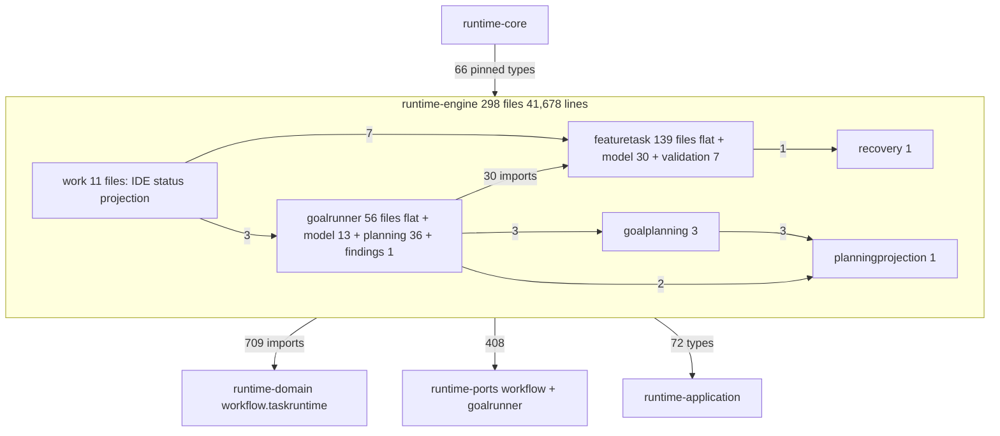

# Runtime-engine architectural investigation

## Assessment

Keep the module, its four area roots, and its position in the graph. `runtime-engine` sits where the architecture puts it: it imports domain, ports, contracts, and application; nothing inward imports it; the pinned inbound API and the empty package-cycle baseline are enforced by tests; area-level dependencies are acyclic (`goalrunner → featuretask`, `work → featuretask, goalrunner`, `goalrunner.planning → goalplanning, planningprojection`). No new module, layer, or framework is needed.

The problems are how the run loops are put together inside that boundary. The feature-task run loop still hands 85 helper functions its whole 16-field context, three times what the architecture document says it does. Function parameters that exceed a lint threshold are wrapped into 152 bag classes, 87 of them built at exactly one call site, and several carry ports and session objects so the bag hides the dependency the threshold was meant to expose. Ten role interfaces have one implementor each and no consumer typed by them. Nineteen engine files decode the raw `artifactsJson` SQLite column and patch it back, which is why the module inlines 168 wire-key literals. Durable decoders in goal planning fail through `require`/`error`, status projection turns read failures into zero counts without a record, and two emitters duplicate the same best-effort write path. Thirty application types have no production consumer except the engine. Of 746 public top-level names, 420 have no consumer outside the module, and all of them are transitive ABI for the CLI and MCP.

Reviewed on 2026-09-16 at `3f6aaff18318483771900c96b5e7cd854e7e8259` on `main`; the only untracked path was the SKILL-351 spec directory. Scope: all 298 production Kotlin files (41,678 lines), 127 test files (36,011 lines, 938 tests), ten test fixtures (829 lines), the module build script, the architecture guards and baselines in `runtime-core`, the recorded decisions in `runtime-kotlin/agent/decisions.md` and `featuretask/agent/decisions.md`, and the consumers named per finding. SHA-256 of the sorted production-file digest list is `31fd93acf09e4e6aee2f62414a956689034a0168d5417b182599de6d870bba30`. This is a whole-module architectural investigation, not a diff review and not a governed review-driver verdict.

## Structure and ownership

Area edges are acyclic and `ApplicationPackageAcyclicityArchitectureTest` records an empty cycle baseline for the module. One level down, `model` packages import their orchestration parents: `featuretask.model → featuretask` (7 edges), `goalrunner.model → goalrunner` (8), and `featuretask.validation ↔ featuretask` (7 and 7). Every one of those reverse edges comes from an `@Inject data class` bundle of services placed under `model` (F-007).

The 22 `FeatureTaskRuntimeRunLoop*.kt` files total 11,099 lines, 27% of the module. Four of them are within 150 lines of the 1,200-line ceiling (AttemptSettlement 1,057; ValidationGate 1,051; PhaseAttempts 956; OutputVerification 879). The module declares 72 interfaces: 52 are sealed alternatives, which is the intended closed-type modelling; 10 are the phase-recorder role interfaces (F-003); 10 are `fun interface` or plain ports with one production implementation each, of which `FeatureTaskRuntimeReviewDriver`, the two validation-gate launchers, `ValidationGateProgressStore`, `GoalPlanningAttemptRecorder`, and `GoalPlanningRefreshLiveness` have test substitutes and earn their place.

Consumers: `runtime-core` exposes the engine as `api(...)`, so every public declaration is transitive ABI for the CLI and MCP even though `RuntimeEngineInboundApiTest` pins only 66 types those adapters may reference. Persistence: 27 engine files hold a `DatabaseSessionFactory`, 162 sites touch `unitOfWork.workflowStates`, 58 sites in 19 files call `decodeWorkflowArtifacts(record.artifactsJson)`, and 25 call `persistPatch`. Area history lives in two homes: `runtime-engine/agent/history.md` and 831 lines of markdown under `src/main/kotlin/skillbill/engine/{featuretask,goalrunner}/agent/`.

## Principles assessment

| Principle | Assessment and evidence |
| --- | --- |
| Clean and hexagonal architecture | Direction is correct and enforced (`RuntimeGradleModuleLayeringTest`, `RuntimeEngineInboundApiTest`, empty cycle baseline). Inside the boundary the engine performs adapter work: 19 files decode a raw JSON column and patch it back; ten `*Recorder` classes are repositories in all but name. F-009. |
| Single responsibility | Area clusters are cohesive. The run loop is one responsibility spread across 22 files that communicate through an all-access context and 116 `*Args` classes rather than through named collaborators. F-001, F-002. |
| Open/closed | Closed sets are sealed types in 52 places. `GoalRunnerLedgerContext` models the union of ledger actions as 18 fields, 15 nullable; liveness classes and worker roles are string literals at six or more sites. F-002, F-012. |
| Liskov substitution | No `Map by delegate` wrappers here. `RuntimeOwnedFactUnavailable`, `MissingCarriedForwardGoalReviewResultException`, and `GoalRunnerExecutionAlreadyRunningException` extend `IllegalStateException`, so a `catch (IllegalStateException)` anywhere below them absorbs typed runtime facts. F-004. |
| Interface segregation | Ten `FeatureTaskRuntimePhase*Api` interfaces segregate nothing: zero parameters or fields in production or tests are typed by one; the only consumer is the facade that composes all ten. F-003. |
| Dependency inversion | Ports live in `runtime-ports` and the engine consumes them. Bundles of those ports (`*Boundaries`, `GoalRunnerDeps`) are declared in `model` packages and imported by the orchestrators they bundle for, inverting the model→orchestration direction. F-007. |
| YAGNI and simplicity | 87 of 116 `*Args` classes are constructed at one site; one is constructed nowhere. Ten role interfaces plus a private `Parts` class exist to compose one facade. Two emitters and one persistence boundary implement the same best-effort write three times. `topLevelJsonObjectCandidates` is a third hand-written JSON brace scanner alongside two in `runtime-infra-fs`. F-002, F-003, F-006. |
| State ownership | `FeatureTaskRuntimeRunState` (438 lines) owns its collections privately and exposes named transitions, as the principle requires. Around it, `phaseTokenAccumulator: MutableMap<String, Pair<Int, Int>>` rides in the context and three bags (34 references), `ValidationSettlementState` exposes two `MutableSet` fields, and `attempted: MutableList<Int>` passes through three goal-runner bags. F-001, F-002. |
| Failure and observability | 138 `runCatching`, 59 `error()`, 149 `require(`, 12 `!!`, 3 `catch (IllegalArgumentException)` translations. Status projection turns a ledger read failure into zero counts and a liveness failure into `UNKNOWN` with no record; `GoalRunnerRepairCoordinator` swallows a worker-ownership read. F-004, F-005. |
| Contract ownership | 168 `"key" to` pairs and 85 literal bracket or `get("…")` accesses. `GoalPlanningSharedContextPacket.PACKET_FIELDS` mixes one `*Keys` constant with nine literals; `GoalContinuationArtifactCodec` re-inlines keys that `FeatureTaskRuntimeGoalContinuationArtifact` in domain already owns. F-010. |
| Testing | 938 tests pass and exercise real SQLite persistence through the production recorder, which matches Tests And Evidence. `GoalRunnerTest.kt` holds 118 tests in 5,029 lines, `GoalPlanningSweepTest.kt` 87 in 3,267, and 118 assertions pin message substrings. F-013. |

## Findings

Paths are repository-relative under `runtime-kotlin/runtime-engine/src/main/kotlin/skillbill/engine/` unless another module is named.

- [F-001] Major | High | `featuretask/FeatureTaskRuntimeRunLoop.kt:17` | 85 run-loop helpers still take the all-access context; the architecture document records 25.
- [F-002] Major | High | `featuretask/FeatureTaskRuntimeRunLoopSharedArgs.kt:35` | 152 parameter-bag classes, 87 built once, several carrying ports, replace named collaborators to satisfy a lint threshold.
- [F-003] Major | High | `featuretask/FeatureTaskRuntimePhaseRecorderApis.kt:35` | Ten role interfaces have one implementor each and no consumer typed by them.
- [F-004] Major | High | `goalrunner/planning/GoalPlanningSharedContextPacketValidation.kt:30` | Durable decoders fail through `require`/`error`/`!!` and a tenth raw-map reader; typed facts extend `IllegalStateException`.
- [F-005] Minor | High | `goalrunner/GoalRunnerStatusProjectionAssembler.kt:128` | Read failures become zero counts or `UNKNOWN` without a record; 98 `runCatching` blocks hand-copy the diagnostic guard.
- [F-006] Minor | High | `goalrunner/GoalRunnerObservabilityEmitter.kt:37` | Two emitters and one persistence boundary implement the same best-effort write; a third JSON brace scanner.
- [F-007] Minor | High | `goalrunner/model/GoalRunnerDeps.kt:13` | Collaborator bundles live under `model`, invert the model→orchestration direction, and one bundle nests bundles for one constructor pair.
- [F-008] Minor | High | `work/IdeStatusProjector.kt:1` | 30 of the 72 application types the engine imports have no other production consumer.
- [F-009] Minor | High | `featuretask/FeatureTaskRuntimeGateProgressRecorder.kt:20` | Nineteen files decode the raw `artifactsJson` column and patch it back; the engine does the adapter's job.
- [F-010] Minor | High | `goalrunner/GoalContinuationArtifactCodecWireDecode.kt:25` | 168 inline wire-key pairs and 85 literal accesses, some for keys a domain owner already declares.
- [F-011] Minor | High | `featuretask/FeatureTaskRuntimeRunLoop.kt:64` | 420 of 746 public names have no consumer outside the module, and all are transitive ABI.
- [F-012] Minor | Medium | `goalrunner/GoalRunnerStatusProjectionAssembler.kt:350` | Timestamps and closed vocabularies travel as strings and are parsed inside `runCatching`.
- [F-013] Minor | Medium | `runtime-kotlin/runtime-engine/src/test/kotlin/skillbill/engine/GoalRunnerTest.kt:1` | Two test classes hold 205 tests in 8,296 lines; 118 assertions pin prose.

### F-001. Helpers take facts and capabilities, not the run loop

`FeatureTaskRuntimeRunLoopContext` has 16 fields: request, state, observability, spec source, transitions, a mutable token accumulator, six recorder or validator collaborators, the subtask launcher, the settlement service, the activity stamp writer, the clock, diagnostics, and the session. Eighty-five extension functions across 15 files take it as receiver. `ARCHITECTURE.md` "Feature-task run-loop helper inputs (SKILL-247 subtask 3)" records a census of six families totalling 25 after narrowing (PlanningBranch 0, Drive 2, ValidationGate 9, AttemptSettlement 3, Review 6, PhaseAttempts 4). The current numbers for those six are 0, 2, 9, 4, 6, 4. The nine files the census never counted hold the other 60: CheckpointRemediation 12, Checkpoint 10, OutputPersistence 7, Launch 6, BackwardEdge 6, RecordRejection 5, OutputVerification 5, Transitions 3, RepairReceipt 3, AuditRetry 3. The document's statement that "new helpers must not reintroduce run-loop or context-all-access parameters when a narrowed overload already exists" is therefore true of one third of the helpers and untested for the rest.

`phaseTokenAccumulator: MutableMap<String, Pair<Int, Int>>` is a mutable collection exposed to every helper through the context and through `PhaseAttemptAccumulatorContext`, `RecordRejectionAttemptArgs`, and `FeatureTaskRuntimeRunnerExecute` (34 references). `ValidationSettlementState` (`FeatureTaskRuntimeRunStateValidation.kt:15`) exposes `completed: MutableSet<String>` and `gateInvalidatedPhases: MutableSet<String>` that alias `FeatureTaskRuntimeRunState`'s private sets. State Ownership forbids both shapes.

Finish the narrowing for the nine uncounted families using the same rule the counted ones follow: pure calculations take request facts and recorder reads; persistence tails take request, state, recorder, diagnostics; only launch capture and the forward drive loop keep the context. Give the run state a named `recordPhaseTokens(phaseId, input, output)` transition and a read-only view and delete the shared mutable map. Extend the census in `ARCHITECTURE.md` to every `FeatureTaskRuntimeRunLoop*` file and add the count to the existing architecture-test inventory so the documented number cannot drift again.

### F-002. Bags are not collaborators

The module declares 152 classes suffixed `Args` (116), `Context` (23), `Boundaries` (7), `Inputs` (5), or `Deps` (1). Of the 116 `Args` classes, 87 are constructed at exactly one call site and `BuildDeclaredGoalProgressEventArgs` at none. `FeatureTaskRuntimeRunLoopSharedArgs.kt` is 635 lines of such bags and `GoalRunnerSharedArgs.kt` follows the same shape. Detekt's `LongParameterList.functionThreshold` is 6 while `constructorThreshold` is 12 (2026-09-04 decision), so any helper with a seventh parameter gets a bag; the decision text itself says the split point must be "a real sub-collaborator with a name a reader can state, never a bundle that only one constructor consumes."

Several bags carry the dependencies the threshold was meant to surface. `SettleValidationGateCycleArgs` carries `recorder`, `goalContinuationRecorder`, `outputValidator`, `phaseGates`, and `session`; `WriteUnattributableRejectedEvidenceArgs` carries the recorder; `GateOutputArgs` has 16 fields and `SettleValidatedOutputArgs` 14. `GoalRunnerLedgerContext` (18 fields, 15 nullable) is the union of every attempt-ledger action expressed as optional fields, which the State Ownership principle names as accidental precedence. Data that is genuinely wide is fine: `FeatureTaskRuntimePhasePromptComposeInputs` (26 fields) and `FeatureTaskRuntimePhaseStateRequest` (24) are records that cross a real seam.

Dissolve single-site bags whose fields are facts back into parameters, and where that exceeds six, raise `functionThreshold` by decision to the value the surviving signatures need rather than to hide them. Turn bags that carry ports into named collaborators with those ports as constructor dependencies. Model `GoalRunnerLedgerContext` as a sealed hierarchy of ledger actions. Keep a bag only when two or more call sites build it or it names a concept a reader can state (`PhaseRun`, `CarriedForwardGoalReviewArgs`).

### F-003. Role interfaces that no one is typed by

`FeatureTaskRuntimePhaseRecorderApis.kt` declares ten interfaces (`…WorkflowApi`, `…RejectedApi`, `…StateApi`, `…ReviewApi`, `…ReviewGenerationApi`, `…FindingVerificationApi`, `…ReviewCheckpointApi`, `…BriefingApi`, `…GateApi`, `…EvidenceApi`). Each has exactly one implementor, a `*Recorder` class in the same package. `FeatureTaskRuntimePhaseRecorder` implements all ten `by` delegation to a private `FeatureTaskRuntimePhaseRecorderParts` bundle built from ten constructor parameters that are repeated in the public `@Inject` constructor. A census of every parameter, field, and local typed as one of the ten across `runtime-engine`, `runtime-core`, their tests and fixtures finds zero. The 2026-09-06 decision (b) already collapsed the same shape for `GoalRunnerManifestStore`. `ARCHITECTURE.md` Enforcement Status lists "Redundant role interfaces and application forwarders" against SKILL-238; the engine's instance remains.

Delete the ten interfaces and the `Parts` class. `FeatureTaskRuntimePhaseRecorder` either exposes the ten concrete recorders as named members or keeps its current method surface by delegation to concrete types; the second keeps every call site unchanged. Port width guards (`thresholdInInterfaces` 11) are unaffected because no interface remains. If a future consumer needs a narrower type, reintroduce one interface for that consumer.

### F-004. One failure identity per durable decode seam

`GoalPlanningSharedContextPacket.migrate` and `validate` and `GoalPlanningSharedContextPacketValidation` decode the durable `_goal_planning_shared_context` artifact with 22 `require` and 12 `error` calls, so a malformed packet raises `IllegalArgumentException` or `IllegalStateException`. `decodeGoalAgentAddonSelection` (`goalrunner/GoalRunnerWorkflowFamilyLookup.kt:50`) decodes the durable review-policy artifact with `error` and `check`. `FeatureTaskRuntimePlanningStopper.kt:61` and `FeatureTaskRuntimePhaseLaunchBriefing.kt:103` catch `IllegalArgumentException` to recover the typed identity after the fact, and `wireMapping` (`featuretask/FeatureTaskRuntimeWireMapping.kt:7`) exists to rethrow `IllegalArgumentException` as `InvalidWorkflowStateSchemaError`. The same file declares `requiredMap`, `requiredString`, `requiredList`, `optionalList`, `stringList`, `requiredInt`, `requiredBoolean`, `optionalString`: a tenth raw-map reader family beside the nine SKILL-351 F-002 counts in domain.

Twelve `!!` follow nullable domain decoders (`decodeValidationEvidenceFromArtifact(…)!!`, `decodeValidationGateProgressFromArtifact(artifact)!!`, `decodeRepairReceiptFromArtifact(…)!!`, `decodeRunInvariantsFromArtifact(…)!!`) whose `null` means "raw was null" while every caller has already established non-null input; the API shape forces the operator. `RuntimeOwnedFactUnavailable`, `MissingCarriedForwardGoalReviewResultException`, and `GoalRunnerExecutionAlreadyRunningException` extend `IllegalStateException` rather than `SkillBillRuntimeException`.

Route the two durable decoders above through the goal-planning and review-policy families' typed errors, delete the three `catch (IllegalArgumentException)` recoveries and `wireMapping`, and adopt the single internal reader SKILL-351 subtask 1 introduces instead of the engine copy. Where SKILL-351 has not landed when this work starts, make the engine reader `internal` and mark it for replacement. Ask the domain for non-null decoder overloads so the `!!` disappear. Move the three runtime-fact exceptions under the runtime exception taxonomy.

### F-005. Record every fallback or fail

`GoalRunnerStatusProjectionAssembler.kt:128` wraps `readAttemptLedgerSummary` in `runCatching { … }.getOrNull()` and projects `blockedAttemptCount = 0`, `supervisorKillCount = 0`, empty phase-attempt maps, and `findingsInScope = null` when the read fails, so an operator sees a healthy goal with no attempts instead of a broken ledger. `resolveChildExecutionLiveness` and `resolveParentExecutionLiveness` (`:344`, `:359`) `getOrDefault(ExecutionLiveness.UNKNOWN)` over lease reads, `Instant.parse`, and process inspection with no record. `GoalRunnerRepairCoordinator.kt:340` reads worker ownership with `runCatching { … }.getOrNull()`. The observability policy requires a bounded record naming seam, value expected, and value used for each.

Of 138 `runCatching`, 98 open a block and 18 of those wrap `diagnostics.warning(…)` so a failing diagnostics port cannot mask the primary outcome. That guard is correct and is already owned once by `RuntimeOwnedPersistenceBoundary.recordFailure`; it is hand-copied in `GoalRunnerProgressEventEmitter`, `GoalRunnerObservabilityEmitter`, `GoalRunnerResetReplanCoordinator` (twice), `GoalRunnerPurgeCoordinator`, and others.

Make the three status seams either fail typed at the projection or record through the diagnostics port with the policy's three fields, and reflect a degraded read in the projection (`integrityProblem` already exists for validation evidence). Give the diagnostics guard one owner that the emitters and coordinators call.

### F-006. One best-effort write path, one JSON scanner

`GoalRunnerProgressEventEmitter` (95 lines) and `GoalRunnerObservabilityEmitter` (200 lines) each hold a `sequence` counter seeded from a watermark, a `runCatching` store write, a `when` that rethrows `CancellationException`, re-interrupts and rethrows `InterruptedException`, and logs anything else through two near-identical `logBestEffortFailure`/`logBestEffortMissingWorkflow` functions with a duplicated `MAX_DIAGNOSTIC_MESSAGE_LENGTH = 240`. `RuntimeOwnedPersistenceBoundary.optionalWrite` implements the same contract for database writes with different cancellation handling (`CancellationException` only). `GoalRunnerChildRepairWedgeDiagnosis` (228 lines) and `GoalRunnerParentRepairWedgeDiagnosis` (67) share the `wedges`/`passed` accumulation shape.

`topLevelJsonObjectCandidates` (`goalrunner/GoalRunnerLaunchModels.kt:113`) is a hand-written brace-depth scanner with `inString`/`escaped` state; `runtime-infra-fs` already has two (`StructuralRepairSyntax.kt:76`, `FeatureTaskRuntimePhaseOutputSchemaLoading.kt:100`). The engine copy locates JSON objects in agent stdout, which is adapter-side agent-output parsing.

Extract one best-effort recorder with the emitters as thin callers, unify the cancellation and interruption rule, and declare the message cap once. Move or reuse the brace scanner through the adapter that owns agent-output parsing; do not add a fourth.

### F-007. Bundles do not belong in `model`

`goalrunner/model/GoalRunnerDeps.kt`, `goalrunner/model/GoalRunnerBoundaries.kt` (three bundles), `featuretask/model/FeatureTaskRuntimePhaseGateBoundaries.kt` (two bundles, one with 11 collaborators), and `goalrunner/planning/model/GoalPlanningSweepBoundaries.kt` are `@Inject data class`es of services and ports. `docs/code-principles.md` reserves `model` packages for public inputs and results. These files produce every `model → parent` import edge in the module (7 in featuretask, 8 in goalrunner). `GoalRunnerDeps` bundles nine collaborators, two of which are themselves bundles, for two consumers (`GoalRunner`, `GoalRunnerPerRunLoopAssembler`), and `GoalRunner` re-exposes six of them through `get()` forwarders. The 2026-09-04 decision names exactly this as the shape never to use.

The `*Boundaries` collapse is a recorded decision with a stated revisit condition and is not reopened here. Move the bundles beside the orchestrators they serve, delete `GoalRunnerDeps` in favour of `GoalRunner` taking its two bundles and seven collaborators directly (nine is under the constructor threshold), and remove the forwarders. The `model → parent` edges then disappear and the acyclicity scan can run at sub-area granularity for this module.

### F-008. Thirty application types have one consumer

The engine imports 72 distinct `skillbill.application.*` types. A production-consumer census outside the engine finds none for 30 of them: the 19 types in `application/idestatus/model/IdeStatusModels.kt` (`IdeStatusSnapshot`, `IdeStatusResult`, `IdeStatusStep`, `IdeStatusWorkflowFamily`, `IdeStatusLifecycleState`, and fourteen more), `FeatureTaskRuntimeRejectedOutputWrite`, `FeatureTaskRuntimeAgentContext`, `FeatureTaskRuntimeCorrelation`, `FeatureTaskRuntimeFindingVerificationTelemetry`, `FeatureTaskRuntimeRegenerationTelemetry`, `FeatureSpecPreparationRuntime`, `FeatureSpecPreparationWriter`, `SpecSourceResolver`, `FeatureTaskRuntimeSharedReviewEvidenceResolver`, `encodeDecompositionManifestYaml`, and `findMatchingDecompositionManifests`. The CLI reaches IDE status only through `skillbill.engine.work.IdeStatusService` and `IdeStatusRequest`. `ARCHITECTURE.md` justifies the engine→application edge as "the shared services those loops call today"; 30 of the 72 are not shared.

Move the engine-only models into the engine area that produces them (`work.model`, `featuretask.model`) and the engine-only services beside their callers, keeping `IdeStatusRequest` and any type the CLI or MCP references where the inbound-API pin can see it. The remaining 42 imports are the real shared edge; document that list so the edge is auditable.

### F-009. The engine decodes a database column

Twenty-seven engine files hold a `DatabaseSessionFactory`. Nineteen files call `decodeWorkflowArtifacts(record.artifactsJson)` at 58 sites, then index the resulting map with a string key, then `persistPatch` (25 sites) a new map back through `FeatureTaskRuntimeWorkflowPersistence`. `FeatureTaskRuntimeGateProgressRecorder.kt:20-30` is representative: read the row, decode the column, pick `FEATURE_TASK_RUNTIME_VALIDATION_GATE_PROGRESS_ARTIFACT_KEY`, coerce to a map, decode the artifact with `!!`. `GoalRunnerChildRepairWedgeApplyLoop.kt:333` mutates `state.patch["goal_continuation_outcome"] = null` on a raw map. The Durable State principle allows an adapter callback inside a unit of work; it does not make the engine the owner of the column format. This is the source of most of F-010's literals and of the `!!` in F-004.

Give the column one engine-side owner. `FeatureTaskRuntimeWorkflowPersistence` already exists; extend it (or a sibling `FeatureTaskRuntimeArtifactStore`) with typed `readArtifact(workflowId, key, decoder)` and `writeArtifact(workflowId, key, artifact)` operations that decode once and patch once, and route the 19 files through it. Do not add a port per artifact and do not introduce a new module; the aim is that `artifactsJson` is spelled in one engine file.

### F-010. Declare each wire key once

The engine holds 168 `"snake_case" to` pairs and 85 literal `["…"]`, `.get("…")`, or `.put("…")` accesses. Concentrations: `GoalContinuationArtifactCodecWireDecode.kt` 25, `GoalPlanningPreparationCheckpoint.kt` 22, `GoalChildPlanningHydrator.kt` 14, `GoalPlanningPreparationRecordMapping.kt` 13, `GoalRunnerChildRepairWedgeApplyLoop.kt` 11, `GoalPlanningSharedContextPacket.kt` 10. `GoalPlanningSharedContextPacket.PACKET_FIELDS` lists `DecompositionPlanningPayloadKeys.PARENT_SPEC_PATH` beside nine literals for the same packet. `GoalContinuationArtifactCodec.kt:26-36` reads `"goal_continuation"`, `"suppress_pr"`, and `"goal_branch"` while `FeatureTaskRuntimeGoalContinuationArtifact` in domain encodes the same keys (SKILL-351 F-011). `isImplementationReturnContract` (`GoalRunnerLaunchModels.kt:98`) hardcodes the six keys of the implementation return contract. `AGENTS.md` forbids inlining governed keys; `WireVocabularyGovernedSeamInventory` covers three schema seams and none of these.

For each artifact family the engine encodes or decodes, reference the owning `*Keys` object (existing contract owners where a schema exists; an area-owned object beside the codec otherwise) and add these seams to the governed inventory. Open agent prose and pack-authored payloads stay open.

### F-011. Internal by default

A word-boundary census over every Kotlin source root in `runtime-kotlin` (method as SKILL-351 F-007; rerun at implementation time) finds 746 public top-level names in engine production code. 420 are never referenced outside `runtime-engine/src/main`: 111 only in their declaring file, 309 only elsewhere in the module. A further 186 are referenced outside the module only by tests or fixtures. By kind the 420 are 232 functions, 73 classes, 39 objects, 34 constants, 22 values, 20 interfaces. Examples in the run-loop file itself: `isFeatureSpecPathForIssue`, `reconcileCheckpointPathInventory`, `resolveReviewPassNumber`. Because `runtime-core` exposes the module as `api(...)`, every one is ABI for the CLI and MCP, and `RuntimeEngineInboundApiTest` constrains consumers rather than the engine.

Make same-file-only declarations `private` and module-only declarations `internal`, delete the dead ones after a fresh census plus compilation and the full suite, and add an architecture check that new public engine declarations outside the pinned inbound API and `model` packages fail. Fixtures that need engine internals use the existing `testFixtures` source set, which shares the module.

### F-012. Type what is closed

`clock.instant().toString()` appears at 26 sites and `Instant.parse(` at 12. `GoalRunnerStatusProjectionAssembler.kt:350` parses `ownership.expiresAt` inside `runCatching`, so a malformed timestamp silently becomes `UNKNOWN` liveness (F-005). `GoalRunnerObservabilitySignal.livenessClass: String` takes `"heartbeat"`, `"phase_change"`, `"file_activity"`, `"subtask_start"`, `"resume"`, `"worker_output_summary"`; `workerRole = "goal_runner_supervisor"` and `workflowPhase = "goal_runner_supervision"` repeat across the two emitters. `GoalPlanningSharedContextPacket` compares `"planning_disposition" == "included"` at three sites.

Where the port model already stores a string timestamp, parse once at the port boundary into `Instant` and fail typed; where a vocabulary is closed on both ends, use an enum with `wireValue` and convert at the wire seam. Check at implementation whether `GoalObservabilityRecordKind` or another domain enum already names the liveness classes before adding one.

### F-013. Tests are organised by class, not behaviour

`GoalRunnerTest.kt` holds 118 tests in 5,029 lines and `GoalPlanningSweepTest.kt` 87 in 3,267; `FeatureTaskRuntimeRunnerTestSupport.kt` is a 2,119-line builder. 118 assertions pin message substrings (`assertTrue(message.contains(…))` or 40-plus-character `assertEquals` prose). The suites exercise real SQLite through the production recorder and fixtures, which is the right boundary and is why F-003's missing fakes are not a gap.

Split the two large classes by behaviour family when a subtask touches them, and replace prose pins with assertions on typed outcomes or failure codes where a typed value exists. This is a cost to pay alongside the other findings, not a subtask of its own.

## Over-engineering cuts

Estimates of net production-line change, excluding tests. Required validators, typed errors, and schema constants are not counted as bloat.

- 87 single-site `*Args` classes and one dead one (F-002): dissolve into parameters or named collaborators. About 500 net lines including construction ceremony.
- `featuretask/FeatureTaskRuntimePhaseRecorderApis.kt` plus `FeatureTaskRuntimePhaseRecorderParts` (F-003): delete. About 170 net lines.
- Two emitters' duplicated best-effort path and second message cap (F-006): one recorder. About 70 net lines.
- `featuretask/FeatureTaskRuntimeWireMapping.kt` and the three `catch (IllegalArgumentException)` recoveries (F-004): delete once the shared reader is adopted. About 70 net lines.
- `GoalRunnerDeps` and six `get()` forwarders (F-007): delete. About 30 net lines.
- 58 `decodeWorkflowArtifacts` read-decode-patch sequences (F-009): collapse to one typed call each. About 150 net lines.
- Visibility narrowing and dead-declaration deletion (F-011): the 111 same-file-only names include some with no reference anywhere; deletion count is set by the implementation census. About 100 lines.

net: about -1,000 lines possible; zero new modules or dependencies.

## Changes deliberately rejected

- Splitting `runtime-engine` into per-area Gradle modules (`featuretask`, `goalrunner`, `work`). The area edges are already acyclic and pinned; the problems are inside `featuretask`, and a module boundary would not narrow one helper's inputs.
- Reopening the `*Boundaries` collapse recorded in `runtime-kotlin/agent/decisions.md`. The bundles stay; only their package and the nested `GoalRunnerDeps` change (F-007).
- Rewriting the run loop as a generic state machine or workflow framework. The phase graph is declared in domain; the fix is narrower inputs and fewer bags, not another abstraction.
- Replacing the ten recorders with a single 60-method port in `runtime-ports`. `thresholdInInterfaces` 11 exists to prevent composite ports; F-003 deletes interfaces rather than merging them.
- A port per artifact key for F-009. One typed read/write pair on the existing persistence owner is the whole requirement.
- Removing the engine→application edge. Forty-two of the 72 imported types are genuinely shared services; F-008 moves the 30 that are not.
- Renaming the `FeatureTaskRuntime*` prefix or the 22 `FeatureTaskRuntimeRunLoop*` files. No behavioural payoff; the diff would dominate review.
- Raising `LongParameterList.functionThreshold` alone without dissolving bags. The threshold change is the enabler; deleting the bags is the work.

## Public engineering comparisons

Reddit's account of separating model types from transport and keeping one owner per wire shape is the standard F-009 and F-010 apply to the artifact column and its keys. [Reddit client migration design](https://www.reddit.com/r/RedditEng/comments/rdfbin), [Reddit Core transport and model separation](https://www.reddit.com/r/RedditEng/comments/xivl8d)

Microsoft's dependency-injection guidance names over-injection and service-locator bundles as the signal that a class has too many responsibilities, and its architectural principles place persistence ignorance with business rules; F-002, F-007, and F-009 apply both. [Microsoft DI guidelines](https://learn.microsoft.com/en-us/dotnet/core/extensions/dependency-injection-guidelines), [Microsoft architectural principles](https://learn.microsoft.com/en-us/dotnet/architecture/modern-web-apps-azure/architectural-principles)

Meta's Project LightSpeed rewrite removed duplicate implementations of one capability in favour of one platform facility; F-006 applies the same test to two emitters and three brace scanners. [Meta Project LightSpeed](https://engineering.fb.com/2020/03/02/data-infrastructure/messenger/)

These are public engineering comparisons. This report does not certify compliance with private Reddit, Microsoft, or Meta review standards.

## Validation and limits

`./gradlew :runtime-engine:test --offline` passed at the recorded commit: 938 tests, zero failures, zero skipped. Every production file was listed and its package edges computed; files quoted in findings were read in full or at the cited ranges. Consumer tracing followed each finding's call sites and does not claim execution of every CLI or MCP path. The reference and consumer censuses are word-boundary text matching; overloads share a name and generated or reflective access is invisible to them, so their numbers are inputs to implementation, not deletion authority. No full repository gate, dependency audit, load test, installed-runtime launch, or governed review-driver pass ran. No production source was changed.

The review skill drives a revision or diff; this whole-module investigation follows the user's requested scope directly. The feature-spec skill supplies the bundle shape; the user's instruction to use the next available key resolves its key intake.
