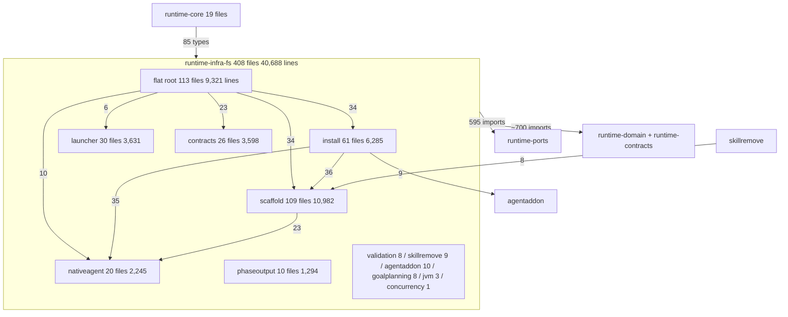

# Runtime-infra-fs architectural investigation

## Assessment

Keep the module, its single-adapter-module status, and its position in the graph. `runtime-infra-fs` sits where the architecture puts it: it imports domain, ports, and contracts; only the composition root imports it (19 files in `runtime-core`, 85 types); no entry adapter, application, engine, or sibling infrastructure module reaches it; the package-cycle baseline is empty; the ten-area layer order the build script enforces has zero measured violations. Parameter bags are rare (21 classes, each built at 2 to 9 sites), closed outcomes are sealed in 8 hierarchies, and the two documented process owners (`invokeGitProcess`, `ProcessRunLifetime`) and the journal recovery path are shaped as the design principles require. No new module, layer, library, or framework is needed.

The problems are how the adapters inside that boundary are organised and how often the same mechanism is implemented again. The flat root package holds 113 of 408 files while twelve child areas exist beside it, and the clustering guard does not scan this module. Twenty JSON Schema validators each carry their own copy of a 90-to-100-line load-and-report skeleton, seventeen of them with a fallback that walks the working directory for the schema file at runtime, and seventeen forwarding adapters exist only to hand a domain port to one of those validators. Eleven sites start child processes with six bespoke lifetimes beside the three documented owners. Four agents are spelled as 38 string literals across four vocabularies. Home-directory and environment resolution has 18 owners. Atomic writes, digests, path containment, and directory discovery are each implemented many times. Failure identity at durable and external seams is still `IllegalArgumentException` at 45 recovery sites, and fallbacks report through `java.util.logging` in 22 files while the diagnostics port is used in 4. The module build script is 499 lines against a median of 28 for the other ten modules.

Reviewed on 2026-09-16 at `66b39806dff8a9d5461993c575faad615cded32a` on `main` with a clean working tree. Scope: all 408 production Kotlin files (40,688 lines) in 41 packages, 209 test files (39,691 lines), the 33 `repoTest` files, the module build script, the architecture guards and baselines in `runtime-core` that scan this module, the recorded decisions in `runtime-kotlin/agent/decisions.md` and `runtime-infra-fs/agent/history.md`, and the consumers named per finding. SHA-256 of the sorted production-file digest list is `c2f276daf6061adb829cfc4434a17145f60a2312662b52efb79d523bd0920c53`. This is a whole-module architectural investigation, not a diff review and not a governed review-driver verdict.

## Structure and ownership

The build script compiles ten area source sets in the order Jvm, Contracts, AgentAddon, NativeAgent, Scaffold, Install, Launcher, root, GoalPlanning, SkillRemove and fails when a lower area imports a higher one. Every measured edge respects that order and nothing imports the root package, so the root is the top of the module: it is where every area's adapters are assembled. The order itself is recorded only in `agent/history.md` (SKILL-244) and in the build script; `ARCHITECTURE.md` and the architecture tests do not know it. `ApplicationPackageAcyclicityArchitectureTest` scans this module's packages with an empty baseline, which is the weaker property (no cycles) of the same fact.

The 113 root files group into eleven concerns, six of which already have a child package:

| Root concern | Files | Lines | Child package for the same concern |
| --- | --- | --- | --- |
| Git workflow operations (`Git*`, diff, branch source) | 19 | 2,335 | none |
| Review evidence broker, input source, staging, preflight, rubric | 18 | 1,481 | `launcher/review` (endpoint only) |
| Schema-validator adapters (`*ValidatorAdapter`, `*ValidatorInfraAdapter`) | 17 | 495 | `contracts` |
| External add-on overlay and source config | 12 | 989 | `agentaddon` (partly) |
| Install selection, baseline manifest, installer process, uninstall gateway | 11 | 1,116 | `install` |
| Feature-task runtime stores, spec paths, worker supervisor | 8 | 795 | none |
| JDK ports (thread, shutdown hook, timing, identifiers, host, fan-out, diagnostics) | 7 | 166 | `jvm` (a different concern) |
| Scaffold capability adapters and gateway | 6 | 558 | `scaffold` |
| Decomposition manifest journal and file store | 6 | 711 | none |
| Telemetry config, repo-local config, repository root, snapshot mapper, PR port | 5 | 570 | none |
| Native-agent composition and pack loader | 3 | 75 | `nativeagent`, `install/nativeagent` |

`PackageClusteringArchitectureTest` enforces "loose files in a subpackaged area must not belong to a sibling area cluster", but `PrincipleEnforcementInventory.packageClusteringSourceRoots` lists only `runtime-application`, `runtime-domain`, and `runtime-ports`. The rule that would have caught this shape never ran here.

Consumers: the module is an `implementation` dependency of `runtime-core`, so none of its 284 public top-level names are ABI. A word-boundary census finds 97 of those names referenced by `runtime-core`, the CLI, or MCP; 109 referenced only by tests; 78 referenced by nothing outside the module. Tests: 1,518 tests pass in the `test` task; 180 more in `repoTest` read governed repository sources and did not run for this baseline. The test source set depends on `runtime-application` and `runtime-engine` and grants itself `friendPaths` access to application internals.

## Principles assessment

| Principle | Assessment and evidence |
| --- | --- |
| Clean and hexagonal architecture | Direction is correct and enforced (`RuntimeGradleModuleLayeringTest`, `RuntimeAdapterDependencyAllowlistTest`, `RuntimeCoreCompositionOnlyTest`). Inside the module, seventeen adapters forward domain ports to validators that live in the same module; the ports are needed, the extra class is not. F-002. |
| Single responsibility | Area clusters are cohesive. The root package is eleven concerns in one namespace, and the review concern is split between root and `launcher/review`. F-001. |
| Open/closed | Closed sets are sealed in 8 hierarchies (`GateJvmDisposition` 13 alternatives, structural repair decisions 18). The four supported agents are four vocabularies plus 38 literals and 15 `when (provider)` sites. F-004. |
| Liskov substitution | One exception extends `IllegalStateException`; four validator adapters throw `IllegalArgumentException` for non-object input, so a durable-seam failure has the identity of a programming error. F-007. |
| Interface segregation | The twelve `gitops` role ports each have test doubles (4 to 10) and are reached through the composite `WorkflowGitOperations` (33 consumers); they earn their place. `AgentAddonSchemaResourceLoader` has one implementor and one test. F-002. |
| Dependency inversion | Ports live in `runtime-ports` or domain and the module implements them. Eighteen files resolve `user.home` themselves while `EnvironmentContext.userHome` and `HostPlatformPort` exist and eight files already receive them. F-005. |
| YAGNI and simplicity | 20 copies of one schema-loading skeleton; 6 bespoke process lifetimes beside 3 owners; 8 atomic-write helpers, 8 `sha256` functions, 43 `discover*` walkers, 19 rollback or restore functions in 7 files; a 888-line report tool whose only consumer is a Gradle task; a 499-line build script. F-002, F-003, F-006, F-009, F-010. |
| State ownership | Bags are few (21, built 2 to 9 times each). Process capture is frozen before publication in `ProcessRunLifetime`. `GitWorkflowSelectedDiff` owns a second drain thread, deadline, and process-tree teardown in the same package as `invokeGitProcess`. F-003. |
| Resource lifetime and failure | Three owners are documented and tested. `GeneratedArtifactGuardReport` reads stdout to completion and then waits with no deadline and no destroy; `ImmutableReviewFile`, `FileSystemDiffResolver`, `GhGoalPullRequestPort`, `GateJvmResolver`, and `FileSystemValidationGateRunner` each carry their own timeout and teardown. F-003. |
| Failure and observability | 174 `runCatching`, 196 `require(`, 27 `error(`, 22 `throw Illegal*`, 45 `catch (Illegal*)`, about 40 `getOrNull`/`getOrDefault`/`getOrElse` fallbacks. Twenty-two files log through `java.util.logging`; four use `RuntimeDiagnostics`. Seventeen validators read the repository from the working directory when the packaged schema is missing. F-002, F-007, F-008. |
| Contract ownership | Schemas are copied from `orchestration/contracts` at build time and pinned by parity tests, as the 2026-05-29 decision requires. The module inlines 134 `"key" to` pairs and 218 `["key"]` accesses; 46 of the accesses are in one scaffold payload reader and the top ten files are all under `scaffold/`. Governed seams the wire-vocabulary guard scans are clean. F-010. |
| Documentation truth | `ARCHITECTURE.md` still says `ScaffoldGateway` raw-map removal is deferred and `FileSystemScaffoldGateway` is retained pending it; the port has been typed (0 raw maps) and is consumed by five CLI files. F-010. |
| Testing | 1,518 tests pass over real filesystems, real git, and real processes, which matches Tests And Evidence. 653 assertions pin message substrings, 47 pin `IllegalStateException` or `IllegalArgumentException`, 16 use `Thread.sleep`, and infra tests import engine model types. F-012. |

## Findings

Paths are repository-relative under `runtime-kotlin/runtime-infra-fs/src/main/kotlin/skillbill/infrastructure/fs/` unless another module is named.

- [F-001] Major | High | `GitStandardWorkflowGitOperations.kt:1` | 113 files in the flat root span eleven concerns; six have a child package already and the clustering guard does not scan this module.
- [F-002] Major | High | `contracts/workflow/GoalProgressEventSchemaValidator.kt:24` | Twenty schema validators copy one loading skeleton, seventeen fall back to walking the working directory, and seventeen forwarding adapters stand between port and validator.
- [F-003] Major | High | `GitWorkflowSelectedDiff.kt:46` | Eleven process launch sites, three owners, six bespoke lifetimes; one has no deadline and no teardown.
- [F-004] Minor | High | `agentaddon/AgentAddonAgentIds.kt:4` | Four agents are four vocabularies, 38 literals, 15 `when (provider)` sites, and one parser duplicated verbatim.
- [F-005] Minor | High | `install/plan/InstallPrimitives.kt:168` | Home and environment resolution has 18 owners while an injected context already carries both.
- [F-006] Minor | High | `install/staging/InstallStagingAtomicMoves.kt:1` | Atomic write, digest, path containment, discovery, and rollback are each implemented many times.
- [F-007] Minor | High | `launcher/review/GovernedReviewEvidenceEndpoint.kt:172` | Durable and external seams fail as `IllegalArgumentException`; 45 sites catch it back; tests pin the untyped identity 47 times.
- [F-008] Minor | High | `install/nativeagent/NativeAgentLinkInventoryBootstrap.kt:39` | About 40 fallbacks return a default without a record, and the module reports through two channels.
- [F-009] Minor | High | `runtime-kotlin/runtime-infra-fs/build.gradle.kts:424` | A 499-line build script hand-lists 33 copies and compiles ten extra source sets to prove a layer order no test or document records.
- [F-010] Minor | High | `runtime-kotlin/ARCHITECTURE.md:1190` | Scaffold documentation describes a deferred migration that has landed, and an 888-line report tool ships in the runtime library for one Gradle task.
- [F-011] Minor | Medium | `FileSystemNativeAgentComposition.kt:1` | 187 of 284 public names have no production consumer outside the module.
- [F-012] Minor | Medium | `runtime-kotlin/runtime-infra-fs/build.gradle.kts:24` | Adapter tests depend on the engine and on application internals through `friendPaths`; 653 assertions pin prose.

### F-001. The root package is eleven areas without names

The root package `skillbill.infrastructure.fs` holds 113 files and 9,321 lines. Nineteen `Git*` files (2,335 lines) implement the twelve `skillbill.ports.workflow.gitops` role ports and assemble them in `GitWorkflowGitOperations`; there is no `git` package. Eighteen review files (`FileSystemReviewEvidenceBroker*`, `FileSystemReviewInputSource`, `FileSystemReviewLaunchAgentStaging`, `FileSystemReviewNativeAgentPreflight`, `FileSystemReviewRubricResolver*`, `ReviewCheckpointFile`, `ReviewCoordinateFile`, `ImmutableReviewFile`, 1,481 lines) implement the review ports while the review evidence endpoint they serve lives in `launcher/review`. Eleven install files (`FileSystemInstallAdapters`, `FileSystemInstallSelection*`, `FileSystemBaselineManifest*`, `FileSystemInstalled*`, `InstallerProcessAdapter`, `FileSystemUninstallFileSystemGateway`) sit beside a 61-file `install/` tree; six scaffold adapters beside a 109-file `scaffold/` tree; twelve external add-on overlay files beside `agentaddon/`; three native-agent files beside `nativeagent/` and `install/nativeagent/`. The decomposition journal (6 files, 711 lines), the feature-task runtime stores (8 files, 795 lines), the JDK ports (7 files), and the telemetry, repo-config, and repository-root adapters (5 files) have no package at all.

`docs/code-principles.md` names "loose files in a parent package when a child area cluster already exists" as the anti-pattern, and `PrincipleEnforcementInventory.enforceableRules` lists the clustering rule as enforced. Its `packageClusteringSourceRoots` covers `runtime-application`, `runtime-domain`, and `runtime-ports` only, so the rule has never run over this module. The `install/support` package (8 files: two provider config-path files, telemetry config paths, cleanup operations, legacy skill names, pointer rendering, a symlink exception, and symlink replacement) is a grab-bag named after the suffix the spillover guard bans for files.

Give each concern its package: `git` (the 19 files plus `FileSystemDiffResolver` and `FileSystemCheckedOutBranchSource`), `review` (the 18 root files together with the three `launcher/review` files), `journal` or `decomposition`, `featuretask`, `host` (the `Jdk*` ports and `CanonicalRepositoryRoot`), and move the install, scaffold, add-on, and native-agent adapters into the areas they assemble. The root files import the areas they would join and nothing imports the root, so the layer order is preserved by construction; the moved files become the top of their own area. Dissolve `install/support` into `install/plan` (config paths), `install/apply` (cleanup, symlink replacement), and the owners of the other two. Add `runtime-infra-fs/src/main/kotlin` to `packageClusteringSourceRoots` so the guard holds the shape.

Resolution: deferred to SKILL-354, whose investigation places every root file in one of five Gradle modules; the area names above become module and sub-package names there.

### F-002. One schema loader, and validators that are their own adapters

Twenty objects under `contracts/`, `agentaddon/AgentAddonSchemaValidator.kt`, and `scaffold/platformpack/PlatformPackSchemaValidator.kt` load a Draft 2020-12 schema from the classpath and validate a map against it. Each declares `private val schema: JsonSchema by lazy`, a `private val mapper: ObjectMapper by lazy`, an `assertIdentity` that compares `$id` and `properties.contract_version.const` to constants in `runtime-contracts`, a `load*Schema()` with three identical `catch` blocks that call `logSchemaLoadFailure` and rethrow, a `read*SchemaText()` that tries `getResourceAsStream` and then walks parent directories from `Path.of("").toAbsolutePath()` looking for the repository-relative YAML, a `violationOrdering` comparator, a `buildSchemaDriftLog`, and a `formatValidationReason`. After normalising the family names, `IdeStatusSchemaValidator.kt` and `GoalProgressEventSchemaValidator.kt` (172 lines each) differ in 18 lines; `FeatureTaskRuntimeQuarantineSchemaValidator.kt` and `FeatureTaskRuntimeImplementationAttemptSchemaValidator.kt` (108 lines each) differ in 14. `JsonSchemaFactory.getInstance` appears in 20 files, `SpecVersion` in 20, `ObjectMapper()` in 21, `by lazy` in 20, `Path.of("")` in 17, and `fun walkFor*` in 11. The `contracts/` tree is 3,598 lines; the two validators outside it add 332.

The working-directory walk is a fallback that reads the repository at runtime when the packaged resource is missing. The 2026-05-29 decision states that validators "load a classpath resource, not a repo-relative path" and that a missing schema must loud-fail at build time; the copy tasks in the build script already enforce that. The fallback produces 17 of the 104 rows in `runtime-infra-fs-ambient-environment-baseline.txt` (the next largest module baseline is 12) and makes a mispackaged runtime validate against whatever schema happens to be under the caller's working directory.

Seventeen `*ValidatorAdapter` and `*ValidatorInfraAdapter` classes in the root (495 lines) implement domain-owned ports (`skillbill.workflow.*`, `skillbill.install.model`, `skillbill.review.context`, `skillbill.ports.*`) by calling one of those validators. Fifteen are 13 to 17 lines and forward one call. `GoalProgressEventValidatorAdapter`, `GoalObservabilityEventValidatorAdapter`, `GoalPlanningPreparationEnvelopeValidatorAdapter`, and `DecompositionManifestValidatorAdapter` throw `IllegalArgumentException` when the input does not decode to an object, which is a durable-seam failure with a programming-error identity. The 2026-05-28 decision requires that domain and application reach validation through ports bound in `RuntimeComponent`; it does not require a separate class between port and validator. Both live in this module. The two adapters that do more than forward (`DecompositionManifestValidatorAdapter`, 111 lines, structural-repair inspection and failure-code mapping; `FeatureTaskRuntimePhaseOutputValidatorAdapter`, 145 lines, lenient normalisation and nested build-receipt validation) are real adaptation and keep their shape. `FeatureTaskRuntimeProjectionMeasurementSchemaValidator` is referenced only by one adapter and one sibling validator.

Introduce one internal loader in `contracts/` that takes the classpath resource, repository-relative path (for the message only), expected `$id`, contract-version constant, and a typed error factory, compiles the schema once, and returns the ordered violations with the dotted field path and offending value. Each validator becomes its schema declaration plus its family-specific message shaping, and implements its port directly as an `@Inject class`; the fifteen forwarding adapters are deleted and `RuntimeValidatorProvides` binds the validators. Delete the working-directory walk; a missing resource is the typed schema error the decision already names. Non-object input fails with the family's `Invalid*SchemaError`. The parity tests that pin each `*_CONTRACT_VERSION` to its schema `const` stay.

### F-003. One cleanup owner per process

`ProcessBuilder` is constructed in eleven files. Three lifetimes are documented and tested: `invokeGitProcess` in `GitProcessInvocation.kt` (registration before blocking I/O, one deadline, a cleanup budget, `ProcessHandle` descendant teardown, interruption preserved; used by five git files), `ProcessRunLifetime` with `JvmAgentRunProcessRunner` and `JvmAgentRunProcessOutputDrain` for agent runs, and `InstallerProcessAdapter` (1 MiB cap, 600 s deadline, tree teardown). Six more sites carry their own:

| Site | Deadline | Teardown | Drain |
| --- | --- | --- | --- |
| `GitWorkflowSelectedDiff.kt:46` (392 lines, git diff) | own `deadlineNanos` from `gitTimeoutSeconds` | own `destroyProcessTree`, `destroyForInterrupted`, `closeInputAndJoin` | own `skill-bill-selected-diff-output` thread |
| `ImmutableReviewFile.kt:44` (git show to file) | `waitFor(GIT_TIMEOUT_SECONDS)` | `destroyForcibly` | redirect to file |
| `FileSystemDiffResolver.kt` (git diff) | `waitFor` with timeout | `destroy` | one thread |
| `GhGoalPullRequestPort.kt:71` (gh) | 30 s | `destroyForcibly`, `join(1000)` | reader thread |
| `jvm/GateJvmResolver.kt` (guard script) | `waitFor` with timeout | `destroy` | none |
| `validation/FileSystemValidationGateRunner.kt` (gate command) | `waitFor` with timeout | `destroy` | none |
| `scaffold/pointer/GeneratedArtifactGuardReport.kt:125` (git ls-files) | none | none | `readText()` then `waitFor()` |

Four of the six run `git` in the same package as `invokeGitProcess`. `GitWorkflowSelectedDiff` re-implements the deadline, the cleanup budget (`GIT_PROCESS_CLEANUP_BUDGET_SECONDS`), the tree teardown, and the settle check that `invokeGitProcess` already owns, 120 lines after the SKILL-248 subtask 2 history entry that made `invokeGitProcess` the owner. `GeneratedArtifactGuardReport` reads stdout to end and then waits without a deadline, so a hung `git` hangs the scaffold guard. The module has 30 `Thread(`/`thread {` sites and 2 shutdown-hook registrations.

Route the four git sites through `invokeGitProcess`, adding redirect-to-file capture as an option only if `ImmutableReviewFile` needs it after measurement. Give `gh`, the JVM guard, the gate runner, and the installer one bounded runner with the installer's cap and teardown, or reuse `invokeGitProcess` with an executable parameter if the differences are only argv and deadline. Delete the private lifetime in `GitWorkflowSelectedDiff`. Extend `GitProcessLifetimeBehaviorTest` to the callers that move.

### F-004. Four agents, one vocabulary

The supported agents are `claude`, `codex`, `junie`, and `cursor`. They are declared as `InstallAgent` (enum, `runtime-domain` install model), `AgentSymlinkProvider` (enum, `runtime-domain` skill-remove model), `NativeAgentProvider` (enum, `nativeagent/rendering/NativeAgentProvider.kt`), and `AgentAddonAgentIds.supportedIds` (a `List<String>` with a `require`-based `parse`, `agentaddon/AgentAddonAgentIds.kt:4`). The literals appear 38 times in 11 files (`"codex"` 14, `"claude"` 10, `"junie"` 7, `"cursor"` 7). Fifteen sites branch on the provider (`FileSystemInstallAdapters.kt:210,240,259`, `FileSystemReviewNativeAgentPreflight.kt:100,110`, `FileSystemReviewLaunchAgentStaging.kt:75`, `launcher/mcp/McpRegistrationOperations.kt:51,59`, `install/apply/InstallApplyNativeAgents.kt:168`, `install/plan/InstallPrimitives.kt:168`, `install/plan/InstallPlanBuilder.kt:151`, `skillremove/*:50,47`, and two `provider == "codex"` comparisons). `parseEmbeddedLogicalName` is duplicated verbatim in `install/nativeagent/InstallNativeAgentOperationsLink.kt:111` and `install/nativeagent/NativeAgentLinkInventoryDecode.kt:165`, choosing a TOML or YAML `name` regex by that string comparison. Eight production files are named after a provider.

The repository rule (AGENTS.md "Runtime Agent Behavior") is to extend through manifest data and injected strategies rather than identity branches in shared code, and Type Modeling asks for one enum with `wireValue` per closed set. The agent-run launcher already follows that rule (`AgentRunCommandBuilder` and `AgentRunOutputDecoder` per provider, strategies on the request).

Declare one domain enum for the supported agents with `wireValue` and `fromWire`, and hang the per-agent facts the `when` sites compute (config root, MCP config format and path, agent-file format, home target, unlink pattern) on it or on a manifest-declared record it indexes. Convert `InstallAgent`, `AgentSymlinkProvider`, and `NativeAgentProvider` to that enum or to typed views of it, delete `AgentAddonAgentIds`, and delete the duplicated parser. Provider-specific command builders and decoders stay; they are the strategy pattern working as intended.

### F-005. Home and environment have one owner

`System.getenv` and `System.getProperty` are called 86 times in 33 files; `"user.home"` is read 34 times in 18 files (`install/plan/InstallPrimitives.kt` 10 ambient reads, `install/runtime/InstallOperationsPaths.kt` 9, `install/runtime/InstallOperations.kt` 6, `nativeagent/support/AgentHomePaths.kt` 5, and four config-path files with 4 each). `EnvironmentContext` in `runtime-ports` carries `userHome`, `environment`, and `repositoryRoot`, `HostPlatformPort` carries OS facts, and eight files in this module already take the context. The 2026-09-03 decision makes the infra ambient baseline shrink-only and states the boundary: "a policy decision may not depend on an ambient read." `install/plan/InstallPrimitives.kt:168` selects config roots by agent from ambient reads inside plan construction, which is policy.

Resolve home and environment once at the adapter's constructor from the injected context, pass the resolved paths to the operations, and delete the per-file reads. The baseline shrinks by the sites removed; the recorder confirms.

### F-006. Filesystem primitives are written once

Eight differently named helpers perform temp-file-then-`ATOMIC_MOVE` (`atomicMove`, `atomicWrite`, `atomicWriteString`, `moveAtomically`, `moveWithAtomicFallback`, `replaceSkillDirAtomically`, `writeAtomically`, `writeTextAtomically`) across 14 files and 22 call sites, including `launcher/process/AtomicFileWrites.kt`, `install/staging/InstallStagingAtomicMoves.kt`, and `install/staging/InstallStagingIO.kt`. Eight functions are named `sha256(` and `MessageDigest.getInstance` is called in 22 files. `toRealPath` is called 48 times in 26 files while only two named containment helpers exist (`pathContainedIn`, `requireWithinSource`), so most containment checks are inline. Forty-three distinct `discover*` functions walk directories (44 `Files.walk` calls; `install/reconcile/InstallReconcileApply.kt` and `scaffold/runtime/RepoValidationRuntimeSkillDiscovery.kt` five each). Nineteen functions named `rollback*`, `restore*`, or `undo*` live in seven files (`install/scaffold/ScaffoldRollbackBridge.kt`, `scaffold/runtime/ScaffoldServiceRollback.kt`, `FileSystemScaffoldGeneratedStaging.kt`, `FileSystemScaffoldInstallLink.kt`, `skillremove/SkillRemoveJvmFileSystemApply.kt`, `launcher/review/GovernedReviewEvidenceEndpoint.kt`, `scaffold/authoring/AuthoringDiscovery.kt`) beside the journal's roll-forward recovery.

Give the module one internal `AtomicFiles` (write text, write bytes, move, replace directory) and one `ContentDigest`, and one containment check that returns a typed result; delete the copies. Keep rollback per transaction owner (install apply, scaffold staging, skill remove each own a different set of effects) but make each hold its undo list in one shape and use the shared primitives. Consolidate the `discover*` walkers only where two walk the same tree for the same predicate; the census names them per area.

### F-007. Typed failures at durable and external seams

The module has 196 `require(`, 27 `error(`, 22 `throw IllegalStateException|IllegalArgumentException`, and 45 `catch (…: IllegalArgumentException|IllegalStateException)` in 15 files. `launcher/review/GovernedReviewEvidenceEndpoint.kt:172,178,236,239,261,267` catches both to map a specialist's request to a JSON-RPC invalid-params response or to roll back a bind, so every `require` in the evidence path is the endpoint's error contract. `install/nativeagent/NativeAgentLinkInventoryDecode.kt`, `NativeAgentLinkInventoryReconcile.kt`, `NativeAgentLinkInventoryWrite.kt`, and `install/staging/InstallStaging.kt` recover the same way over durable inventory and staging state. `AgentAddonAgentIds.parse` rejects an unknown agent with `require`. Four validator adapters throw `IllegalArgumentException` (F-002). Tests pin the untyped identity in 47 `assertThrows<IllegalStateException|IllegalArgumentException>` sites. Eight typed errors extend the runtime taxonomy; one class extends `IllegalStateException`.

At each named seam (evidence-endpoint request decoding, link-inventory decode, staging manifest decode, add-on id parse, validator input) raise the family's typed error and catch that type; keep `require` for constructor invariants of value types. The endpoint maps typed errors to its response codes. Move the one `IllegalStateException` subclass under `SkillBillRuntimeException`.

### F-008. Record every fallback, through one channel

About 40 sites wrap a read in `runCatching` and return a default with `getOrNull()`, `getOrDefault(...)`, or `getOrElse { … }` without a record: `install/nativeagent/NativeAgentLinkInventoryBootstrap.kt:39` substitutes `EMPTY_DIGEST` when the linked file cannot be hashed, so a reconcile pass treats an unreadable artifact as a known one; `install/identity/SkillContentIdentity.kt:57` falls back from the real path to the raw path; `FileSystemCheckedOutBranchSource.kt:13,32` returns `null` for an unreadable `HEAD` or worktree marker; `JdkFeatureTaskRuntimeWorkerSupervisor.kt:44,49` returns `null` for boot id and init start; `scaffold/validation/GovernedSkillDriftReport.kt:126` falls back to the absolute path; `launcher/agentrun/AgentRunAdapters.kt:220,238` drops undecodable structured-output lines. Some of these are legitimate absences; none says so where the policy requires it.

`docs/observability-policy.md` requires that every fallback name the seam, the value expected, and the value used. The module reports through two channels: `java.util.logging.Logger` in 22 files (15 `log(Level.WARNING|SEVERE)`, 5 `.warning(`) and `RuntimeDiagnostics` in 4 files (8 calls). Twenty of the logger sites are the schema drift logs in F-002.

Classify each of the ~40 sites as a typed failure, a recorded degradation through the diagnostics port, or a documented legitimate absence, and change the code accordingly. Choose one channel for degradation records (the port is the sanctioned one) and leave `java.util.logging` only where no port is injectable, with that list recorded.

### F-009. The build script proves what a test should

`runtime-kotlin/runtime-infra-fs/build.gradle.kts` is 499 lines; the other ten module scripts total 398 (median 28). Lines 47 to 350 declare 33 `GovernedResourceCopy` entries, each with its own multi-line ticket-prefixed `missingSourceMessage` and up to three flags, for what is one rule: copy a YAML from `orchestration/contracts` into one of four resource directories. Lines 401 to 499 create ten extra Kotlin source sets, wire each to the outputs and `friendPaths` of the areas below it, register ten compile tasks, and hang them on `check` as `verifyInfraFsAreaCompile`. The layering fact is real and holds (F-001 measured zero violations), but the order lives nowhere else: not in `ARCHITECTURE.md`, not in `RuntimeModuleCatalog`, not in an architecture test. Every `check` pays ten additional compilations of 40,688 lines' worth of sources to learn what an import scan over the same files reports in milliseconds. `SKILL-247 subtask 4` already cut this file from 914 to 410 lines; the area scheme grew it back.

Reduce the copy list to `(repoRelativeSource, destination)` pairs with one message template (the SKILL keys can stay as a comment-free `owner` field if the messages must name them). Record the area order in `ARCHITECTURE.md` and enforce it with an import-direction test in `runtime-core` that reuses `ArchitectureScanSupport`; delete the ten source sets and `verifyInfraFsAreaCompile`. The `platformPackSubstanceReport` task goes with F-010.

Resolution: the copy-list reduction lands in SKILL-354 subtask 1 as a build-logic convention plugin and the source-set deletion in SKILL-354 subtask 2, where Gradle project dependencies replace the import-direction test for the module order and a skills-package order test remains.

### F-010. Documentation matches the code, and a report tool finds its home

`runtime-kotlin/ARCHITECTURE.md:1185-1226` ("Scaffold Capability Ports And Pure-Policy Ownership") states that the `ScaffoldGateway` raw-map elimination "and the 18 scaffold allow-list entries below are intentionally NOT yet removed" and that `FileSystemScaffoldGateway` "is intentionally retained — its raw-map removal belongs to subtask 3." `skillbill.ports.scaffold.ScaffoldGateways.kt` has ten typed methods and zero raw maps; five CLI files consume it directly under the 2026-09-03 decision; the five capability adapters are wired beside it. Inside `scaffold/**` there are 48 `Map<String, Any?>` occurrences and 28 raw-map function signatures (20 `internal`, 1 public), which the Raw Map Boundary Rule permits for adapter-internal serialisers; `scaffold/payload/ScaffoldCommandRequestRawPayload.kt` alone has 46 `["key"]` accesses.

`scaffold/substance/` (10 files, 888 lines) computes a platform-pack substance report with its own `main()` (`PlatformPackSubstanceReportMain.kt`, 28 inline `"key" to` pairs), a pointer audit catalog (233 lines), and metric types. Its only consumer is the `platformPackSubstanceReport` Gradle task in the module build script; no CI workflow, script, document, decision, or spec references it, and eight of its public types have no consumer outside the module. It landed on 2026-09-11 under SKILL-233.

Rewrite the scaffold section to describe the current typed port and the adapter-internal raw-map inventory, and record which subtask closed it. Decide the substance report's home: if operators use it, it is a `skill-bill` CLI command over the existing catalog gateway; if not, delete the ten files and the task. The investigation found no evidence of use.

### F-011. Internal by default

The module declares 284 public top-level names. Ninety-seven are referenced by `runtime-core`, `runtime-cli`, or `runtime-mcp` (the composition surface; most are `@Inject` classes the generated component constructs). One hundred and nine are referenced only by tests, and 78 by nothing outside the module (`AgentRunProcess*Fields`, `NativeAgent*` result and policy types, `GateJvmGuard*Exception`, `PackMetric`, `SpecialistMetric`, `SubstanceViolation`, `WorkflowStateSnapshotWireMapper`, five `discover*` functions, and others). Same-module tests reach `internal` declarations without `friendPaths`. Composition And API Surface asks for visibility as narrow as callers allow.

After F-001 and F-010, run the census again, make the 187 names `internal`, and delete those with no reference anywhere. Guard it with the existing inject-defaults and composition scans rather than a new rule.

Resolution: deferred to SKILL-354 subtask 2, where the census runs per new module so that no name is narrowed here and widened again by the split.

### F-012. Adapter tests stay on the adapter side

`build.gradle.kts:24-34` adds `testImplementation(project(":runtime-application"))`, `testImplementation(project(":runtime-engine"))`, and a `friendPaths` entry that exposes `runtime-application` internals to this module's tests. Two test files import seven `skillbill.engine.featuretask` types (`RemediationBaseCoherent`, `GoalSubtaskReviewPassInFlight`, `FeatureTaskRuntimeGoalContinuationRecorder`, and siblings) and four import application types; the internals reached include `ReviewContextBudgetPolicy`, `ReviewExpansionRecord`, `ReviewHunkEvidenceLocator`, `ReviewLaneDecision`, and `WorkflowEngine`. An infrastructure module's tests driving engine models inverts the direction the module graph enforces for production code; the end-to-end behaviour those tests prove belongs in `runtime-core` or `runtime-engine`, and the adapter tests should exercise the port.

The suite is otherwise healthy: 1,518 tests over real filesystems, git, and processes; 386 `assertThrows` on typed errors; `repoTest` (33 files, 180 tests) reads governed sources and runs under `check`. Against that, 653 assertions pin message substrings, 47 pin untyped exception classes (F-007), and 16 tests use `Thread.sleep`. `ScaffoldServiceParityTest.kt` is 973 lines for 29 tests and `FeatureTaskRuntimePhaseOutputSchemaValidatorTest.kt` 886 lines for 65.

Move the engine-dependent tests to the module whose behaviour they prove, drop the engine dependency and `friendPaths`, and let application types reach these tests only through `runtime-ports` test fixtures. Replace substring pins with typed-error and field assertions where a subtask touches the test; do not rewrite the suite.

## What is good and stays

- Module direction, allow-lists, empty cycle baseline, zero spillover names, two `@Suppress("UNCHECKED_CAST")` in 40,688 lines.
- `invokeGitProcess`, `ProcessRunLifetime`, `JvmAgentRunProcessOutputDrain` frozen capture, and the installer adapter: one owner each, tested for interruption, backpressure, and timeout.
- Decomposition manifest bundle journal: versioned envelope, containment checks, typed rejection, roll-forward recovery with retained evidence.
- Injected agent-run strategies (`AgentRunActivityProbe`, `AgentRunIdlePolicy`, per-provider builders and decoders) instead of identity branches in the runner.
- Sealed outcome types (`GateJvmDisposition`, structural-repair decisions, `StrictParse`, overlay collision outcomes) and few parameter bags.
- Canonical schemas copied at build time with contract-version parity tests; `repoTest` reading governed sources.
- `ScaffoldStandaloneEntrypoint` as the one sanctioned second entrypoint, named in the enforcement inventory.

## Estimated reductions

- Schema loading skeleton in 20 validators and 15 forwarding adapters (F-002): about 2,000 net lines.
- Six bespoke process lifetimes (F-003): about 300 net lines.
- Duplicated atomic-write, digest, containment helpers and the duplicated parser (F-004, F-006): about 250 net lines.
- Substance report (F-010) if deleted: 888 lines and one Gradle task.
- Build script (F-009): about 250 lines.

net: about -3,500 lines possible; zero new modules or dependencies.

## Changes deliberately rejected

- Splitting `runtime-infra-fs` into Gradle modules inside this goal. SKILL-354 prepares that split along the measured area edges after this goal lands and takes F-001, F-009, and F-011 with it, so this goal does not cluster the root, move the layer proof, or narrow visibility only for the split to redo them.
- Moving the schema validators back to `runtime-contracts` or into domain. The 2026-05-28 decision and the contracts-leaf purity guard forbid it; F-002 changes the shape inside this module only.
- A process-execution framework or coroutine migration. `invokeGitProcess` and the installer adapter already hold the required lifetime; F-003 reuses them.
- Replacing `java.util.logging` and `RuntimeDiagnostics` with a logging library. One channel is a choice between the two that exist.
- Renaming the `FileSystem*`, `Jdk*`, or `Git*` prefixes. No behavioural payoff.
- Rewriting the scaffold pipeline or its raw-map internals beyond what F-010's documentation and F-011's visibility require. The adapter-internal maps are permitted.
- Deleting the twelve `gitops` role ports. Each has 4 to 10 test doubles and the composite has 33 consumers.
- Re-litigating the Gradle layer order itself. The order is correct; F-009 changes where it is enforced.

## Public engineering comparisons

Reddit's account of separating model types from transport and keeping one owner per wire shape is the standard F-002 and F-004 apply to schema loading and the agent vocabulary. [Reddit client migration design](https://www.reddit.com/r/RedditEng/comments/rdfbin), [Reddit Core transport and model separation](https://www.reddit.com/r/RedditEng/comments/xivl8d)

Microsoft's dependency-injection guidance treats ambient service lookup and hidden environment reads as the signal that a dependency should be injected, and its architectural principles place infrastructure concerns behind explicit boundaries organised by feature; F-001 and F-005 apply both. [Microsoft DI guidelines](https://learn.microsoft.com/en-us/dotnet/core/extensions/dependency-injection-guidelines), [Microsoft architectural principles](https://learn.microsoft.com/en-us/dotnet/architecture/modern-web-apps-azure/architectural-principles)

Meta's Project LightSpeed rewrite removed duplicate implementations of one capability in favour of one platform facility; F-003 and F-006 apply the same test to six process lifetimes, eight atomic writers, and eight digest helpers. [Meta Project LightSpeed](https://engineering.fb.com/2020/03/02/data-infrastructure/messenger/)

These are public engineering comparisons. This report does not certify compliance with private Reddit, Microsoft, or Meta review standards.

## Validation and limits

`./gradlew :runtime-infra-fs:test --offline` passed at the recorded commit: 1,518 tests, zero failures, zero skipped, across 202 result files. The `repoTest` task did not run. Every production file was listed, its area and import edges computed by script, and the layer order checked against those edges. Files quoted in findings were read in full or at the cited ranges; the twenty validators were compared by normalised diff for two pairs and by feature census for all. Consumer and reference censuses are word-boundary text matching over `src/main`, `src/test`, and `src/repoTest`; overloads share a name and kotlin-inject generated access is invisible to them, so their numbers are inputs to implementation, not deletion authority. No full repository gate, dependency audit, load test, installed-runtime launch, or governed review-driver pass ran. No production source was changed.

The review skill drives a revision or diff; this whole-module investigation follows the user's requested scope directly. The feature-spec skill supplies the bundle shape; the user's instruction to use the next available key resolves its key intake.
