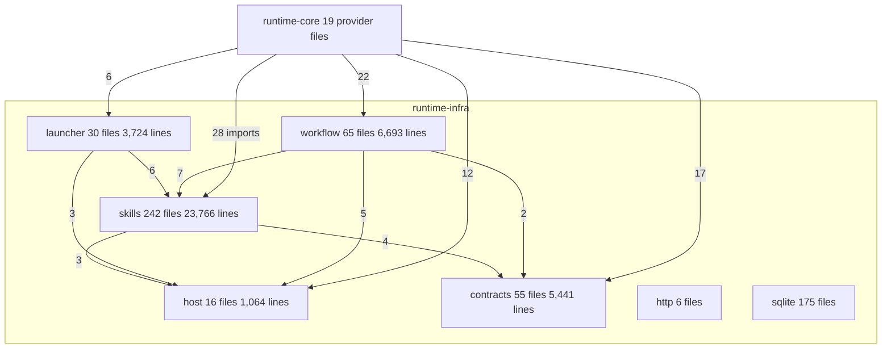

# Runtime-infra module graph investigation

## Assessment

Replace the single `runtime-infra-fs` adapter module with five Gradle modules cut by adapter concern, and nest every infrastructure module under `runtime-infra/` as `:runtime-infra:<name>`. The 2026-06-12 decision to keep one adapter module named its own revisit trigger: "build/runtime ownership pressure makes module-level separation cheaper than the current single adapter module." That trigger is met. The module's build script already simulates module boundaries with ten Kotlin source sets, `friendPaths` wiring, ten compile tasks, and a `verifyInfraFsAreaCompile` aggregate (build.gradle.kts lines 401 to 499), so `check` compiles the same 40,688 lines eleven times to prove a fact Gradle project dependencies would prove once, for free, with `internal` visibility as the real boundary instead of a convention.

The concerns inside the module have distinct dependency profiles and distinct consumers. Twenty-two of the 26 `contracts/` files import `com.networknt`; no other area does except six validators that SKILL-353 subtask 1 routes through the shared loader. Seven scaffold and native-agent files import SnakeYAML; nothing else does. The JDK ports, gate JVM resolver, and config stores import nothing but kotlin-inject and the JDK. The composition root imports 85 types from 19 provider files and every other module's tests import by cluster: engine tests reach git and journal adapters, CLI tests reach scaffold and install adapters, application test fixtures reach validators and config stores.

The measured import graph between the five proposed modules is a directed acyclic graph once two placements are fixed: MCP config registration (used by install and by agent-run command builders) belongs with install, and the atomic-write primitive that MCP config writing uses belongs in the host module, which SKILL-353 subtask 2 (F-006, one owner per filesystem primitive) already makes a single-owner concern. Every other edge points downward: launcher and workflow build on skills, skills builds on contracts and host, contracts and host stand alone.

This is not one module per folder. The five `skills` areas (agentaddon, nativeagent, scaffold, install, skillremove) stay together because the root scaffold gateways import install while install imports scaffold in 15 files, and scaffolding is atomic through install linking (AGENTS.md). The `launcher/review` evidence endpoint stays with the launcher because two `agentrun` files import its Cursor stream decoders. Cuts follow the measured edges and the dependency profiles, not the directory listing.

Reviewed on 2026-09-17 at `66b39806dff8a9d5461993c575faad615cded32a` on `main` with a clean tracked tree and the untracked SKILL-353 bundle present. Scope: the three infrastructure modules (`runtime-infra-fs` 408 production files and 40,688 lines, `runtime-infra-http` 6 files and 536 lines, `runtime-infra-sqlite` 175 files and 18,491 lines), the 209 `test` and 33 `repoTest` files of `runtime-infra-fs`, `settings.gradle.kts`, the root and per-module build scripts, `build-logic/convention`, the sixteen architecture test files and twelve baseline files in `runtime-core` that name infrastructure modules or paths, the resource-path constants in `runtime-contracts`, and the documents that record module names. This investigation builds on the SKILL-353 investigation of the same commit and reuses its test baseline; it is not a diff review and not a governed review-driver verdict.

## Structure and ownership

Today:

| Module | Production files | Lines | Third-party imports (files) | Project dependencies |
| --- | --- | --- | --- | --- |
| `runtime-infra-fs` | 408 | 40,688 | networknt 28, jackson 51, snakeyaml 7, kotlin-inject 71, kotlinx-serialization 0 | ports, domain, contracts |
| `runtime-infra-http` | 6 | 536 | kotlinx-serialization, kotlin-inject | ports, domain, contracts |
| `runtime-infra-sqlite` | 175 | 18,491 | sqlite-jdbc, jackson, kotlinx-serialization, kotlin-inject | ports, domain, contracts |

`runtime-infra-fs` declares `kotlinx-serialization-json` and no production file imports it.

Proposed, with every current production file assigned by script (placement rules below):

| Module | Package | Contents | Justification |
| --- | --- | --- | --- |
| `host` | `skillbill.infrastructure.host` | `Jdk*` ports (thread, shutdown hook, timing, identifiers, host platform, fan-out, diagnostics, worker supervisor), `JvmInterruptSignalPort`, `jvm/GateJvm*`, `CanonicalRepositoryRoot`, `FileSystemRepoLocalConfig`, `FileTelemetryConfigStore`, `TelemetryConfigPaths`, and the single atomic-write, atomic-move, digest, and containment primitives SKILL-353 F-006 creates | JDK and host-environment adapters with no third-party dependency beyond kotlin-inject; every other infrastructure module uses them |
| `contracts` | `skillbill.infrastructure.contracts` | `contracts/**` schema validators, `phaseoutput/**` parse-and-repair engines, the validator port implementations SKILL-353 F-002 leaves, `FeatureTaskRuntimeArtifactMapBridge`, `WorkflowStateSnapshotWireMapper` | Sole owner of the json-schema-validator dependency; imports nothing from any sibling; the leaf below skills |
| `skills` | `skillbill.infrastructure.skills` | `agentaddon`, `nativeagent`, `scaffold`, `install`, `skillremove`, the root scaffold, native-agent, install, external add-on overlay, baseline manifest, uninstall, and installed-catalog adapters, `FileSystemRepoValidationGateway`, `McpRegistrationOperations`, `McpJsonConfig`, `McpTomlConfig` | One lifecycle: author, render, validate, install, register, remove. Install and scaffold depend on each other through the root gateways, so they are one module |
| `launcher` | `skillbill.infrastructure.launcher` | `launcher/agent`, `agentrun`, `process`, `review`, `GovernedReviewMcpConfigWriter`, `InstallerProcessAdapter`, `AgentRunReviewIsolationResolver`, `FileSystemReviewLaunchAgentStaging` | Child-process ownership (the lifetimes `ARCHITECTURE.md` documents under SKILL-247 and SKILL-348) and agent launching; depends on skills for agent config roots and link inventories |
| `workflow` | `skillbill.infrastructure.workflow` | `git/` (19 `Git*` files, `GhGoalPullRequestPort`, `FileSystemCheckedOutBranchSource`, `FileSystemDiffResolver`), `review/` (evidence broker, input source, rubric resolver, attribution, snapshot gateway, preflight, checkpoint and coordinate files), `featuretask/` (runtime stores, spec paths, decomposition manifest journal and file store), `goalplanning/`, `validation/` (gate runner) | The workflow engine's adapters; git and review reference each other (`ImmutableReviewFile` and `ReviewCoordinateFile` run git commands, `FileSystemDiffResolver` reads checkpoint identity), so they share a module; top of the stack |
| `http`, `sqlite` | unchanged | unchanged | unchanged |

Placement rules the census applied to the 113 root files: `Jdk*`, repository root, and the two config stores go to host; `*ValidatorAdapter`, `*ValidatorInfraAdapter`, the artifact-map bridge, and the snapshot wire mapper (whose only consumer is `WorkflowSnapshotValidatorInfraAdapter`) go to contracts; `Git*`, `Gh*`, branch source, and diff resolver go to `workflow.git`; `*Review*` files except the launch staging go to `workflow.review`; `*FeatureTask*`, `*DecompositionManifest*`, spec scratch store, and spec path resolver go to `workflow.featuretask`; `*Scaffold*`, `*NativeAgent*`, `*ExternalAddon*`, `*Install*`, `*Uninstall*`, `*Baseline*`, and the repo validation gateway (it imports `scaffold.runtime`, `scaffold.authoring`, and `nativeagent.composition` and implements the `skill-bill validate` report port) go to skills; the installer process adapter and the two review launch files go to launcher. `install/support/TelemetryConfigPaths.kt` moves to host because both install and the config stores read it; SKILL-353 subtask 3 dissolves the rest of `install/support` into its owners before this work starts.

Consumers outside the module by proposed target, counted as import lines: `runtime-core` main 28 skills, 22 workflow, 17 contracts, 12 host, 6 launcher; `runtime-application` test fixtures 4 workflow, 3 contracts, 1 host; `runtime-engine` tests 9 workflow, 3 contracts; `runtime-cli` tests 9 skills, 4 host, 2 workflow, 2 contracts; `runtime-mcp` tests 1 each of host, workflow, contracts. No main source outside `runtime-core` imports the module today and none would after the split.

Tests by proposed target: skills 93, contracts 43 (plus `GovernedResourceCopyParityTest`), workflow 40 (plus `GovernedSpecSectionParserContractTest` and `RuntimeFilesystemArchitectureProbeTest`), launcher 16, host 8 (plus `SnapshotAssertionsTest`), and five shared helpers (`skillbill.testing.RepoRoot`, `HarborAddonPackFixture`, `skillbill.testsupport.SkillClassFixtures`, `SnapshotAssertions`, and `ConformingPlatformPackFixture`). The first four import nothing from the module and become host test fixtures; `ConformingPlatformPackFixture` imports scaffold rendering and becomes a skills test fixture. Snapshot resources go with scaffold and native-agent tests to skills, the validation-gate stdout fixtures to workflow, the golden governed-resource manifest to contracts. The 33 `repoTest` files sit under `skillbill.agentaddon`, `contracts`, `install`, `nativeagent`, and `scaffold` packages and follow the sources they read.

## Principles assessment

Dependencies and responsibilities: the infra to ports, domain, and contracts direction is unchanged; no new edge reaches application, engine, or entry adapters. The split introduces adapter-to-adapter Gradle edges (launcher and workflow on skills, everything on host). Those edges exist today as intra-module imports; making them project dependencies records them and stops new ones appearing silently. `runtime-core` keeps every infrastructure edge as `implementation`; its public ABI closure does not change.

Simplicity and change cost: the module boundary replaces 100 lines of source-set machinery and ten compilations per `check`. Seven module scripts of roughly 25 to 40 lines plus one build-logic convention plugin for governed resource copies replace one 499-line script. Nested Gradle projects need two small conventions: an archive name that carries the parent (`runtime-infra-host.jar`, not `host.jar`), and root aggregation that tolerates the empty `:runtime-infra` parent project, which has no `check` task for `tasks.named("check")` to find.

Composition and API surface: 284 public top-level names today, 97 consumed by the composition surface. After the split each module runs its own census; names consumed only inside a module become `internal`, names consumed across modules stay public. SKILL-353 F-011 is therefore resolved here, not inside the single module, so that no name is narrowed and then widened again.

Tests and evidence: tests move with the code they exercise; the module boundary becomes the test boundary, and cross-module `internal` reach disappears by construction. `friendPaths` is not reintroduced anywhere.

## Findings

### F-001. Module boundaries are simulated in the build script

`runtime-infra-fs/build.gradle.kts` lines 401 to 499 create ten Kotlin source sets over ten package directories, give each the outputs and `friendPaths` of the areas below it, register ten compile tasks, and hang them on `check`. The area order (Jvm, Contracts, AgentAddon, NativeAgent, Scaffold, Install, Launcher, root, GoalPlanning, SkillRemove) holds with zero violations. The root package imports every area and nothing imports the root, so the root is a set of assembly adapters that belong to the areas they assemble. Gradle project dependencies express the same order once, refuse upward imports at compile time without extra tasks, and give each module `internal` as a real boundary.

Cut the module along the measured edges into host, contracts, skills, launcher, and workflow, in that dependency order, and delete the source-set machinery.

### F-002. Three sibling modules, one flat root listing

`runtime-infra-fs`, `runtime-infra-http`, and `runtime-infra-sqlite` sit beside eight other modules in the runtime root. After the split there are seven infrastructure modules; a flat listing of fifteen `runtime-*` directories hides which are adapters. Gradle supports nested project paths (`include("runtime-infra:host")` maps to `runtime-infra/host`). The layering and allow-list tests already accept `:` in module ids and derive the directory by replacing `:` with `/`; `RuntimeCoreCompositionOnlyTest`, `RuntimeArchitectureTestSupport`, `PrincipleEnforcementInventory.moduleArchitectureScanCase`, and the baseline file names do not, and the root `check` aggregation calls `tasks.named("check")` on every subproject, which fails for the empty parent.

Nest under `runtime-infra/`, teach the catalog one id-to-directory mapping, name baseline files with `-` in place of `:`, and either give the parent a `plugins { base }` script or aggregate with `findByName`.

### F-003. Two edges close a cycle between skills and launcher

`FileSystemInstallAdapters` imports `launcher.mcp.McpRegistrationOperations`; `McpRegistrationOperations` imports `install.support.codexConfigRoots` and `nativeagent.support.claudeConfigRoots`; `McpJsonConfig` and `McpTomlConfig` import `launcher.process.atomicWriteString`; `CursorAgentRunCommandBuilder`, `JunieAgentRunCommandBuilder`, `AgentRunCommandBuilders`, and `GovernedReviewLaunchCapability` import `McpRegistrationOperations` and `McpConfig*`. Registering the skill-bill MCP server in an agent's config is an install step; writing a per-run review MCP config is a launch step.

Move `McpRegistrationOperations`, `McpJsonConfig`, and `McpTomlConfig` to skills under `install`; keep `GovernedReviewMcpConfigWriter` in launcher; make the atomic-write owner that SKILL-353 F-006 creates live in host. With those three placements every remaining edge points downward.

### F-004. Governed resource copies are one module's list but four modules' resources

Lines 47 to 350 declare 33 copy tasks for four destinations: 30 schemas into the contracts resource directory, the review-context schema into `skillbill/contracts`, the Java guard script into `jvm`, and the specialist contract into `skillbill/review`. After the split the guard belongs to host, the schemas and review-context schema to contracts, the specialist contract to workflow (`ClasspathReviewSpecialistContractProvider`). Copying the same machinery into three scripts repeats 100 lines three times.

Add a `skillbill.governed-resources` convention plugin in `build-logic` with an extension that takes `(taskName, repoRelativeSource, destinationDir, owner)` entries and one message template, registers validate-and-copy tasks, wires `processResources` and `processTestResources`, and writes under `build/generated/<module>`. `GovernedResourceCopyParityTest` reads the generated tree per module and its golden manifest changes only in the module and resource-path prefixes; resource bytes stay identical.

### F-005. Packages and resource paths say `fs`

Every production file is under `skillbill.infrastructure.fs`; 31 string literals in 19 `runtime-contracts` files name classpath resources under `skillbill/infrastructure/fs/contracts/`, and `GateJvmResolver.GUARD_CLASSPATH_RESOURCE` names `skillbill/infrastructure/fs/jvm/`. A module named skills owning `skillbill.infrastructure.fs.scaffold` reads as a leftover.

Rename packages to `skillbill.infrastructure.<module>` with the area sub-packages kept (`skills.scaffold`, `workflow.git`, `contracts.phaseoutput`), and rename the resource prefixes to `skillbill/infrastructure/contracts/` and `skillbill/infrastructure/host/jvm/`. The 2026-06-12 decision that retained the split `skillbill.contracts.*` package concerned import compatibility for validators that have since moved to `skillbill.infrastructure.fs.contracts`; the resource-path constants are the only surviving coupling and they change in one commit with the golden manifest.

### F-006. Sixteen architecture tests and twelve baselines pin the old names

`RuntimeModuleCatalog` lists module ids, per-module edge expectations, test-fixture edges, and main package roots; `RuntimeArchitectureTestSupport` lists source roots; `RuntimeGradleModuleLayeringTest`, `RuntimeAdapterDependencyAllowlistTest`, `RuntimeCoreCompositionOnlyTest`, `ImplementationOwnershipArchitectureTest`, `InstallPolicyOwnershipArchitectureTest`, `RuntimeCompositionGuardArchitectureTest`, `DecompositionManifestArchitectureTest`, `RuntimeArchitectureTest`, `RuntimeArchitectureDocumentationTest`, `PrincipleEnforcementInventory`, and the four per-module census tests (package cycles, inject defaults, ambient clock, ambient environment) name `runtime-infra-fs` or its paths. Twelve baseline files exist, four per module; the fs ambient-environment baseline has 104 rows and the other three are empty.

Update the catalog to seven infrastructure ids, add `ModuleEdgeExpectation` rows for each, pin `runtime-core` to seven `implementation` edges, re-record baselines per new module under the shrink-only rule (the sum of rows across the five new modules must not exceed the fs rows they replace), and keep `RuntimeArchitectureDocumentationTest` asserting that settings, catalog, and `ARCHITECTURE.md` agree.

### F-007. A declared dependency nothing imports

`runtime-infra-fs` declares `implementation(libs.kotlinx.serialization.json)`; zero production files import `kotlinx.serialization`. Drop it during the relocation.

### F-008. Visibility follows the new boundaries

SKILL-353 F-011 counted 284 public top-level names with 97 consumed outside the module. Inside one module the right answer is to make 187 names `internal`; across five modules some of those are cross-module calls (launcher to skills link inventories, workflow to scaffold pack discovery). Narrowing first and widening after the split does the work twice.

Run the census per new module after the moves; make names consumed only inside their module `internal`; delete names with no consumer anywhere; keep the inject-defaults and composition guards as the enforcement.

### F-009. Test placement follows the code

209 tests, 33 `repoTest` files, five shared helpers, and three orphan tests (`GovernedResourceCopyParityTest`, `GovernedSpecSectionParserContractTest` on a domain parser, `RuntimeFilesystemArchitectureProbeTest` on journal recovery) need homes. The test source set today also depends on `runtime-application` and `runtime-engine` with `friendPaths` into application internals; SKILL-353 subtask 3 removes that first.

Move each test to the module that owns the code it drives; put helpers in `java-test-fixtures` source sets on host and skills; move resources with their tests; record the test-fixture edges in `RuntimeModuleCatalog.testFixturesProjectDependenciesByModule`.

## What is good and stays

The area order is correct and is kept as the module order. The infra to ports, domain, and contracts direction, the `implementation` edge from `runtime-core`, the composition surface, port semantics, git argv and process observable behaviour, the packaged resource bytes, and every passing test's assertion are unchanged. `http` and `sqlite` move directories and nothing else.

## Estimated reductions and costs

- Build scripts: 499 lines in one file become seven files of 25 to 40 lines plus one convention plugin of roughly 120 lines; ten compile tasks and `verifyInfraFsAreaCompile` disappear.
- `runtime-core` gains four `implementation` edges (three become seven).
- Files moved: 408 production, 209 test, 33 `repoTest`; package lines rewritten in all of them; roughly 300 import lines rewritten in `runtime-core`, `runtime-application`, `runtime-engine`, `runtime-cli`, and `runtime-mcp`; 31 resource-path literals in `runtime-contracts`.
- Documentation: the Gradle module list, graph, and package ownership sections of `runtime-kotlin/ARCHITECTURE.md`; five paths in `docs/code-principles.md`; two in `docs/internal-skills-architecture.md`; one in `docs/skill-source-generation.md`; the area name in `docs/agent/history.md`; `runtime-infra-fs/agent/history.md` relocates to `runtime-infra/agent/history.md`.

## Changes deliberately rejected

- One Gradle module per current area (eleven or more). Install and scaffold gateways depend on each other; agentaddon, nativeagent, and skillremove have no dependency profile of their own; `launcher/review` is imported by `agentrun`. The extra modules would add build files without adding a boundary the code respects.
- Merging skills and launcher. They have different consumers (install flows versus engine agent runs), different process-ownership documentation, and a clean one-way edge once MCP registration moves.
- Keeping `skillbill.infrastructure.fs.*` package names in the new modules, or keeping `fs` as the name of the remainder. Every module here is filesystem-backed; `fs` names nothing.
- A `runtime-infra/build.gradle.kts` that configures children (`subprojects {}` blocks). The parent stays empty except for what root aggregation needs.
- Placing the validator port implementations in workflow. They depend on contracts and phase-output only; workflow depends on them.
- Any behaviour change, prefix rename (`FileSystem*`, `Jdk*`, `Git*`), or change to ports.

## Public engineering comparisons

Gradle's multi-project guidance recommends grouping subprojects by logical area under a parent directory, keeping build logic in convention plugins rather than cross-project configuration, and using project dependencies to make layering explicit; F-002, F-004, and F-001 apply those three points. [Gradle: structuring projects](https://docs.gradle.org/current/userguide/multi_project_builds.html), [Gradle: sharing build logic with convention plugins](https://docs.gradle.org/current/userguide/sharing_build_logic_between_subprojects.html)

Android's modularization guide argues for modules with low coupling and high cohesion, cut where dependency direction and ownership differ rather than by file count, and warns against both one giant module and one module per class; the five-module cut follows that reasoning. [Android: guide to modularization](https://developer.android.com/topic/modularization)

These are public engineering comparisons. This report does not certify compliance with Gradle's or Google's private review standards.

## Validation and limits

Edges were computed by script over `import` lines and, for the flat root package where same-package references need no import, by word-boundary matching of class, object, and interface names declared in root files. The import-line figures are exact for the sub-areas; the root-file figures are conservative for classes and blind to top-level functions, so the two named cycle-closing edges are the ones the census found, and compilation is the authority for any it missed. File and line counts are `find` and `wc` over `src/main`. The test baseline is SKILL-353's: 1,518 tests passed in `:runtime-infra-fs:test` at this commit, `repoTest` did not run. No build, no Gradle configuration, and no source change was attempted for this investigation. The feature-spec skill supplies the bundle shape; the user selected SKILL-354 as the next available key and chose to run this goal after SKILL-353 with that goal's subtask 3 trimmed.
