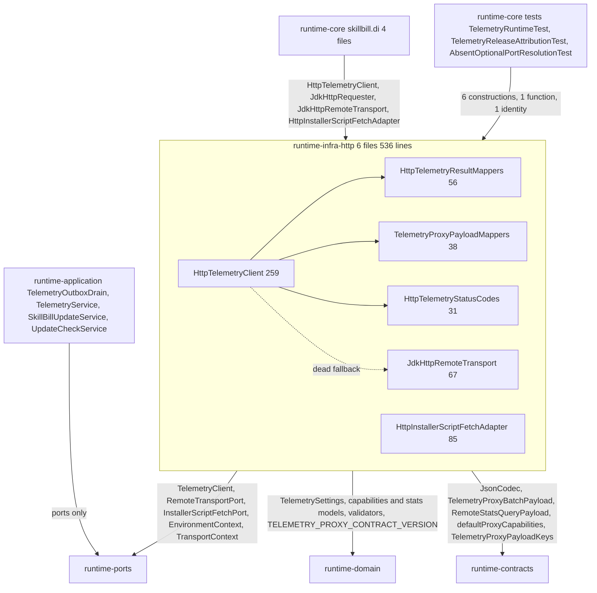

# Runtime-infra-http architectural investigation

## Assessment

Keep the module, its two adapters, and its place in the graph. `runtime-infra-http` implements three ports (`TelemetryClient`, `RemoteTransportPort`, `InstallerScriptFetchPort`) toward `runtime-ports`, `runtime-domain`, and `runtime-contracts`; only the composition root imports it in production (`runtime-core`, 4 files, 5 types); the package-cycle, ambient-clock, and inject-defaults baselines are empty; detekt reports zero smells; the transport reuses one JDK `HttpClient` with a connect deadline and a per-request deadline below the outbox claim lease; `InterruptedException` propagates; delivery outcomes are a closed enum with an out-of-range status raising a typed error; the deduplication handshake refuses loudly. No new module, library, port, or framework is needed.

The problems are inside a 536-line module that carries more machinery than its three ports need. `HttpTelemetryClient` re-resolves the process environment and the transport that the composition root already resolved, so 13 of its 259 lines are unreachable and all 4 rows of the module's ambient-environment baseline sit in that dead path; two secondary constructors exist for six test call sites in another module. Both remote reads decode to a raw map, patch defaults and request echoes into the map, and read the map back into a typed model through a `knownKeys` filter and a boolean flag. Three ways construct the same transport, and the installer adapter builds a second `HttpClient` with a different redirect policy. The telemetry proxy vocabulary is spelled 46 times in this module and again in `runtime-contracts` and `runtime-cli` while the owning `*PayloadKeys` object declares two keys and the wire-vocabulary guard does not scan this seam. External-input failures are `IllegalArgumentException`, one error extends `IllegalStateException`, the 404 fallback to default capabilities and seven swallowed cleanup failures emit no record, staging cleanup is spelled four times, and the installer adapter has no test anywhere while the telemetry client's behaviour tests live in `runtime-core`.

Reviewed on 2026-09-17 at `d8a103a1ebf88662fc7f7db7b6efce4bfd24a905` on `main` with a clean tracked tree. Scope: all 6 production Kotlin files (536 lines) in one package, the 2 test files (132 lines, 4 tests), the module build script, the ports and contracts the module implements or consumes (`runtime-ports` `skillbill.ports.telemetry` and `skillbill.ports.process`, `runtime-contracts` `skillbill.contracts.telemetry`, `runtime-domain` `skillbill.telemetry`), the composition-root bindings and the 6 `runtime-core` test call sites that construct the adapters, the application consumers (`TelemetryOutboxDrain`, `TelemetryService`, `SkillBillUpdateService`, `UpdateCheckService`), the CLI result mappers that re-spell the same vocabulary, the architecture guards and baselines in `runtime-core` that scan this module, the proxy implementation under `docs/cloudflare-telemetry-proxy/worker.js`, and the recorded decisions in `runtime-kotlin/agent/decisions.md` and `agent/history.md`. SHA-256 of the sorted production-file digest list is `d1b3b7e8ac54513df6af55f4902d658d64cb63178a93379fba10c4bed56dade5`. This is a whole-module architectural investigation, not a diff review and not a governed review-driver verdict.

## Structure and ownership

Module edges are `implementation` on `runtime-contracts`, `runtime-domain`, `runtime-ports`, `kotlinx-serialization-json`, and `kotlin-inject`, pinned by `RuntimeModuleCatalog.moduleEdgeExpectations`. `runtime-core` consumes four types: `HttpTelemetryClient` (bound to `TelemetryClient` in `RuntimeTelemetryProvides`), `HttpInstallerScriptFetchAdapter` (bound to `InstallerScriptFetchPort` in `RuntimeInstallerProvides` behind `OptionalCallbacks.installerScriptFetchPort`), and `JdkHttpRequester` plus `JdkHttpRemoteTransport.create` (chosen in `RuntimeBootstrapBindings.runtimeContext` when `TransportContext.requester` is null). `runtime-mcp` and `runtime-cli` declare `testImplementation(project(":runtime-infra-http"))`; no test file in either module imports `skillbill.infrastructure.http`.

The application layer reaches HTTP only through ports: `TelemetryOutboxDrain.attemptDelivery` calls `TelemetryClient.sendBatch` inside `runCatching` and maps any escaping `Exception` to an unconfirmed delivery; `TelemetryService.capabilities` and `remoteStats` call the port and let exceptions escape to the CLI and MCP entry adapters; `SkillBillUpdateService` calls `InstallerScriptFetchPort.fetch` then `cleanup`; `UpdateCheckService` calls `RemoteTransportPort.execute` against the GitHub Releases API directly, with its own `HTTP_SUCCESS_RANGE`, `USER_AGENT`, and `error.message.orEmpty().ifBlank { simpleName }` idiom. `TelemetryHttpRuntime` in `runtime-application` forwards the three `TelemetryClient` methods and has zero production callers; it is referenced only as two banned-import strings in `RuntimeLayerBoundaryArchitectureTest`, beside a `TelemetryRemoteStatsRuntime` string whose class no longer exists.

Tests: 4 tests pass in the module (`JdkHttpRemoteTransportDeadlineTest` 1, `TelemetryProxyPayloadMappersTest` 3). The behaviour of `HttpTelemetryClient` (remote stats round-trip, 404 default capabilities, deduplication refusal, rejected batch detail, null capabilities preservation) is tested by 5 tests in `runtime-core` `TelemetryRuntimeTest` through 6 constructions of the secondary constructors, and `telemetryProxyBatchPayload` is public so that `runtime-core` `TelemetryReleaseAttributionTest` can call it. `HttpInstallerScriptFetchAdapter` has no test in any module; `CliRuntimeUpdateTest` substitutes the port with `CapturingInstallerScriptFetchPort`.

## Principles assessment

| Principle | Assessment and evidence |
| --- | --- |
| Clean and hexagonal architecture | Direction is correct and enforced (`RuntimeGradleModuleLayeringTest`, `RuntimeAdapterDependencyAllowlistTest`, `RuntimeImplementationImportRules`, `RuntimeLayerBoundaryArchitectureTest` banning `java.net.http` in cli, mcp, domain, ports, application). The adapter re-does composition-root work: environment and transport resolution exist in both `RuntimeBootstrapBindings` and `HttpTelemetryClient`. F-001, F-004. |
| Single responsibility | `HttpTelemetryClient` owns request building, header policy, response decoding, default patching, request echoing, error mapping, and environment resolution in one 259-line file with 12 private top-level functions. The three ports it serves are one responsibility; the resolution and the raw-map round trip are not. F-001, F-003. |
| Open/closed | `TelemetryDeliveryOutcome` and `InstallerScriptFetchResult` are closed types. Capability and stats responses are documented open documents (`CustomFieldMap`, `TelemetryOpenDocument`), which is correct: the proxy emits `stats_auth_required` (worker.js:122) that the client carries as an additional field. F-002 keeps them open. |
| Liskov substitution | `HttpFailureException` is a private `IllegalArgumentException`; `decodeJsonObject` throws `IllegalArgumentException` for a peer's invalid JSON; `InvalidTelemetryTransportOutcomeError` extends `IllegalStateException`, outside `SkillBillRuntimeException`. A peer fault has the identity of a caller bug, and `TelemetryRuntimeTest` pins `assertFailsWith<IllegalArgumentException>`. F-005. |
| Interface segregation | `RemoteTransportPort` is a four-argument `fun interface` with two production implementers and lambda fakes in tests; it earns its place. `TelemetryClient` has three methods and two implementers (adapter, test recorder). `EnvironmentContext` is injected for one field (`environment`); `userHome` is resolved and never read. F-001. |
| Dependency inversion | Ports live in `runtime-ports`; the module implements them. The transport is injected as a nullable field in a context bag and re-defaulted inside the adapter, and the installer adapter constructs its own `HttpClient` in a field initializer. F-001, F-004. |
| YAGNI and simplicity | Two dead fallback paths, two secondary constructors for tests, three ways to obtain one transport with an identity branch on a `Duration` equality, a `preserveResponseCapabilities` flag, request fields echoed into a response map and filtered out again, `requestJson` beside `requestJsonGet`, the 2xx range declared five times across the runtime (including two unused constants in `runtime-domain` `TelemetryConstants`), a dead forwarder in `runtime-application`. F-001, F-003, F-004, F-009, F-010. |
| State ownership | No mutable state leaks; `MutableMap` is local to each function. The `JdkHttpRemoteTransport` companion holds the shared client, which is the right owner. |
| Resource lifetime and failure | The transport has one deadline pair and propagates interruption. The installer adapter spells staging cleanup four times with two different file sets, swallows every cleanup failure in `runCatching`, and its `cleanup(scriptPath)` deletes whatever directory contains the path it is given rather than only a directory it created. F-007. |
| Failure and observability | 3 `require` on configuration, 3 `throw IllegalArgumentException` on peer input, 1 private exception type, 8 `runCatching` that continue silently, 1 silent default substitution (404 and 405 on `/capabilities`), 1 silent blank-body-to-empty-object decode. No diagnostics port is injected, so no record can be emitted. F-005, F-006. |
| Contract ownership | `TelemetryProxyPayloadKeys` owns 2 keys; the module inlines 46 literal wire keys (`HttpTelemetryClient` 18, `HttpTelemetryResultMappers` 26, `TelemetryProxyPayloadMappers` 2); `runtime-contracts` spells 16 of the same keys in `TelemetryProxyContracts.kt` and `runtime-cli` spells 12 in `TelemetryCliResultMappers.kt`. `HttpTelemetryResultMappers.kt:17` spells `"contract_version"` while line 27 uses `SharedPayloadKeys.CONTRACT_VERSION` for the same key. `WireVocabularyGovernedSeamInventory` does not register this seam; the rule in AGENTS.md has never run here. F-002. |
| Documentation truth | `ARCHITECTURE.md:550` says the transport reuses one `HttpClient` for the process; the installer adapter owns a second with `followRedirects(NORMAL)`. `ARCHITECTURE.md:604-608` documents fetch-failure cleanup guarantees that no test proves. `RuntimeLayerBoundaryArchitectureTest` bans imports of a class that does not exist. F-004, F-008, F-009. |
| Testing | 4 tests over real sockets and real payload mapping. The adapter's behaviour tests live in the composition root; one production function is public only for a test in another module; two modules carry a test edge nobody uses; the installer adapter's documented cleanup guarantees have no test; the deadline test asserts wall-clock time. F-008. |

## Findings

Paths are repository-relative under `runtime-kotlin/runtime-infra-http/src/main/kotlin/skillbill/infrastructure/http/` unless another module is named.

- [F-001] Major | High | `HttpTelemetryClient.kt:36` | The adapter re-resolves environment and transport the composition root already resolved; 13 lines and all 4 ambient-environment baseline rows are unreachable, and two constructors exist for tests in another module.
- [F-002] Major | High | `HttpTelemetryResultMappers.kt:15` | The telemetry proxy vocabulary is 46 inline literals here, 16 in `runtime-contracts`, and 12 in `runtime-cli`; the owner declares 2 keys and the guard does not scan the seam.
- [F-003] Major | High | `HttpTelemetryClient.kt:80` | Both remote reads decode to a raw map, patch defaults and request echoes into it, and filter the map back into a typed model through a `knownKeys` set and a flag.
- [F-004] Minor | High | `JdkHttpRemoteTransport.kt:44` | Three constructions of one transport with an identity branch, a second `HttpClient` in the installer adapter, and the 2xx range spelled five times.
- [F-005] Minor | High | `HttpTelemetryClient.kt:256` | Peer faults and configuration faults are `IllegalArgumentException`; the one typed error extends `IllegalStateException`.
- [F-006] Minor | High | `HttpTelemetryClient.kt:90` | The 404 and 405 default substitution, the blank-body decode, and seven swallowed cleanup failures emit no record; no diagnostics port is injected.
- [F-007] Minor | High | `HttpInstallerScriptFetchAdapter.kt:45` | Staging cleanup is spelled four times with two file sets, and `cleanup` deletes the parent of any path it is handed.
- [F-008] Minor | High | `runtime-kotlin/runtime-core/src/test/kotlin/skillbill/telemetry/TelemetryRuntimeTest.kt:42` | The client's behaviour tests live in `runtime-core`, one function is public for a test elsewhere, two modules carry unused test edges, and the installer adapter has no test.
- [F-009] Minor | Medium | `runtime-kotlin/runtime-application/src/main/kotlin/skillbill/application/telemetry/http/TelemetryHttpRuntime.kt:10` | A forwarding object with zero production callers is kept alive by two architecture-test strings, one of which names a deleted class.
- [F-010] Minor | Medium | `HttpTelemetryClient.kt:182` | User-agent strings, the success range, and the message-or-class-name idiom are declared per file across this module and `runtime-application`.

### F-001. The adapter resolves what the root already resolved

`RuntimeComponent` resolves `inputRuntimeContext` once through `RuntimeBootstrapBindings.runtimeContext` (`RuntimeComponent.kt:85-96`) before providing `EnvironmentContext` and `TransportContext`. That function replaces `UnspecifiedUserHome` with `user.home`, `UnspecifiedEnvironment` with `System.getenv()`, and a null `requester` with `JdkHttpRequester` or `JdkHttpRemoteTransport.create(connectTimeout, requestTimeout)` (`RuntimeBootstrapBindings.kt:20-44`). `HttpTelemetryClient` then does the same work again: `withProcessDefaults()` (`HttpTelemetryClient.kt:238-250`) repeats the home and environment substitution, and line 39 repeats the requester fallback. In production both branches receive resolved values and never fire. The two secondary constructors (lines 41-54) exist for six call sites in `runtime-core` `TelemetryRuntimeTest`; they pass a non-null requester and a concrete environment and home, so the fallbacks are unreachable from tests too. The first secondary constructor defaults `environment` to `System.getenv()` (line 43) and reads `user.home` (line 44), so the 4 rows of `runtime-infra-http-ambient-environment-baseline.txt` (lines 43, 44, 241, 246) are all in code no caller reaches. `resolvedEnvironment.userHome` is computed and never read; the only consumer of the resolved context is `proxyAuthHeaders(resolvedEnvironment.environment)` at lines 80 and 133, which reads one variable, `SKILL_BILL_TELEMETRY_PROXY_STATS_TOKEN`.

The 2026-09-06 decision (ports evacuation) names the fallback sites deliberately: "`TransportContext.requester` (`?: JdkHttpRequester` in `RuntimeBootstrapBindings` and `HttpTelemetryClient`)". Two owners of one fallback is what the Simplicity principle calls a pure forwarding layer, and `RuntimeBootstrapBindings` is the one that runs. `UpdateCheckService.requireRequester` (`runtime-application/.../UpdateCheckService.kt:72-73`) is a third site that handles the same null with `error(...)`.

Give `HttpTelemetryClient` one constructor that takes what it uses: a `RemoteTransportPort`, the environment map (or the resolved stats token), and a `Clock`. Provide `RemoteTransportPort` from the composition root with one `@Provides` that reads `TransportContext.requester` after bootstrap resolution and fails with a typed error if it is still null; `UpdateCheckService` takes the port instead of the context. Delete `withProcessDefaults`, the requester fallback, and both secondary constructors; the moved tests (F-008) construct the adapter with explicit arguments. Re-record the ambient-environment baseline to empty and, if `RuntimeBootstrapBindings` remains the only fallback site, correct the decision entry's parenthesis in a new entry.

### F-002. One owner for the telemetry proxy vocabulary

`TelemetryProxyPayloadKeys` (`runtime-contracts/.../telemetry/TelemetryProxyPayloadKeys.kt`) declares `$insert_id` and `supports_event_deduplication`. Every other key on the proxy wire is a literal. In this module: `HttpTelemetryResultMappers.kt` 26 (`supported_workflows`, `contract_version`, `source`, `proxy_url`, `capabilities_url`, `supports_ingest`, `supports_stats`, `workflow`, `date_from`, `date_to`, `stats_url`, `group_by`, `capabilities`), `HttpTelemetryClient.kt` 18 (the same set as `putIfAbsent` defaults at lines 81-87 and 135-144, plus `remote_proxy`), `TelemetryProxyPayloadMappers.kt` 2 (`install_id`, `skill_bill_version`) and the `$process_person_profile` PostHog flag. In `runtime-contracts` `TelemetryProxyContracts.kt`: `event`, `distinct_id`, `properties`, `timestamp`, `batch`, `workflow`, `date_from`, `date_to`, `group_by`, and the seven `defaultProxyCapabilities` keys, 16 in all. In `runtime-cli` `TelemetryCliResultMappers.kt`: 12 of the same names. `HttpTelemetryResultMappers.kt:17` spells `"contract_version"` in `knownKeys` while line 27 reads the same key through `SharedPayloadKeys.CONTRACT_VERSION`. The proxy itself (`docs/cloudflare-telemetry-proxy/worker.js:113-128`) is the fourth spelling and adds `stats_auth_required`, which the client neither names nor uses.

AGENTS.md ("Wire and payload keys") requires each key declared once in an owning `*PayloadKeys` object in `runtime-contracts` and referenced downstream, and names `WireVocabularyArchitectureTest` with `WireVocabularyGovernedSeamInventory` as the enforcement. That inventory registers decomposition-manifest, bundle-journal, workflow phase-output, and goal-continuation seams; it contains no telemetry entry, so the rule has never run over this module, `TelemetryProxyContracts.kt`, or the CLI mappers. `TELEMETRY_PROXY_CONTRACT_VERSION = "2"` lives in `runtime-domain` `TelemetryConstants.kt:13` with no schema beside it; `orchestration/contracts/` holds only `telemetry-event-schema.yaml`.

Extend `TelemetryProxyPayloadKeys` with every capabilities, stats, and batch key the client, contracts, and CLI spell today (about 20 names, including `stats_auth_required` for completeness and `remote_proxy` as the `source` wire value), and reference it from `TelemetryProxyContracts.kt`, this module, and `TelemetryCliResultMappers.kt`. Register the telemetry proxy seam in `WireVocabularyGovernedSeamInventory` with the three files as its path markers so literal accesses fail there. Keep `CustomFieldMap` and `TelemetryOpenDocument` open: the proxy is an external worker that adds fields, and a closed schema would refuse them. Move `TELEMETRY_PROXY_CONTRACT_VERSION` beside the keys only if the contracts module is its natural owner after the decision entry; the version stays `"2"`.

### F-003. Typed results are built once, not patched into a map and read back

`fetchProxyCapabilities` (`HttpTelemetryClient.kt:74-88`) decodes the response to `Map<String, Any?>`, copies it to a `MutableMap`, `putIfAbsent`s seven defaults (`contract_version`, `source`, `proxy_url`, `capabilities_url`, `supports_ingest`, `supports_stats`, `supported_workflows`), then calls `toTelemetryProxyCapabilities()`, which reads those seven keys back with `?.toString().orEmpty()` and `== true`, and lists the same seven plus one in a `knownKeys` set to compute `additionalFields` (`HttpTelemetryResultMappers.kt:15-25`). The 404 branch (line 91) converts the `defaultProxyCapabilities` map from `runtime-contracts` through the same mapper, so a typed default is expressed as a map in contracts, converted in infra, and typed in domain.

`fetchRemoteStats` (lines 120-149) decodes the `/stats` response, remembers whether `capabilities` was present (line 134), `putIfAbsent`s the request's `workflow`, `date_from`, `date_to`, `group_by`, plus `source`, `stats_url`, and the fetched `capabilities` object (lines 135-145), and calls `toTelemetryRemoteStatsResult(capabilities, preserveResponseCapabilities)`, which reads the six echoed keys back out and removes them from `metrics` through a `knownKeys` set that includes or excludes `capabilities` on the flag (`HttpTelemetryResultMappers.kt:43-45`). The `capabilities` value written at line 141 is a `TelemetryProxyCapabilities` object placed in a `Map<String, Any?>` so that the mapper can filter it out again. The only behaviour the round trip pins is that a `capabilities` key present in the response with a null value survives into `metrics` (`TelemetryRuntimeTest` "preserves explicit null stats capabilities").

Two helpers duplicate each other: `requestJson` (lines 153-169) and `requestJsonGet` (lines 171-186) differ in method, body, and the header map (`defaultJsonHeaders() + headers` versus a hand-written `User-Agent` map); both call `ensureSuccessfulResponse` and `decodeJsonObject`.

Build each typed result directly from the decoded response and the request: `TelemetryProxyCapabilities(contractVersion = response[key] ?: TELEMETRY_PROXY_CONTRACT_VERSION, ...)` with `additionalFields` as the response minus the owned keys, and `TelemetryRemoteStatsResult(workflow = response[key] ?: request.workflow, ...)` with `metrics` as the response minus the owned keys, keeping a `capabilities` entry when the response carried one. Replace `defaultProxyCapabilities(proxyUrl, capabilitiesUrl): Map` with a typed factory on `TelemetryProxyCapabilities` (or a function beside it in domain) so no map is built to be immediately converted. Collapse `requestJson` and `requestJsonGet` into one request function taking method and optional body. The existing `TelemetryRuntimeTest` assertions stay the acceptance test for the round trip, including the null-capabilities case.

### F-004. One transport, one client, one success range

`JdkHttpRemoteTransport.kt` offers a public class taking `HttpClient` and `Duration` (line 17), a companion `create(connectTimeout?, requestTimeout?)` (lines 44-48) that returns the shared `defaultClient` when `connectTimeout == DEFAULT_HTTP_CONNECT_TIMEOUT` and builds a new client otherwise (lines 50-57), and `object JdkHttpRequester : RemoteTransportPort by JdkHttpRemoteTransport.create()` (line 61). `RuntimeBootstrapBindings.kt:36-43` chooses `JdkHttpRequester` when both timeouts are null and `create(...)` otherwise; since `create(null, null)` yields a transport over the same shared client, the branch exists so that `AbsentOptionalPortResolutionTest` can `assertSame(JdkHttpRequester, ...)`. `HttpTelemetryClient.kt:39` is a third construction site (dead, F-001). `ARCHITECTURE.md:550-553` states the timeout overrides are for tests only.

`HttpInstallerScriptFetchAdapter.kt:19-24` builds a second `HttpClient` in a field initializer with `followRedirects(HttpClient.Redirect.NORMAL)`; the telemetry client does not follow redirects. `ARCHITECTURE.md:550` says the transport "reuses one JDK `HttpClient` for the process". The installer adapter downloads a text file (`install.sh` from `raw.githubusercontent.com`) and inspects only the status code and body bytes, which `RemoteTransportPort` already returns as `statusCode` and a `String` body. Because it owns its client, the adapter cannot be tested without a socket, and it has no test (F-008).

The 2xx range is declared as `HTTP_SUCCESS_RANGE = 200..299` in `HttpInstallerScriptFetchAdapter.kt:83`, `HTTP_SUCCESS_MIN..HTTP_SUCCESS_MAX` in `HttpTelemetryStatusCodes.kt:10-11`, `HTTP_OK_MIN..HTTP_OK_MAX` in `HttpTelemetryClient.kt:252-253`, `HTTP_SUCCESS_RANGE` in `runtime-application` `UpdateCheckService.kt:180`, and `HTTP_OK_MIN`/`HTTP_OK_MAX` in `runtime-domain` `TelemetryConstants.kt:14-15`, which nothing references.

Keep one `JdkHttpRemoteTransport` with one named default instance (the existing `JdkHttpRequester` object or a companion `Default`), and one factory for a non-default deadline pair; delete the `Duration`-equality branch and let `RuntimeBootstrapBindings` call the factory with the two nullable timeouts, the factory returning the default instance when both are null. Inject `RemoteTransportPort` into `HttpInstallerScriptFetchAdapter` and delete its private client; record the redirect policy once in `agent/decisions.md` (either the shared client follows redirects or the installer fetch does not need to, measured against the raw GitHub URL). Declare the success range once where the transport response is classified (`HttpTelemetryStatusCodes.kt` is the natural owner inside the module; `UpdateCheckService` may keep its own until the port exposes `isSuccess`) and delete the two unused domain constants.

### F-005. Typed failures at the peer and configuration seams

`HttpFailureException` (`HttpTelemetryClient.kt:256-259`) is a private class extending `IllegalArgumentException`; `fetchProxyCapabilities` catches it and rethrows every non-404/405 status as a plain `IllegalArgumentException` (lines 93-96). `decodeJsonObject` throws `IllegalArgumentException` when the peer returns invalid JSON or a non-object (lines 203-207). `require(settings.proxyUrl.isNotBlank())` appears three times (lines 57, 72, 103). `InvalidTelemetryTransportOutcomeError` (`HttpTelemetryStatusCodes.kt:29`) extends `IllegalStateException`, outside the `SkillBillRuntimeException` taxonomy in `skillbill.error`. `HttpInstallerScriptFetchAdapter.kt:64-68` catches `IllegalArgumentException` from `URI.create` and folds it into `Failed(message)`. `TelemetryRuntimeTest:80` pins `assertFailsWith<IllegalArgumentException>` for the deduplication refusal, which is a `require` in `validateIngestCapabilities` (domain).

The Failure Contracts rule says untrusted input at a named parse boundary returns a typed contract failure and `require`, bare `throw`, and `runCatching` classifiers do not report malformed external input. The proxy response is untrusted input; a blank relay URL is a caller-construction defect the observability policy classifies as a loud-fail, not a degradation.

Declare one typed family in `skillbill.error` under `SkillBillRuntimeException`: a proxy request failure carrying `statusCode`, seam, and bounded body detail, and an invalid proxy response error for invalid or non-object JSON. Raise them at `ensureSuccessfulResponse` and `decodeJsonObject`; keep the 404 and 405 branch on the typed status. Move `InvalidTelemetryTransportOutcomeError` under the same base. Replace the three `require` on `proxyUrl` with one guard that raises a typed configuration error (the sync runtime already reports `UNCONFIGURED` before calling the adapter, so the adapter path is a caller defect). The moved tests assert the typed classes; domain `require` calls in `validateIngestCapabilities` and `validateRemoteStatsRequest` are out of scope here.

### F-006. Record every fallback

`fetchProxyCapabilities` returns `defaultProxyCapabilities` when `/capabilities` answers 404 or 405 (`HttpTelemetryClient.kt:90-91`) with no record; the substituted value changes what `fetchRemoteStats` will refuse (`supportsStats = false`). `decodeJsonObject` returns `emptyMap()` for a blank body (lines 198-200), so a 2xx with no body becomes an all-default capabilities object with no record. `toTelemetryProxyCapabilities` drops non-string entries of `supported_workflows` through `filterIsInstance` (`HttpTelemetryResultMappers.kt:12-14`). `HttpInstallerScriptFetchAdapter` wraps seven `deleteIfExists` calls and the whole `cleanup` walk in `runCatching` (lines 46, 55-57, 60-62, 65-67, 74-78); a staging directory that cannot be removed stays on disk with no record. `deliveryDetail` truncates the relay body to 300 characters (line 211), which the bounded-output rule permits.

`docs/observability-policy.md` requires a record at every `?:`, default-value, and `runCatching`-and-continue seam that names the seam, the expected value, and the value used, and classifies a fallback that cannot be attributed as a loud-fail. `RuntimeDiagnostics` (`runtime-ports` `skillbill.ports.diagnostics`) is the sanctioned channel and is already injected into `TelemetryService`; this module injects nothing.

Inject `RuntimeDiagnostics` into both adapters. Record the 404/405 default substitution with the capabilities URL and the status used. Treat a 2xx with a blank or non-object body on `/capabilities` and `/stats` as the typed invalid-response error from F-005, since the proxy contract answers with an object. Record dropped non-string workflow entries or fail typed; pick one and say why in the decision entry. Record each swallowed cleanup failure with the path and the exception class; the primary result (`Ready`, `Failed`, or the rethrown interruption) stays primary.

### F-007. One cleanup owner for installer staging

`HttpInstallerScriptFetchAdapter.fetch` creates a staging directory (line 29), then spells its teardown four times: the non-2xx branch deletes `partialPath` and the directory (lines 45-46), and the `InterruptedException`, `IOException`, and `IllegalArgumentException` handlers each delete `partialPath`, `scriptPath`, and the directory (lines 55-57, 60-62, 65-67). The Resource Lifetime principle requires that "successful acquisition immediately establishes one cleanup owner" and that "every exit goes through that owner's cleanup". `Files.write` followed by `ATOMIC_MOVE` (lines 51-52) is the module's own atomic-write implementation, the ninth in the runtime beside the eight SKILL-353 consolidates in `runtime-infra-fs`, which this module cannot import.

`cleanup(scriptPath)` (lines 72-79) resolves `scriptPath.parent` and deletes that whole tree. The port contract lets a caller pass any path; the adapter should refuse a directory it did not create. `SkillBillUpdateService` passes back the `Ready.scriptPath` it received, so production is safe today, and nothing tests the guarantee.

Own the staging directory in one place: acquire it, run the fetch inside a function whose single `finally`-shaped exit deletes the directory unless ownership transferred to the caller on `Ready`, and let the three failure kinds map to `Failed` or rethrow without repeating the teardown. Make `cleanup` delete only a directory whose name carries the adapter's staging prefix and which contains the given script, and record a refusal otherwise (F-006). Keep the temp-then-atomic-move promotion; it is the correct shape for "never executes a partial script".

### F-008. Adapter tests beside the adapter

`runtime-core/.../TelemetryRuntimeTest.kt` constructs `HttpTelemetryClient` six times (lines 42, 68, 77, 78, 101, 121) to test the remote-stats round trip, the 404 default, the deduplication refusal, the rejected-batch detail, and null-capabilities preservation; the two `syncTelemetry` tests in the same file test `TelemetrySyncRuntime` with a fake client and belong in `runtime-core` or `runtime-application`. `TelemetryReleaseAttributionTest.kt:3` imports `telemetryProxyBatchPayload`, which is the only reason that function (`TelemetryProxyPayloadMappers.kt:10`) is public; the test's subject is the outbox store's version stamping, which it could assert on `TelemetryOutboxRecord.skillBillVersion` without mapping. `runtime-mcp/build.gradle.kts:29` and `runtime-cli/build.gradle.kts:27` declare `testImplementation(project(":runtime-infra-http"))` with zero imports of `skillbill.infrastructure.http` in either test tree. `HttpInstallerScriptFetchAdapter` has no test in any module; the cleanup, partial-bytes, and never-execute guarantees `ARCHITECTURE.md:604-608` documents rest on reading. `JdkHttpRemoteTransportDeadlineTest` binds a real socket, sleeps ten minutes in the handler, and asserts `elapsedMillis < 5000` with 500 ms deadlines.

Move the five client tests into this module with a fake `RemoteTransportPort`, leaving the two sync tests where the sync runtime is tested. Make `telemetryProxyBatchPayload` and the result mappers `internal` and rewrite `TelemetryReleaseAttributionTest` against the record. Add tests for the installer adapter through the injected transport (F-004): a non-2xx or `IOException` leaves no staging directory and returns `Failed`; an interruption rethrows and leaves no staging directory; a 2xx promotes atomically and `Ready.scriptPath` exists; `cleanup` removes the adapter's own directory and refuses another. Drop the two unused test edges and adjust `RuntimeModuleCatalog` if it pins them. Keep the deadline test; the deadline is the property, so a wall-clock bound is the only observable, and the 10x margin is acceptable.

### F-009. Delete the dead forwarder

`runtime-application/.../telemetry/http/TelemetryHttpRuntime.kt` is an `object` whose three functions forward `TelemetryClient` calls with the client as a parameter (lines 11-21). No production or test file calls it; it is referenced only by two banned-import strings in `RuntimeLayerBoundaryArchitectureTest.kt:94` and `:360`, beside `skillbill.application.telemetry.http.TelemetryRemoteStatsRuntime`, a class that no longer exists. It landed on 2026-09-11 under SKILL-233. The Simplicity principle says to delete pure forwarding layers before adding abstraction, and `docs/code-principles.md` names "a wrapper that only forwards calls" as the anti-pattern.

Delete the file and the `telemetry/http` package, remove both strings and the stale `TelemetryRemoteStatsRuntime` string from the two ban lists, and record the deletion in `agent/history.md`.

### F-010. Declare each HTTP constant once

`"skill-bill-telemetry/1.0"` is spelled at `HttpTelemetryClient.kt:182` and `:235`; `"skill-bill-update"` at `HttpInstallerScriptFetchAdapter.kt:82`; `"skill-bill-update-check"` at `UpdateCheckService.kt:179`. `"Content-Type"`, `"User-Agent"`, `"Authorization"`, and `"Bearer "` are literals at their use sites. The idiom `error.message.orEmpty().ifBlank { error::class.simpleName.orEmpty() }` appears three times in the installer adapter (lines 31, 63, 68), in `UpdateCheckService.kt:183`, and in `TelemetryOutboxDrain.kt` `failureDetail`, 11 times across `src/main` in the runtime. SKILL-163 deliberately left the telemetry user agent alone; the point here is one declaration per string, not a new format.

Declare the user-agent values and header names once in the module (a small `HttpHeaders` object or constants beside the transport), reference them from both adapters, and give the message-or-class-name idiom one owner the two application call sites can also use if a shared home exists in `runtime-contracts` or `runtime-domain`; otherwise leave the application copies and record why.

## What is good and stays

- Module direction and pinned edges: `implementation` on ports, domain, and contracts only; `runtime-core` is the sole production importer; empty package-cycle, ambient-clock, and inject-defaults baselines; zero detekt findings.
- `RemoteTransportPort` as a four-argument `fun interface`: two production implementers (`JdkHttpRemoteTransport`, and lambda fakes in tests), reached by telemetry and update check without either knowing `java.net.http`.
- One shared `HttpClient` for telemetry with a ten-second connect deadline and a four-minute request deadline, both below the five-minute claim lease; `InterruptedException` propagates unchanged; the deadline test proves the request bound against a silent peer.
- `classifyDeliveryOutcome`: ACCEPTED / REJECTED / UNKNOWN with 408, 429, and 5xx as UNKNOWN and an out-of-range status raising a typed error, matching the observability policy's rejected/unconfirmed distinction.
- The deduplication handshake: a relay that reports `supports_event_deduplication: false` fails the ingest capabilities loudly with the capabilities URL in the message; a relay that omits the field keeps working.
- Installer fetch: download to `install.sh.partial`, promote with `ATOMIC_MOVE`, never hand a partial path to the process port, rethrow interruption; `InstallerScriptFetchResult` is a sealed pair.
- Capabilities and stats responses are open documents by design (`CustomFieldMap`, `TelemetryOpenDocument`), so a proxy fork can add fields without a client release.

## Estimated reductions

- `HttpTelemetryClient` from 259 to about 140 lines and `HttpTelemetryResultMappers` from 56 to about 30 (F-001, F-003, F-005).
- `JdkHttpRemoteTransport` from 67 to about 40; the installer adapter's private client and three of its four teardown blocks (F-004, F-007).
- `TelemetryHttpRuntime` (22 lines), two unused domain constants, two unused test edges, three stale guard strings (F-004, F-008, F-009).
- Ambient-environment baseline from 4 rows to 0 (F-001).
- Wire literals in this module from 46 to 0, in `TelemetryProxyContracts.kt` from 16 to 0, in `TelemetryCliResultMappers.kt` from 12 to 0 for the proxy vocabulary, against about 20 new constants (F-002).

net: about -150 production lines in the module and about -60 outside it; about +130 test lines move into the module and about -130 leave `runtime-core`; zero new modules or dependencies.

## Changes deliberately rejected

- A typed `RemoteTransportRequest` with an `HttpMethod` enum in `runtime-ports`. Two methods at four call sites do not justify changing a port two modules implement; the string method stays.
- A JSON Schema for the capabilities and stats responses. Both are documented open documents that an external worker extends (`stats_auth_required` today); key ownership in `TelemetryProxyPayloadKeys` plus the guard seam is the enforceable part, and a closed schema would refuse legitimate proxy fields.
- Routing `UpdateCheckService` through this module or a shared "GitHub client". It already uses the port; F-001 only changes how it receives the port.
- A retry or circuit-breaker layer in the transport. The outbox drain owns retry through claim leases and delivery budgets; a second retry owner would double-send.
- An HTTP client library (Ktor, OkHttp). The JDK client meets the deadline and interruption requirements and `RuntimeArchitectureTestSupport.boundaryFrameworkImports` bans the alternatives outside adapters for a reason.
- Merging this module into `runtime-infra-fs` or splitting it further. SKILL-354 moves it under `runtime-infra/` unchanged; it is one adapter package with two adapters and stays so.
- Changing the telemetry user-agent format or the `$process_person_profile` PostHog flag. SKILL-163 recorded the user agent as out of scope; F-010 declares the strings once and changes no bytes on the wire.
- Coroutine or async migration. Every caller is synchronous and cancellation already works through interruption.

## Public engineering comparisons

Microsoft's `HttpClient` guidelines say to create one client per process (or per configuration) and reuse it, never to construct clients per call site, and to keep the client behind an abstraction the application code does not see; F-001 and F-004 apply that to the two clients and three construction paths here. [Microsoft HttpClient guidelines](https://learn.microsoft.com/en-us/dotnet/fundamentals/networking/http/httpclient-guidelines) Microsoft's exception guidance says to throw specific, meaningful exception types and not to reuse `ArgumentException` for failures that are not argument errors; F-005 applies it to peer faults. [Microsoft exception best practices](https://learn.microsoft.com/en-us/dotnet/standard/exceptions/best-practices-for-exceptions)

Reddit's account of separating model types from transport and keeping one owner per wire shape is the standard F-002 and F-003 apply: the wire vocabulary is declared once, and typed models are built at the boundary instead of patched through a raw map. [Reddit client migration design](https://www.reddit.com/r/RedditEng/comments/rdfbin), [Reddit Core transport and model separation](https://www.reddit.com/r/RedditEng/comments/xivl8d)

Meta's Project LightSpeed rewrite removed duplicate implementations of one capability in favour of one platform facility; F-004, F-007, and F-010 apply the same test to two HTTP clients, four teardown blocks, and five success ranges. [Meta Project LightSpeed](https://engineering.fb.com/2020/03/02/data-infrastructure/messenger/)

These are public engineering comparisons. This report does not certify compliance with private Reddit, Microsoft, or Meta review standards.

## Validation and limits

`./gradlew :runtime-infra-http:test --offline` passed at the recorded commit: 4 tests (`JdkHttpRemoteTransportDeadlineTest` 1, `TelemetryProxyPayloadMappersTest` 3), zero failures, zero skipped, on the JDK 21 Homebrew toolchain with `JAVA_HOME` unset. Every production and test file in the module was read in full; the ports, contracts, domain validators, composition-root bindings, application consumers, CLI mappers, guard files, baselines, and proxy worker were read at the cited ranges. Literal and constant censuses are text matches over `src/main` and `src/test`; kotlin-inject generated access is invisible to them, so the reference counts are inputs to implementation, not deletion authority. No full repository gate, dependency audit, installed-runtime launch, live proxy call, or governed review-driver pass ran. No production source was changed.

The review skill drives a revision or diff; this whole-module investigation follows the user's requested scope directly. The feature-spec skill supplies the bundle shape; the user's instruction to use the next available key resolves its key intake.
