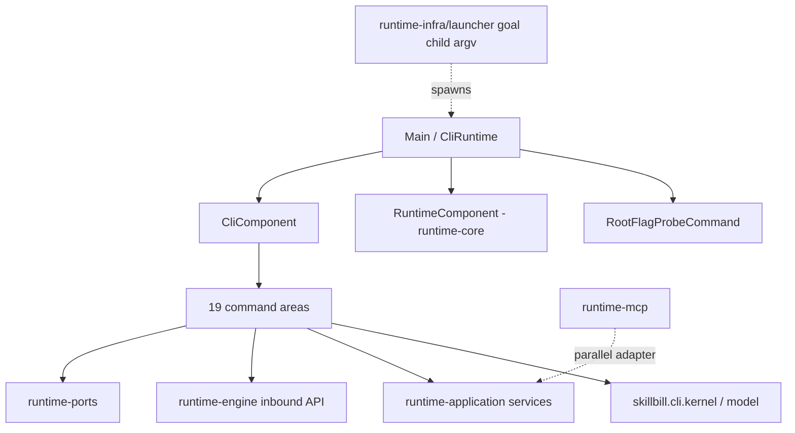

# runtime-cli architectural investigation (post SKILL-348)

## Execution rule

This bundle runs on the current tree. It does not wait for a subtask of another issue. Ordering notes later in this file are overlap context. If a change this bundle's acceptance criteria need is missing, make it here. If it is already present, keep it.

## Assessment

Keep the module graph, Clikt, Kotlin-Inject, the `CliRunState` completion model, and command-area isolation. SKILL-229 and SKILL-348 fixed the invocation inputs, the command-area cycles, and update/uninstall ownership. That work landed and holds.

Three kinds of problem remain:

1. **Enforcement claims more than it checks.** Eight architecture tests in six classes resolve module paths against the repository root instead of `runtime-kotlin/`, and skip any missing root without failing. They scan zero files and pass. That includes the zero-tolerance raw-map rule and the engine inbound-API pin that runtime-cli relies on. Two public raw-map functions and at least 13 unpinned engine types have landed behind them.
2. **The process boundary has no single output and failure contract.** Typed runtime errors and I/O errors reach the terminal as JVM stack traces. Usage errors and diagnostics print to stdout, including under `--format json`. One command area bypasses `CliRunState` and gets root help appended. Goal exit codes depend on substring matches against free-text reasons.
3. **Contracts shared with other modules have more than one owner.** The CLI computes durable repository identity with its own filesystem walk, and that walk disagrees with the engine's. The goal launcher and the CLI share a flag-and-env protocol that nothing pins. The CLI and MCP each carry a verbatim copy of the governed scaffold payload parser, and the two copies disagree on `repo_root` precedence.

None of this needs a new layer, module, or framework. Every fix below either deletes a copy, moves a decision to the owner that already exists, or makes an existing check actually run.

Recommendation: implement SKILL-371 on the current tree. Do not wait for another issue. Five findings are Major because they affect correctness, durable identity, or a guard that is supposed to fail builds. Four are Minor.

## Scope and evidence

This is a whole-module architecture investigation of `runtime-kotlin/runtime-cli` and its seams with runtime-application, runtime-engine, runtime-ports, runtime-domain, runtime-contracts, runtime-core (composition and architecture tests), runtime-infra/launcher, runtime-infra/host, and runtime-mcp. It is not a diff review. No review subagents were used. All reading and censuses ran in this session.

Census at commit `11d8615ba` (2026-09-22): 113 production Kotlin files, 11,705 lines, 30 packages across 19 areas. Test sources: 61 files. Other work kept committing to the shared checkout during the investigation: SKILL-368 subtasks moved HEAD from `a9c9f4ba0` to `dbf9f4830`. No CLI production file changed between those commits. Recheck the anchors below before implementation.

Behavior probes ran against the `runtime-cli` distribution built at 16:26 on 2026-09-22 from the shared checkout (`runtime-cli-0.4.3-SNAPSHOT.jar`). They used a throwaway `--db` and `--home`, and no real installation or database was touched. HEAD itself did not compile at probe time: `runtime-engine` failed in `FeatureTaskRuntimeFindingVerificationBoundaryMemoryProbe.kt:24`, an in-flight SKILL-368 edit. The CLI files involved in the probes did not change between that build and HEAD. See [evidence/validation.md](evidence/validation.md).

Prior work this bundle builds on and does not repeat:

- SKILL-229: area isolation, empty cycle/ambient/inject-defaults baselines.
- SKILL-348: update/uninstall ownership, invocation root and stdin, rejected-output raw bytes, workflow step-update strictness, deletion of workflow family wrappers.
- SKILL-370 (prepared, not landed): renames `RejectedOutputDiagnosticCliSession` and moves its line rendering and flag hint into the CLI. That finding is theirs and is excluded here.

## Current architecture

The dependency direction is correct. `runtime-cli/build.gradle.kts` has no production edge to infrastructure, and `CliComponent` only builds the command graph over `RuntimeComponent`. The problems are in what crosses those edges, not in the edges themselves.

| Area | Files / lines | Assessment |
| --- | --- | --- |
| core | 7 / 308 | Correct composition root. Root error mapping is incomplete (F-002). Seven grouping holders with arbitrary names (F-009). |
| kernel, model | 19 / 761 | `CliRunState` completion is the right shape. `CliExecutionResult` has no stderr channel (F-002). `CliFormat.fromWireName` is dead. |
| featuretask | 12 / 1,489 | Computes durable identity itself (F-004). Consumes the unpinned launcher protocol (F-005). Map-driven exit codes (F-006). 153-line duplicate deprecated tree (F-009). |
| goal | 17 / 2,648 | Presenters and exit codes run on `Map<String, Any?>`. Exit code parses prose (F-006). Copies featuretask's candidate mappers (F-009). |
| experiment | 1 / 104 | Bypasses the result contract, hand-rolls `--format`, crashes on an unknown id (F-003). |
| scaffold | 19 / 1,932 | Verbatim copy of the MCP payload parser. Repo-root heuristic hardcodes this repository's layout (F-007). |
| install | 14 / 1,475 | Restates the state-root layout and goal-continuation env name (F-005, F-008). Otherwise translation only. |
| system | 2 / 359 | Update-check JSON differs from MCP. Restates wire tokens (F-008). |
| codereview, review, workflow, learning, telemetry, config, agentaddon, skillremove, repovalidation, work | 30 / 2,629 | Mostly thin translation and presentation. Hand-rolled `--format` in `work` (F-008). No structural finding. |

## Principles assessment

| Principle | Judgment |
| --- | --- |
| Clean / hexagonal | Module direction holds. Three contracts shared across adapters are owned in the adapter instead of inward: repository identity, the scaffold payload, and the goal-child protocol (F-004, F-005, F-007). |
| Single responsibility | Command classes mix parsing and rendering, which is fine for a CLI. Failure policy is spread across roughly 30 catch sites plus a three-type root catch, with no owner (F-002). |
| Open/closed | Explicit command registration is fine. Keep it. |
| Liskov | `CliExecutionResult` claims one completion per run, but `echo`-based commands complete twice: once with their own output, and again implicitly with root help (F-003). |
| Interface segregation | No finding in CLI. `InstallService.discoverPlatformPackSlugs` needs a full fake `InstallPlanRequest` from the CLI, which is noted under F-008. |
| Dependency inversion | `RepositoryEnclosingRootPort` exists and is already injected through `CliRunInputs`, but featuretask reimplements it with `toFile().exists()` (F-004). |
| YAGNI | The deprecated alias tree, seven grouping holders, a thunk parameter, a dead parser, and duplicated mappers (F-009). |
| Testability | The guards that would catch regressions do not run (F-001). No test covers the launcher→CLI protocol (F-005). |
| Documentation truth | `ARCHITECTURE.md` says "typed CLI presenter models are the input to CLI text rendering", and 16 renderers take a raw map. It says the raw-map rule is zero-tolerance, and the rule scans nothing. |

## Risk register

Paths are relative to `runtime-kotlin/` unless stated otherwise. CLI paths abbreviate `runtime-cli/src/main/kotlin/skillbill/cli` as `cli/`.

- [F-001] Major | High | `runtime-core/src/test/kotlin/skillbill/architecture/ArchitectureScanSupport.kt:10` and `RuntimeArchitectureTestSupport.kt:8,26` | Eight architecture tests scan zero files, and violations have already landed.
- [F-002] Major | High | `cli/core/CliRuntime.kt:55-69`, `cli/model/CliExecutionResult.kt` | No process-boundary failure policy. Typed and I/O errors become stack traces, and diagnostics go to stdout.
- [F-003] Major | High | `cli/experiment/ExperimentsCliCommands.kt:67,77,83,102` | `experiments` bypasses `CliRunState`. Root help is appended on success, and an unknown pair crashes.
- [F-004] Major | High | `cli/featuretask/FeatureTaskRuntimeCliFormatting.kt:42-71` | Durable repository identity has six derivations with two semantics. The CLI's copy duplicates an injected port.
- [F-005] Major | High | `runtime-infra/launcher/.../agentrun/AgentRunCommandBuildersLaunch.kt:66-140`, `cli/featuretask/FeatureTaskRuntimeCliCommands.kt:30-120` | The goal-child argv and env protocol has two owners and no test.
- [F-006] Minor | High | `cli/goal/core/GoalCliExitCodes.kt:11-22` and 16 map-driven renderers | Exit codes and text re-parse the JSON map. The goal exit code substring-matches prose.
- [F-007] Major | High | `cli/scaffold/payload/ScaffoldCommandRequest*.kt` and `runtime-mcp/.../scaffold/McpScaffoldCommandRequest*.kt` | The governed scaffold payload parser is duplicated verbatim, and the two adapters disagree on its semantics.
- [F-008] Minor | High | `cli/system/SystemCliCommands.kt:101-110,220`, `cli/work/WorkCliCommands.kt:38,67`, `cli/install/...` | Restated wire tokens, two update-check JSON shapes, three hand-rolled `--format` options, and restated state-root layout.
- [F-009] Minor | High | `cli/featuretask/FeatureTaskRuntimeDeprecatedCliCommands.kt`, `cli/core/CliCommandGroups.kt`, `cli/core/CliUtilityCommandGroups.kt` | Remove generalizations and copies with no current need.

### F-001. Architecture guards scan nothing

`ArchitectureScanSupport.runtimeRoot` walks up from the Gradle working directory to the first directory that *contains* `runtime-kotlin/`, which is the repository root. `RuntimeModuleCatalog.runtimeKotlinModuleDirectory` correctly prefixes `runtime-kotlin/`, but several tests pass bare module paths such as `"runtime-cli/src/main/kotlin"` or filter on `relativePath.startsWith("runtime-application/src/main/kotlin/")`, where `relativePath` is relative to the repository root. The walkers then return empty on a missing root (`if (!Files.isDirectory(root)) return@forEach`, `if (!Files.exists(root)) return emptyList()`), so the tests pass without reading a file.

Affected tests:

| Test | Effect |
| --- | --- |
| `RuntimeEngineInboundApiTest` "consumer modules reference only pinned engine inbound api types" | Scans no CLI, MCP, or application file. Its last recorded run took 1 ms. |
| `RuntimeApplicationSharedEngineEdgeArchitectureTest` | Same scanner, application root only. |
| `RuntimeRawMapArchitectureTest` "forbids public raw map shapes in inner layers" | The `startsWith` filter never matches, so zero files are checked. |
| `RuntimeArchitectureTest` "touched domain contract foundation…", "runtime domain workflow source must not import…", "review and telemetry domain models do not own json payload contracts" | The same filter matches nothing. |
| `ImplementationOwnershipArchitectureTest` `forbiddenSourcePackages` (core/cli/mcp entries) | Those three roots contribute no packages. If they still pass without reading files, delete them in this bundle. |
| `RuntimeLayerBoundaryArchitectureTest` "retired review and telemetry adapters stay absent" | `Files.exists` on a path that can never exist, so the test always passes. If it still passes without reading files, delete it in this bundle. |

Violations that landed behind these guards:

- `runtime-domain/src/main/kotlin/skillbill/review/context/model/accounting/ReviewAccountingPayload.kt:5` has `fun ReviewAccountingSummary.toBoundedPayload(): Map<String, Any?>`. Both the raw-map rule and "review and telemetry domain models do not own json payload contracts" forbid this.
- `runtime-application/src/main/kotlin/skillbill/application/review/stats/ReviewAccountingOutput.kt:5` is a public raw-map function in application.
- runtime-cli imports 13 engine types that the pinned inbound list does not name, from two causes. SKILL-361 moved `GoalRunnerStatusService` and `GoalPreflightService` into `status`/`preflight` subpackages, and the pin still names the old FQNs. SKILL-366 added `ExperimentNavigationPairCoordinator`, `ExperimentNavigationPairRequest`, `ExperimentNavigationPairSource`, `ExperimentPairCoordinator`, `parseNavigationAcceptanceCriteria`, `ExperimentReportProjector`, and `ExperimentStatsProjector`, which were never pinned.

This is the most consequential finding for runtime-cli's architecture, because SKILL-229 and SKILL-348 both cite these guards as proof of the CLI boundary. Other guards do their own root resolution and work: `RuntimeCliAreaIsolationArchitectureTest`, `RuntimeAdapterDependencyAllowlistTest`, and `RuntimeCoreCompositionOnlyTest`, which resolves `runtime-kotlin` explicitly.

- runtime-ports has public raw-map signatures in seven files, including four experiment files if they are still present, plus `IdeStatusValidator.toWireMap`, `IdeStatusProblemDetails.from` / `asWireEntries`, and `ReviewFinishedTelemetryPayload`. This bundle fixes every signature the restored filter reports.

`PortsDeclarationArchitectureTest` and `PortNullObjectAbsenceArchitectureTest` are vacuous for a different reason: their own walker doubles `runtime-kotlin/` and drops `runtime-infra:<name>` ids. This bundle applies the same scan-root convention to them.

Experiment imports are still in the tree until this bundle removes the ones that fail the pin. Do not wait for another issue to delete them, and do not pin them.

Fix: resolve every module-relative scan path through `RuntimeModuleCatalog.runtimeKotlinModuleDirectory`, or through one root that *is* `runtime-kotlin/`. Make every scan root that does not exist fail the test instead of returning empty. Add one assertion per affected scanner that it visited at least one file of each root it names. Then fix what the restored guards report instead of baselining it. That means refreshing the engine pin to the real inbound surface, choosing ownership for the two raw-map functions, and deciding whether `experiments` stays on engine types. Do not widen any exemption.

### F-002. No process-boundary failure and output policy

`CliRuntime.run` catches exactly three types: `CliktError`, `IllegalArgumentException`, and `DatabaseAccessError`. Everything else escapes `main` as an uncaught exception. The probes reproduced these:

| Invocation | Observed |
| --- | --- |
| `feature-task rejected-output --workflow nope` | `RejectedOutputDiagnosticError$Absent` stack trace, 9 lines of stderr, exit 1. |
| `import-review /nonexistent --format json` | `java.nio.file.NoSuchFileException` stack trace, 16 lines, exit 1. |
| `experiments report nope` | `IllegalStateException: unknown pair nope` stack trace, exit 1. |
| `goal status NOPE-1 --format json` | Clikt usage text on **stdout**, empty stderr, exit 1. |
| `feature-task repair-identity … /etc/passwd …` | Usage block plus a domain refusal message on **stdout**, exit 1. |

`CliExecutionResult` has only `stdout`, so the runtime cannot put a diagnostic anywhere else. Around 30 command-local catch blocks compensate, each with its own taxonomy and output. For example, install catches `SkillBillRuntimeException` plus `IllegalArgumentException`, codereview maps five exception types to `UsageError`, and scaffold returns an `errorResult` JSON on stdout. As a result, `--format json | jq` receives help text on failure, and an operator or agent sees a JVM trace for an expected, typed domain condition.

`SkillBillRuntimeException` is already the root of the typed runtime error taxonomy (`runtime-contracts/.../error/core`). The standard CLI contract is that stdout carries only the requested result and stderr carries diagnostics. That contract fits this codebase without adding a framework: map once at `CliRuntime`, give `CliExecutionResult` a stderr field, and have `Main` write it. `require` failures stay a usage-class error.

Keep the exit-code families: 0 success, 1 failure, and the command-specific 2 and 3 that goal and lookup already define. The goal runner and scripts read them. An unexpected non-typed throwable still exits non-zero, with a one-line diagnostic and a `RuntimeDiagnostics` record per the observability policy. It does not get silently converted into a normal result.

### F-003. `experiments` bypasses the result contract

`ExperimentsRunCommand`, `ExperimentsReportCommand`, and `ExperimentsStatsCommand` write with Clikt `echo` and never settle `CliRunState`. `CliRuntime` then treats the null result as "show root help". `experiments stats` printed its line and then the full 89-line root usage, with exit 0. This is the same defect class SKILL-348 fixed for rejected-output. It landed afterwards with SKILL-366.

The area also:

- declares `--format` as a free string defaulting to `text`, so any value other than `json` silently renders text;
- prints stats as a Kotlin `Map.toString()` dump (`goal={total_pairs=0, …}`) instead of the shared `CliOutput` text or JSON;
- throws `error("unknown pair …")`, an `IllegalStateException`, for an expected absent id;
- reads and validates the navigation spec, which is use-case preparation, in the command before calling the engine coordinator.

If the `experiments` command is already gone, F-003 is met by that deletion. If the command is still there, apply the fix below in this bundle. Do not wait for another issue to delete it.

Fix: complete through `CliRunState` with `formatOption()`, and make an absent pair a typed error handled by F-002. Move spec reading and acceptance-criteria validation into the engine coordinator request, so the command passes the path and the coordinator owns the read. `ExperimentNavigationSpecError` is already a typed runtime error. Pin, or stop importing, the engine projectors under F-001.

### F-004. Repository identity has six derivations and two meanings

`FeatureTaskExecutionIdentityPolicy` (runtime-domain) defines `repository_identity` as `repo-root-realpath-v1:` plus "the absolute real path of the Git top-level directory". Production code builds that string in six places:

| Site | Semantics |
| --- | --- |
| `cli/featuretask/FeatureTaskRuntimeCliFormatting.kt:42-53` `repositoryIdentity`/`canonicalGitRoot` | Walks up to `.git` with `toFile().exists()`. `toRealPath()` throws on a missing path. |
| `runtime-infra/host/.../CanonicalRepositoryRoot.kt:28` (the `RepositoryEnclosingRootPort` implementation) | `canonicalPath(repoRoot)` with **no** walk. Falls back to the normalized path. |
| `runtime-engine/.../planning/sweep/GoalPlanningSweep.kt:67`, `.../context/GoalPlanningSharedPreplanProduction.kt:125,173`, `.../recovery/GoalPlanningStatusReasonCoherence.kt:61` | `"repo-root-realpath-v1:$canonicalRepository"`, where `canonicalRepository` is `port.canonicalPath(repoRoot)` with no walk. |
| `runtime-infra/sqlite/.../control/GoalRepositoryIdentity.kt:20` | `toRealPath()` with no walk, and a diagnostic on fallback. |

The CLI's `canonicalGitRoot` is a line-for-line copy of `CanonicalRepositoryRoot.enclosingRepositoryRoot`, differing only in the fallback. The port is already injected into every command through `CliRunInputs.repositoryEnclosingRootPort`. It is not used here.

Consequence (source-traced, not run end to end): for an invocation root below the Git top level, feature-task records the top-level identity while goal planning records the subdirectory identity. Lookups keyed on one do not find rows written with the other. Changing the identity format to a `v2` means six edits across four modules. `governedSpecPath`'s `.feature-specs/` and `.md` rule restates `FeatureTaskExecutionIdentityPolicy.validGovernedSpecPath` in the CLI.

Fix: `RepositoryEnclosingRootPort.repositoryIdentity` becomes the only producer. It resolves the enclosing Git top level, as the domain definition says, and builds the value from `FeatureTaskExecutionIdentityPolicy.REPOSITORY_IDENTITY_PREFIX`. The CLI, engine, and SQLite sites call it or receive its result. Governed spec path normalization moves next to the policy that validates it (an application or port function the CLI calls), and the CLI keeps only the `UsageError` translation. Existing rows keep their stored values. A row written from a subdirectory root stays readable through its original workflow id and gets no silent rewrite.

### F-005. The goal-child launch protocol has no owner

`goalContinuationArguments` and `addGoalContinuationArguments` in `runtime-infra/launcher` build `skill-bill [--db …] feature-task run|resume … --goal-parent-issue-key … --goal-subtask-id … --goal-branch … --suppress-pr --goal-parent-workflow-id … --goal-last-resumable-step … --code-review-mode … --goal-review-base-sha … --goal-baseline-untracked-path … --agent-addon-selection-json … --agent … --max-wall-clock-minutes …` from string literals. `AgentRunCommandBuilders.kt:46` sets `SKILL_BILL_GOAL_CONTINUATION=1`, and the quality gate reaches the child through `SKILL_BILL_QUALITY_GATE_SELECTION`. The CLI declares the same flags as separate literals in `FeatureTaskRuntimePhaseAgentCommand`. It restates the env names in `install/apply/InstallCliMutations.kt:8`, `system/UninstallCommand.kt:93`, and `featuretask/FeatureTaskRuntimeRunRequestAssembly.kt:124`. The add-on selection JSON is built with an ad-hoc `ObjectMapper` and inline keys.

`grep -rl goal-review-base-sha` finds only the two production files and no test. Renaming or retyping one of these options passes every test and breaks every decomposed goal child at runtime. This is an internal RPC contract carried over argv. The repository's own rule for wire keys already covers this: declare once in `runtime-contracts` and reference from both sides.

Fix: one contract object in `runtime-contracts` owns the child command tokens, flag names, and env names. The launcher builds from it, and the CLI declares its options from it. The add-on selection JSON uses the existing agent add-on selection contract keys. One test on each side pins the shared vocabulary. The launcher test asserts that every `SkillRunGoalContinuationContext` field is emitted. The CLI test parses an argv assembled from the contract and asserts that the resulting `FeatureTaskRuntimeRunRequest` carries every field. Do not introduce a JSON-over-stdin protocol or a new IPC mechanism.

### F-006. Exit codes and text re-parse the presentation map

In goal and featuretask, a typed engine result becomes a `Map<String, Any?>`. That map then feeds 16 text renderers and 10 `Map.…ExitCode()` functions, with 62 `as? Map<*, *>` / `as? List<*>` casts. `goalRunExitCode` returns `GOAL_EXIT_FAILED` when the lowercase free-text `reason` *contains* "failed" or "timeout". Otherwise it returns blocked (3) or paused (2). A blocked reason that happens to mention a failed check therefore exits 1 instead of 3, and a renamed map key silently turns into `null` in text output. `ARCHITECTURE.md` states "typed CLI presenter models are the input to CLI text rendering". The learning, review, and triage presenters in `kernel/cli/CliPresenters.kt` already follow that rule.

Fix: in goal and featuretask, compute the exit code from the typed result: status enum plus a closed reason kind. If the engine result carries no typed reason kind, add one to the engine result model. Renderers consume typed presentation models, and the JSON map is produced from the same typed value. JSON field names and exit-code families stay the same. This is scoped to the two areas that violate the rule. It is not a blanket conversion of every CLI map. SKILL-348 already rejected that conversion, and the remaining maps are open presentation payloads.

### F-007. The governed scaffold payload is parsed twice, with different semantics

`cli/scaffold/payload/ScaffoldCommandRequestParser.kt`, `…BaselineLayerParser.kt`, and `…Parsing.kt` (335 lines) match `runtime-mcp/.../scaffold/McpScaffoldCommandRequest*.kt` (337 lines) except for the parameter name `args` versus `payload`. Both parse the contract in `orchestration/shell-content-contract/SCAFFOLD_PAYLOAD.md`, pinned by `scaffold_payload_version`. Each adapter also sequences the use case differently:

| Behavior | CLI | MCP | Contract |
| --- | --- | --- | --- |
| `repo_root` | Payload value wins. Otherwise `findRepoRoot`, which walks up looking for `runtime-kotlin/settings.gradle.kts` and `skills/`, meaning **this** repository's layout. | Always overwritten with the invocation root, so the payload value is ignored. | "absolute path override … Defaults to the current working directory." |
| External add-on source registration | Registered after success when `addon_location_path` is set. | Not registered. | "Desktop callers register … Scripted callers … must register the source themselves." |
| Session id date | `clock.zone` | `ZoneOffset.UTC` | n/a |

The duplication exists because the raw-map rule forbids a public application function that accepts `Map<String, Any?>`. The rule meant "do not put wire maps inside the hexagon". Copying the parser into both adapters satisfies the rule's wording but defeats its purpose. `findRepoRoot` contradicts the product boundary: bundled skills and packs are defaults, and another repository's layout must work.

Fix: one decoder in runtime-application's scaffold area takes the payload as a `JsonObject` or as text, which the raw-map rule accepts, and returns `ScaffoldCommandRequest`. It loud-fails with the existing typed errors. One application scaffold operation owns the session id, the `repo_root` default, and the optional external-source registration step. Callers opt into registration explicitly: the CLI does, MCP does not, as today. A registration failure after a successful scaffold is reported as a partial outcome, not swallowed. `repo_root` follows the contract in both adapters: the payload value wins, and the default is the invocation repository root. Delete `findRepoRoot`. MCP stops ignoring an explicit `repo_root`, which is a documented behavior correction.

### F-008. Restated tokens and inconsistent output options

- `system/SystemCliCommands.kt:101-110` restates `UpdateRunStatus` wire tokens in a local `when`, against the rule that enum wire tokens use `wireValue`.
- `UpdateCheckResult.toPayload` (CLI) emits `release_url`. MCP emits the same result through `UpdateCheckContract`, which lacks it. One use case therefore has two JSON shapes. Route both adapters through the contract and add `release_url` to it.
- `format.wireName == "json"` is a string comparison on an enum (`SystemCliCommands.kt`).
- 58 commands use `formatOption()`. Three hand-roll `--format`: `work list` (`table|json` via `require`), `work status` (`json` only via `require`), and `experiments report` (any string). Use Clikt `choice` so invalid values fail at parse. Keep `table` where it is the existing default.
- The state-root layout `~/.skill-bill` and `~/.skill-bill/runtime` appears in three CLI sites (`install/core/InstallCliCommands.kt:228`, `install/apply/InstallRequestCommand.kt:66,139`) and at least eight sites in application and infrastructure. The CLI should pass `null` and let the install planner apply its default, instead of restating it. Consolidating the non-CLI sites is out of scope.
- `replay-last-selection` builds a complete fake `InstallPlanRequest` just to call `discoverPlatformPackSlugs`, then enforces stale-slug policy in the CLI. Give discovery the input it needs (the packs root) and move the stale-selection refusal next to the selection read.

### F-009. Complexity-only cuts

This list is the over-engineering result. It excludes the repairs above.

- `featuretask/FeatureTaskRuntimeDeprecatedCliCommands.kt:1-153`: **yagni**. Four classes duplicate `run`/`status`/`resume` for the hidden `feature-task-runtime` alias. They cover only three of nine subcommands, so the alias is also incomplete. No skill, doc, script, or launcher invokes `feature-task-runtime`. Replace with a root alias to `feature-task` that keeps the stderr deprecation note, or delete the alias if the owner confirms no external users.
- `core/CliCommandGroups.kt`, `core/CliUtilityCommandGroups.kt`: **shrink**. Seven holders (`ReviewCliCommandGroup`, which also carries telemetry; `ScaffoldCliCommandGroup`, which also carries install; `UtilityCliCommandGroup`; `TopLevelCliCommands`; `WorkflowGoalFeatureCliCommands`; `SystemMaintenanceCliCommands`; `MiscCliCommands`) exist to stay under detekt's `constructorThreshold: 12`, and their names do not describe their contents. Replace them with a single ordered provider over the existing area `*TopLevelCommands` holders, or with at most two groups named by what they hold. Help order must stay stable.
- `featuretask/FeatureTaskRuntimeCliCommands.kt:139-144`: **shrink**. `executeRuntimeRun(…, workflowId: () -> String)` invokes the thunk on its first line. Pass the id.
- `featuretask/FeatureTaskRuntimeControlCliCommands.kt:69-101` and `goal/run/GoalCliRunCommands.kt:126-203`: **delete** one copy of the identical `GoalContinuationCandidate` and `FeatureTaskContinuationCandidate` mappers. Keep a single `kernel/payload` owner, as SKILL-229 did for `WorkflowUpdateResult`.
- `workflow/WorkflowContinueCliBranchMapsDecomposition.kt` and the `--subtask-id` option on `verify-workflow continue` (`workflow/WorkflowCliCommands.kt:223`): **delete**. The CLI continues only `WorkflowFamilyKind.VERIFY`, but `WorkflowService.continueWorkflow` produces the seven `Decomposition*` results only for `WorkflowFamily.TASK_RUNTIME` (`WorkflowService.kt:397`). The mapper therefore handles results the CLI never receives, and the option cannot take effect. Reported by the SKILL-375 investigation, which deletes the byte-identical MCP copy. The unreachable application half (`DecompositionWorkflowContinuation`) is a follow-up outside this bundle. The stale `WireVocabularyGovernedSeamInventory` marker for this area is removed by SKILL-375 subtask 1, not here.
- `model/CliFormat.kt:8-15`: **delete** `fromWireName`, which has no caller.
- `featuretask/FeatureTaskRuntimeControlCliCommands.kt:147`: **delete** `requireNotNull` on a non-null argument.

Net: about 280 lines removable across F-007 and F-009, with 0 dependencies added and 0 removed. This is an estimate, not a target. The F-002 and F-005 tests add lines.

## Changes rejected

- **Moving feature-task run preparation into the engine.** `prepareRuntimeRun` composes engine-owned resolvers (`FeatureTaskRuntimeAgentResolver`, `FeatureTaskRuntimeModelResolver`) with CLI flag parsing and refusals. It has one entry adapter. A second consumer would justify a use-case object. Today it would be an interface with one caller.
- **A command bus, registry, or plugin loader** to replace the grouping holders. Explicit registration is readable and already tested.
- **Replacing Clikt, Kotlin-Inject, or `CliRunState`.** The defects come from commands bypassing them.
- **A blanket typed-DTO migration for every CLI map.** Only goal and featuretask violate the documented rule, and F-006 is limited to them.
- **Changing exit-code numbers to sysexits or POSIX 2.** Scripts and the goal runner read today's values. F-002 changes channels, not numbers.
- **A JSON-over-stdin or socket protocol for goal children.** Argv is adequate once one side owns its vocabulary.
- **Consolidating every `~/.skill-bill` path** across application and infrastructure. It is real duplication, but outside this module. It belongs to an install-layout owner.
- **Removing `CliRuntimeContext` and `OptionalCallbacks` test hooks.** They are the documented embedding and test seam. Replacing them with per-test components costs more than they do.
- **Splitting large goal files by line count.** Cohesion decides, and F-006 will shrink them.

## Public engineering references

No single public document states Reddit's, Microsoft's, or Meta's internal CLI review rules. These are the public sources the criteria come from. The findings rest on this repository's behavior.

- stdout for results and stderr for diagnostics, with machine-readable output never mixed with help text: [Command Line Interface Guidelines](https://clig.dev/#the-basics), and POSIX's definition of standard error as the diagnostic output stream in [XBD 10.1 Standard I/O Streams](https://pubs.opengroup.org/onlinepubs/9799919799/basedefs/V1_chap10.html). Applies to F-002 and F-003.
- Inward-pointing dependencies, with application policy independent of adapters: [Microsoft, Common web application architectures — Clean architecture](https://learn.microsoft.com/en-us/dotnet/architecture/modern-web-apps-azure/common-web-application-architectures#clean-architecture). Applies to F-004 and F-007.
- Keep one owner for an interface shared between processes, and test that producer and consumer agree: Martin Fowler, [Consumer-Driven Contracts](https://martinfowler.com/articles/consumerDrivenContracts.html). Applies to F-005.
- Tests must be able to fail: a check that cannot observe its subject provides no signal. Google's [Software Engineering at Google, ch. 11–12](https://abseil.io/resources/swe-book/html/ch12.html) on test fidelity and brittleness. Applies to F-001.

These are reasoned applications of public material, not claims about any company's private practice.
