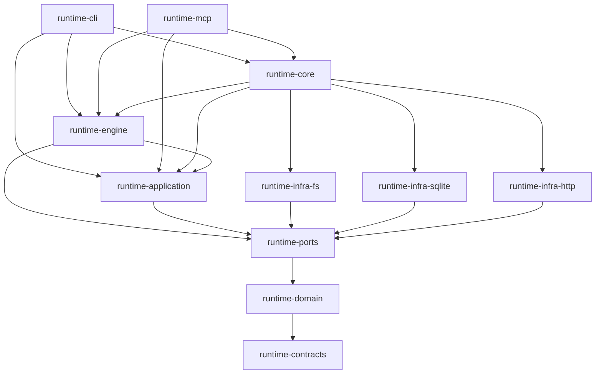

# Runtime Kotlin architecture investigation

## Assessment

Keep the module graph. Improve the semantics of its boundaries and reduce the shared access inside the feature engine.

The current code does not warrant a Clean Architecture rewrite. It does warrant changes before describing its cancellation, cleanup, and lease behavior as consistent. Three executable probes found violations that the selected green tests do not cover. The most useful simplification is reducing who can change run state, followed by deleting repeated resource-task setup.

This is a whole-module inventory with deep traces through selected critical paths. It is not a manual review of every line, a security audit, a load test, or a certification of Reddit's internal practices. Findings distinguish reproduced behavior, source-traced consequences, and design judgment.

## Scope and method

Inspected on 2026-09-15 at `45cc6b1cf099f44a9e0822e8721119d352eb4f8f`. The initial working tree was clean. Only investigation/spec artifacts are delivered. Tests and probes used disposable data; no user database, external telemetry receiver, branch, or production code was changed.

All eleven modules declared in settings.gradle.kts were inventoried. The residual runtime-desktop directory has no declared module or production Kotlin. Counts include blank lines. [evidence/inventory.json](evidence/inventory.json) records module dependencies, source hashes for findings, key allocation, and test results.

The diff-oriented bill-code-review skill was inspected but not invoked because the requested target is a whole module. This report is not a driver-issued review approval. The over-engineering skill supplies the deletion rubric. The bill-code-check guidance informed the focused evidence selection; its repair/full-gate workflow was not run for this investigation. The bill-unit-test-value-check rubric was applied to the selected regression coverage. Unslop applies to the authored prose. No subagents were launched.

## Evaluation standard

Reddit's r/place engineering report starts with explicit load and consistency requirements, reuses existing technology, and reports measured tradeoffs and an actual concurrency bug. I apply that approach here: state the requirement, trace ownership, test failure, and keep the existing tools where they suffice. This is an inference from a public project report, not an internal company-wide standard. [How We Built r/Place](https://redditinc.com/news/how-we-built-rplace).

Clean Architecture supports inward dependencies and boundary data that does not force consumers to know an adapter. Cockburn's hexagonal model supports running application behavior through substitutes for external devices. Neither requires one interface for every class. [The Clean Architecture](https://blog.cleancoder.com/uncle-bob/2012/08/13/the-clean-architecture.html), [Hexagonal architecture](https://alistair.cockburn.us/hexagonal-architecture).

YAGNI asks whether a capability is needed now. The runtime already needs schema validation, durable recovery, and ownership fencing; those are current requirements. Duplicate dependency exposure and repeated Gradle setup are different candidates because deleting them can preserve behavior. [Yagni](https://martinfowler.com/bliki/Yagni.html).

## Module coverage

| Module | Production files | Production lines | Test files |
| --- | ---: | ---: | ---: |
| runtime-application | 173 | 16,398 | 66 |
| runtime-cli | 114 | 11,370 | 57 |
| runtime-contracts | 76 | 3,315 | 6 |
| runtime-core | 20 | 925 | 79 |
| runtime-domain | 337 | 27,583 | 110 |
| runtime-engine | 298 | 41,218 | 126 |
| runtime-infra-fs | 403 | 39,610 | 202 |
| runtime-infra-http | 4 | 409 | 1 |
| runtime-infra-sqlite | 175 | 18,370 | 48 |
| runtime-mcp | 35 | 2,777 | 20 |
| runtime-ports | 227 | 7,077 | 5 |

Total: 1,862 production files, 169,052 production lines, and 720 test files. Size is inventory, not a defect.

| Area | Trace and conclusion |
| --- | --- |
| CLI and MCP | Declared dependencies point to application, engine, ports, contracts, and the composition root. Selected layer checks passed. No adapter bypass was found in the inspected entry paths. |
| Composition | runtime-core remains small and binds implementations outside the inner layers. Keep this ownership; do not create a second container. |
| Domain and contracts | WorkflowEngine uses typed snapshots and validators but still decodes and re-encodes JSON for step/artifact updates. That is serialization coupling, not an IO dependency. No measured cost or distinct bug justifies a bulk model migration here. |
| Application | InstallService coordinates planning facts, pure InstallPlanPolicy, materialization, and validation. These ports have actual boundaries. TelemetryService has sensible transaction sessions but inconsistent exception handling. |
| Engine | The loop/session now has private storage and a sealed terminal outcome. The broad shared context and duplicate forwarding remain. Goal worker persistence uses owner token and generation checks, a useful model for the weaker telemetry claim protocol. |
| SQLite | Read snapshots, write transactions, and readiness have explicit owners. Existing tests prove routine writes avoid repeated historical maintenance. Outbox settlement and rollback evidence still fail the intended contract. |
| Filesystem/process | SKILL-239 added lifetime ownership and immutable incomplete capture; real-process tests pass. Exceptional exits still need a reliable route for cleanup diagnostics. Manifest projections now distinguish written, absent, and failed outcomes. |
| HTTP | JdkHttpRequester is isolated behind a transport port, but its synchronous send lacks explicit deadlines and creates a client per request. |
| Build and tests | The module graph and selected package-cycle checks pass. Handwritten source scans prove their named patterns only. Resource copying repeats the same registration structure 32 times. |

## Dependency graph

Arrows show production project dependencies. Direct contracts/domain edges are omitted where they repeat a transitive direction; inventory.json contains every declared edge.



## Findings

### F-001. Outbox settlement does not enforce claim ownership

P2. Reproduced against compiled production adapter code with an in-memory SQLite database.

[TelemetryOutboxStore.kt:63](../../../runtime-kotlin/runtime-infra-sqlite/src/main/kotlin/skillbill/infrastructure/sqlite/telemetry/TelemetryOutboxStore.kt#L63) claims with a token, but [TelemetryOutboxStore.kt:174](../../../runtime-kotlin/runtime-infra-sqlite/src/main/kotlin/skillbill/infrastructure/sqlite/telemetry/TelemetryOutboxStore.kt#L174) and [TelemetryOutboxStore.kt:205](../../../runtime-kotlin/runtime-infra-sqlite/src/main/kotlin/skillbill/infrastructure/sqlite/telemetry/TelemetryOutboxStore.kt#L205) settle by event IDs alone. [TelemetryOutboxRepository.kt:19](../../../runtime-kotlin/runtime-ports/src/main/kotlin/skillbill/ports/telemetry/TelemetryOutboxRepository.kt#L19) cannot express the current owner's identity. The port therefore omits a condition the adapter needs to maintain its concurrency contract.

The probe claims one row for A, reclaims it for B after expiry, then applies A's late unconfirmed result. B's token becomes null. C can immediately claim the same row while B remains in flight.

```text
A_claimed=1, B_reclaimed=1
B_claim_after_stale_A_settlement=null
C_claimed_while_B_in_flight=1
```

A stale failure can also add an error or consume attempts after another sender acknowledges the row because failure settlement does not require synced_at to remain null. Receiver UUID deduplication reduces duplicate ingestion, but it does not preserve local ownership or status. Require owned compare-and-set settlement and explicit lost-claim handling. Keep the current durable event identity.

### F-002. Telemetry delivery has no explicit request deadline

P2. Source-confirmed; no stalled remote service was contacted.

[HttpTelemetryClient.kt:39](../../../runtime-kotlin/runtime-infra-http/src/main/kotlin/skillbill/infrastructure/http/HttpTelemetryClient.kt#L39) creates HttpClient per request and calls synchronous send without connectTimeout or request timeout. The JDK documents an unset request timeout as an infinite wait. Manual or automatic telemetry synchronization can therefore hold its caller indefinitely when a peer does not finish responding. [HttpRequest.Builder.timeout](https://docs.oracle.com/en/java/javase/21/docs/api/java.net.http/java/net/http/HttpRequest.Builder.html#timeout(java.time.Duration)).

[TelemetryOutboxDrain.kt:47](../../../runtime-kotlin/runtime-application/src/main/kotlin/skillbill/application/telemetry/sync/TelemetryOutboxDrain.kt#L47) uses request.now for every claim in the drain. A batch claimed after a slow previous request has an old timestamp and can expire too early. That amplifies F-001 but is independently wrong even after settlement is fenced.

Give the existing HTTP owner a reusable client and finite deadlines. Read the injected clock for each batch claim. Keep expiry recovery because a deadline alone cannot protect against JVM suspension, process death, or a lost acknowledgement. Do not add a retry scheduler or claim that timeouts provide exactly-once delivery.

### F-003. Automatic sync converts cancellation to absence

P2. Reproduced against compiled application code with a throwing repository substitute.

[TelemetrySyncRuntime.kt:53](../../../runtime-kotlin/runtime-application/src/main/kotlin/skillbill/application/telemetry/sync/TelemetrySyncRuntime.kt#L53) catches every Exception, including CancellationException, and returns null. The probe result is `auto_sync_result_after_cancellation=null`. No network call occurs.

[TelemetryOutboxDrain.kt:91](../../../runtime-kotlin/runtime-application/src/main/kotlin/skillbill/application/telemetry/sync/TelemetryOutboxDrain.kt#L91) also classifies transport exceptions as UNKNOWN, and acknowledgement handling catches Exception. [TelemetryService.kt:131](../../../runtime-kotlin/runtime-application/src/main/kotlin/skillbill/application/telemetry/TelemetryService.kt#L131) handles reconciliation failure through exception telemetry. These layers do not consistently preserve cancellation or interruption. Ordinary automatic-sync failures can also disappear when their own persistence/diagnostic route fails.

Propagate cancellation and preserve interrupt state before ordinary failure classification. Keep background operational failure non-fatal where that is the existing contract, but emit a bounded independent diagnostic. Adapt the current boundaries; a generic exception framework would add more indirection than this fix needs.

### F-004. Secondary failure evidence disappears during teardown

P2. SQLite failure reproduced; process diagnostic loss source-traced.

[SQLiteDatabaseSessionFactory.kt:102](../../../runtime-kotlin/runtime-infra-sqlite/src/main/kotlin/skillbill/infrastructure/sqlite/SQLiteDatabaseSessionFactory.kt#L102) and [ConnectionTransactions.kt:20](../../../runtime-kotlin/runtime-infra-sqlite/src/main/kotlin/skillbill/infrastructure/sqlite/core/ConnectionTransactions.kt#L20) discard rollback exceptions. A probe invokes the compiled transaction helper with a failing body and a JDBC statement that also fails rollback. The primary failure survives, but suppressed_cleanup_failures is zero and the helper has no diagnostic path. This is an observability failure; the probe does not establish database corruption.

[ProcessRunLifetime.kt:30](../../../runtime-kotlin/runtime-infra-fs/src/main/kotlin/skillbill/infrastructure/fs/launcher/process/ProcessRunLifetime.kt#L30) records teardown failures locally. [JvmAgentRunProcessRunner.kt:126](../../../runtime-kotlin/runtime-infra-fs/src/main/kotlin/skillbill/infrastructure/fs/launcher/process/JvmAgentRunProcessRunner.kt#L126) rethrows setup/wait failures before buildRunResult appends that recorder to stderr. [JvmAgentRunProcessRunner.kt:70](../../../runtime-kotlin/runtime-infra-fs/src/main/kotlin/skillbill/infrastructure/fs/launcher/process/JvmAgentRunProcessRunner.kt#L70) reports endpoint teardown through the same output sink that may already have failed and then swallows that second failure. Capturing a record in an object the exception path discards is not external observability.

Preserve primary failure identity, attach secondary failure evidence, and use the existing independent bounded diagnostic facilities. Check total cleanup bounds, including stream close, while changing these owners. The old callback-leaks-child finding is fixed and is not reissued here.

### F-005. The run loop still gives helpers broad shared access

P2 design debt. Source-confirmed, with consequence assessed through dependency inspection rather than a reproduced workflow bug.

[FeatureTaskRuntimeRunLoop.kt:17](../../../runtime-kotlin/runtime-engine/src/main/kotlin/skillbill/engine/featuretask/FeatureTaskRuntimeRunLoop.kt#L17) declares 17 fields in FeatureTaskRuntimeRunLoopContext. The loop then repeats these collaborators as properties at [FeatureTaskRuntimeRunLoop.kt:104](../../../runtime-kotlin/runtime-engine/src/main/kotlin/skillbill/engine/featuretask/FeatureTaskRuntimeRunLoop.kt#L104). There are 122 context-receiver functions across 15 production files. [FeatureTaskRuntimeRunLoopPlanningBranch.kt:21](../../../runtime-kotlin/runtime-engine/src/main/kotlin/skillbill/engine/featuretask/FeatureTaskRuntimeRunLoopPlanningBranch.kt#L21) still takes the whole run loop to perform a state check and mutation; other branch operations accept it for recording or reporting. [FeatureTaskRuntimeRunLoopValidationGate.kt:36](../../../runtime-kotlin/runtime-engine/src/main/kotlin/skillbill/engine/featuretask/FeatureTaskRuntimeRunLoopValidationGate.kt#L36) mixes gate orchestration, validation, persistence, retry preparation, and result assembly through the same context. [FeatureTaskRuntimeRunLoopDrive.kt:235](../../../runtime-kotlin/runtime-engine/src/main/kotlin/skillbill/engine/featuretask/FeatureTaskRuntimeRunLoopDrive.kt#L235) reads durable review state and changes session outcomes through that shared access.

The impact is change cost: helper signatures do not reveal their required state or capabilities, and adding a collaborator makes it available across the family. Private session fields are an improvement, but any helper with the session can still call unrelated transitions. The logical-type scanner at [ArchitectureScanSupport.kt:467](../../../runtime-kotlin/runtime-core/src/test/kotlin/skillbill/architecture/ArchitectureScanSupport.kt#L467) assigns a file to its primary declaration when one exists, so object-hosted context extensions are not a proof of a small effective receiver responsibility. A green size check does not settle this design question.

Narrow the named planning-branch, review-carry, and gate/settlement families with direct parameters or cohesive concrete collaborators. Remove duplicate public forwarding. Preserve one phase/state owner. Do not replace the context with a role interface exposing the same graph or create an interface per helper.

### F-006. Resource task registration repeats one policy 32 times

P3 maintenance debt. Source-confirmed.

[build.gradle.kts:37](../../../runtime-kotlin/runtime-infra-fs/build.gradle.kts#L37) begins repeated path, Copy task, output-directory, input, and missing-file setup. The file has 32 Copy registrations and 914 lines; its task-dependency lists repeat the inventory again. Each new governed resource can require edits in several parallel places.

A module-local list and small registration function can retain named tasks and explicit destinations while deleting repeated setup. Preserve missing-file failure messages, canonical schema ownership, generated directories, and any intentional main/test differences. Keep area compilation unchanged. Estimated saving is about 500 lines, pending an actual refactor, with no dependency removal.

## SOLID, clean architecture, and YAGNI assessment

| Principle | Assessment |
| --- | --- |
| Single responsibility | Module responsibilities are credible. Run-loop helper access and mixed gate orchestration need narrowing. A file being below 1,200 lines does not establish cohesion. |
| Open/closed | Manifest-owned packs and injected process strategies support extension without editing identity branches in shared runners. Retain these concrete extension points. |
| Liskov substitution | A substitute must preserve cancellation, failure, and transaction meaning. Telemetry's Exception-to-null behavior violates that expectation; merely implementing the same interface is insufficient. |
| Interface segregation | Storage/transport ports are justified even with one production adapter. The outbox port lacks ownership needed for settlement; the run-loop context exposes far more than individual helpers need. |
| Dependency inversion | Production project edges and selected source checks point inward. Composition stays outside. No module rewrite is proposed. |
| Clean boundary data | Typed snapshots and schema seams are useful. JSON remains part of inner workflow coordination, so claims of serialization-free domain logic would be false. Defer broad migration absent a bounded behavioral or measured cost case. |
| YAGNI | Keep currently exercised ports and recovery contracts. Delete duplicate forwarding and repeated resource registration. Do not add layers to satisfy a diagram. |

## Over-engineering findings

Ranked by the clearest bounded deletion first. Counts are estimates, not promised acceptance thresholds.

runtime-kotlin/runtime-infra-fs/build.gradle.kts:L37: shrink: repeated resource registration bodies and parallel dependency lists. One module-local resource declaration and registration function preserving all named tasks and destinations.

runtime-kotlin/runtime-engine/src/main/kotlin/skillbill/engine/featuretask/FeatureTaskRuntimeRunLoop.kt:L104: yagni: public properties duplicating the context's collaborators. Keep the context at its owner and pass helpers only the inputs they need; retain an alias only for a demonstrated public consumer.

net: approximately -500 lines possible, -0 deps possible. The context refactor's net size is unestimated because narrowing signatures can add lines while removing shared authority.

## Test-value review

Overall verdict: Strong within the executed boundaries; incomplete for the newly reproduced sequences. Applied bill-unit-test-value-check to these selected areas, not every test in the module.

| Test or area | Verdict | Confidence | Evidence | Value and action |
| --- | --- | --- | --- | --- |
| Outbox disjoint claims and reclaim | Strong but incomplete | High | [TelemetryOutboxStoreTest.kt:189](../../../runtime-kotlin/runtime-infra-sqlite/src/test/kotlin/skillbill/infrastructure/sqlite/TelemetryOutboxStoreTest.kt#L189), [TelemetryOutboxStoreTest.kt:215](../../../runtime-kotlin/runtime-infra-sqlite/src/test/kotlin/skillbill/infrastructure/sqlite/TelemetryOutboxStoreTest.kt#L215) | Proves acquisition and recovery. Add late settlement after a different owner reclaims. Keep existing tests. |
| Process callback and interruption | Strong | High | [JvmAgentRunProcessRunnerTest.kt:67](../../../runtime-kotlin/runtime-infra-fs/src/test/kotlin/skillbill/infrastructure/fs/launcher/process/JvmAgentRunProcessRunnerTest.kt#L67), [JvmAgentRunProcessRunnerTest.kt:144](../../../runtime-kotlin/runtime-infra-fs/src/test/kotlin/skillbill/infrastructure/fs/launcher/process/JvmAgentRunProcessRunnerTest.kt#L144), [JvmAgentRunProcessRunnerTest.kt:158](../../../runtime-kotlin/runtime-infra-fs/src/test/kotlin/skillbill/infrastructure/fs/launcher/process/JvmAgentRunProcessRunnerTest.kt#L158) | Exercises actual child release and immutable incomplete capture. Add exception-path diagnostic observation. |
| SQLite snapshots and rollback | Strong but incomplete | High | SQLiteDatabaseSessionFactoryTest and the rollback probe | Keep real database semantics. Add simultaneous body/rollback failure evidence. |
| Routine write maintenance | Strong | High | DatabaseWriteMaintenanceRegressionTest | Protects a real prior amplification bug. Do not replace it with an exact SQL statement quota. |
| Layer/cycle checks | Useful within named scope | High | 49 passing architecture tests in the selected run | Prevent forbidden edges. They do not certify cohesion, semantic ownership, or every source construct. |
| Resource ownership source assertions | Keep contract, adapt implementation pin if needed | High | [RuntimeArchitectureTest.kt:106](../../../runtime-kotlin/runtime-core/src/test/kotlin/skillbill/architecture/RuntimeArchitectureTest.kt#L106) | Preserves required schema ownership. Replace only text assumptions invalidated by the resource refactor. |

Keep: the listed behavioral and boundary tests. Rewrite: only affected resource-registration assertions if the same contract can be tested through Gradle/resource output. Delete: no test deletion justified in this investigation. Missing high-value cases: stale owner settlement, cancellation through telemetry, a nonresponding HTTP peer, fresh batch time, rollback failure evidence, and exceptional process diagnostic export.

## Prior work and limits

SKILL-238 deleted earlier role interfaces and forwarders. SKILL-239 added process lifetime cleanup, a database readiness gate, explicit manifest projection outcomes, and private run-loop session storage. The passing current tests and source traces support those improvements. This report does not copy the archived findings as though their fixes never landed.

SKILL-236 introduced stable telemetry identity and claims. F-001 to F-003 are remaining gaps in the current implementation. UUID deduplication and the rejection budget stay in the new spec.

Preparation ran seven selected test classes, 99 tests, zero failures/errors/skips. Gradle reused some cached build outputs. Three probes called compiled production code. See [evidence/validation.md](evidence/validation.md) for commands and limits. No full check, detekt sweep, production benchmark, external receiver exercise, complete test-value audit, or security certification ran.

## Delivery

[spec.md](spec.md) and four executable subtask specs capture the changes. The schema-valid decomposition manifest uses SKILL-247 and the existing goal executor. Preparation does not start implementation.
