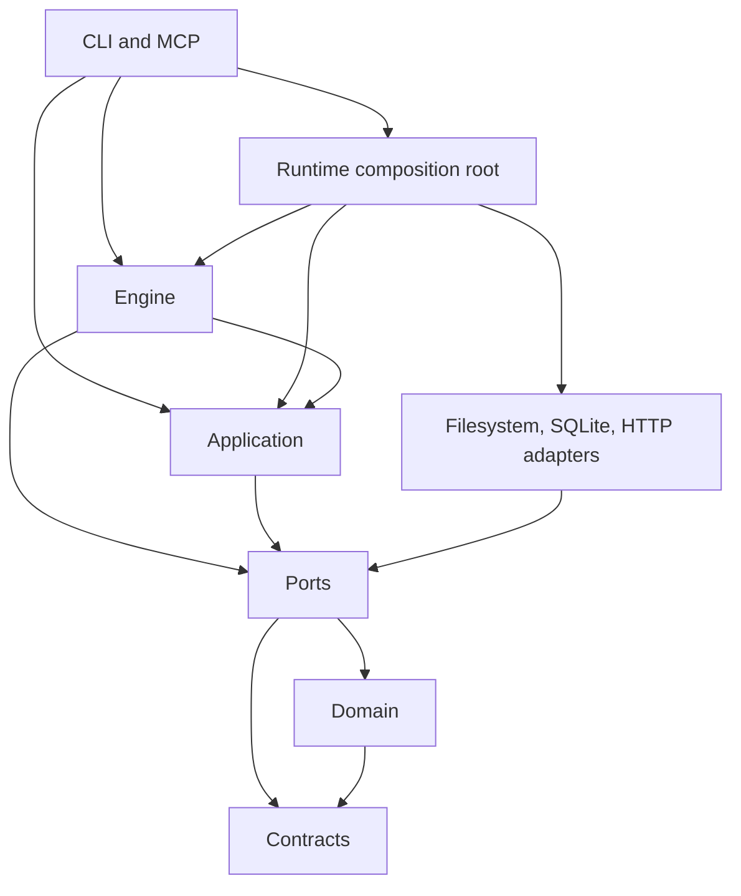

# Runtime Kotlin architectural investigation

The architecture is good enough to keep. Its inward module graph, ports, composition root, durable workflow model, and existing tests provide a sound base. I would approve that overall design direction. I would still require the resource-lifetime and recovery fixes below before describing the implementation as consistently reliable at its boundaries.

This investigation found four behavioral gaps and two small simplifications. None calls for a rewrite, another architecture layer, or a general workflow framework.

## Scope and evidence

Investigated on 2026-09-16 at commit `b4e72a95fc33f95a42367d21b883ce4c5aa1f295`. The working tree was clean before preparation. The user assigned `SKILL-248`.

The census covers all eleven declared runtime modules: 1,866 production Kotlin files and 170,041 lines. It excludes generated build output, test fixtures, and the undeclared empty `runtime-desktop` directory. Build scripts and convention ownership received structural inspection. [Module counts](evidence/module-census.json) and [source hashes](evidence/source-inventory.json) bind the investigation to this revision.

The method combines module and source scans, existing architecture guards, manual tracing of high-risk execution paths, and isolated failure injection. Manual tracing covered composition, workflow transitions, goal supervision, Git invocation, journal recovery, SQLite transactions and readiness, telemetry delivery, and CLI/MCP entry boundaries. This is a whole-module architectural investigation, not a claim of line-by-line review of every function or exhaustive correctness coverage.

Preparation ran 394 existing tests, including 248 architecture tests, with no failures or skips. Nine isolated probes reproduced defects against the compiled production owners. Their passing assertions describe broken baseline behavior. [Validation evidence](evidence/validation.md) names the exact commands, classes, and probe limitations. No production code changed.

## Architectural assessment

| Principle | Assessment | Evidence and consequence |
| --- | --- | --- |
| Clean Architecture and dependency inversion | Sound at the module boundary | Application and engine depend on ports and core models; infrastructure implements those ports. The composition root knows concrete adapters. Gradle dependency and source-import guards pass. |
| Hexagonal architecture | Real adapter boundaries | CLI/MCP use cases reach SQLite, filesystem, process, and HTTP adapters through explicit contracts. Failure injection can replace these boundaries without starting a real goal or contacting a service. Keep these ports even where only one production adapter exists. |
| Single responsibility | Mostly good; concentrated engine orchestration remains costly to navigate | The run-loop session owns terminal alternatives and private state. The large helper families still require careful tracing, but SKILL-247 narrowed several families. Their size alone does not justify another decomposition. F-001 concerns an actual missing lifetime owner. |
| Open/closed principle | Good extension boundary | Pack manifests and injected agent process strategies support real variation. Keep open pack vocabularies. A closed enum for every extension field would reduce the framework's intended extensibility. |
| Liskov substitution | Incomplete failure semantics | Cancellation and cleanup behavior differ between goal callback paths and the repaired application paths. F-001, F-002, and F-004 show why matching method signatures is insufficient. |
| Interface segregation | Good across modules; one redundant local hierarchy | Existing goal progress and ledger ports already describe the required operations. F-005 repeats those contracts inside the SQLite adapter without another consumer or substitute. |
| YAGNI and simplicity | Broad design justified; local reductions available | Persistence, compatibility, schema checks, and fencing solve current requirements. The progress forwarder and duplicate readiness reads add no useful behavior. Delete those before adding abstractions. |
| State ownership and durability | Strong model with a recovery hole | SQLite commits and filesystem projections have separate outcomes. Session state and outbox claims have clear owners. Journal recovery still trusts content and cleanup paths too far, F-003. |
| Test design | Useful behavioral foundation; exceptional paths remain uncovered | Existing architecture and selected recovery tests pass. The new failure probes expose gaps those suites did not reject. Passing source scanners does not establish lifecycle or recovery correctness. |

The domain knows workflow wire snapshots and contract helpers. It is a pragmatic workflow core, not a model stripped of all persistence representation. Removing those representations would duplicate conversion logic without a demonstrated benefit. The declared dependency graph remains inward.

The composition arrangement is also reasonable. `RuntimeComponent` composes application, engine, and infrastructure dependencies. CLI and MCP components add their transport-specific construction over that root. They do not justify replacing the DI system or merging the modules.

This diagram shows the principal production relationships. The [Gradle files](../../../runtime-kotlin/settings.gradle.kts) and architecture dependency tests own the complete edge set, including direct DTO dependencies and generated public API requirements.

## Coverage by area

| Area | Current structure and inspected paths | Conclusion |
| --- | --- | --- |
| `runtime-contracts` | Wire-key ownership, schema versions, JSON helpers, and failure taxonomy | Keep the current contract module. F-003 adds the missing governed journal contract and typed parse boundary. |
| `runtime-domain` | WorkflowEngine, decomposition codecs, closed workflow outcomes, and phase output models | No broad domain redesign justified. Existing decomposition and phase-output tests passed. |
| `runtime-ports` | Persistence sessions, goal roles, process hooks, worker supervisor, and progress emitters | Real boundary contracts are useful. Repair failure semantics at their owners; do not delete interfaces by implementation count. |
| `runtime-application` | Review composition, activity writer, shared persistence boundary, spec writer, and workflow projection path | SKILL-347 repaired several prior gaps. The review graph now receives executable collaborators; activity state belongs to a bounded writer instance. Do not repeat the previous audit's recommendations. |
| `runtime-engine` | GoalRunner, execution coordinator, ledger/progress emitters, run-loop context and session | F-001 and F-004 need repair. Keep the established run-loop ownership and phase model. |
| `runtime-infra-fs` | Agent process lifetime, Git process commands, decomposition journal, and schema/resource packaging | Agent process cleanup provides useful existing machinery. Git and journal behavior have separate defects, F-002 and F-003. |
| `runtime-infra-sqlite` | Session factory, transaction teardown, readiness identity, outbox settlement, goal progress bridges, and projections | Keep explicit transactions and claim fencing. F-005 and F-006 remove local redundancy. |
| `runtime-infra-http` | JDK HTTP transport and telemetry client | Connect and request deadlines already exist. Retain the transport port and current deadline behavior. No HTTP replacement justified. |
| `runtime-core` | RuntimeComponent and area bindings, module/import/API guards | Keep as the composition root. The selected architecture suite passed. |
| `runtime-cli` | Entry composition, workflow mapping, goal status failure and exit behavior | No new architectural defect established in the inspected paths. Selected boundary tests passed. |
| `runtime-mcp` | Entry composition, runtime services, lifecycle mapping, and stdio tests | No new transport-boundary redesign justified. Selected stdio tests passed. |
| Build logic | Declared modules, convention ownership, filesystem schema-resource copying, and source-set organization | Existing ownership is adequate for this work. Do not repeat SKILL-247's already-landed resource-copy consolidation. |

## Findings

### F-001. Goal execution cleanup begins after fallible resource acquisition

Major severity, high confidence. Reproduced in four engine probes.

[GoalRunnerExecutionCoordinator.kt](../../../runtime-kotlin/runtime-engine/src/main/kotlin/skillbill/engine/goalrunner/GoalRunnerExecutionCoordinator.kt), lines 63 through 99, acquires the execution lease, starts the heartbeat, and registers the shutdown hook before entering the `try/finally` around the body. A failure in heartbeat startup leaves the lease acquired. A failure registering the hook leaves both the lease and heartbeat without normal cleanup.

The `finally` calls unregister, heartbeat stop, and lease release sequentially. An unregister exception prevents the remaining two operations. A heartbeat stop exception prevents release. A cleanup exception also replaces a body exception instead of preserving the primary failure.

The four probes observed each of those states through substituted ports. The hook-registration case can leave a heartbeat renewing a lease for a run whose body never started. Exact duration depends on the supervisor and process lifetime; the probe establishes skipped cleanup, not a measured production outage.

Repair the local acquisition/cleanup structure. Establish lease ownership immediately after acquisition, release each acquired resource despite other cleanup failures, and preserve primary plus secondary failures. Keep the existing fenced lease release and existing takeover policy. This is a resource ownership fix, not a reason to add a lifecycle framework.

### F-002. Git process ownership and deadlines do not cover the full operation

Major severity, high confidence. Interruption leak reproduced; pipe/deadline gaps source-traced.

[GitProcessCommands.kt](../../../runtime-kotlin/runtime-infra-fs/src/main/kotlin/skillbill/infrastructure/fs/GitProcessCommands.kt), lines 72 through 112, starts a process without a surrounding cleanup owner. `waitFor` and output-thread `join` can throw on interruption. The real-process probe interrupted a waiting caller and observed both its Git process and shell alias child still alive. The probe then explicitly terminated its own processes.

The same function writes all stdin before it starts draining stdout, lines 78 through 101. Its timeout begins only at `waitFor`, line 104. Input backpressure is therefore outside that timeout. After normal child exit, line 110 joins the output thread without a deadline. A descendant retaining the output pipe can keep this join open. Those two scenarios were identified from source and still need dedicated regressions.

Give this invocation one owner for process, streams, and drain settlement. Start input and output handling without a circular pipe wait. Bound the whole operation and its cleanup. Preserve ordinary versus hooked-command timeout policy, binary/NUL handling, and Git result semantics. Do not make Git depend on the agent-run request model.

### F-003. Journal recovery does not establish content integrity or cleanup ownership

Major severity, high confidence. Both consequences reproduced in temporary directories.

[DecompositionManifestBundleJournalOperations.kt](../../../runtime-kotlin/runtime-infra-fs/src/main/kotlin/skillbill/infrastructure/fs/DecompositionManifestBundleJournalOperations.kt), lines 104 through 110, moves an existing staged file without checking its stored digest. The digest check only runs when the staged file is already absent. Changing staged bytes after journal creation caused recovery to publish the changed bytes and delete the marker as if recovery had completed normally.

The reader at lines 122 through 150 accepts any staging directory whose parent matches the marker's parent. It does not bind that directory to the marker's transaction name. Cleanup at lines 114 through 116 recursively deletes the accepted directory. A probe first applied a valid transaction, then changed the journal's staging path to a sibling `evidence` directory. Recovery accepted the already-applied target digest and deleted that unrelated directory.

These are local recovery-data integrity and deletion-ownership defects. The probes did not establish a remote attack path. A corrupt or edited local marker is sufficient for the observed behavior.

The journal also owns an ad hoc `0.1` wire envelope with inline keys and generic `require`/`error` failures. It has no canonical journal schema. Fix this at the persisted-contract boundary: validate the entire transaction, owned paths, and digests before applying more entries or cleaning up. Use the repository's schema/version/key/typed-error pattern. Retain corrupt evidence and an explicit recovery path. Keep valid interrupted roll-forward and SQLite projection semantics.

### F-004. Goal callback failures can become absence or fresh history

Major severity for cancellation propagation, minor severity for missing diagnostic attribution. High confidence. Two engine probes reproduced the stated results.

[GoalRunnerProgressEventEmitter.kt](../../../runtime-kotlin/runtime-engine/src/main/kotlin/skillbill/engine/goalrunner/GoalRunnerProgressEventEmitter.kt), line 21, wraps workflow-ID resolution in `runCatching(...).getOrNull()`. A resolver throwing `CancellationException` produced an ordinary return and no diagnostic. Its write path at line 36 also catches every throwable before treating failure as best effort.

[GoalRunnerLedgerRecorder.kt](../../../runtime-kotlin/runtime-engine/src/main/kotlin/skillbill/engine/goalrunner/GoalRunnerLedgerRecorder.kt), lines 22 through 28, converts a failed authoritative watermark read into a zero sequence and empty backward-edge counts. The probe made this read fail, then captured a subsequent production record with sequence zero and no warning. Historical sequence continuity is therefore not established. This evidence does not prove retry-budget bypass or durable-record deletion.

Ledger writes at line 81 and [GoalRunnerObservabilityEmitter.kt](../../../runtime-kotlin/runtime-engine/src/main/kotlin/skillbill/engine/goalrunner/GoalRunnerObservabilityEmitter.kt), line 36, use broad best-effort handling as well. Their diagnostic callback can throw and replace the failure being reported. Those adjacent write/diagnostic consequences are source-traced.

Reuse the existing cooperative-failure semantics from application code. Distinguish genuine absent identity from failed lookup. A failed required watermark read must not fabricate fresh history; fail visibly or recover the actual watermark before appending. Keep optional ordinary publication best effort with bounded independent diagnostics. Limit the change to the named goal paths.

### F-005. SQLite progress forwarding repeats existing ports

Minor severity, high confidence. Source and reference census; no behavior change required.

[WorkflowGoalRunnerOutcomeStoreBridges.kt](../../../runtime-kotlin/runtime-infra-sqlite/src/main/kotlin/skillbill/infrastructure/sqlite/goalrunner/WorkflowGoalRunnerOutcomeStoreBridges.kt), lines 385 through 443, declares three private progress interfaces and a bridge with nine direct forwarding methods. All references to the private hierarchy are in that one production file. No test substitute implements it.

The actual owner, [WorkflowGoalRunnerProgressRecording.kt](../../../runtime-kotlin/runtime-infra-sqlite/src/main/kotlin/skillbill/infrastructure/sqlite/goalrunner/WorkflowGoalRunnerProgressRecording.kt), already owns the read and write behavior and its transactions. The existing inward `GoalRunnerWorkflowProgressStore`, `GoalRunnerWorkflowLedgerWriteStore`, and `GoalRunnerAttemptLedgerStore` describe the operations.

Let the behavior owner implement those existing contracts and wire it directly. Remove the private duplicate hierarchy and forwarding bridge. Keep the other bridges that establish transaction boundaries or project committed state; their usefulness is not determined by having one implementation.

### F-006. Readiness rereads the database identity it just loaded

Minor severity, high confidence. Source-traced work amplification; no throughput benchmark claim.

[DatabaseWriteReadinessGate.kt](../../../runtime-kotlin/runtime-infra-sqlite/src/main/kotlin/skillbill/infrastructure/sqlite/core/DatabaseWriteReadinessGate.kt), lines 15 through 16 and 21 through 22, reads `current` and `currentAgain` but uses them only as null checks. It then calls `cached.matchesFile(path)`.

[DatabaseIdentity.kt](../../../runtime-kotlin/runtime-infra-sqlite/src/main/kotlin/skillbill/infrastructure/sqlite/core/DatabaseIdentity.kt), line 13, reads the identity again. Each identity read opens a read connection and queries `PRAGMA user_version`, lines 35 through 43. Thus a healthy cached decision performs two identity reads when one observation supplies the comparison values.

Compare the already-read identity values. Keep the independent observation under the initialization lock, file identity and version checks, database replacement behavior, and failed-initialization recovery. This removes repeated work without adding another cache or pool. Existing readiness tests passed; they do not measure this redundant fast-path read.

## Over-engineering cuts

Findings are limited to demonstrated redundancy. Line reductions are estimates before implementation.

- `WorkflowGoalRunnerOutcomeStoreBridges.kt:L385-L443: shrink:` Remove the three private progress interfaces and forwarding-only bridge. Implement the existing inward progress and ledger ports on the current behavior owner.
- `DatabaseWriteReadinessGate.kt:L15-L22: shrink:` Remove repeated identity I/O from cache comparison. Compare the already-read values; retain the locked recheck.

Estimated net: about 50 lines removable, 0 dependencies removable. The correctness repairs may add more lines than these cuts remove. Total line count is not an acceptance criterion.

## Changes I would reject

- Replacing the eleven modules with a new Clean Architecture template. The current graph already enforces useful separation.
- Deleting every single-implementation port. Database, filesystem, process, and transport contracts have real substitution and dependency-boundary value.
- Adding interfaces around each run-loop helper or moving all its dependencies into new context bags. The existing narrowed overloads and session owner should remain.
- Reopening the SKILL-347 review graph and activity-state work merely because its archived spec still describes earlier problems. Current code differs from that baseline.
- Splitting files to make a style metric look better. The largest production file has 1,057 lines under the current 1,200-line ceiling. That says little about cohesion; no additional split is justified by this census alone.
- Deleting schema validators, typed failures, lease generation checks, outbox ownership, compatibility migration, or transaction tests as over-engineering. Each protects a current contract.
- Adding a connection pool or new database cache to fix F-006. A value comparison removes the demonstrated redundant work.
- Rewriting every raw-map or string-based workflow model. Governed envelopes and open extension payloads have different needs.

The broad package-cycle baselines are empty. Remaining ambient-environment baselines contain 104 filesystem, 12 SQLite, and 4 HTTP entries. These are declared allowances, not proof that ambient dependencies are ideal. This investigation does not turn that inventory into a blanket cleanup project.

## Public engineering references

These references inform the judgment; they are not a shared company standard or certification. Reddit's internal expectations were not supplied.

- [Microsoft architectural principles](https://learn.microsoft.com/en-us/dotnet/architecture/modern-web-apps-azure/architectural-principles) connects separation of concerns, encapsulation, dependency inversion, and persistence ignorance to maintainable application boundaries. This runtime follows the dependency direction. Its main gaps are behavior at those boundaries, rather than missing layers.
- [Neil Williams, Reddit's Architecture, QCon SF 2017](https://qconsf.com/sf2018/sf2017/system/files/presentation-slides/qconsf-20171113-reddits-architecture.pdf), especially slides 25 through 35, discusses measuring contention and tail behavior before changing concurrency design. I applied that approach by reproducing failure states and limiting F-006 to demonstrable repeated I/O. This is a historical engineering account, not a claim about Reddit's current internal practices.
- [Meta's Project LightSpeed account, 2020](https://engineering.fb.com/2020/03/02/data-infrastructure/messenger/) describes reducing redundant implementations, using platform facilities, and simplifying Messenger's architecture. The relevant principle here is deleting unnecessary forwarding while preserving demonstrated behavior. Messenger's scale and code-reduction results do not predict outcomes for this runtime.

## Delivery

[The parent spec](spec.md) preserves the existing architecture and assigns the six findings to three independently shippable subtasks. Their scopes cover goal execution ownership, Git process lifetime, and durable recovery with local persistence simplification. Tests stay with each implementation change. The spec adds no work merely to satisfy an architecture label.
