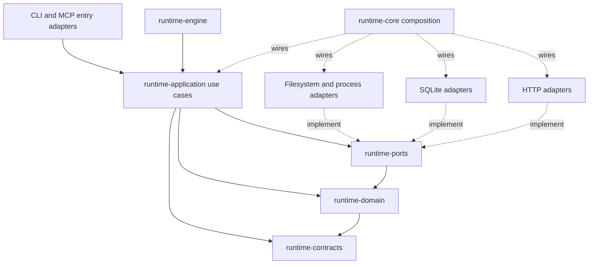

# Runtime application architecture investigation

## Judgment

`runtime-application` has a credible hexagonal foundation. Its production Gradle dependencies point inward, its use cases can run against substituted ports, and its application package-cycle baseline is empty. The interruption adapter placement remains an exception to the intended inner/outer ownership. I would keep that structure.

I would not sign off on its failure and ownership semantics yet. The review launcher can leak an acquired endpoint, several optional-result paths consume cancellation, activity publication retains process-global state, and issue-key continuation can discard a projection failure. Some previous decompositions also left dependency bags and forwarding code that add steps without adding behavior.

The corrective plan is [SKILL-347](spec.md). It preserves the current modules and useful boundaries. It does not introduce another architecture layer.

## Scope and evidence

- Refreshed on 2026-09-15 at commit `2ef12ad7e76b8282a1cfa2bb8cdfd795d3e79c7f`. This updates the existing SKILL-347 investigation and pending implementation bundle.
- Current census covers all 173 production Kotlin files under `../../../runtime-kotlin/runtime-application`, with 16,593 physical lines including imports and blank lines. [The refreshed inventory](evidence/source-inventory-refresh.csv) records each path, area, line count, and SHA-256. The [original inventory](evidence/source-inventory.csv) remains historical evidence.
- Compared all current production hashes with the original census. 170 files are unchanged. TelemetryService, TelemetrySyncRuntime, and TelemetryOutboxDrain account for the three changed files and received a fresh behavioral and dependency review. The new InterruptSignalPort implementation and runtime-core binding were traced across module boundaries.
- Rechecked the endpoint cleanup path, optional spec reads and persistence, activity state, issue-key continuation, projection settlement, update-check scratch fields, review dependency groups, and repository-wide callers for the deletion candidates. All seven findings remain open. F-002 now describes the implementation in runtime-ports and concrete application defaults rather than the former direct Thread calls.
- The original whole-module inspection covered dependencies, package ownership, exported declarations, mutable state, catch and fallback sites, caller references, and test placement across every area in the coverage table. This refresh retains that evidence for unchanged files. Model and mapper coverage is structural, not exhaustive path testing of every function.
- Read the runtime design principles, code principles, current architecture inventories, relevant tests and fixtures, existing decisions, and current SKILL-247 changes. Archived specs are context, not proof of implementation.
- Fresh checks passed 592 application tests and all 68 tests in the five selected architecture classes. All six retained defect probes reproduced their broken-baseline expectations again. The shared writer and runtime manifest validator passed a separate preparation check. See [validation evidence](evidence/validation.md).
- Initial unrelated state consisted of the untracked SKILL-347 bundle being updated and the archived SKILL-247 bundle. This refresh changed no repository production or test source and did not launch review agents or a goal.
- The bill-code-review shell accepts diffs and cannot express a whole-current-module investigation. These findings are a direct source investigation with isolated probes, not a driver verdict. The over-engineering skill applies at module-wide scope.

## What the external standards mean here

Hexagonal architecture requires the application to work through meaningful ports and to support alternate adapters, including tests. It does not require an interface around every class. This is the criterion used for keeping database, process, and evidence ports. [Cockburn's original article](https://alistair.cockburn.us/hexagonal-architecture).

Clean Architecture's dependency rule keeps outer mechanisms from determining inner application policy. The existing module graph largely achieves that. Keeping concrete thread operations in outer adapters and preserving error semantics matters more here than renaming services to interactors. [Martin's description](https://blog.cleancoder.com/uncle-bob/2012/08/13/the-clean-architecture.html).

Reddit's published comment-backend migration describes domain ownership, old/new behavioral comparison, data compatibility checks, write-race investigation, and production-informed local tests. My inference for this module is to require observable parity and failure tests before accepting a refactor. That account does not establish Reddit-wide rules for Kotlin layering or prove this module meets private internal standards. [Katie Shannon's engineering account](https://www.reddit.com/r/RedditEng/comments/1mbqto6/modernizing_reddits_comment_backend_infrastructure/).

Simplicity should reduce the work needed to understand and operate the system. The deletion proposals below remove unused paths and redundant dependency handling. They do not remove correctness checks or recovery guarantees. [Google SRE's simplicity chapter](https://sre.google/workbook/simplicity/).

## Dependency and responsibility map

`runtime-application/build.gradle.kts` declares three production project dependencies, all inward, plus Kotlin Inject and serialization. Infrastructure and engine dependencies in that file belong to tests and test fixtures. The module has no production dependency on runtime-core, CLI, MCP, runtime-engine, or a concrete infrastructure module.

The diagram shows dependency direction, not call-stack direction. An application use case calls an injected port whose implementation lives outside it. There is no reason to add another module to make that relationship more explicit.

## Principle assessment

| Principle | Assessment | Concrete evidence and limit |
| --- | --- | --- |
| Clean Architecture | Inward module dependencies; incomplete adapter ownership | The direct application thread scan now passes. A JVM implementation in runtime-ports and application defaults still place mechanism inside the boundary, F-002. |
| Hexagonal architecture | Useful and exercised | Database, file-store, launcher, and endpoint substitutes drive application behavior tests. An acquired port resource still needs an owner, F-001. |
| Single responsibility | Uneven within the review root | Existing review collaborators have distinct jobs. The root also reconstructs their dependency graph; update-check parsing stores call-local state on the service, F-005/F-006. |
| Open/closed principle | Generally appropriate | Review pack selection uses manifest routing and declared rubrics. The current Cursor staging branch has a real adapter need; its existence alone does not justify a plugin framework. |
| Liskov substitution | Failure semantics need work | Substituting a port that throws cancellation exposes silent fallback and exception translation, F-002. Normal-return substitution alone is insufficient. |
| Interface segregation | Real ports earn their place; dependency bags do not | Review uses two public groups with 21 fields and duplicate launcher/reader slots, F-006. Goal lifecycle telemetry has a current substitute and remains. |
| Dependency inversion | Strong module graph with a concrete-default exception | Application production code generally uses inward contracts and ports. Telemetry defaults select JvmInterruptSignalPort directly, outside runtime-core binding authority, F-002. |
| YAGNI | Specific deletions remain | F-007 names production-unused or forwarding-only paths with existing replacements. Single implementation counts alone are not deletion evidence. |
| Cohesion and design clarity | Prefer behavioral boundaries | Workflow projections already distinguish committed state from file output. Losing the parent identity at settlement is the defect, F-004. No wholesale workflow rewrite is needed. |
| Operational reliability | Incomplete despite green application tests | Probes expose endpoint leakage, cancelled work reported as normal results, and silently failed activity writes. |
| Test value | Strong existing boundary coverage with identifiable omissions | 592 application tests and 68 selected architecture tests passed in the refresh. The missing cases are exceptional exits, independent lifetime ownership, and projection settlement identity. |

File size is not itself a finding. The largest production file has 514 lines; the current enforcement owner sets the production ceiling to 1,200. An older decision log mentioning 500 does not override that inventory.

## Findings

Priorities describe impact. High requires correction before relying on the affected failure path. Medium identifies bounded ownership or maintenance risk. Low identifies a safe deletion candidate. None is a claim of a demonstrated production incident.

### F-001. High. Endpoint lifetime starts after a fallible staging operation

Evidence: `review/ParallelCodeReviewRunnerLaneLaunch.kt:98-111`.

`bindGovernedEvidence` returns an owned endpoint. `launchedBoundParent` then calls the Cursor staging port for delegated execution. Only after staging succeeds does it enter `args.bound.endpoint.use`. If staging throws, the outer lane capture maps the failure but nobody closes the handle.

An isolated probe uses the actual runner, a counted endpoint, and a throwing staging port. It observes one bind, zero closes, no parent launch, and a failed lane. The probe uses reflection only to replace the existing harness's hard-coded staging dependency. It does not bypass the production `run` path.

Fix: enter the cleanup scope immediately upon using the bound endpoint, before staging. Preserve the primary staging, launch, or cancellation failure if closing also fails. No new resource-management framework is needed.

Permanent regression: a staging failure closes the endpoint exactly once and launches no worker. Add the dual-failure assertion to retain the primary exception.

### F-002. High. Optional-result boundaries lose cancellation and disagree with the module boundary

Evidence:

- `review/SpecIntentProjectionResolver.kt:122-132` catches all Exception and returns null.
- `review/SpecIntentProjectionExtractor.kt:77-85` converts a cancelled read into an unavailable spec.
- `runtimepersistence/RuntimeOwnedPersistenceBoundary.kt:42-48` preserves CancellationException but sends InterruptedException through ordinary fallback or failure translation. Its required error also drops the throwable cause; `recordFailure` ignores diagnostic failure.
- `review/ParallelCodeReviewRunnerLaneLaunch.kt:249-252` preserves cancellation but not interruption during evidence binding.
- `review/ParallelCodeReviewRunnerFailureAdmission.kt:159-173` can convert interrupted execution into an ordinary failed lane.
- `idestatus/AgentActivityStampWriter.kt:18,76` ignores callback and persistence failures.
- `updatecheck/UpdateCheckService.kt:86-88` converts interruption to an UNKNOWN network result.

Four probes reproduce cancellation loss at the spec read, activity write, optional persistence, and update-check boundaries. The remaining sites are source-traced instances of the same contract problem. `TelemetrySettingsProvider.loadOrNull` is an adjacent port default that also catches all failures; changing an application caller alone cannot repair a failure already swallowed there.

The current SKILL-247 code has removed the direct application Thread calls and duplicate JVM cancellation alias. All selected architecture checks now pass. The remaining boundary problem is concrete and source-traced:

- `runtime-ports/src/main/kotlin/skillbill/ports/concurrency/InterruptSignalPort.kt:7-10` implements restoration with `Thread.currentThread().interrupt()` inside the inward port module.
- `telemetry/sync/TelemetrySyncRuntime.kt:24,62` and `telemetry/sync/TelemetryOutboxDrain.kt:34` default to that concrete implementation. Application entry points can therefore select the JVM adapter without the composition root.
- `runtime-core/src/main/kotlin/skillbill/di/RuntimeComponent.kt:106` also supplies the implementation, so the defaults create a second selection path.
- `runtime-core/src/test/kotlin/skillbill/architecture/RuntimeLayerBoundaryArchitectureTest.kt:105-134` scans direct application thread references. Its subsequent port checks concern file I/O, JDBC, HTTP, and entry frameworks; they do not reject this thread implementation in ports.

This is an ownership and enforcement gap, not a new cancellation failure in telemetry. Keep InterruptSignalPort as the existing contract, move its JVM implementation into the existing outer adapter module, and supply it through runtime-core. Remove the concrete application defaults. Preserve the implemented cancellation, restoration, deadline, and claim-settlement behavior. Extend the existing guard to cover this inward implementation leak without adding a new scanner framework or expanding baselines.

Fix: propagate cancellation and interruption before ordinary failure mapping, retain the original cause, and make ordinary optional degradation observable through the existing diagnostic mechanism. Avoid a general-purpose exception policy abstraction. Cancellation must not consume retry or delivery attempts.

Permanent regressions: cancelled spec reads never produce an absent-spec result; interrupted optional persistence never returns its fallback; interrupted update checks do not report ordinary network failure; interrupted review binding never reports an ordinary Unbound result. Preserve existing telemetry settlement and cancellation tests.

### F-003. Medium. Activity publication has process-global state and advances it before a write succeeds

Evidence: `idestatus/AgentActivityStampWriter.kt:47-79,100-104`.

The companion HashMap is keyed only by workflow ID and never removes entries. Every instance shares it, including instances backed by different databases. The writer stores the new stamp and last-persist timestamp before the database call. The call then runs inside an ignored `runCatching`.

A probe makes the first writer's database throw. A second writer at the same instant with the same workflow ID receives no write attempt because the static cache already records the stamp. This establishes cross-instance suppression after failure; it does not measure a production memory leak rate. The unbounded retention follows directly from the map lifetime and absence of removal.

Fix: give throttle state an explicit writer or runtime owner and bound its lifetime. Track observed activity separately from successful persistence where throttling requires both. Preserve timestamp ordering and parent publication. Do not hold a process-global monitor while waiting on the database or roll an older failure over a newer successful acknowledgement.

Permanent regressions: independent database owners do not suppress each other, failed writes can retry, concurrent completion order preserves newer acknowledgements, and ordinary write failure emits a bounded diagnostic. Keep the existing debounce purpose.

### F-004. High. Projection settlement loses the authoritative parent workflow identity

Evidence: `workflow/WorkflowService.kt:306-347`, `workflow/ContinuationStepResult.kt:15-18`, and `decomposition/DecompositionManifestProjectionWorkflow.kt:16-24,43-50`.

`continueWorkflow` accepts a string called workflowId. When that string is an issue key, the method resolves or bootstraps the parent in `continueDecomposedParentByIssueKey`. The result carries projection JSON but no projection-owner ID. After commit, the service passes the original input string to projection reconciliation. Failure recording looks up a workflow row by that issue key and silently returns when it cannot find one.

Consequently a failed file projection can leave the database transition committed without a failure marker on its parent. Successful retry clearing has the same identity dependency. A child continuation that produces parent projection data also needs the actual parent owner rather than an assumed input identity.

This finding is source-traced. The six probes did not reproduce the complete issue-key continuation path. Existing projection tests prove Absent, Written, and Failed writer outcomes, but do not settle this ownership handoff.

Fix: carry the parent workflow ID with the pending projection, resolved inside the authoritative transaction. Settle that identity after commit. Missing expected owners must be visible. Repair the filesystem projection from durable state without replaying the mutation.

Permanent regression: invoke `continueWorkflow` by issue key, inject a projection write failure, verify the committed parent and child records, and require the failure marker on the parent. Retry must fix the projection and clear that marker without creating a child or incrementing an attempt.

### F-005. Medium. Update-check parsing uses shared mutable scratch state

Evidence: `updatecheck/UpdateCheckService.kt:70,113-156`.

`lastUnknown`, `releasePayloadMalformed`, and `releaseEntryMalformed` belong to the service instance. One request resets flags that another request may still use. Two overlapping checks can exchange an error reason or cause a valid candidate list to inherit another response's malformed-entry flag.

No concurrent production call or failing concurrency test was demonstrated in this investigation. This is a source-level unsafe interleaving and a local design defect, not a measured operational failure. The public service does not express a single-call lifetime, and there is no benefit to storing this scratch state on it.

Fix: return parsing outcomes and failure reasons as local values. Keep the existing outward result and release-selection rules. A private result type is sufficient only if it simplifies those returns; no parser framework is warranted.

Permanent regression: controlled overlapping checks with distinct valid and malformed responses produce independent results. Cancellation is handled by F-002.

### F-006. Medium. Review dependency bags hide duplicate wiring

Evidence: `review/model/ParallelCodeReviewRunnerBoundaries.kt:28-53` and `review/ParallelCodeReviewRunner.kt:18-78`.

The two groups contain 16 planning fields and five launch fields. Launcher and evidence-reader bindings appear in both groups. The runner unwraps most of them and constructs planning, lane-launch, result-assembly, persistence, and verification collaborators. Parent launch uses the launch group's launcher; later stages use the planning group's launcher. The groups permit inconsistent values even though current DI supplies the same implementation.

Three copied fields, reviewEvidenceBrokerFactory, governedEvidenceEndpointBinder, and reviewLaunchAgentStaging, are never read after assignment. The launch constructor reads the group again. Constructor arity looks small while the object still owns the larger graph.

The SKILL-238 decision correctly removed interfaces around these groups. It did not establish that the remaining groups are the final design. Reintroducing those interfaces would add the deleted complexity back.

Fix: use existing executable collaborators as the runner's dependencies and wire them through runtime-core's established composition mechanism. Remove duplicate binding authority and unused fields. Narrow internal visibility based on actual callers. Do not turn every helper into an interface or move the same fields into another context object.

Validation: existing review entry-point, tier, evidence, resumed-stage, verification, adjudication, and accounting tests preserve observable behavior. Record the before and after dependency census; do not enforce an arbitrary constructor count.

### F-007. Low. Production-unused and forwarding-only paths remain

Repository-wide reference searches found these bounded candidates. Tests and architecture strings account for references to the retired entry points; they do not establish production use.

- `TelemetryConfigMutationRuntime.kt`, 32 lines, has no production caller. The active `TelemetryLevelMutationService` already calls `TelemetryConfigMutations` directly.
- `TelemetryConfigRuntime.kt`, 37 lines, forwards to ports or existing domain parsers. Its production callers use only the three parser wrappers in `TelemetrySettingsFromStore`.
- `ReviewCommitSequenceResolver.kt`, 28 lines, has no production caller. Its test-only class and parseCommitUnits forwarder wrap `SharedReviewEvidenceAssembler`, `SharedReviewEvidenceProjection`, and the shared parser used by the real planning path.
- `FeatureSpecPreparationRuntime.prepareForFeatureImplement` and `prepareForGoal` have only test callers. `prepareForFeatureSpec` is used by `FeatureTaskRuntimeDecompositionPlanner` and remains an active injected seam.

Fix: delete the unused entry points, call the existing domain functions, and move useful parsing/assembly assertions to the actual production entry. Update source-shape architecture assertions to check the surviving boundary rather than require a deleted file. Do not discard behavioral coverage as part of deletion.

A conservative estimate is about 80 net production lines removed, excluding any savings from review composition. That is an estimate after replacement imports and local call-site changes, not a measured diff.

## Over-engineering register

Paths below are relative to `../../../runtime-kotlin/runtime-application/src/main/kotlin/skillbill/application`. Ordered by straightforward gross deletion size; review composition savings are unestimated.

- `telemetry/config/TelemetryConfigRuntime.kt:L13-37: shrink: forwarding facade. Call the existing domain parsers from TelemetrySettingsFromStore; delete the unused forwarding methods.`
- `telemetry/config/TelemetryConfigMutationRuntime.kt:L8-32: delete: unused mutation forwarding object. Existing TelemetryConfigMutations remains the live owner.`
- `review/ReviewCommitSequenceResolver.kt:L15-28: delete: production-unused resolver and parser forwarder. Retarget useful tests to SharedReviewEvidenceAssembler and SharedReviewEvidenceProjection.`
- `featurespec/FeatureSpecPreparationRuntime.kt:L13-16: delete: two test-only aliases. Keep prepareForFeatureSpec and its current injection seam.`
- `review/ParallelCodeReviewRunner.kt:L34-37: shrink: three unused copied fields. Read dependencies only where the live collaborator is composed.`
- `review/model/ParallelCodeReviewRunnerBoundaries.kt:L28-53: yagni: duplicate dependency groups and runner-owned graph reconstruction. Inject the existing executable collaborators through the existing composition root.`

Estimated net: -80 lines possible, -0 deps possible. No deletion target applies to recovery or contract machinery.

## What should stay

- The inward Gradle module graph and product-area packages. No new service, use-case, repository, or adapter modules are needed.
- Existing ports across module boundaries, including ones with a single production implementation. The probes demonstrate why useful substitutes matter.
- `InstallAgentService`. The 2026-09-14 decision records request adaptation, response unwrapping, and defaults used by CLI callers. Removing it would distribute that adaptation across callers.
- `AgentRunGoalRunnerSubtaskLauncher`. It crosses the current launcher boundary and preserves agent-resolution policy in AgentRunService. It is not equivalent to a dead same-module alias.
- `GoalLifecycleTelemetryEmitter`, its real lifecycle consumer, and its current substitute. Interface count is not a YAGNI test.
- `RuntimeOwnedPersistenceBoundary` as a distinction between required and optional facts. Fix its interruption and diagnostic semantics; do not replace every call with raw database access.
- Manifest validators, typed failures, authorization and evidence budgets, immutable review identities, claim fencing, projection outcomes, and compatibility repair. Their complexity protects observable contracts.
- The transactional learning source validation and workflow mutation paths. Moving repository callbacks outside a transaction can change their snapshot.
- The per-operation telemetry outbox session adapter. It avoids retaining a transaction around network delivery; its forwarding has a resource-lifetime purpose.
- Diagnostic retention, digest checks, and permission enforcement. These are explicit storage and privacy requirements.

## Area coverage

The inventory table records structural coverage across every top-level application area. Detailed failure findings are above; absence of a listed finding is not proof that all execution paths were exercised.

| Area | Files | Lines | Inspection focus |
| --- | ---: | ---: | --- |
| agentoutput | 1 | 38 | Bounded output excerpt helpers and current callers. |
| agentrun | 3 | 84 | Agent normalization, configured override, launch request adaptation and consumer boundary. |
| config | 1 | 79 | Machine versus repository configuration, typed malformed config and precedence. |
| continuation | 2 | 19 | Compatibility typealias and owned result model. |
| decomposition | 15 | 1374 | Manifest preparation, validated load/repair, projection outcomes and failure recording; F-004. |
| diagnostics | 2 | 246 | Rejected output identity, content digest, permissions, retention, typed storage failures. |
| featurespec | 2 | 332 | Shared writer, bundle preparation, live planner caller and dead aliases; F-007. |
| idestatus | 3 | 513 | Activity writer and status models; F-003 and cancellation in F-002. |
| install | 5 | 278 | Planning facts and policy, staging, apply, baseline reconciliation, saved selection. Existing ports retained. |
| learning | 4 | 197 | Repository session ownership and learning-source validation in the write transaction. |
| review | 56 | 6875 | Runner, planning, evidence binding, stage settlement, dependency groups, live callers; F-001, F-002, F-006, F-007. |
| reviewevidence | 12 | 769 | Shared evidence resolution, codec, parser and assembly ownership, test-only review adapter. No domain relocation proposed. |
| runtime | 1 | 7 | Existing injection scope annotation, retained at its documented dependency owner. |
| runtimepersistence | 1 | 70 | Required/optional persistence behavior, diagnostic fallback and cause retention; F-002. |
| scaffold | 2 | 195 | Install request adaptation and removal refusal/apply policy. Read the explicit InstallAgentService retention decision. |
| specsource | 1 | 37 | Manifest-first source selection and legacy absence behavior. |
| system | 2 | 107 | Version/doctor and provenance path calculation, injected database/settings. |
| telemetry | 28 | 2070 | Outbox session lifetime, claim delivery, cancellation, configuration and lifecycle payloads; F-002 and F-007. Refreshed all three changed telemetry files and the adjacent interrupt binding. |
| updatecheck | 3 | 268 | Service, semver model, transport seam, response mapping; F-002 and F-005. |
| work | 2 | 96 | Read session, bounded list request, batched snapshot validation and result mapping. |
| workflow | 27 | 2939 | Open, update, continuation, identity and projection handoffs, transaction scope; F-004. |

## Remaining limits

The investigation did not run a full repository quality gate, live review agents, load tests, or an end-to-end production shutdown. It did not prove the concurrent update-check interleaving or the complete projection identity failure dynamically. Those source-traced cases have explicit regression requirements in the spec.

There is no measured throughput or latency claim. The case for the changes is concrete resource ownership, failure propagation, state identity, and removal of unused indirection. After implementation, rerun the relevant boundary tests and architecture guards and assess the actual diff before calling the findings resolved.
