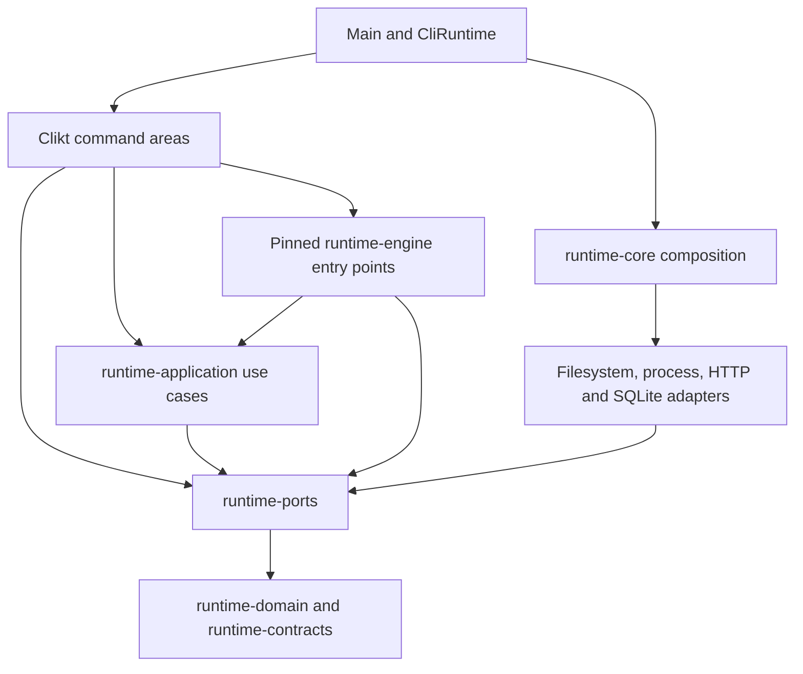

# runtime-cli architectural investigation

## Assessment

Keep the module graph. `runtime-cli` has a sound starting structure, useful injected boundaries, and well-separated command areas. Its main weakness is inconsistent ownership at the edges. Some commands only translate arguments and results; others own destructive use cases, assemble application services from database repositories, or bypass invocation inputs and output completion. Those exceptions cause observable failures.

The module does not need another framework or a stricter interpretation of architecture diagrams. It needs fewer competing input and output paths, explicit ownership of maintenance operations, and deletion of abstractions whose original consumers are gone.

Recommendation: implement SKILL-348 before treating the module as conforming to the repository's ownership and failure principles. Seven findings are actionable. Five are Major because they affect execution, mutation, or evidence correctness. Two are Minor because they affect command input behavior and maintenance cost. None justifies a full rewrite.

## Scope and evidence

This is a whole-module architecture investigation, not a branch-diff review. The `bill-code-review` driver accepts diff scopes and its default inline mode is a reduced-depth review. It was not used as evidence of a whole-module audit. Investigation and source tracing ran in this session, with no review subagents.

The census covers 114 production Kotlin files, 11,370 lines, 18 package areas, the module build file, existing CLI tests, and relevant application, port, infrastructure, and composition boundaries. [source-inventory.csv](evidence/source-inventory.csv) records file hashes and line counts. Reading focused on ownership, command registration, public input/output contracts, mutation order, error handling, state lifetime, and tests at those boundaries. Presentation-only mappings received structural inspection rather than an exhaustive check of every rendered field.

The initial source commit was `b76359a5a604fb81188bc83a9b5759293e438dc1` on 2026-09-16. Unrelated SKILL-248 work changed infrastructure and contract files during the investigation. This preparation did not edit those files. Recheck the recorded CLI hashes before implementation.

Evidence consists of 295 existing CLI tests, 51 architecture checks across seven classes, and six temporary defect probes. All passed. The defect probes deliberately assert the observed faulty behavior, so their passing result proves reproduction, not correctness. See [validation.md](evidence/validation.md).

No production installer ran and no real user installation was uninstalled. The update probe supplied a fake failing `curl`, uninstall used a substituted port, and process tests terminated only their own child. No native Windows or macOS session, performance benchmark, external agent run, or full repository quality gate was part of this investigation.

## Current architecture

The diagram shows permitted module relationships. It does not prove correct responsibility placement inside a command. In particular, directly using a port is not automatically wrong, but a destructive multi-step policy remains an application responsibility even if every mutation goes through a port.

| Area | Files / lines | Assessment |
| --- | --- | --- |
| core | 6 / 275 | Thin composition delegation; root-flag probing and fallback help require care when changing completion. |
| kernel and model | 18 / 678 | Invocation state is per run. Process execution in model and split stdin/output ownership violate that intent. |
| system | 4 / 770 | Main policy-placement problem. Update and uninstall own operation sequencing and failure decisions. |
| featuretask | 12 / 1,522 | Runner delegation is appropriate. Diagnostic DB composition and divergent root preparation are exceptions. |
| goal | 17 / 2,360 | Delegates durable state and control to engine APIs. Watch polling and text formatting legitimately belong here. |
| install | 14 / 1,475 | Real shared request parsing supports plan/apply/reconcile. Defaults bypass invocation root in several paths. |
| scaffold | 19 / 1,760 | Typed scaffold requests and gateway calls are useful. Input file/stdin handling and authoring root defaults need alignment. |
| workflow | 6 / 617 | Thin service calls, but permissive update decoding and obsolete family inheritance remain. |
| codereview | 4 / 354 | Delegates review policy to the application runner. One inherited implementation and an unused competing parser remain. |
| config and agentaddon | 4 / 310 | Small adapters with explicit contract failures. Some root defaults still use the process directory. |
| learning, review and telemetry | 5 / 710 | Mostly argument translation and presentation. Keep real command contracts and application services. Remove unused input injection when touched. |
| skillremove and repovalidation | 4 / 341 | Use existing use cases/ports. Align root defaults; preserve dry-run and shipped-surface protection. |
| work | 1 / 198 | Status service delegation and terminal-safe rendering are appropriate entry-adapter responsibilities. |

`runtime-cli/build.gradle.kts` declares its inward dependencies directly and has no production dependency on concrete infrastructure modules. Infrastructure modules appear in test dependencies. `CliComponent` composes with `RuntimeComponent`; it is an entry-command graph, not a competing infrastructure graph. Keep it.

The seven architecture test classes exercised command-area isolation, the adapter dependency allowlist, module composition, out-of-root construction, package cycles, ambient environment access, and injected defaults. These guards are useful but incomplete by design. A scan that bans `Path.of("")` does not catch `.default(".")` followed by `toAbsolutePath()`. A constructor scan over DI-bound types does not catch every manually constructed application service. Passing those guards therefore does not settle F-003 or F-004.

## Principles assessment

| Principle | Evidence and judgment |
| --- | --- |
| Clean Architecture | Most commands translate transport input into use-case requests. Update/uninstall policy and diagnostic transaction composition belong inward. Repair those exceptions, keep the module layout. |
| Hexagonal architecture | Existing filesystem, install, telemetry, review, and workflow ports are useful boundaries. One production implementation is sufficient when a port crosses modules or admits a useful test substitute. Move the installer process implementation behind such a boundary. |
| Single responsibility | Keep Clikt parsing and presentation together where they change together. Separate maintenance sequencing and transaction ownership because they must remain correct independently of terminal interaction. File size alone is not a finding. |
| Open/closed | Pack discovery and injected runtime strategies already provide real extension points. Preserve them. Do not invent a command plugin registry to replace explicit registration. |
| Liskov substitution | Substituted operation boundaries expose failure-semantic gaps. Cancellation must remain cancellation, and an interrupted operation cannot report settlement while leaving its child alive. Current tests of ordinary failures do not cover those obligations. |
| Interface segregation | Ports used by commands mostly describe relevant capabilities. `FeatureTaskRuntimeRunDependencies` and command grouping objects are broad construction conveniences, not proof of narrow consumer contracts. Reuse prepared facts and remove unused inputs before adding interfaces. |
| Dependency inversion | Module dependencies are mostly correct. `ProcessExternalCommandRunner` in the CLI model package and diagnostic service construction from a unit of work are the clearest local exceptions. |
| YAGNI | Six workflow family base classes have only one current command consumer. The review base class has one subclass. An unused parser remains beside the active parser. Delete these before generalizing anything else. |
| Testability | The suite uses injected contexts and real SQLite boundaries well. Process-level stdin and output behavior is under-covered. The raw-output helper test bypasses both CliRuntime and Main. |
| Simplicity | Prefer one request preparation and one completed output representation. Keep ordinary presentation maps at the CLI edge; a blanket DTO or identifier-wrapper migration is not justified. |

## Risk register

Paths below are relative to `../../../runtime-kotlin/runtime-cli/src/main/kotlin/skillbill/cli` unless stated otherwise. Line anchors refer to the recorded source snapshot.

- [F-001] Major | High | system/SystemCliCommands.kt:105 and model/ExternalCommandRunner.kt:23 | Update can report a failed download as completed and can leave an installer process alive after interruption.
- [F-002] Major | High | system/UninstallCommand.kt:115 and system/UninstallCommandApply.kt:76 | Uninstall owns destructive application policy in the CLI and treats cancellation as a recoverable mutation failure.
- [F-003] Major | High | featuretask/RejectedOutputCommands.kt:89 and core/CliRuntime.kt:45 | Diagnostic commands bypass result completion; raw output can acquire root help, and the CLI owns application service/transaction assembly.
- [F-004] Major | High | config/ConfigCommand.kt:50 and featuretask/FeatureTaskRuntimeCliCommands.kt:242 | Commands select competing repository roots, including different roots for feature-task discovery, workflow identity, and execution.
- [F-005] Major | High | workflow/WorkflowCliCommands.kt:319 | Malformed step-update JSON becomes an empty list while the workflow update proceeds.
- [F-006] Minor | High | core/Main.kt:6 | Stdin selection depends on an unparsed literal dash and reconstructs input lines, breaking implicit/attached stdin forms and exact text preservation.
- [F-007] Minor | High | workflow/WorkflowCliCommands.kt:83 and codereview/ReviewPrelaunchExpansionParsing.kt:6 | Unused command generalizations and a dead competing parser add navigation and maintenance cost.

### F-001. Update needs an application owner and a bounded process adapter

`UpdateCommand.updatePlan` builds `curl -fsSL URL | bash -s -- ...`. `runInstaller` starts `bash -c`, and the reported status comes from that pipeline's exit code. Without pipeline failure propagation, a failed curl followed by bash reading empty input produces zero. The fake-curl probe returned exit 22, but the actual update command returned `completed` and exit zero.

Adding pipefail would correct that status but still execute bytes while the download is incomplete. Download the complete installer before execution and refuse to execute on failed download. Preserve existing argument quoting or use an argument vector wherever possible.

The process implementation reads stdout until EOF and then waits without a deadline. It never closes child stdin or establishes teardown in a finally block. When the probe child closed output and continued running, interrupting the runner returned an error result while the child remained alive. Its output capture is also unbounded. The cleanup defect is demonstrated; an actual out-of-memory event was not induced.

Move update policy to the existing application update area and process I/O to infrastructure. Wire through runtime-core. Establish a bounded lifetime, explicit stdin behavior, bounded capture, and cleanup that preserves the original error and cancellation signal. Keep a real process port with test substitutes. Do not move the same code to an application service that still starts ProcessBuilder directly.

### F-002. Uninstall cancellation must stop the operation

`UninstallCommand` discovers install roots, defines managed removals, sequences agent/native/MCP cleanup, removes launchers and desktop files, and finally deletes the state root. It also asks for confirmation and formats output. The low-level mutation ports are already useful; the missing boundary is the application owner for the operation.

The helper functions use `runCatching`, which catches cancellation along with ordinary exceptions. They record a degradation and return to the remaining cleanup sequence. The probe injected one CancellationException into MCP unregistration and observed both target calls, plus two ordinary failure records. Source tracing shows the enclosing apply path proceeds to launcher, desktop, and state-root removal after those helpers return.

Move plan/apply policy to one cohesive application operation. Keep prompts and rendering in CLI. Abort on cancellation/interruption, preserve the signal, and do not perform later destructive work. Keep existing best-effort continuation for supported ordinary failures, including MCP partial-success accounting. No cross-filesystem transaction is required.

### F-003. Diagnostic output bypasses the invocation contract

`RejectedOutputInspectCliCommand.run` writes directly to System.out. Cleanup uses Clikt echo. Neither settles CliRunState. After the command returns, CliRuntime interprets its null result as a request for root help, and Main prints that text.

The cleanup probe confirms the returned result contains `Usage:`. Raw inspection follows the same unsettled path, so its successful bytes can be followed by help. The existing `RejectedOutputCommandsTest` checks only a helper writing to ByteArrayOutputStream. It cannot detect this integration failure. Also, Main appends a newline to nonempty text without a trailing newline, so routing raw bytes through the existing String field would still violate the raw-output contract.

The same command opens a database session and constructs RejectedOutputDiagnosticService from UnitOfWork repositories. That keeps application composition and retention work in a transport adapter. Introduce an injected application entry point for the current operation and a minimal output representation that distinguishes completed text/raw output from missing completion. Preserve exact bytes. Terminal emission belongs to Main, with a substitute sink for embedded use.

Inspection currently performs retention cleanup. Do not relabel it as a read-only transaction or remove those writes just to simplify the diagram. Preserve expiry, digest, permissions, metadata validation, and selector refusal behavior. Return settled data before writing to a terminal stream.

### F-004. Repository selection has multiple authorities

Config resolution defaults `--repo-root` to dot and converts it to Path. Install request assembly resolves dot against the JVM process directory. Scaffold authoring, code review, removal, and validation have similar defaults. They can ignore CliRuntimeContext.repositoryRoot even though that context is a supported embedding seam.

A temporary repository with `spec_type: linear` produced `local` when passed only through CliRuntimeContext, then `linear` when also passed through the flag. Existing CliRunInputsRuntimeTest covers discovery in feature-task and the scaffold wizard, so it does not prove uniform behavior across commands.

Feature-task has a more consequential internal split. `prepareRuntimeRun` and spec discovery use `deps.inputs.repositoryRoot`, but workflow opening receives `repoRoot ?: "."`. Resume verification also receives that independent default. A run can discover a spec in one repository and construct identity or continuation work from another. That path is source-traced, not exercised by a full agent launch.

Resolve the effective invocation root once and pass it through discovery, identity, resume, and launch. Preserve the intended interpretation of explicit relative flags and document the embedded base. Resume currently prepares its configuration once for validation, discards it, then prepares again for execution. Reuse the prepared immutable facts. Validate operator decisions and combinations before opening a workflow or acquiring worker ownership. Do not add a general context or dependency bag to hide the mismatch.

### F-005. Workflow input must fail before mutation

`parseStepUpdates` calls `JsonCodec.parseArrayOrEmpty`. That utility returns an empty list for malformed JSON and for non-array JSON. `WorkflowUpdateCommand` then calls the service with the requested workflow status and the now-empty updates.

The probe opened a temporary verify workflow and passed `--step-updates broken-json` with a status update. The command accepted it with status `ok` and exit zero. This is a failure-boundary issue, not an invitation to redesign workflow persistence.

Use strict decoding at this CLI input seam. Reject malformed JSON, wrong root shape, and non-object entries before the service call. Preserve omission versus explicit empty-array semantics. Test unchanged durable state after rejection. Do not change every permissive JsonCodec caller without checking its own contract.

### F-006. Stdin should belong to the parsed input request

Main reads stdin only when the raw argument list contains an element equal to a dash. `import-review` defaults its input argument to a dash, so omitting that argument never triggers the read. Its filesystem input adapter then requires the missing stdinText. Accepted attached option values such as `--body-file=-` have no standalone dash token either.

Conversely, a dash supplied as some unrelated value triggers a read before Clikt knows what the command means. Even help can wait for EOF. `readlnOrNull` plus joinToString removes original line endings and the final newline, changing supplied authoring text.

Replace the raw scan with demand-driven reading at the parsed input boundary. Keep interactive line reading where the wizard needs it, and whole-text reading where a payload or authored body needs it. Test the actual process entry point, including help without available input. No generalized streaming framework is needed.

### F-007. Remove generalizations whose consumers disappeared

Repository-wide reference searches found six Workflow* base classes with one VerifyWorkflow* subclass each: open, update, list, latest, resume, and continue. Their family argument is always VERIFY. Each also receives CliRunInputs without using it. Merge each into its real command. `WorkflowGetCommand` serves both show and get, so retain useful sharing and both aliases.

`CodeReviewDriverCommand` has one subclass, CodeReviewCommand, which only contributes the positional target. Put them together. The separate `parseReviewPrelaunchExpansion` helper has no caller; the live command uses its private parseExpansion implementation. Delete the dead helper and preserve the live behavior unless a separate contract test demonstrates a required change.

Update also copies ExternalCommandResult into an identical private InstallerRunResult. Remove that copy during F-001. Command grouping classes and broad constructor arguments remain review signals, but no blanket flattening of all DI groups is required. Shared InstallRequestCommand and FeatureTaskRuntimePhaseAgentCommand have multiple active consumers and are not deletion targets merely because they use inheritance.

## Complexity-only cuts

This list is the repo-scope over-engineering result. It excludes the correctness and lifetime repairs above.

- `workflow/WorkflowCliCommands.kt:L83-L126`: yagni: six one-consumer workflow family wrappers across this file. Concrete verify commands with the same options replace them; keep get/show sharing.
- `codereview/CodeReviewCommand.kt:L10-L29`: yagni: the subclass that only adds one positional argument. One concrete CodeReviewCommand replaces the pair.
- `codereview/ReviewPrelaunchExpansionParsing.kt:L1-L30`: delete: unreferenced competing parser. Nothing replaces it; retain the active parser.
- `system/SystemCliCommands.kt:L127-L157`: shrink: copying the external command result into an identical private result. Return the owned execution result directly.
- `workflow/WorkflowCliCommands.kt:L93`: delete: unused CliRunInputs in the workflow command family and touched similarly unused command parameters. Nothing replaces those dependencies.

Net: approximately 100 lines possible, 0 dependencies possible. This is a conservative deletion estimate, not a required net-size target. New lifetime and boundary tests may make the overall change larger.

## Changes rejected

- No module-per-command split. Current package isolation already blocks sibling command imports.
- No CQRS framework, command bus, reflective registry, or service locator. Explicit command registration is understandable and testable.
- No replacement of Clikt or Kotlin-Inject. The faults arise from bypassing their surrounding contracts, not evidence that the libraries are unsuitable.
- No deletion of every single-implementation port. ExternalCommandRunner has useful test substitutes; the problem is production placement and incomplete lifecycle semantics.
- No generic base command for every result or option combination. Share only the proven input/output primitives.
- No blanket conversion of CLI maps into domain models. Boundary presentation maps are permitted. Preserve typed results until presentation where practical.
- No file split based on line count and no large flattening of every command grouping. Cohesion and current consumers decide.
- No second telemetry-drain owner in this spec. The existing daemon drain has an explicit five-second abandonment diagnostic and tests. Deeper telemetry shutdown policy belongs with its existing application and transport owners.
- No broader retry, journal, or rollback system for maintenance commands. Cancellation and operation outcomes can be fixed within current boundaries.

## Public engineering references and how they apply

There is no single public standard shared by Reddit, Microsoft, and Meta that certifies this module. These sources support the review criteria; the findings above come from this repository and its behavior.

Reddit's engineering account of its mobile feed rewrite ties architecture work to explicit success metrics and non-goals. It describes modular ownership and tooling that reduces DI boilerplate. The applicable lesson here is to name the failed boundary and the cost being removed before restructuring code. That supports focused repair and deletion rather than a new command framework. [Rewriting Home Feed on Android & iOS, Vikram Aravamudhan](https://www.reddit.com/r/RedditEng/comments/1btowiw/rewriting_home_feed_on_android_ios/).

Microsoft's architecture guidance describes inward dependencies and keeping application logic independent of infrastructure implementations. That supports placing maintenance policy in application code and concrete process/database access behind the existing boundary. It does not require importing web-specific layers or patterns into a JVM CLI. [Common web application architectures](https://learn.microsoft.com/en-us/dotnet/architecture/modern-web-apps-azure/common-web-application-architectures).

Meta's BellJar article argues for exercising recovery and failure dependencies through actual tests. The applicable lesson is to test interrupted child ownership and real command output, because a dependency diagram and passing formatter test miss both faults found here. Building a BellJar-like framework for this CLI would not be proportionate. [BellJar: A new framework for testing system recoverability at scale](https://engineering.fb.com/2022/05/05/developer-tools/belljar/).

These are reasoned applications of public examples. They are not claims about the companies' current private review rules.
