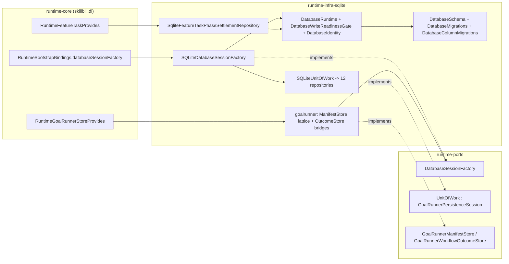

# SKILL-356 - runtime-infra-sqlite architectural investigation

Prepared 2026-09-17 against `main` at `d8a103a1ebf88662fc7f7db7b6efce4bfd24a905`. Scope is the `runtime-infra-sqlite` Gradle module (`skillbill.infrastructure.sqlite`), the ports it implements, the composition-root bindings that construct it, the guards and baselines that scan it, and the tests in every module that reach into it. Line numbers cite the tree at that commit.

## Assessment

The module points the right way and does the hard things well. It depends only on `runtime-ports`, `runtime-domain`, and `runtime-contracts` (`RuntimeModuleCatalog` L60-63), imports nothing from application, engine, CLI, or DI, and only three composition-root files import it. One `SQLiteDatabaseSessionFactory` implements the `DatabaseSessionFactory` port, one `SQLiteUnitOfWork` hands out twelve repository ports over a single connection, WAL and `busy_timeout` are set on every connection by recorded decision (2026-06-26), a write-readiness gate keeps routine writes from rerunning schema work (SKILL-239 subtask 2), and schema history is a name-keyed ledger with 37 migrations and 51 compatibility tests over legacy database fixtures. Its package-cycle, inject-default, and clock baselines are empty.

The problems are the ones a large adapter accumulates when every feature adds its own shape: 176 production files and 18,523 lines for one SQLite adapter, with the goal-runner store built as a lattice of same-module interfaces, forwarding implementations, a dependency bag, and bridge builders; three schema-evolution mechanisms running at every establishment with a readiness key (`PRAGMA user_version`) that is read but never written; five transaction implementations; an ambient re-resolution path the composition root already performs; a public surface of 65 declarations of which the composition root consumes four; tests in other modules and in wrong packages coupling to internals, including one test that fails on `main` because it reads a fixture from a spec bundle that never existed in git; wire tokens spelled five and six times; `java.util.logging` as the degradation channel with zero uses of the `RuntimeDiagnostics` port; two clock disciplines, one of which the guard cannot see; and three declared Gradle dependencies with zero imports.

Nothing here calls for a new module, port family, ORM, query builder, migration library, connection pool, or coroutine layer. The work is deletion, consolidation, and making the existing mechanisms honest.

## Structure

Package sizes: `core` 29 files / 3,668 lines, `goalrunner` 34 / 3,694, `workflow` 39 / 3,779, `review` 27 / 2,896, `telemetry` 32 / 2,601, root 8 / 1,230, `goal` 4 / 277, `decomposition` 1 / 187, `worklist` 1 / 147, `featuretask/artifact` 1 / 44. Tests: 51 files, 14,471 lines, 368 tests.

## Principles assessment

| Principle | Verdict | Evidence |
| --- | --- | --- |
| Dependency direction (hexagonal) | Holds | Build edges are `runtime-domain`, `runtime-ports`, `runtime-contracts` only; zero imports from `skillbill.application`, `skillbill.di`, `skillbill.cli`, `skillbill.mcp`; production consumers are three `skillbill.di` files. |
| Ports over adapters | Holds at the boundary, leaks inside | Application reaches SQLite through `DatabaseSessionFactory` and `UnitOfWork`. Inside the module `SqliteFeatureTaskPhaseSettlementRepository` bypasses the session port (F-007) and `WorkflowGoalRunnerPurgePersistence` downcasts `unitOfWork as SQLiteUnitOfWork` for a raw connection. |
| Single responsibility | Mixed | `DatabaseRuntime` owns path resolution, connection opening, pragma setup, schema establishment, readiness, and test hooks. `DbConstants` mixes an environment key, row-format versions, wire tokens, and a default path. |
| Interface segregation | Over-applied | Seven same-module interfaces in `WorkflowGoalRunnerManifestOps.kt` re-segregate the five port role interfaces that already exist in `GoalRunnerPorts.kt` (F-001). |
| YAGNI / no speculative abstraction | Violated in goalrunner | Six `*OpsImpl` classes forward one-to-one; a `Context` bag; a `BridgeBuilder` producing a data class of bridges; a nullable validator whose only caller passes non-null. ARCHITECTURE.md L180-192 names these shapes. |
| Simplicity and change cost | Violated | Five transaction helpers (F-003), three schema-evolution passes (F-002), 27 `PARAM_*` constants in four files (F-012), 15 files under 20 lines. |
| State and resource ownership | Mostly holds | One connection per operation, closed by `use`. Process-global mutable state lives in `DatabaseRuntime` (`private var writeReadinessGate`) with four test-only hooks in production (`resetWriteReadinessForTests`, `writeReadinessEstablishmentCount`, `identityReadCountForTests`, `resetIdentityReadCountForTests`). |
| Typed failures | Asymmetric | Read path wraps `SQLException` into `DatabaseAccessError`; write path wraps only `BEGIN`/`COMMIT` (F-003). 28 `error(...)`, 30 `require(...)`, one raw `IllegalStateException` and one `IllegalArgumentException` thrown in production. |
| Observability policy | Violated | Five `java.util.logging` loggers, zero `RuntimeDiagnostics` uses, eleven silent fallbacks (F-009). |
| Contract enforcement (wire keys) | Partial | 167 `*PayloadKeys` references beside 127 inline `"key" to` literals and 58 bracket reads; finding-outcome tokens spelled in six places; two seams registered in the guard (F-008). |
| Ambient environment and clock | Dead path and guard gap | All 12 ambient-environment baseline rows sit in unreachable defaults (F-004); `OffsetDateTime.now` and `JvmSystemClock.instant()` are not guard markers (F-010). |
| Tests and evidence | Strong on compatibility, weak on placement | 51 migration tests with legacy fixtures are the right kind. 23 test files in four other modules construct `DatabaseRuntime` directly; 11 test files sit in `skillbill.review` and `skillbill.application.learning` packages; one test is red on `main` (F-005). |

## Findings

Severity: Major means the finding changes how the module is understood or maintained, or hides a defect; unlabelled findings are hygiene with measurable payoff.

### F-001 Major - The goal-runner manifest and outcome stores are a forwarding lattice

`runtime-ports` already segregates `GoalRunnerManifestStore` into five role interfaces (`GoalRunnerPorts.kt` L149-155: `Queries` 10 methods, `ExecutionCommands` 9, `ControlWrites` 9, `StateWrites` 8, `PurgeCommands` 2). The module re-segregates the same 38 methods into seven internal interfaces with a different grouping (`goalrunner/WorkflowGoalRunnerManifestOps.kt` L19-143: `Lookup`, `PauseOps`, `ExecutionLease`, `ControlCommands`, `PersistenceCommands`, `PurgeCommands`, `ReviewCommands`), implements each in its own class, and composes them back:

- `WorkflowGoalRunnerManifestPauseOpsImpl.kt` (28 lines), `WorkflowGoalRunnerManifestLeaseOpsImpl.kt` (31), and `WorkflowGoalRunnerManifestControlOpsImpl.kt` (32) forward every method to `ctx.controls`, a `GoalRunnerControlCoordinator`, without adding a line of behaviour. `ControlOpsImpl` additionally delegates `PauseOps by WorkflowGoalRunnerManifestPauseOpsImpl(ctx)` (L11), so the same coordinator is reached through two forwarders.
- `WorkflowGoalRunnerManifestStore.kt` L36-63 declares a private `ManifestStoreDelegate` with seven `by` clauses and a `buildParts` factory; the public class is `GoalRunnerManifestStore by buildParts(WorkflowGoalRunnerManifestStoreContext(...))` (L23-34).
- `WorkflowGoalRunnerManifestStoreContext.kt` (83 lines) is a dependency bag holding eight collaborators plus five constructed helpers (`engine`, `parentProjection`, `manifestLoader`, `projectionPersistence`, `childWorkflowPersistence`, `scopedReplanPersistence`, `controls`).
- `WorkflowGoalRunnerOutcomeStoreBridges.kt` (399 lines) repeats the pattern for the outcome store: a public `@Inject` `WorkflowGoalRunnerOutcomeStoreBridgeBuilder` (L52-111) returns a data class of three bridges; `WorkflowGoalRunnerOutcomeWorkflowBridge` (L379-399) composes five bridges with six `by` clauses; two more internal interfaces (`WorkflowGoalRunnerReconcileOutcomeStore` L303, `WorkflowGoalRunnerBlockOutcomeStore` L340) exist for that delegation; `WorkflowGoalRunnerOutcomeStore.kt` L12-31 wraps it with a private constructor and a second `@Inject` constructor.
- `build()` takes `decompositionManifestValidator: DecompositionManifestValidator?` (L63) although its only caller passes a non-null value (`WorkflowGoalRunnerOutcomeStore.kt` L26); the null branch at L146-147 silently skips writing the manifest projection, a fallback that can never fire and emits no record if it did.

ARCHITECTURE.md L180-183: "Repeating its dependencies in a same-module interface and implementation usually cannot [justify an abstraction]. Delete dead helpers and pure forwarding layers before adding another abstraction." L189-192: "Do not split by count, merge unrelated responsibilities, or hide dependencies in bags to satisfy a threshold." The 23 `WorkflowGoalRunner*` files total 3,694 lines; the store, ops, impl, context, bridge, and builder files are about 1,050 of those, roughly 250 of them pure forwarding.

Proposed: `WorkflowGoalRunnerManifestStore` implements `GoalRunnerManifestStore` directly, holding the coordinator, loader, projection persistence, child persistence, and scoped-replan persistence as fields, with `writeProjectionFile` as a private method; delete the seven internal interfaces, six `*OpsImpl` classes, `ManifestStoreDelegate`, `buildParts`, and the context bag. `WorkflowGoalRunnerOutcomeStore` implements `GoalRunnerWorkflowOutcomeStore` with the terminal, review, reconcile, block, and progress collaborators as private fields constructed in its `@Inject` constructor; delete the bridge builder, the bridges data class, the workflow bridge, and the two internal interfaces; the validator parameter is non-null. `RuntimeGoalRunnerStoreProvides` keeps binding the two adapters to their ports. Behaviour, SQL, and every existing goal-runner test assertion are unchanged.

### F-002 Major - Three schema-evolution passes and an inert readiness key

`DatabaseRuntime.establishSchemaReadiness` (`core/DatabaseRuntime.kt` L57-73) runs, in order: `DatabaseSchema.createBaseSchema` (35 `CREATE TABLE IF NOT EXISTS` statements plus indexes of the current shape, `DatabaseSchemaStatementsEarly/Late.kt`, `DatabaseReviewLedgerSchema.kt`), `DatabaseMigrations.apply` (the name-keyed ledger, 37 `DatabaseMigration` entries across `DatabaseMigrationEntriesEarly/Late.kt`), then `DatabaseColumnMigrations.apply`, `healDiagnosticEvidenceKeys`, and `healWorkListMetadata` unconditionally. `DatabaseColumnMigrations.apply` is also ledger migration version 1 (`DatabaseMigrationEntriesEarly.kt` L7-11), so it runs both as a recorded migration and as an unconditional pass. The unconditional pass performs 151 `ensureColumn` probes (each a `pragma_table_info` query) and 4 `backfillBlankColumn` updates every time readiness is established.

ARCHITECTURE.md L149-150: "Once readiness succeeds, routine writes must not rerun historical backfills or full-table repair scans." Boundary rule 14 (L743-746): "SQLite schema changes are append-only versioned migrations recorded in `schema_migrations`, keyed by migration name." `../../../runtime-kotlin/agent/history.md` 2026-04-25 recorded the gap when the ledger landed: "Known limitation: base schema still creates the current full schema first; versioned migrations record compatibility state." Five months later the limitation is unchanged and a third pass has grown beside it.

The readiness key is half dead. ARCHITECTURE.md L159-161 and the SKILL-239 table row describe the gate as "keyed by `PRAGMA user_version` plus stable file identity". `PRAGMA user_version` is read at `core/DatabaseIdentity.kt` L44 and written nowhere in the module (`grep user_version` returns that one line), so `DatabaseIdentity.userVersion` is always 0 and the cache decision (`DatabaseIdentity.matches` L13-16) rests on absolute path, file key, and non-shrinking size. `readUserVersion` (L40-50) swallows any failure to `null`, which makes `DatabaseIdentity.read` return `null`, which makes `DatabaseWriteReadinessGate.ensureReady` (L16-22) miss its cache and re-run the full establishment on every write with no record.

Two file pairs are split by count against L191-192: `DatabaseMigrationEntriesEarly.kt` (194 lines) and `Late.kt` (331), `DatabaseSchemaStatementsEarly.kt` (266) and `Late.kt` (258); merged, each pair is under 530 lines.

Proposed: after the ledger records the last pending migration, `DatabaseMigrations.apply` sets `PRAGMA user_version` to the highest applied version so the identity key means what the documentation says; the unconditional column-ensure and heal calls at `DatabaseRuntime.kt` L66-68 are deleted and their work is registered once as the final ledger migration under a new immutable name (the helpers are idempotent, so existing databases converge on first open and are never probed again); `readUserVersion` raises `DatabaseAccessError(READ)` instead of returning `null`; the base schema stays as the fresh-database fast path with the existing convention that a new column lands in both the DDL and a migration; the Early/Late pairs merge by area. `DatabaseMigrationsTest` and `DatabaseMigrationsTestSupport` (51 tests over legacy fixtures) are the safety net and stay.

### F-003 Major - Five transaction implementations and asymmetric typed failures

- `SQLiteDatabaseSessionFactory.inTransaction` (L82-98) and `inReadTransaction` (L100-116) are the same 17 lines with `BEGIN IMMEDIATE`/`OPEN` swapped for `BEGIN DEFERRED`/`READ`.
- `core/ConnectionTransactions.inImmediateTransaction` (L11-27) is the same shape again, without typed statement failures, used by migrations.
- `review/TriageRuntime.inTransaction` (L88-101) toggles `autoCommit` and calls `commit`/`rollback`; it serves `TriageRuntime.recordFeedback`, which has no production caller (the session repository calls `recordFeedbackWithoutTransaction`, `SQLiteRepositories.kt` L170) and six test callers.
- `review/ReviewRuntime.saveImportedReview` (L17-28) toggles `autoCommit` a fifth way; production calls `persistImportedReview` inside the session transaction (`SQLiteRepositories.kt` L141-142) and only tests call this entry point.

The read path converts every `SQLException` from the block into `DatabaseAccessError` (`throwReadFailure` L124-129). The write path converts only `BEGIN` and `COMMIT` (`typedStatement` L118-122); a repository statement failing inside `transaction {}` escapes as a raw `SQLException`, which is why two adapters wrap locally (`SqliteRejectedOutputDiagnosticRepository.persistence` L206-212, `GoalPlanningPreparationSqlNormalize.translateSqlFailure` L15-25).

Proposed: one `Connection.inTransaction(dbPath, mode, operation, block)` in `core` used by the factory's read and write paths and by the migration runner; delete the two `autoCommit` variants and the two test-only entry points that exist for them (tests call the session repository instead); the write path wraps block `SQLException` into `DatabaseAccessError(WRITE)` the way the read path does, leaving adapters that already raise a more specific typed error untouched.

### F-004 Major - Ambient re-resolution the composition root already performs

`RuntimeBootstrapBindings.runtimeContext` (L17-30) replaces the `UnspecifiedUserHome` and `UnspecifiedEnvironment` sentinels before `databaseSessionFactory(context)` (L61-62) constructs the adapter, and `RuntimeComponent` L93 provides `EnvironmentContext` from that resolved context. `SQLiteDatabaseSessionFactory.withProcessDefaults` (L68-80) performs the same two replacements again and is unreachable in production. `DatabaseRuntime.resolveDbPath`, `openDb`, `openReadDb`, `openReadDbIfPresent` (L34-47, L87-94, L105-112) and `DatabasePaths.resolveDbPath` (L7-11) default `environment` to `System.getenv()` and `userHome` to `user.home`; production callers use only the `*At` variants (census over `runtime-kotlin/*/src/main`). Every one of the 12 rows in `runtime-infra-sqlite-ambient-environment-baseline.txt` sits in this dead code.

The sentinel path is reachable from tests and is a hazard there: `AgentActivityStampStoreTest` L16 constructs `SQLiteDatabaseSessionFactory(EnvironmentContext(userHome = tempDir))` with the environment left unspecified, so a developer with `SKILL_BILL_REVIEW_DB` exported runs that test against their real database.

Proposed: delete `withProcessDefaults` and every ambient default; `SQLiteDatabaseSessionFactory` raises a typed configuration error when handed a sentinel; the baseline file empties under `RECORD_ARCHITECTURE_BASELINES=1`.

### F-005 Major - Test coupling to internals, a package squat, and a red test on `main`

- `review/ReviewFinishedLearningsPayloadTest.kt` L56-58 asserts bytes against `.feature-specs/SKILL-351-runtime-domain-boundaries-and-simplicity/baselines/learnings-session.json`. That path has never existed in git (`git log --all --diff-filter=A` finds no such file) and the SKILL-351 bundle directory is gone, so `:runtime-infra-sqlite:test` fails on `main` (368 tests, 1 failure, 3 skipped).
- `src/test/kotlin/skillbill/application/learning/LearningSessionWireTestSupport.kt` (53 lines) declares package `skillbill.application.learning`, which belongs to `runtime-application`, and copies `learningEntrySessionJson`, `learningAppliedSessionWire`, `learningEntry`, and `learningEntryDto` from `runtime-application` `LearningSessionWire.kt` because this module has no test edge to application. Both files landed in `58b235671`.
- Ten test files (2,648 lines) under `src/test/kotlin/skillbill/review/` test the infrastructure objects `ReviewRuntime`, `TriageRuntime`, `ReviewStatsRuntime`, and `ReviewFinishedPayloadBuildRequest` from the domain's package name.
- 23 test files in `runtime-cli` (11), `runtime-core` (6), `runtime-mcp` (5), and `runtime-engine` (1) call `DatabaseRuntime.ensureDatabase`, `openReadDb`, `openDb`, or `resolveDbPath` directly; `DatabaseRuntime.ensureDatabase` is called 261 times across all tests. This is why `DatabaseRuntime`, `OpenDatabase`, `DbConstants`, and `DatabasePaths` are public. Eight sibling modules use `java-test-fixtures`; this module does not.

Proposed: delete the byte-identical test and the copied support file (the session JSON is `runtime-application`'s to test, and `TriageAndLearningsRuntimeTest` keeps the persistence assertions); move the ten review tests to `skillbill.infrastructure.sqlite.review`; add a `testFixtures` source set exposing one fixture that opens a temporary database through the real establishment path and one that returns a bound `SQLiteDatabaseSessionFactory`; consumers switch to `testFixtures(project(":runtime-infra-sqlite"))`.

### F-006 - A public surface of 65 declarations for four consumers

The composition root constructs four types: `SQLiteDatabaseSessionFactory`, `SqliteFeatureTaskPhaseSettlementRepository`, `WorkflowGoalRunnerManifestStore`, and `WorkflowGoalRunnerOutcomeStore` (plus its `BridgeBuilder`, which F-001 removes). The module has 65 public top-level declarations; 35 public types have zero production references outside the module, among them `DatabaseRuntime`, `DatabasePaths`, `DbConstants`, `OpenDatabase`, `SQLiteUnitOfWork`, `SQLiteReviewRepository`, `SQLiteLearningStore`, `TelemetryOutboxStore`, `LifecycleTelemetryStore`, `ReviewRuntime`, `ReviewStatsRuntime`, `TriageRuntime`, `WorkflowStateStore`, `GoalPlanningPreparationStore`, `TerminalSaveOutcome`, `ReviewFinishedPayloadBuildRequest`. Boundary rules 8 and 9 (ARCHITECTURE.md L695-696) say application code reaches SQLite through the repository and unit-of-work ports and never through adapter internals; the visibility should say the same.

Proposed: after F-005 removes the test reasons, everything except the DI entry points becomes `internal`; `DatabaseRuntime` loses its four test hooks in favour of the fixture.

### F-007 - One repository bypasses the session port

`SqliteFeatureTaskPhaseSettlementRepository` receives `DatabaseSessionFactory` but calls `DatabaseRuntime.openDbAt(databaseSessionFactory.resolveDbPath())` in each of its three methods (L15, L39, L66): a fresh connection and a readiness check per call, no transaction, no typed failure, and result columns read by position through constants named `PARAM_ONE..PARAM_SIX` (L53-58, L82-87). It is the only adapter that opens connections itself. `WorkflowGoalRunnerPurgePersistence.kt` L56 reaches the same place from the other side by downcasting `(unitOfWork as SQLiteUnitOfWork).rawConnection`.

Proposed: a `featureTaskPhaseSettlements` repository on `SQLiteUnitOfWork` and the `UnitOfWork` port, with the DI-bound adapter reduced to `database.transaction { it.featureTaskPhaseSettlements.upsert(...) }` and `database.read { ... }`; purge persistence takes the repositories it needs from the unit of work instead of the raw connection.

### F-008 - Wire vocabulary spelled in place

Finding-outcome tokens `finding_accepted`, `fix_applied`, `finding_edited`, `fix_rejected`, `false_positive` are declared in `core/DbConstants.findingOutcomeTypes` (L12-19), `review/ReviewFindingStats.kt` (three collections, L11-20), `review/ReviewHealthAggregation.kt` L7, two SQL `CHECK` constraints (`DatabaseSchemaStatementsEarly.kt` L121, `telemetry/FeedbackEventMigration.kt` L109), and in the domain (`LearningsRuntime.rejectedFindingOutcomeTypes`, `TriageDecisionParser` L69-71). No enum owns them. AGENTS.md: "Enum wire tokens use `wireValue` on the owning enum; do not restate them in local `setOf`/`mapOf` collections."

Telemetry payload builders in `telemetry/` and `review/` spell 127 `"key" to` literals and 58 `["key"]` reads (`session_id` ×5, `attempt_count` ×5, `started_at`, `finished_at`, `duration_seconds`, `subtasks_complete`, `commit_sha`, `event_name`, ...) beside 167 references to `SharedPayloadKeys`, `LifecycleTelemetryPayloadKeys`, and `ReviewFindingPayloadKeys`. `../../../orchestration/contracts/telemetry-event-schema.yaml` governs those events. `WireVocabularyGovernedSeamInventory` registers only `infrastructure/sqlite/goalrunner/WorkflowGoalRunnerManifest` and `GoalContinuationArtifactCodec` (L32-33, L64).

Proposed: a `FindingOutcomeType` enum with `wireValue` in `runtime-domain` `skillbill.review.model`, referenced from the two `CHECK` constraints and every collection; telemetry keys declared once in the owning `*PayloadKeys`; `infrastructure/sqlite/telemetry/` and `infrastructure/sqlite/review/` registered as governed seams with the guard proven against a synthetic violation.

### F-009 - Logging as the degradation channel and eleven silent fallbacks

`../../../docs/observability-policy.md` L3: "Every fallback, degradation, and swallowed failure emits a record"; L49: "Each record names the seam, the value actually used, the value that was expected." The module has five `java.util.logging.Logger` instances (`core/ConnectionTransactions.kt` L8, `review/ReviewStatsArithmetic.kt` L12, `telemetry/LifecycleTelemetryPayloads.kt` L17, `telemetry/GoalTelemetryPayloads.kt` L15, `telemetry/GoalTelemetrySave.kt` L340) and zero references to the `RuntimeDiagnostics` port that `runtime-infra-fs` uses in four adapters. Fallbacks with no record of any kind:

- `review/ReviewStatsArithmetic.durationSeconds` L53-58: unparsable timestamps become `0` seconds.
- `telemetry/LifecycleTelemetryDurations.parseDurationSeconds` L16 and `telemetry/GoalTelemetryPayloads.durationBetweenSeconds` L117, `parseTelemetryTimestamp` L123: same.
- `worklist/SQLiteWorkListRepository.kt` L134: `runCatching { Instant.parse(value) }`.
- `goalrunner/WorkflowGoalRunnerCrashReconcile.kt` L15: an unparsable lease expiry is treated as not expired.
- `review/ReviewStageStateCodec.kt` L40: an unknown severity name becomes `null`.
- `core/DatabaseIdentity.readUserVersion` L40-50: see F-002.
- `goalrunner/GoalRepositoryIdentity.kt` L6 and `goalrunner/WorkflowGoalRunnerChildWorkflowPersistence.kt` L136-137: real-path resolution falls back to the lexical path.
- `core/DatabaseRuntime.closeQuietly` L198-200.

The right shape already exists in the module: `LifecycleTelemetryPayloads.ParsedNameList.availability()` (L138-142) turns a malformed durable value into a closed `TelemetryMeasurementAvailability` state, and `GoalIssueFinishedSaveOutcome.suppressionReason` (`GoalTelemetrySave.kt` L16) returns the suppression to the caller.

Proposed: `RuntimeDiagnostics` injected into `SQLiteDatabaseSessionFactory` (threaded into `SQLiteUnitOfWork`) and the two goal-runner stores; every site above either raises a typed error for a corrupt durable row, returns a closed availability state, or emits one diagnostics record naming seam, expected, and used value; the five loggers are deleted.

### F-010 - Two clock disciplines, one invisible to the guard

Eight goal-runner classes take `java.time.Clock` by constructor. Beside them, `JvmSystemClock.instant()` is called directly at `core/StaleSessionReconciler.kt` L71, `review/ReviewStageState.kt` L125 and L215, and `workflow/WorkflowStateWrites.kt` L217, and `OffsetDateTime.now(ZoneOffset.UTC)` at `goalrunner/WorkflowGoalRunnerBlockWrites.kt` L152 and L180 and `workflow/WorkflowIdGeneration.kt` L11 (which also draws from an unseeded `kotlin.random.Random`). The ambient-clock guard (`ArchitectureScanGuardSupport.kt` L21-24) matches only `Instant.now`, `LocalDateTime.now`, `LocalDate.now`, and `Clock.systemUTC`, so the module's empty `runtime-infra-sqlite-ambient-clock-baseline.txt` is not evidence of compliance. Decision 2026-09-03 placed `JvmSystemClock` in `runtime-contracts` so the composition root can bind `Clock`; it did not license adapters to call it.

Proposed: `OffsetDateTime.now`, `ZonedDateTime.now`, and `JvmSystemClock.instant` join the guard markers; the seven sites read the injected `Clock` (the session factory receives a `Clock` and passes it to the unit of work for the review and workflow writers); the baseline stays empty by fixing, not recording.

### F-011 - Lazy legacy migrations on the hot path

`migrateLegacyGoalRunnerControls` (`goalrunner/LegacyGoalRunnerControlMigration.kt` L13) is invoked from eleven call sites on ordinary reads and writes (`WorkflowGoalRunnerManifestReviewOpsImpl` L22, L45, L70; `WorkflowGoalRunnerChildWorkflowPersistence` L172; `WorkflowGoalRunnerManifestProjectionPersistence` L47; `GoalRunnerControlCoordinator` L97; `GoalRunnerControlCoordinatorPause` L35, L48; `GoalRunnerControlCoordinatorLeaseRenew` L36, L119; `WorkflowGoalRunnerManifestLoader` L90), and three read paths fall back to decoding legacy artifacts from `feature_task_workflows` rows (`ReviewOpsImpl` L15-16, L38-39, L59-60). `persistLegacyTelemetryRewrites` runs on every `reconcileStaleSessions` (`SQLiteRepositories.kt` L112). The module owns a ledger built for exactly this, and the observability policy (L17-19) says a legacy-record migration emits a `record_kind: migration` record; these do neither.

Proposed: one named ledger migration walks every goal parent row once and moves legacy review-policy and out-of-band-acceptance artifacts into `goal_runner_controls`; one named migration performs the legacy telemetry restamp; the eleven call sites, the three read fallbacks, `LegacyGoalRunnerControlMigration.kt`, `restampUnsyncedLegacyTelemetry`, and `persistLegacyReviewFinishedRow` are deleted. Decision 2026-09-03 L234 records that `runtime-application` holds a diverged near-duplicate of `LegacyGoalRunnerControlMigration`; that copy is outside this module and stays.

### F-012 - Constants and tiny files that carry no meaning

`PARAM_ONE..PARAM_FOUR` are declared four times (`SqlParamIndexes.kt`, `SQLiteLearningStore.kt` L15-18, `SqliteFeatureTaskPhaseSettlementRepository.kt` L82-87, and `review/ReviewSqlConstants.kt` L3-12 continuing to `PARAM_FOURTEEN`): 27 `const val PARAM_*` declarations whose only purpose is detekt `MagicNumber`, and which in `SqliteFeatureTaskPhaseSettlementRepository` L53-58 index result columns, not parameters. `WorkflowStateWrites.kt` L222 already has a positional binder (`nextIndex`). `DbConstants` (22 lines) mixes the `SKILL_BILL_REVIEW_DB` key, three row-format version literals (`FEATURE_IMPLEMENT_WORKFLOW_CONTRACT_VERSION` "0.1", `FEATURE_VERIFY_WORKFLOW_CONTRACT_VERSION` "0.3", `FEATURE_TASK_RUNTIME_WORKFLOW_CONTRACT_VERSION` "0.3") with no schema file behind them, the finding-outcome tokens, and the default path. Fifteen files are under 20 lines (`TerminalSaveOutcome.kt` 3, `StoredRecoveryIdentity.kt` 7, `GoalRepositoryIdentity.kt` 9, `WorkflowStateQueryArguments.kt` 9, `GoalTelemetryRows.kt` 12, `LifecycleTelemetryStoreAdapters.kt` 12, ...). `DatabaseColumnMigrations.kt` L39-60 exposes three forwarding wrappers.

Proposed: one `PreparedStatement.bindAll(vararg values)` extension in `core` replaces the 27 constants; `DbConstants` splits into the path constants beside `DatabasePaths` and the row-format versions beside their writers; the tokens move with F-008; tiny files fold into the file that uses them; the wrappers go.

### F-013 - Three Gradle dependencies with zero imports

`build.gradle.kts` L19-21 declares `libs.json.schema.validator`, `libs.jackson.databind`, and `libs.jackson.dataformat.yaml`. No file under `src/main` imports `com.fasterxml` or `com.networknt`. `RuntimeArchitectureTest` L36 records that the JVM schema validators are owned by `runtime-infra-fs`.

Proposed: delete the three lines.

### F-014 - A POSIX-only filesystem adapter in the SQLite module

`FileRejectedOutputDiagnosticPermissions.kt` (31 lines) implements the `RejectedOutputDiagnosticPermissions` port by calling `Files.setPosixFilePermissions` on the database directory and file. The README and getting-started guide list `windows-x64` as a shipped target; on a non-POSIX file system that call throws `UnsupportedOperationException`, and the caller (`RejectedOutputDiagnosticService.applyRestrictivePermissions` L68-73) catches only `RejectedOutputDiagnosticError`. The adapter is filesystem code with no SQL in it.

Proposed: the adapter checks `FileSystems.getDefault().supportedFileAttributeViews()` for `posix`, emits one diagnostics record and returns when absent, and raises `RejectedOutputDiagnosticError.Persistence` on an `IOException`; it moves to `runtime-infra-fs` only if SKILL-354 chooses to, so this spec keeps it in place and fixes the behaviour.

## What stays

- The module graph and `RuntimeModuleCatalog` edges; the four DI entry points; the `DatabaseSessionFactory`, `UnitOfWork`, and repository ports (except the additive `featureTaskPhaseSettlements` property in F-007).
- One connection per operation with WAL, `busy_timeout`, and `foreign_keys` (decision 2026-06-26); no connection pool (ARCHITECTURE.md L157: "Measure repeated work before adding a cache, connection pool, or replacement library").
- `DatabaseWriteReadinessGate`, `DatabaseIdentity`, and the one-identity-read-per-write design (SKILL-239 subtask 2); F-002 makes its key real rather than replacing it.
- The name-keyed migration ledger, immutable migration names, `MigrationLedger.ensureNameKeyed` for pre-2026-04-25 databases, and the 51 migration tests with their legacy fixture builders.
- `SqliteRejectedOutputDiagnosticRepository`'s typed error family and `ParsedNameList.availability()`, which are the patterns the rest of the module should follow.
- The six diverged near-duplicates between `runtime-application` and this module recorded in decision 2026-09-03 L234.
- The `contract_version` column literals and their `CHECK` constraints on the wire.

## Estimated reductions

| Change | Production lines | Files |
| --- | --- | --- |
| F-001 goal-runner lattice | about -600 | -14 |
| F-011 lazy legacy migrations | about -220 | -1 |
| F-003 transactions | about -90 | 0 |
| F-004 ambient defaults | about -60 | 0 |
| F-012 constants and tiny files | about -80 | -10 |
| F-002 merged Early/Late pairs | 0 | -2 |
| F-013 build file | -3 | 0 |
| Total | about -1,050 of 18,523 | about -27 of 176 |

Test tree: -1 red test, -53 copied lines, 10 files repackaged, 23 files in other modules switched to the fixture.

## Rejected changes

- **An ORM, SQLDelight, Exposed, or a query builder.** 221 `prepareStatement` calls with hand-written SQL are readable and the repository already pins DDL text in tests; a library would add a dependency and a second dialect without removing a finding.
- **Flyway or Liquibase.** The name-keyed ledger already is the migration tool; the gap is the two extra passes beside it, not the ledger.
- **A connection pool or a long-lived connection.** Per-operation connections are a recorded design for a multi-process CLI over one file; nothing measured here contradicts it.
- **Splitting the module by area (`review`, `telemetry`, `goalrunner`).** SKILL-354 owns module layout and moves this module under `runtime-infra/sqlite` unchanged.
- **Deleting `MigrationLedger.ensureNameKeyed` or the legacy fixture tests.** Compatibility with pre-ledger databases is a requirement (ARCHITECTURE.md L184-186), and removing it needs a decision entry with a support window, not an architecture spec.
- **Changing `UnitOfWork` from a bag of twelve repositories to per-use-case sessions.** The fat unit of work is the recorded persistence boundary (decision 2026-09-06, interface segregation restored in ports); the sqlite adapter follows it.
- **Rewriting the `runtime-application` near-duplicates.** Recorded as distinct types in decision 2026-09-03.
- **Coroutines or async JDBC.** The engine is thread-based and SQLite is single-writer.

## Comparison with publicly documented practice

These comparisons use public documentation only; none of it certifies alignment with any company's internal standards.

- **Microsoft, EF Core migrations.** The EF Core documentation tells teams to pick one schema mechanism and warns against combining `EnsureCreated` with `Migrate` because a database created at the current shape confuses later migrations. F-002 is that warning realised: the current-shape base DDL, the ledger, and the unconditional ensure pass coexist, and every migration has to be idempotent to survive it.
- **SQLite, `PRAGMA user_version`.** The SQLite pragma documentation reserves `user_version` for application-managed schema versioning. F-002 records that this module reads it as the readiness key and never writes it.
- **Microsoft, .NET Framework Design Guidelines and Kotlin visibility.** Both treat the public surface as the contract to be minimised; F-006 measures 65 public declarations for four consumers.
- **Meta, Online Schema Change (public tool) and the MySQL-at-Facebook write-ups.** Schema changes are explicit, tracked operations run once, never repairs performed lazily on the read path. F-011's eleven migrate-on-access call sites and F-002's per-establishment probes are the opposite shape.
- **Reddit, Baseplate (public framework).** Baseplate's documented model gives each dependency one sanctioned attachment point on the request context and no parallel paths; F-007's adapter opening its own connections beside the session factory, and F-003's five transaction helpers, are parallel paths.
- **Gradle, `java-test-fixtures`.** Gradle's documented mechanism for sharing test helpers across modules without exposing production internals; eight sibling modules already use it and F-005 extends it here.

## Validation and limits

- HEAD `d8a103a1ebf88662fc7f7db7b6efce4bfd24a905`; tracked tree clean apart from the untracked SKILL-355 bundle.
- Sorted production-file SHA-256 digest: `3475548ef3916855ae63e08bc85d55c4a50611ba58bfdc252e84c393b5b6846a`.
- `./gradlew :runtime-infra-sqlite:test` with `JAVA_HOME` unset: 368 tests, 1 failure (`ReviewFinishedLearningsPayloadTest.learning session JSON remains byte-identical to the captured baseline`, `NoSuchFileException` on the missing fixture), 3 skipped.
- Counts come from `grep` and `find` over `src/main` and `src/test`; they are evidence about the tree at this commit, not authority for deletion. Every deletion in the subtasks requires a fresh reference census plus compilation and the full `runtime-kotlin` suite.
- Engine, application, CLI, and MCP suites were not run for this investigation; their coupling to this module is measured by reference, not by execution.
