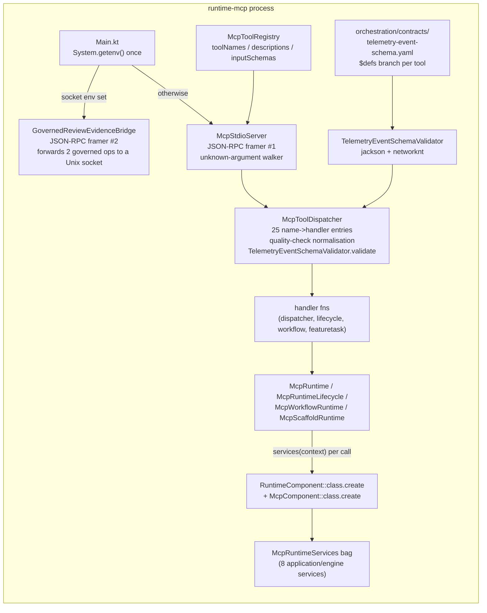

# SKILL-357 Investigation - `runtime-mcp` boundaries and simplicity

Issue key: SKILL-357
Module: `../../../runtime-kotlin/runtime-mcp` (`skillbill.mcp`)
Baseline: `main` at `d8a103a1ebf88662fc7f7db7b6efce4bfd24a905`, 2026-09-17

## Assessment

`runtime-mcp` is the MCP entry adapter: a stdio JSON-RPC server that advertises 25 tools and dispatches each call to an application or engine service, plus a second stdio mode that bridges a governed review-evidence socket. It is small (35 production files, 2,777 lines; 20 test files, 4,002 lines; 5 repo-contract tests) and its dependency direction is right. Main sources import only `runtime-application`, `runtime-engine`, `runtime-contracts`, `runtime-domain`, `runtime-ports`, and the `runtime-core` composition root; there are no concrete `skillbill.infrastructure.*` imports in main, and all four architecture baselines recorded for the module (ambient clock, ambient environment, inject-constructor defaults, package cycles) are empty. The process boundary reads the environment exactly once in `Main.kt`, as the 2026-09-03 decision requires. The module's suites are green: 91 tests plus 27 repo-contract tests, zero failures.

The problems are about shape, not direction. The adapter rebuilds the whole dependency graph on every tool call, spells each tool's identity in four Kotlin tables and one YAML branch, carries two hand-maintained input schemas for one seam with a parity test as glue, keeps a dead bounded socket reader beside a live unbounded one, and spells its wire vocabulary in place. None of this needs a framework, a new module, or an MCP SDK; it needs the adapter to be composed once and declared once.

## Structure

Package sizes (production lines): `core` 952, `workflow` 500, `scaffold` 418, `telemetry` 317, `review` 238, `shared` 206, `lifecycle` 97, `featuretask` 43, `learning` 6.

Consumers: none outside the module. `Main.kt` is the only entry; `build.gradle.kts` names `skillbill.mcp.core.MainKt`. The installer stages the `runtime-mcp` distribution and registers it with agents.

## Principles applied

| Principle | Verdict | Evidence |
| --- | --- | --- |
| Dependency direction | Holds | Main-source project edges match `ImplementationOwnershipArchitectureTest` L278-284; `RuntimeLayerBoundaryArchitectureTest` L370-395 bans `java.sql`, `java.net.http`, and low-level runtimes in `skillbill.mcp`. |
| Hexagonal boundary | Holds with one leak | Handlers call application services and the engine settlement service through `RuntimeComponent`. `McpRuntime.importReview` L21 smuggles the review text through the process-level `RuntimeContext.stdinText` so the application can read "stdin" (F-003). |
| State and resource ownership | Violated | A new composition root per tool call, two per scaffold, a third on the failure path (F-003). |
| Contract enforcement | Duplicated | Kotlin `inputSchemas` and the YAML `$defs` branches describe the same 25 inputs; the parity test compares keys only and the enums have already drifted (F-002). |
| Simplicity (no forwarding, no count splits, no bags) | Violated | `McpRuntimeServices` merges two count-split `@Inject` bags; `McpRuntime`, `McpRuntimeLifecycle`, `McpWorkflowRuntime` forward one-to-one to services; tool identity in four tables (F-001, F-008). |
| Observability policy | Violated | Silent coercion of missing or mistyped arguments, advertised arguments stripped silently, a swallowed capture failure, a constant duration reported as measured (F-006, F-007). |
| Wire vocabulary rule | Violated | 306 inline `"key" to`, 83 literal argument reads against 8 constant reads; 33 of the 55 argument keys already exist as `runtime-contracts` constants (F-005). |
| Typed errors | Mixed | Unknown tool, bad remote-stats workflow, and missing `attempt` raise `IllegalStateException` or `IllegalArgumentException`; the dispatcher's error classification depends on those JDK types (F-006). |
| Test value | Mostly good | Golden payload files, real SQLite, stdio boundary tests. Test-side coupling to `runtime-cli` and three infrastructure modules, one root-package squat (F-010). |

## Findings

### F-001 Major - One tool, four tables, one YAML branch

A tool's identity is spelled in `McpToolRegistry.toolNames` (L38-65), `McpToolRegistry.descriptions` (L67-97), `McpToolRegistry.inputSchemas` (L99-303), and `McpToolDispatcher.nativeHandlers` (L34-69), all keyed by the tool-name string, and once more as the `event_name` const of its `$defs` branch in `../../../orchestration/contracts/telemetry-event-schema.yaml` (the header at L84 says the const matches `McpToolRegistry.toolNames`). `tools` is assembled at class init by `descriptions.getValue(name)` (L305-307), so a missing description fails the whole server at first `tools/list`; a tool present in `toolNames` but absent from `nativeHandlers` fails only when called (`error("Unknown MCP tool")`, dispatcher L76). `toolNamed` is a linear scan (L310). `normalizeTelemetryEnvelopeArguments` branches on `toolName != "quality_check_finished"` (dispatcher L101), so per-tool behaviour hides in the dispatcher instead of the tool's declaration. Adding a tool today touches five places and two tests (`TelemetryEventInputSchemaParityTest`, `McpStdioServerTestSupport.assertStrictSchemaCoveragePublished`).

Shape wanted: one `McpTool` value per tool carrying `name`, `description`, `inputSchema`, and `handler`, in one ordered list; `tools/list` and dispatch both read that list; a tool-specific argument normaliser is part of that tool's declaration, not a dispatcher branch.

### F-002 Major - Two input schemas for one seam, drifted, glued by a key-only parity test

The advertised `inputSchema` is hand-written Kotlin (`McpToolRegistry.inputSchemas` ~200 lines, `McpInputSchemas.kt` 88, `McpInputSchemaPrimitives.kt` 35). The validating schema is the YAML branch, loaded through jackson and networknt by `TelemetryEventSchemaValidator`. `../../../agent/history.md` L2531 records the YAML as "the SSOT for every MCP `tools/call` envelope", so the Kotlin copy is the derived artifact by the repo's own record. `TelemetryEventInputSchemaParityTest` (repoTest, 155 lines) checks branch existence, `additionalProperties`, property keys, and required keys, and nothing else. The constraints have already drifted:

- `feature_verify_workflow_update` advertises `workflow_status` as a five-value enum and `current_step_id` as a nine-value enum (registry L178-190); the YAML branch declares both as plain `type: string`. A client sending `workflow_status: blocked` is told by the advertised schema it is invalid, passes validation, and fails deeper in the application.
- The Kotlin copy restates enum tokens the repo already owns, against the AGENTS.md rule that enum wire tokens use `wireValue` on the owning enum: `FeatureTaskRuntimeFailureDisposition` (L120-128, guarded by `FailureDispositionSchemaAdvertisementTest` instead of referenced), `WorkflowStatus` (L179), `FeatureVerifyWorkflowDefinition.stepIds` (L180-190), `FeatureTaskRuntimePhaseWorkflowDefinition.PHASE_*` (L106, L117), and the application-owned `historySignalValues`, `qualityCheckScopeTypes`, `qualityCheckResults`, `auditResults`, `featureVerifyCompletionStatuses` (`McpInputSchemas.kt` L10-13, registry L157-159, L253).
- The same key is spelled two ways inside one schema: `required = listOf("workflow_id", "phase_id", ...)` beside `SharedPayloadKeys.WORKFLOW_ID to ...` (registry L102-108, L113-116).

A third validation layer sits in front of both: `McpStdioServer.validateStrictArguments` and the 45-line recursive `unknownProperties` walker (L123-167) reject unknown keys before dispatch, duplicating what networknt already enforces from `additionalProperties: false`. The two entry points disagree: `McpToolDispatcher.call`, which tests call directly, skips the walker.

Shape wanted: the YAML branch is the one schema. The advertised `inputSchema` is projected from it at startup (drop `event_name` and `contract_version`, inline local `$ref`s), the enums the Kotlin copy carried move into the YAML branch, a repo-contract test pins each YAML enum to its owning Kotlin `wireValue` list, and the walker and the parity test are deleted.

### F-003 Major - A composition root per tool call

`services(context)` (`McpComponent.kt` L19-22) creates a `RuntimeComponent` and an `McpComponent` on every call; 28 production functions route through it. `McpScaffoldRuntime.newSkillScaffold` builds a `RuntimeComponent` (L23) and then `mcpClock(runtimeComponent)` (L25) builds a second `McpComponent` to read a `Clock` that `RuntimeDiagnosticsProvides.runtimeClock` already provides and `RuntimeComponent` does not expose. `McpRuntimeLifecycle.captureException` (L55-57) builds a third graph on the failure path. The stdio server's context is fixed for the process lifetime (`Main.kt` L11), so one graph per process is the natural shape, and it is the shape `runtime-cli` already has (`CliRuntime.kt` L23-40 builds one component per run). The schema readiness gate is process-wide (`DatabaseRuntime.kt` L23), so the per-call rebuild does not re-run migrations; what it rebuilds is the service graph, the session factory, and every `@RuntimeSingleton` in it.

What forces the per-call shape is one leak: `McpRuntime.importReview` passes the review text as `stdinText` into the `RuntimeContext` (L21) so `ReviewService.previewImport("-")` and `importReview("-")` read it as stdin. `ReviewService.importReview` already accepts a `stdinText` parameter (L41-46); `previewImport` does not (L35-36). `McpComponent` itself exposes only `clock` and a `services` bag; `McpRuntimeContext` (L9-15) mirrors `RuntimeContext` with sentinel defaults, and 28 production functions carry `context: McpRuntimeContext = McpRuntimeContext()`.

Shape wanted: `Main.kt` builds one `RuntimeComponent` from the resolved context and one `McpComponent` exposing the services as abstract vals; handlers receive the component (or the one service they need); review text travels as an argument to `previewImport` and `importReview`; the per-call `services()` factory, `mcpClock`, `McpRuntimeContext`, and the 28 sentinel defaults are deleted.

### F-004 Major - A dead bounded socket reader beside a live unbounded one; two JSON-RPC framers

`GovernedReviewEvidenceConnection.kt` (81 lines, added by SKILL-236 in `9f3d05459`) defines `connect`, `openSocketChannel`, and a `readReviewEvidenceFrame` reader that caps the handshake at `REQUEST_BYTES` (64 KiB) and each response at `RESPONSE_FRAME_BYTES` (2 MiB) and raises `GovernedReviewEvidenceTransportError` when exceeded (L63-81). `GovernedReviewEvidenceInitialization.kt` (13 lines) defines `initializeResult`. Nothing references either file: `GovernedReviewEvidenceBridge` declares its own `private class Connection` (L61-75), `private fun connect` (L77-90), `private fun openSocketChannel` (L92-104), and `private fun initializeResult` (L106-113), and Kotlin resolves the member before the top-level function, so the bridge's `connect(Path.of(socketPath), token)` at L26 is the private copy. The live forwarding path reads with `BufferedReader.readLine()` (L69) with no byte cap. The byte limit SKILL-236 introduced is not in effect and `GovernedReviewEvidenceBridgeTest` cannot see it, because it drives `handleLine` with a lambda.

The bridge and `McpStdioServer` also each carry a JSON-RPC framer: `initialize`, `tools/list`, `tools/call`, `successResponse`, `errorResponse`, and a hard-coded `protocolVersion` `2025-11-25` (server L37, bridge L107). They disagree on the parse-error code: the server uses `-32700` (L12, L27), the bridge answers a parse failure with `-32603` internal error (L17, L38). Neither answers the MCP `ping` utility; both return method-not-found for it.

Shape wanted: one framer in `core` (request parsing, `initialize`, `ping`, success and error envelopes, the JSON-RPC codes) used by both servers; the bridge uses the bounded `GovernedReviewEvidenceConnection`; the private copies are deleted.

### F-005 Major - Wire vocabulary spelled in place

Census over `src/main`: 306 inline `"key" to` pairs; 83 literal argument reads (`arguments.string("review_text")`) against 8 reads through constants. 33 of the 55 distinct argument keys and 12 of the 56 distinct output keys already exist as `const val` in `runtime-contracts` (`LifecycleTelemetryPayloadKeys.ERROR` exists while `"error"` is spelled 18 times; `LearningPayloadKeys.DB_PATH` exists while `"db_path"` is spelled 12 times). `McpRuntime.updateCheck` (L113-123) builds its payload from six literals while `doctor` and `version` go through `DoctorContract`/`VersionContract` per the recorded decision (`decisions.md` L1572). `WireVocabularyGovernedSeamInventory` registers two of the module's 35 files (L37, L54), so the guard cannot see the rest. The six-line shell-quoted `read_only_full_state_command` builder is duplicated inside the module (`WorkflowContinueMcpStandardMap.kt` L16-20, `WorkflowMcpResultMappers.kt` L35-41). The 2026-09-03 decision keeps the CLI/MCP mapper pairs distinct; it says nothing about spelling the keys twice, and the keys belong in `runtime-contracts` where both adapters can reference them.

### F-006 Major - Silent coercion, silently dropped input, swallowed capture, untyped input errors

- `McpToolArguments` (L5-21): a missing string becomes `""`, any non-boolean becomes `false`, an unparsable integer becomes the caller's default. The schema validator runs first, but only for keys the branch constrains; open branches (`doctor` and every `additionalProperties: true` tool) and type-loose branches reach the handler with silent defaults.
- The `quality_check_finished` input schema advertises `completion`, `final_failure_count_availability`, and `stale_reason` as accepted properties (registry L246-252); the dispatcher strips them silently before validation (`RUNTIME_OWNED_QUALITY_CHECK_KEYS`, L107, L119-123). An advertised argument that is discarded without a record is a contract the adapter does not keep.
- `NormalizedQualityCheckStack` (L125-152) has two fields, `fallback` and `fallbackReason`, that every code path sets to `false` and `null`; `val fallback = arguments["fallback"] == true || stack.fallback` (L105) is therefore `arguments["fallback"] == true`.
- `McpRuntimeLifecycle.captureException` wraps the whole capture in `runCatching { }` (L56) and discards the result; a failed exception capture leaves no record.
- `TelemetryEventSchemaValidator.validate` logs a `java.util.logging` WARNING (L40) and then throws the typed error carrying the same information (L46-50): the same event reported twice through two channels. The module's only logger lives here (L22).
- Input errors are JDK types: unknown tool `error(...)` (dispatcher L76), `mapRemoteStatsWorkflow` throws `IllegalArgumentException` (L192), missing `attempt` uses `requireNotNull` (featuretask L18, L30), `McpToolArguments.optionalInt` uses `require`/`error` (L27-39). `dispatchMcpToolCall` (server L97-105) then classifies by those JDK types: `ShellContentContractException`, `IllegalArgumentException`, and `IllegalStateException` are client errors, every other `Exception` is captured to telemetry. The classification is right in intent and fragile in mechanism; a typed `InvalidMcpToolArgumentError` under `ShellContentContractException` makes the client-error class explicit.

### F-007 Major - A constant reported as a measurement

`McpScaffoldRuntimeMaps.kt` reports `"duration_seconds" to SCAFFOLD_TELEMETRY_DURATION_SECONDS` where the constant is `0` (L6, L25, L62) in both the success and failure telemetry payloads a parent skill embeds in its own finished event (`../../../skills/bill-feature-verify/content.md` L197 documents the embedding). `TelemetryMeasurementAvailability` exists in `runtime-contracts` to say a measurement is unavailable; the adapter instead reports zero seconds as fact. The same file builds `session_id` into a map and then subtracts it (`- "session_id"`, L31, L65). `McpScaffoldRuntime.generateNewSkillSessionId` takes an injected `Clock` and an ambient `UUID.randomUUID()` (L56).

Adapter-injected policy defaults belong to their owners: `historyRelevance ?: "none"` and `historyHelpfulness ?: "none"` (`McpLifecycleToolHandlers.kt` L71-72) restate `historySignalValues[0]` from `runtime-application`; `failureDisposition ?: "needs_user_action"` (`McpFeatureTaskSettlementHandlers.kt` L32) restates `FeatureTaskRuntimeFailureDisposition.NEEDS_USER_ACTION.wireValue` and decides settlement policy in the adapter.

### F-008 Minor - Forwarding layers, count-split bags, aliases

- Three hops between the dispatcher and a service: dispatcher lambda, `internal fun` handler that parses arguments, then `McpRuntime` / `McpRuntimeLifecycle` / `McpWorkflowRuntime` object functions that mostly forward one-to-one (`McpRuntime.newSkillScaffold` L125-135 forwards every parameter to `McpScaffoldRuntime.newSkillScaffold`; `McpWorkflowRuntime.list`, `latest`, `resume`, `continueWorkflow` L79-103 are one-line calls on `workflowService`; the five `McpRuntimeLifecycle` functions L12-45 are `withAutoSync { service.x(request).toPayload() }`).
- `McpRuntimeServices` (L29-42) merges `McpInsightServices` (3 fields) and `McpOperationsServices` (5 fields), two `@Inject data class` bags split to stay under detekt's `LongParameterList.functionThreshold: 6`, and re-exposes all eight as vals: a count split feeding a dependency bag, both named in the ARCHITECTURE.md design principles.
- `TELEMETRY_EVENT_SCHEMA_CLASSPATH_RESOURCE` and `TELEMETRY_EVENT_SCHEMA_REPO_RELATIVE_PATH` (validator L163-167) alias `TelemetryEventSchemaPaths` constants declared 8 lines away. The classpath resource path is `skillbill/infrastructure/fs/contracts/...` (paths L10-11), an infrastructure-module package path inside the MCP module's generated resources.
- Four files under 20 lines: `McpLearningPayloads.kt` (6), `GovernedReviewEvidenceInitialization.kt` (13), `TelemetryEventSchemaPaths.kt` (15), `WorkflowContinueMcpMaps.kt` (16).

### F-009 Minor - 23 public declarations, zero external consumers

Every top-level declaration except `main` can be `internal`: 23 are public (`McpRuntime`, `McpToolRegistry`, `McpToolDispatcher`, `McpStdioServer`, `McpScaffoldRuntime`, `McpRuntimeLifecycle`, `McpWorkflowRuntime`, `GovernedReviewEvidenceBridge`, `TelemetryEventSchemaValidator`, `TelemetryEventSchemaPaths`, `McpToolSpec`, `McpRuntimeContext`, `McpWorkflowOpenArgs`, `McpInsightServices`, `McpOperationsServices`, `McpRuntimeServices`, `services`, `mcpClock`, `parseMcpScaffoldCommandRequest`, `extractOffendingValueFromTelemetryInstance`, `telemetryEventSchemaDottedFieldPath`, `TELEMETRY_EVENT_CONTRACT_VERSION`, `main`). No other module imports `skillbill.mcp`; `RuntimeArchitectureTest` L528-543 forbids inner-layer tests from doing so. Tests live in the same module and reach `internal`.

### F-010 Minor - Test-side coupling and a root-package squat

`build.gradle.kts` L26-29 gives the test source set `runtime-cli`, `runtime-infra-fs`, `runtime-infra-http`, and `runtime-infra-sqlite`. `McpRuntimeTest` (1,271 lines, 19 tests) imports `CliRuntime` for two payload-parity tests (L70-76, L107-114), which is a legitimate canonical-surface check, and also to seed state through CLI commands before reading it through MCP (L907-950), which uses a sibling adapter as a fixture. `McpStdioServerTestSupport` L313-314, `RuntimeExceptionPersistedRedactionTest` L4-5, and `TelemetryReliabilityContractTest` L8-12 construct SQLite internals (`DatabaseRuntime`, `LifecycleTelemetryStore`, `TelemetryOutboxStore`, `ReviewRuntime`, `ReviewStatsRuntime`) directly; SKILL-356 subtask 1 owns moving the `runtime-mcp` tests onto the `runtime-infra-sqlite` test fixtures and making those types `internal`, so this bundle only records the coupling. `src/test/kotlin/skillbill/TestSupport.kt` sits in the root `skillbill` package. All eight golden fixtures under `src/test/resources/golden/` are referenced.

## What stays

- The two-mode entry (`Main.kt` chooses bridge or server from one environment read) and the `Main.kt` ambient-environment exemption recorded on 2026-09-03.
- `TelemetryEventSchemaValidator` in this module, the `copyTelemetryEventSchema` Gradle task, the jackson and networknt dependencies it needs, and the classpath-only schema load (`history.md` L2531-2540, `ARCHITECTURE.md` L867-869). The validator's coherence rules (`validateCoherence`, `validateQualityCheckFailureCountCoherence`) stay.
- The CLI/MCP mirrored mapper pairs the 2026-09-03 decision keeps distinct, including the three scaffold parser copy pairs (see Rejected changes).
- The `orchestrated` payload envelopes, the golden payload fixtures, the stdio boundary tests, and the `repoTest` contract tests other than the parity test F-002 retires.
- `McpComponent` as the module's kotlin-inject component; it changes from a bag holder to the object that exposes the eight services.
- The application services' signatures, except the additive `stdinText` parameter on `ReviewService.previewImport`.

## Estimated reductions

| Area | Now | After | Change |
| --- | --- | --- | --- |
| `core` (registry, dispatcher, schemas, server, runtime) | 952 | ~560 | one tool table, YAML-projected schemas, walker gone, one framer |
| `shared` (component, context, lifecycle, services bag, arguments) | 206 | ~90 | component exposes services; context, bag, lifecycle object deleted |
| `review` (bridge + dead connection copies) | 238 | ~150 | bridge uses the bounded connection and the shared framer |
| `workflow` + `lifecycle` + `featuretask` + `scaffold` + `telemetry` | 1,381 | ~1,250 | forwarding objects folded into handlers, keys from constants |
| Production total | 2,777 lines / 35 files | ~2,050 lines / ~26 files | about -25 % |
| Tests | 4,002 + 1,273 repoTest | -155 parity test, -23 advertisement test, + ~120 new | net about -60 |

## Rejected changes

- **Adopting an MCP SDK or a JSON-RPC library.** Two framers of ~60 lines each become one of ~70; a dependency buys nothing here.
- **Moving the telemetry-event validator to `runtime-contracts`.** The 2026 decision keeps it here because the tool registry is the event-name source; history L2532 defers the lift until a non-MCP emitter needs it. Not this bundle.
- **Merging the three scaffold parser copy pairs with `runtime-cli`.** The files are identical modulo parameter names (diff of 6, 28, and 122 lines that are all renames). The 2026-09-03 decision defers the merge as a separate feature, and the raw-map boundary rule (ARCHITECTURE.md rule 11) leaves no home for a `Map -> ScaffoldCommandRequest` parser below the adapters without moving `ScaffoldCommandRequest` out of `runtime-domain`. Recorded, not changed.
- **Merging CLI and MCP workflow, review, telemetry, and learning mappers.** Kept distinct by the 2026-09-03 decision. Only the shared key constants move to `runtime-contracts`.
- **Threading or async in the stdio server.** Requests are processed in order over one connection; nothing asks for concurrency.
- **A tool-registration DSL or annotation processor.** A Kotlin `List<McpTool>` is the declaration.
- **Generating the YAML from Kotlin instead of projecting Kotlin from YAML.** The YAML is the recorded cross-language source of truth; the proxy and other consumers read it.

## Comparison with public practice

These are comparisons with published material, not claims about any company's internal code.

- The official MCP SDKs register a tool once with name, description, input schema, and handler in one call and derive `tools/list` and dispatch from that registration; the same shape F-001 asks for. The JSON-RPC 2.0 specification reserves `-32700` for parse errors and `-32603` for internal errors, and the MCP specification's ping utility requires an empty result, which F-004 restores.
- Reddit's open-source Baseplate builds the application context once at startup and attaches per-request context to it; dependencies are constructed at one attachment point, not per request. F-003 asks for the same lifetime.
- Microsoft's ASP.NET Core guidance builds the dependency container once at host startup and resolves per-request work from it; building a container per request is documented as an anti-pattern.
- Meta's Thrift and the broader IDL-first practice keep one schema source that generates both server-side validation and the surface advertised to clients, which is F-002's single-source principle.
- Kotlin and .NET guidance both default library types to internal or non-public and open them on demand; F-009 applies that to a module with no external consumers.

## Validation performed and limits

- Read all 35 production files in full; censused inline keys, argument reads, public declarations, ambient calls, loggers, and exceptions with `grep`; diffed the scaffold parsers against `runtime-cli`; confirmed the dead connection file by reference search and Kotlin resolution rules; confirmed enum drift by reading the YAML branches.
- Ran `./gradlew :runtime-mcp:test :runtime-mcp:repoTest`: 91 + 27 tests, 0 failures, 0 skipped.
- Baselines for the module (`runtime-core/src/test/kotlin/skillbill/architecture/baselines/runtime-mcp-*.txt`) are all empty.
- Not measured: per-call latency of the component rebuild. The finding is about lifetime and ownership; the cost is secondary.
- Not verified by execution: that every YAML branch projects to an `inputSchema` MCP clients accept; subtask 2's golden-file acceptance criterion covers it.
