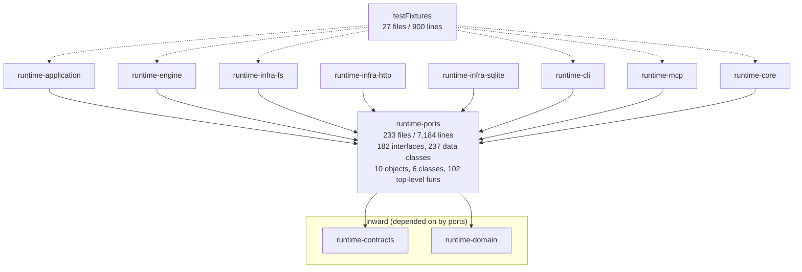

# SKILL-358 investigation: `runtime-ports`

Module on disk: `../../../runtime-kotlin/runtime-ports` (packages `skillbill.ports.*` and `skillbill.model`). There is no
`runtime-infra-ports` module; `settings.gradle.kts` L34 registers `runtime-ports`. Baseline: `main` at
`d8a103a1e`, `./gradlew :runtime-ports:test` runs 21 tests with 0 failures, and all four `runtime-ports-*`
architecture baselines under `runtime-core/src/test/kotlin/skillbill/architecture/baselines/` are empty.

## Assessment

`runtime-ports` is the hexagon's inward boundary: the interfaces that application and engine code call and that
`runtime-infra-fs`, `runtime-infra-http`, and `runtime-infra-sqlite` implement. Its dependency direction is right.
It depends only on `runtime-contracts` and `runtime-domain` (`build.gradle.kts` L9-11), eight modules depend on
it, and the recorded rule for the layer is explicit: the module "declares interfaces and DTOs and imports no
adapter machinery" (`ARCHITECTURE.md` L1460-1462; `../../../agent/decisions.md` L133-139, "now that `runtime-ports` is
interface-and-DTO only").

The module does not match that rule in shape. Beside 182 interfaces and 237 data classes it declares 10 top-level
objects, 6 plain classes, and 102 top-level functions, and the only guard on the rule scans imports, not
declarations (`RuntimeContractModuleImportRulesTest` L25-29). The behaviour that lives here is not trivial: a
424-line MCP wire codec with hand-built JSON schemas, a lease acquire/heartbeat/release algorithm, a multi-file
write-and-rollback routine, an identity validation policy declared twice byte for byte, and 30 interface default
bodies that throw "not implemented by this persistence adapter". One of those port-level routines shadows the
adapter's journaled implementation of the same name, so production callers skip the bundle journal the
architecture document describes.

The problems fall into two groups. The first is behaviour that the inside cannot substitute sitting in the
substitution layer. The second is wire vocabulary: status tokens restated as string lists, 118 inline payload keys
in six files, and three `Map<String, Any?>` wrappers whose names end in `Map` or `Payload`, which are exactly the
suffixes the raw-map guard exempts.

## Structure

Package sizes (files / lines, production):

| Package cluster | Files | Lines | Note |
| --- | --- | --- | --- |
| `ports.review` + `.model` | 43 | 1,491 | codec (424 lines, 6 files), broker, protocol adapter, accounting validator |
| `ports.goalrunner.*` | 22 | 1,290 | five sub-packages; lease algorithm; repair models |
| `ports.workflow.*` | 35 | 1,300 | repository composite, gitops (12 interfaces), decomposition store |
| `ports.telemetry` + `.model` | 21 | 400 | seven lifecycle repositories folded into one composite |
| `ports.install.*` | 26 | 431 | one port + one model file per capability |
| `ports.scaffold.*` | 22 | 526 | same shape |
| `ports.agentrun` + `.model` | 4 | 292 | `SkillRunRequest`, seven fun interfaces |
| `ports.taskruntime` + `.model` | 9 | 240 | worker supervisor, shared evidence |
| `skillbill.model` | 3 | 113 | `RuntimeContext` and path bridges |
| everything else (17 packages) | 48 | 1,101 | 47 packages hold a single file |

Counts behind the assessment: 41 `model` sub-packages; 74 files import `java.nio.file.Path` while
`FileLocation` appears 3 times; 38 `Map<String, Any?>` mentions and 118 literal payload keys, both confined to
six files; 152 `require`/`error`/`check` calls; 30 `error("… not implemented …")` interface defaults, 16 silent
defaults (`= Unit`, `= null`, `= 0`, `= emptyList()`, `= emptyMap()`), and 10 `(this as X)` casts inside
interface bodies. Tests: 5 files, 21 tests, 332 lines. Fixtures: 27 files, 900 lines, consumed by six modules.

## Principles check

| Principle | Verdict | Evidence |
| --- | --- | --- |
| Dependency direction | Holds | Only `contracts` and `domain` edges; all four baselines empty; `RuntimeLayerBoundaryArchitectureTest` and `RuntimeContractModuleImportRulesTest` green on `main`. |
| Ports as substitution seams | Fails | 102 top-level functions and 10 objects; codec, lease algorithm, rollback routine, identity policy are behaviour the inside cannot swap (F-001, F-002, F-003). |
| Interface segregation | Mostly holds | `GoalRunnerManifestStore` is five segregated seams by recorded decision; `WorkflowStateRepository` is six. But `FeatureTaskWorkflowRowRepository` has 0 abstract members and casts `this` to siblings (F-004). |
| Liskov / honest contracts | Fails | 30 defaults throw "not implemented"; 4 defaults fabricate `Ok` results; every `error()` default is overridden by exactly one production adapter, so the defaults exist for fakes (F-004). |
| Single source for wire tokens | Fails | `GoalChildWorkflowDeletionScope` restates six `WorkflowStatus` tokens; two owners for `"ok"`/`"error"`; 118 inline keys; three raw-map wrappers named to pass the scanner (F-005). |
| YAGNI / dead code | Fails | Byte-identical duplicate policy; a discovery operation advertised in the tool schema that nothing dispatches; six dead declarations; a production object used only by tests (F-003, F-006). |
| Observability policy | Fails in places | `TelemetrySettingsProvider.loadOrNull` swallows every `Exception` to `null`; `WorkflowGitRemoteOperations` defaults return success without doing anything (F-004). |
| Error taxonomy | Fails | `RejectedOutputDiagnosticError : RuntimeException`, `GoalRunnerLaunchAuthorizationDeniedException : IllegalStateException` declared in ports rather than `skillbill.error` (F-008). |
| Simplicity | Mixed | Two APIs for `RuntimeContext`; a protocol interface that renames a broker; a single-member enum; 47 single-file packages (F-007, F-009, F-010). |
| Test value | Mixed | 21 tests pin DTO invariants and the codec; one test asserts that a test fixture refuses; 11 fixtures exist only to be counted by a census table (F-010). |

## Findings

### F-001 Major: behaviour lives in the substitution layer

The recorded rule is that ports hold interfaces and DTOs. The module holds:

- **An MCP wire codec.** `ports/review/model/GovernedReviewEvidenceCodec.kt` (158 lines) plus
  `GovernedReviewEvidenceCodecWire.kt` (26), `…CodecWireParsing.kt` (52), `…CodecWirePayloads.kt` (52),
  `…CodecWireSchemas.kt` (99), and `GovernedReviewEvidenceRequestParsing.kt` (37): 424 lines that parse JSON-RPC
  arguments, build JSON-Schema documents with `linkedMapOf("type" to "string", …)` (`…WireSchemas.kt` L6-98),
  serialise result payloads, and measure request bytes with `JsonCodec` (`…Codec.kt` L135-157). Its consumers are
  two adapters, `runtime-infra-fs` (`GovernedReviewEvidenceEndpoint.kt` L186-191) and `runtime-mcp`
  (`GovernedReviewEvidenceBridge.kt` L43, L51). `GovernedReviewEvidenceCodecWire` forwards every call one-to-one
  to a sibling object.
- **A lease algorithm.** `ports/goalrunner/GoalRunnerControlRepository.kt` L48-130 declares `executionLease`,
  `acquireExecutionLease`, `heartbeatExecutionLease`, `releaseExecutionLease`, `releaseExecutionLeaseIfExpired`,
  `advancedBy`, and `advanceAccumulator` as extension functions with owner-token and generation fencing, instant
  parsing, and a heartbeat-gap accumulator. The only production caller is
  `runtime-infra-sqlite/…/GoalRunnerControlCoordinator.kt` L40-68. The same four operation names are abstract
  members of `GoalRunnerManifestExecutionCommands` (`GoalRunnerPorts.kt` L59-80), so the lease API is spelled twice
  in the same module. The interface default `clearRunnerInterruptedPause` (L17-30) is a fourth piece of state logic.
- **A write-and-rollback routine.** `ports/workflow/decomposition/DecompositionManifestPersistencePort.kt` L17-46:
  snapshot, write, verify, restore in reverse, suppress rollback failures. See F-002 for its consequence.
- **An identity validation policy.** `FeatureTaskExecutionIdentityPolicy` (see F-003) validates contract version,
  issue-key shape, repository identity prefix, and governed spec path with error-message formatting.
- **Interface bodies that dispatch.** `FeatureTaskWorkflowRowRepository` (`WorkflowStateRepository.kt` L56-97) has
  zero abstract members and six defaults that cast `this` to sibling interfaces to route by mode.
- **Derivation in a companion.** `FeatureTaskRuntimeSharedEvidenceResolverPort.NONE`
  (`FeatureTaskRuntimeSharedEvidenceResolverPort.kt` L16-38) builds a `FeatureTaskRuntimeSharedEvidenceArtifact`
  from a deriver inside the port declaration.
- **Parsing in a DTO.** `RepoValidationIssue.fromRawIssue` (`RepoValidationGatewayModels.kt` L35-52) parses
  `"path: message"` strings by `indexOf`.

The 2026-09-06 entry in `../../../agent/decisions.md` (L133-139) moved 1,541 lines of such behaviour out and stated the
rule; the guard that followed (`RuntimeContractModuleImportRulesTest`) checks only imports, so declarations drifted
back without a failing test. One recorded exception stands and is honoured here: the `WorkflowFamily` receiver
extensions beside `WorkflowStateRepository` (decisions L115-131, "Behaviour that is not a DTO extension leaves
`runtime-ports`" chose to keep those seven dispatchers beside the port they drive).

### F-002 Major: a port extension shadows the adapter's journaled write

`DecompositionManifestPersistencePort.writeBundleAtomically` (ports, L17-40) and
`FileSystemDecompositionManifestFileStore.writeBundleAtomically` (`runtime-infra-fs`, L47-66 onward) share a name
and a signature. The adapter member takes the bundle lock and runs `bundleJournal.recoverPendingUnlocked` before
writing (L65-66), which is the mechanism `ARCHITECTURE.md` L653-663 describes for interrupted bundle writes. The
ports extension does neither. Both production callers hold the receiver as the interface type:
`FeatureSpecPreparationWriter.kt` L30 `private val fileStore: DecompositionManifestStore` and L84
`fileStore.writeBundleAtomically(`, and `GoalRunnerPurgeCoordinator.kt` L28
`private val manifestFileStore: DecompositionManifestStore` and L195 `manifestFileStore.writeBundleAtomically(`.
Kotlin resolves a member only when the static receiver type declares it, so both sites bind to the ports extension
and the journaled path runs only in the adapter's own test (`FileSystemDecompositionManifestFileStoreTest.kt`
L107, which holds the concrete type). This is a static-analysis conclusion; the investigation did not execute an
interrupted write to observe the missing marker. The two `*WithoutRecovery` members default to their recovering
twins (`DecompositionManifestPersistencePort.kt` L8, L10; `DecompositionManifestDiscoveryPort.kt` L7-8), so a
second implementation would silently equate the two paths.

### F-003 Major: one policy declared twice, one payload mapper reachable from two packages

`object FeatureTaskExecutionIdentityPolicy` exists at `ports/continuation/FeatureTaskExecutionIdentityPolicy.kt`
L9-81 and again at `ports/workflow/WorkflowStateRepository.kt` L244-316. `diff` of the two bodies is empty. All
nine importers use the `skillbill.ports.workflow` copy (application 2, engine 3, sqlite 1, mcp 1, tests 2); the
`ports.continuation` package has no other file and no importer. SKILL-233 folded the object into the repository
file (decisions L135, "folded into the file declaring that type … `FeatureTaskExecutionIdentity`") and the fold
survived the revert and re-merge (`cb96c0d7a`, `4196e3f19`) while the original did not get deleted.

`toReviewFinishedTelemetryPayload` is declared in `ports/telemetry/model/ReviewFinishedTelemetryPayload.kt` L13 and
re-exported by `ports/review/ReviewFinishedTelemetryPayloadCompatibility.kt` (7 lines, an import alias); four
files import each spelling.

### F-004 Major: partial-implementation defaults and fabricated results

Thirty interface defaults end in `error("… is not implemented by this …")`: nine in
`GoalPlanningPreparationRepository.kt` (L15-41, L69-76), six in `WorkflowStateRepository.kt` (L36-58, L106-114),
six in `FeatureTaskRuntimeWorkerRepository.kt` (L14-69), two each in `ReviewEvidenceBroker.kt` (L12-20) and
`NativeReviewOperationProtocol.kt` (L14-15), plus `GoalRunnerWedgeClass.fromWire`. For every one of the
repository defaults exactly one production adapter overrides it (`FeatureTaskExecutionLookupStore`,
`FeatureTaskWorkflowRowStore`, `GoalChildWorkflowStore`, `GitStandardWorkflowGitRemoteOperations`), so the
default is never the production behaviour; it exists so that test fakes compile. The 2026-09-06 decisions (b) and
(c) already replaced this pattern for `GoalRunnerManifestStore` and `UnitOfWork` with abstract members plus
`*Defaults` classes in `testFixtures`; the remaining interfaces did not follow.

Four defaults in `WorkflowGitRemoteOperations` (L11-24) return success without acting: `pushBranch` and
`pushBranchWithLease` return `Failed`, but `refreshRemoteBranch` returns `Ok(branch.trim())` and
`localBranchHasUnpushedCommits` returns `Ok("false")`. A caller on a non-git implementation is told the branch is
pushed. `TelemetrySettingsProvider.loadOrNull` (L9-17) catches `Exception` and returns `null` with no record; its
one caller is `TelemetrySettingsLoading.kt` L13. `DiffResolverPort.readDiff` defaults to `null`,
`FeatureTaskRuntimeWorkerSupervisor.inspect` to `Unsupported`, `RejectedOutputDiagnosticRepository.readProducerOutput`
to `null` and `deleteProducerOutputsBefore` to `0`. `../../../docs/observability-policy.md` requires a record for every
fallback.

The evidence broker's `discover` operation is a special case. `ReviewEvidenceBroker.discover` defaults to
`error(...)`; the only production broker, `FileSystemReviewEvidenceBroker`, overrides `authorizeExpansion`,
`readBatch`, and the accounting members but not `discover`, `expansionById`, `confirmDelivery`,
`recordMalformedRequest`, or `finishDeliverySession`; and the endpoint dispatches only `protocol.read` and
`protocol.authorizeExpansion`. The advertised tool schema (`…CodecWireSchemas.kt` L12-19, L67-88) still offers
`operation: discover`, `cursor`, and `page_size`. Nothing serves what the schema advertises.

### F-005 Major: wire tokens restated, keys inlined, raw maps renamed

- `GoalChildWorkflowDeletionScope` (`ports/workflow/model/GoalChildWorkflowDeletionScope.kt` L3-6) lists
  `"blocked"`, `"failed"`, `"abandoned"`, `"completed"`, `"pending"`, `"paused"` as strings. `WorkflowStatus`
  (`runtime-domain/…/ClosedStatusTypes.kt` L19-28) owns those tokens with `wireValue`. AGENTS.md: "Enum wire tokens
  use `wireValue` on the owning enum; do not restate them in local `setOf`/`mapOf` collections."
- `WorkflowGitOperationResult` (`…/model/WorkflowGitOperationResult.kt`) hard-codes `wireValue = "ok"` (L14) and
  `"error"` (L21) and matches the same literals in `fromWire` (L28-32), while `WorkflowGitOperationStatus`
  (`…/model/WorkflowGitOperationStatus.kt` L3-6) declares the same two tokens with `wireValue`. `fromWire` and
  `invoke` have no production caller; the six uses are in the module's own test.
- `ReviewAccountingRecord.kt` L18-137 is a 120-line hand-rolled validator with about 45 inline keys
  (`"contract_version"`, `"aggregate_counters"`, `"launch_bytes"`, `"evidence_delivery"`, …) that mirrors the
  `accounting_summary` branch of `../../../orchestration/contracts/review-context-schema.yaml` (L659-680). The record's
  payload is a `ReviewAccountingBoundedPayload`, a `Map<String, Any?> by delegate` wrapper, although the typed
  `ReviewAccountingSummary` already exists in `runtime-domain` (`ReviewAccountingModels.kt` L126) and
  `ReviewAccountingProjection.kt` L14 converts it to the map to fit the port.
- `ReviewFinishedTelemetryPayload.kt` L19-111 writes about 50 inline keys (`"review_session_id"`,
  `"routed_skill"`, `"accepted_findings"`, `"refutation_rate_by_stage"`, …) while `LifecycleTelemetryPayloadKeys`
  already declares `ROUTED_SKILL` and the telemetry schema owns the branch.
- The codec files hold 26 distinct keys; `GovernedReviewEvidencePayloadKeys` in `runtime-contracts` declares 13 of
  them, yet the payload builders inline even those (`"expansion_id"` 4 times, `"reachability_reason"` 6,
  `"path"` 6) and the other 13 (`"refused"`, `"refusal_kind"`, `"budget_kind"`, `"configured_limit"`, …) have
  no constant. Total literal keys in the module: 118.
- Three public classes delegate to a raw map: `IdeStatusWireMap` (`ports/idestatus/IdeStatusWireMap.kt`),
  `GoalSubtaskReviewInputWireMap` (`ports/workflow/gitops/model/GoalSubtaskReviewInputWireMap.kt`), and
  `ReviewAccountingBoundedPayload`. `IdeStatusValidator.validate(snapshot: IdeStatusWireMap, …)` is a port that
  accepts a raw map. The raw-map scanner exempts enclosing types whose names end in `Map`, `Payload`, `Artifacts`,
  `Document`, `Arguments`, or `Patch` (`RuntimeArchitectureTestSupport.kt` L370-379), so the three wrappers pass
  the guard by suffix. `GoalSubtaskReviewInput.toArtifactMap()` (`GoalSubtaskReviewGitModels.kt` L70-77) exists
  only to hand the engine a map to persist.

### F-006 Minor: dead declarations

| Declaration | File | Evidence |
| --- | --- | --- |
| `FeatureTaskExecutionIdentityPolicy` (copy) | `ports/continuation/…Policy.kt` L9-81 | zero importers (F-003) |
| `val specInputTypes` | `ports/workflow/persistence/WorkflowSessionSummaryWire.kt` L3 | only declaration; contracts has its own field |
| `object GoalVerificationContext` | `ports/goalrunner/verification/model/GoalVerificationContext.kt` | zero references outside its file |
| `object FeatureTaskRuntimeCrashLiveness` | `ports/taskruntime/model/FeatureTaskRuntimeCrashLiveness.kt` | zero references outside its file |
| `sealed interface FeatureTaskRuntimeWorkerAcquisition` (7 cases) | `ports/featuretask/model/FeatureTaskRuntimeWorkerOwnership.kt` L38-46 | zero references anywhere |
| `WorkflowGitOperationResult.fromWire` / `invoke` | `…/model/WorkflowGitOperationResult.kt` L24-33 | zero production callers |
| five self-referential `typealias` lines | `ports/diagnostics/RejectedOutputDiagnosticRepository.kt` L11-15 | alias a type to itself under the same simple name |
| `ReviewFinishedTelemetryPayloadCompatibility.kt` | `ports/review/` | import alias file (F-003) |
| `object SequentialBoundedWorkFanOutPort` | `ports/concurrency/BoundedWorkFanOutPort.kt` L27-35 | production object; callers are two engine tests |
| `object GovernedReviewEvidenceCodecWire` | `ports/review/model/…CodecWire.kt` | 26-line one-to-one forwarder |
| discovery request/page types and `discoveryRequest`/`discoveryPagePayload` | `ReviewEvidenceDiscovery.kt` L36-53; `…Codec.kt` L29-65; `…RequestParsing.kt` L7-28 | no dispatcher (F-004) |

### F-007 Minor: two views of one collaborator, and provider vocabulary in the port

`NativeReviewOperationProtocol` (`ports/review/NativeReviewOperationProtocol.kt` L13-28) declares
`ReviewEvidenceBroker` with four members renamed (`read`/`readBatch`, `tool`/`recordToolCall`,
`modelTurn`/`recordModelTurn`, `laneResultChunk`/`observeLaneResultChunk`). Its only implementation is
`BrokerBackedNativeReviewOperationProtocol` (L30-44), a concrete class in ports that forwards each call.
`SkillRunRequest` carries `reviewEvidenceBroker`, `nativeReviewOperations`, and `reviewEvidenceEndpoint` and
requires all three to be present together (`AgentRunLauncherModels.kt` L70-75). Production reads the broker field
11 times and the protocol field twice, both pass-throughs (`AgentRunAdapters.kt` L146,
`AgentRunProcessRequestFields.kt` L84). `ReviewEvidenceLaneAccounting` has no implementation or reference other
than as the broker's supertype.

`ConversationIsolation(val forkTurns: String)` (`AgentRunLauncherModels.kt` L89-91) has one member, `NONE`, and
`ReviewLaunchIsolationStrategy.CODEX_NATIVE_FORK_TURNS_NONE` (`ReviewLaunchIsolationStrategy.kt` L4) names a
provider; `runtime-domain` already owns `ReviewConversationIsolation { FRESH }`
(`ReviewContextLaunchModels.kt` L5) and `requireCodexForkTurns` (L105-106).

### F-008 Minor: exceptions outside the taxonomy

`skillbill.error` in `runtime-contracts` owns the exception hierarchy (`SkillBillRuntimeException`,
`ShellContentContractException`). The module declares `sealed class RejectedOutputDiagnosticError : RuntimeException`
with eleven cases (`RejectedOutputDiagnosticModels.kt` L69-102), `GoalRunnerLaunchAuthorizationDeniedException :
IllegalStateException` (`GoalRunnerPortModels.kt` L58-60), and
`FeatureTaskRuntimeSharedEvidenceFingerprintContradictionError : ShellContentContractException`
(`FeatureTaskRuntimeSharedEvidenceResolverPort.kt` L41-50). The first two escape typed handling: the engine
catches the denial by concrete type (`GoalRunnerSelectedSubtaskLoop.kt` L167), but any `IllegalStateException`
handler upstream classifies it as a programming error. `GoalRunnerWedgeClass.fromWire` throws
`IllegalStateException` for an unknown token (`GoalRunnerRepairModels.kt` L20-21).

### F-009 Minor: two constructors for `RuntimeContext`

`skillbill/model/RuntimeContext.kt` declares a four-group primary constructor (`environment`, `transport`,
`workflowOps`, `callbacks`, L51-56), a fourteen-parameter secondary constructor that builds the groups (L57-91), and
three companion aliases that re-export `EnvironmentContext` sentinels (L93-97). Callers use the flat constructor
163 times and the grouped one 30 times. The group types exist so the primary stays under detekt's
`constructorThreshold: 12`; the secondary constructor is the shape the code actually uses.

### F-010 Minor: packaging, fixtures, and tests

233 files average 31 lines; 47 packages hold one file; 41 are `model` sub-packages. One concept is spread across
three packages: `FeatureTaskRuntimeWorkerOwnership` (`ports.featuretask.model`), `FeatureTaskRuntimeWorkerSupervisor`
(`ports.taskruntime`), and `FeatureTaskRuntimeWorkerRepository` (`ports.workflow`). Two packages are named
`decomposition` (`ports.decomposition`, `ports.workflow.decomposition`). `ports.continuation` is dead (F-003).

Fixtures: `StubGovernedReviewEvidenceEndpointBinder` has no reference. Eleven fixture objects are referenced only
by `runtime-core`'s `PortNullObjectClassification` census table and never instantiated by a test
(`EmptyAgentActivityStampRepository`, `UnavailableUnaddressedFindingsRepository`,
`UnavailableReviewRunLaneCompletenessRepository`, `UnavailableReviewRunStageCompletenessRepository`,
`NoopWorkflowGitRemoteOperations`, `NoopWorkflowGitCommitHistoryOperations`, `NoopWorkflowGitBranchOperations`,
`NoopWorkflowGitWorktreeOperations`, `NoopRepositoryFingerprintGitOperations`,
`NoopGoalSubtaskReviewGitOperations`, `UnavailableCheckpointHistoryGitOperations`).
`CheckpointHistoryGitOperationsRefusalTest` asserts that a fixture refuses. `GovernedReviewEvidenceCodecTest`
follows the codec wherever it goes.

## What stays

- The five-way `GoalRunnerManifestStore` split and the seven `internal` seams in `runtime-infra-sqlite`
  (decisions L90-104, audit round 3).
- `WorkflowFamily` receiver extensions beside `WorkflowStateRepository` (decisions L115-131).
- `java.nio.file.Path` as an inert value in DTOs (boundary rule 12). The `FileLocation` migration is a recorded,
  separately deferred item (decisions L133-139, "Revisit when `FileLocation` lands"); 74 files and 121 signatures
  are out of scope here.
- `UnitOfWorkDefaults`, `GoalRunnerManifestStoreDefaults`, and the `Noop*`/`Unavailable*` fixtures that tests
  instantiate (decisions L168-181).
- Self-validating DTOs with `init { require(...) }` and the `NONE` companions on fun interfaces that are real
  default strategies (`AgentRunProgressProbe.NONE` and siblings).
- `ReviewFinishedTelemetryPayload` as a shared adapter-facing projection in `ports.telemetry.model`
  (`ARCHITECTURE.md` L404-407 allows it; decisions L127-131 rejected the domain alternative). Only its keys move.

## Estimated reductions

| Measure | Now | After | Change |
| --- | --- | --- | --- |
| Production lines | 7,184 | ~6,150 | codec out (424), duplicate policy (81), lease algorithm (~85), rollback routine (~30), protocol adapter (44), dead declarations (~130), defaults and casts (~120), constructor and aliases (~45), wrappers (~30) |
| Production files | 233 | ~213 | 6 codec files, 3 dead files, 3 wrappers, alias file, protocol file, `continuation/`, and folded one-liners |
| Fixture lines | 900 | ~640 | census-only fixtures and the unused stub |
| Top-level objects | 10 | 0 | guard-enforced |
| `error()` interface defaults | 30 | 0 | abstract members plus `*Defaults` fixtures |

## Rejected changes

- **Moving the codec into `runtime-domain`.** `RuntimeArchitectureTest` forbids `JsonPayloadContract` under
  domain `skillbill.review`, and the codec builds JSON schemas. It goes to the adapter that owns the endpoint.
- **A shared module below `runtime-infra-fs` and `runtime-mcp` for the codec.** Both need only constants
  (`SERVER_NAME`, `SOCKET_ENV`, `TOKEN_ENV`, `LANE_ENV`, byte caps, operation names) and the tool specs. Constants
  are a contract; tool specs are the server's to advertise. No new module.
- **Flattening the `model` packages.** `RuntimeLayerBoundaryArchitectureTest` requires public model declarations
  under `model`; changing that is repository policy, not a module fix. Only the dead package and the alias file go.
- **Replacing `ReviewAccountingRecord`'s invariant with YAML validation at construction.** That would put a schema
  validator into ports. The record carries the typed domain summary instead, and the YAML branch stays the
  adapter's check.
- **Merging the `GoalRunnerManifest*` seams or the lifecycle telemetry repositories.** Recorded decisions and the
  `thresholdInInterfaces: 11` guard.
- **Running the `FileLocation` migration here.** Recorded as its own item; 74 files.

## Comparisons with public practice

These are patterns from public sources; they are not claims about any company's internal code.

- **Abstractions packages hold interfaces and POCOs.** Microsoft's `Microsoft.Extensions.*.Abstractions` NuGet
  packages ship interfaces, options records, and thin extension methods; algorithms live in the implementation
  packages. The lease algorithm and rollback routine here would be implementation-package code.
- **Optional operations are a known smell.** `java.util.Collection`'s "optional operation" methods that throw
  `UnsupportedOperationException` are the textbook example the Java community advises against; C# guidance for
  default interface members is API evolution, not partial implementation. The 30 `error()` defaults are the
  same shape.
- **One source for wire vocabulary.** Thrift and Protocol Buffers at Meta and Google generate keys from one IDL;
  Reddit's Baseplate services carry Thrift IDL for the same reason. Six files with 118 literal keys beside a YAML
  schema that owns them is two sources.
- **Interfaces do not carry `instanceof` dispatch.** Go's `io` interfaces and Kotlin's stdlib collection interfaces
  never cast `this`; `FeatureTaskWorkflowRowRepository`'s six `(this as X)` defaults invert the dependency an
  interface exists to express.
- **Member versus extension resolution is a Kotlin footgun.** Kotlin's own documentation warns that a member
  always wins over an extension only when the static type declares the member; the shadowed bundle write is the
  documented failure mode.

## Validation and limits

- `./gradlew :runtime-ports:test`: 21 tests, 0 failures (this session, `main` at `d8a103a1e`).
- All four `runtime-ports-*` baselines are empty; the recorded import-rule guard passes.
- Line and reference counts come from `grep`, `find`, and a Python declaration scan over every `src/main`,
  `src/test`, and `src/testFixtures` tree in `runtime-kotlin`; implementation counts use `class X : Port` and
  `object X : Port` matching plus lambda construction sites, so a port implemented through an anonymous
  `object :` inside a function body may be undercounted.
- F-002 is a static conclusion from Kotlin's member-versus-extension resolution and the two call sites' declared
  receiver types; no interrupted write was executed.
- No latency or allocation was measured; none of the findings depend on it.
