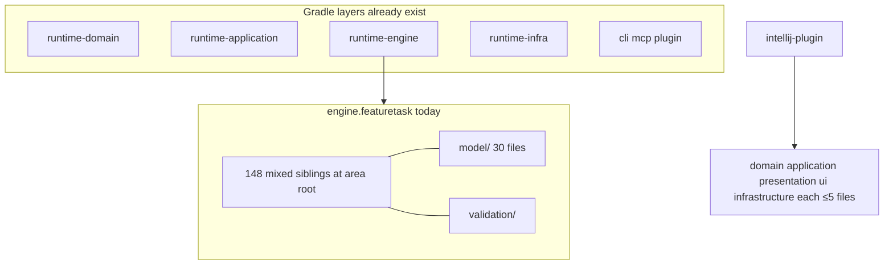

# Runtime package nesting investigation

## Assessment

The Gradle modules already are the layers: domain, application, engine, infrastructure, and the CLI/MCP/plugin entry adapters. The IntelliJ plugin already nests `domain`, `application`, `presentation`, `ui`, and `infrastructure` with at most five Kotlin files per directory. The failure is inside modules: mixed-responsibility area roots dump dozens to a hundred and forty-eight sibling files in one package, so the tree does not show structure.

`../../../docs/code-principles.md` already requires clustering by product area and noun family, with public inputs and results in area-owned `*.model` packages. The architecture test that should enforce that only scans `runtime-application`, `runtime-domain`, and `runtime-ports`. It also treats `model`, `validation`, `review`, `runner`, `planning`, and `persistence` as generic segments, so a fat parent next to those children is invisible. `skillbill.engine.featuretask` is the proof: `model/` (30 files) and `validation/` exist, and 148 other production files still sit in the parent.

This is a move-and-import change. Behaviour, module graph, phase order, and wire bytes stay the same. No new module, port, or framework.

Reviewed on 2026-09-19 at `503e25beb2d94340791c18ec5dfb3be1ff5a1c76` on `main` with a clean tracked tree. Scope: every production Kotlin directory under `runtime-kotlin` (1,901 files) and `intellij-plugin` (27 files). SHA-256 of the sorted runtime-kotlin production-file path list is `86adf9c7dc994b393f7a500110e157009588b627032fd092970393912d11c84a`. This is a whole-repo packaging investigation, not a diff review.

## Structure and ownership

Sibling production `.kt` counts of 15 or more:

| Files | Nested dirs | Package directory |
| --- | --- | --- |
| 148 | 3 | `engine/featuretask` |
| 67 | 0 | `workflow/taskruntime/model` |
| 59 | 4 | `engine/goalrunner` |
| 46 | 3 | `infrastructure/workflow` |
| 46 | 2 | `application/review` |
| 36 | 0 | `sqlite/workflow` |
| 32 | 1 | `engine/goalrunner/planning` |
| 31 | 5 | `infrastructure/skills` |
| 31 | 2 | `workflow/taskruntime` |
| 31 | 0 | `review/context/model` |
| 30 | 0 | `engine/featuretask/model` |
| 29 | 0 | `sqlite/core` |
| 28 | 0 | `sqlite/telemetry` |
| 28 | 0 | `sqlite/review` |
| 26 | 0 | `skillbill/error` |
| 24 | 0 | `skills/scaffold/runtime` |
| 23 | 0 | `contracts/workflow` |
| 22 | 0 | `skillbill/di` |
| 21 | 1 | `application/workflow` |
| 20 | 1 | `skills/scaffold/platformpack` |
| 20 | 0 | `sqlite/goalrunner` |
| 20 | 0 | `skills/install/nativeagent` |
| 20 | 0 | `infrastructure/contracts/workflow` |
| 19 | 0 | `cli/scaffold` |
| 18 | 0 | `ports/review/model` |
| 17 | 4 | `domain/review` |
| 17 | 0 | `cli/goal` |
| 16 | 0 | `domain/review/model` |
| 15 | 4 | `application/telemetry` |
| 15 | 1 | `ports/review` |
| 15 | 0 | `skills/scaffold/validation` |

`engine.featuretask` name families at the area root (148 files): Run 31, Phase 24, Subtask 10, Goal 9, Review 6, Finding 5, Runner 5, Checkpoint 4, then a long tail of Continuation, Remediation, Briefing, Persistence, Spec preparation, and one-off types. `model/` already holds lookup and finalisation models; the services that use them remain in the parent.

`intellij-plugin` is the target shape the user named: `domain`, `application`, `presentation`, `ui`, `infrastructure`, none above five files. Do not copy those layer names into `runtime-engine`; the modules already are those layers.

## Principles assessment

| Principle | Assessment and evidence |
| --- | --- |
| Module and package layout | Direction of modules is correct. Area roots violate "cluster by noun family" and the anti-pattern "loose files in a parent package when a child area cluster already exists." `PackageClusteringArchitectureTest` cannot see engine, infra, cli, contracts, or the plugin. F-001, F-006. |
| Single responsibility | `featuretask` and `goalrunner` mix run-loop, phase prompts, review, persistence, continuation, and launch in one package. F-001, F-002. |
| YAGNI and simplicity | Nesting by noun family inside the existing area. Android-style `domain`/`data`/`ui` packages under `featuretask` would duplicate Gradle modules and fight "not by type kind spanning areas." Rejected. |
| Documentation truth | `ARCHITECTURE.md` Package Ownership names area `.model` packages and does not state a sibling-count rule or that the clustering scanner omits engine. F-006. |
| Testing | No production test fails a fat mixed package. The clustering fixture only covers a `FeatureTask*` type left under `skillbill.application`. F-006. |

## Findings

- [F-001] Major | High | `../../../runtime-kotlin/runtime-engine/src/main/kotlin/skillbill/engine/featuretask` | 148 mixed-responsibility production files sit in the `featuretask` area root beside `model/` and `validation/`.
- [F-002] Major | High | `../../../runtime-kotlin/runtime-engine/src/main/kotlin/skillbill/engine/goalrunner` | 59 mixed files in the area root and 32 more in `planning/`; status, preflight, repair, launch, and manifest types share one list.
- [F-003] Major | Medium | `../../../runtime-kotlin/runtime-application/src/main/kotlin/skillbill/application/review` | 46 mixed files (parallel 17, spec, service, stats) in an area the clustering scanner already watches, because `review` is a generic segment.
- [F-004] Major | Medium | `../../../runtime-kotlin/runtime-domain/src/main/kotlin/skillbill/workflow/taskruntime` | 31 non-model siblings plus 67 files in `taskruntime.model` mixing handoff, repair, validation, phase, and audit noun families.
- [F-005] Major | Medium | `../../../runtime-kotlin/runtime-infra/workflow/src/main/kotlin/skillbill/infrastructure/workflow` | 46 mixed adapter files; sqlite `workflow` 36, `core` 29, `telemetry` 28, `review` 28; skills root 31.
- [F-006] Major | High | `../../../runtime-kotlin/runtime-core/src/test/kotlin/skillbill/architecture/PrincipleEnforcementInventory.kt` | Clustering source roots omit engine, infra, cli, contracts, core, and the plugin. Generic segments hide fat parents next to `model`/`validation`/`review`. There is no sibling-count ceiling.
- [F-007] Minor | Medium | `../../../runtime-kotlin/runtime-cli/src/main/kotlin/skillbill/cli` and `skillbill/di`, `skillbill/error` | CLI scaffold 19 and goal 17; composition root 22; error taxonomy 26. Nest when a second noun family is present or the ceiling is exceeded; `skillbill.di` stays one package only if a recorded decision names it as the sole composition root.

### F-001. Feature-task area root is a flat dump

The 148 files are run-loop orchestration (`FeatureTaskRuntimeRunLoop*.kt`, 23 files), phase prompt and recorder types, review and finding verification, persistence and artifact maps, continuation and crash repair, checkpoint and subtask finalisation, runner launch, and spec preparation. `featuretask.model` already exists (30 files) and `featuretask.validation` already exists. Services and lookup execution still live in the parent (`FeatureTaskContinuationLookupService.kt` next to `model/FeatureTaskContinuationLookupModels.kt`).

Target noun-family packages under `skillbill.engine.featuretask`, names adjustable during preplan if import direction stays acyclic and `model` does not import the parent:

| Package | Moves |
| --- | --- |
| `model` | Public inputs and results; keep current files; move remaining data-only types here |
| `validation` | Keep |
| `runloop` | `FeatureTaskRuntimeRunLoop*`, `RunState*`, `RunObservability*`, `AttemptBudgets` |
| `phase` | `FeatureTaskRuntimePhase*`, briefing, prompt composer and directives |
| `review` | Review drivers, finding verification, shared/scoped review evidence, `GoalSubtaskReviewInputWire` |
| `persist` | Workflow persistence, artifact maps, owned persistence boundary, handoff envelope decoders |
| `lifecycle` | Continuation lookup, crash and remediation, checkpoints, subtask finalisation, commit-push, worker, branch setup |
| `prepare` | Feature-spec preparation writer/runtime, spec source resolver, spec gate |
| `runner` | Runner execute/policies/outcomes, `LaunchResult`, status service |

At most the inbound facade types that do not belong to a child stay in the area root. Matching test files move with the production types.

### F-002. Goal-runner area root is the same shape

Fifty-nine files at `goalrunner/` plus 32 in `planning/`. Existing children: `../../../agent`, `findings/`, `model/`, `planning/`. Status, preflight, child repair, launch, and manifest types remain loose. Nest by those noun families. `planning/` at 32 files also exceeds a 12-file non-model ceiling and splits by noun family inside planning, not by dumping files back to the parent.

### F-003 through F-005. The rest of the repo repeats the dump

Application `review` (46), domain `taskruntime` (31 + 67-file model), infra `workflow` (46) and sqlite area stores, skills (31). Same rule: area `.model` for inputs and results; other types by noun family; tests follow. Do not introduce `domain`/`data`/`ui`/`presentation` packages inside these modules.

### F-006. The guard cannot see the dump

`packageClusteringSourceRoots` is application, domain, and ports. `packageClusteringGenericSegments` includes the noun-family names this goal will create (`model`, `review`, `runner`, `planning`, `persistence`, `validation`). Expanding only that scanner will not fail a 148-file parent. Add a sibling-count scanner over every production root including `intellij-plugin`, with a recorded ceiling: 12 sibling production `.kt` files in a non-model package, 20 in a `model` package. A shrinking remainder inventory names packages later subtasks still own; the inventory is empty when the goal finishes. The existing area-cluster scanner also adds engine, infra, cli, contracts, core, and plugin roots so a `FeatureTask*` type cannot sit loose under a parent that already has a non-generic area child.

### F-007. Homogeneous taxonomies still meet the ceiling

`skillbill.error` and `skillbill.di` are one noun family each. They still nest or gain a recorded decision if they stay above the ceiling. CLI `scaffold` and `goal` nest by command family when they exceed 12. Subtask 3's census is authority for those packages; this finding forbids leaving them uncounted.

## Rejected refactors

- Packages named `domain`, `data`, `ui`, or `presentation` under `featuretask` or other runtime areas. Those layers are the Gradle modules and, in the plugin, the existing top-level packages.
- Splitting Gradle modules or moving types across module boundaries.
- One package per file, or splitting file contents to satisfy a count.
- Using only the existing area-cluster scanner without a sibling-count ceiling.
- Permanent exemptions or new architecture baseline rows for fat packages.

## Test baseline

Evidence about `main` at `503e25beb`, not a future review receipt. Engine, domain, application, infra, cli, and `runtime-core` architecture tests compile on this tree. `intellij-plugin` has 27 production Kotlin files already nested.

## Limits

Same-package references need no import, so a text census of `import` lines under-counts coupling inside a fat parent. Compilation after `git mv` plus package-declaration rewrite is the authority. Generated Kotlin-Inject members are invisible to a filename census; do not make a `@Provides` type `internal` because a grep missed it.
