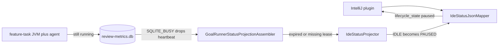

# IDE liveness and idle-as-pause investigation

## Assessment

The IntelliJ plugin showed **Paused** for SKILL-361 while subtask 3 audit was still running: parent `runtime-cli` JVM, child `feature-task resume`, and a Cursor agent were all alive, and the worktree was changing. `skill-bill goal status` reported `paused: false`, `pause_requested: false`, and `execution_liveness: idle`. Parent logs were `SQLITE_BUSY` on `agent_activity_stamp_persist` and `worktree_edit_journal_persist`.

Two seams produce that lie. `IdeStatusProjector` maps idle liveness to `lifecycle_state: paused`. Liveness itself becomes idle when the parent execution lease is missing or expired, without inspecting whether the owner process is still running. Lease heartbeats and activity stamps share one user-level SQLite file whose `busy_timeout` is 5s; under a live goal plus plugin polls those writes fail and the lease ages out.

Reviewed on 2026-09-19 at `6ba6649c3e378fa52b627513482b7458365d80fd`. Observed on SKILL-361 subtask 3 (`wftr-20260919-073155-wrnx`) while this repository's goal runner was in audit. This is an IDE-status and persistence investigation, not a diff review.

## Structure and ownership

`../../../orchestration/contracts/ide-status-schema.yaml` already enumerates `idle` next to `paused`. The plugin already maps `idle` to `SkillBillStatusOutcome.Idle`. The projector never emits idle for a running-but-lease-expired goal.

## Principles assessment

| Principle | Assessment |
| --- | --- |
| Observability | SQLITE_BUSY on stamps is recorded (`seam=agent_activity_stamp_persist value_used=failed`) then ignored for lifecycle. The operator sees pause, not a degraded read. F-002. |
| State ownership | Liveness is supposed to follow the execution lease and process inspect. Expired lease skips inspect and reports idle. A live JVM is invisible. F-003. |
| Documentation truth | Plugin Paused means operator pause in the UI (`Skill Bill: … paused`). The wire for an expired lease has no `paused_at`. F-001. |
| Testing | `IdeStatusServiceGoalProjectionTest` pins expired parent lease → paused without `paused_at`. That test is the wrong contract. F-001. |

## Findings

- [F-001] Major | High | `runtime-kotlin/runtime-engine/src/main/kotlin/skillbill/engine/work/IdeStatusProjector.kt:160` | `executionLiveness == IDLE` becomes `IdeStatusLifecycleState.PAUSED`. Operator pause (`projection.paused == true`) is a separate branch. `IdeStatusServiceGoalProjectionTest` `running goal whose parent lease expired projects paused anchored at the last heartbeat` requires that mislabel and asserts `paused_at` is absent.
- [F-002] Major | High | `runtime-kotlin/runtime-infra/sqlite/src/main/kotlin/skillbill/infrastructure/sqlite/core/schema/DatabaseRuntime.kt:142` | `PRAGMA busy_timeout = 5000` plus WAL (decision 2026-06-26) is not enough when the goal wait-loop, child stamps, worktree journal, and plugin status polls write the same file. `AgentActivityStampWriter.persist` and `WorktreeEditJournalWriter` catch SQLITE_BUSY, emit a warning, and return. Lost heartbeats let the lease expire.
- [F-003] Major | High | `runtime-kotlin/runtime-engine/src/main/kotlin/skillbill/engine/goalrunner/status/GoalRunnerStatusProjectionAssembler.kt:476` | `resolveParentExecutionLiveness` returns `IDLE` when the lease is missing or `expiresAt` is not after now. `livenessOfLeaseOwner` / `workerSupervisor.inspect` runs only for an unexpired lease. A live parent PID is not consulted once the heartbeat write failed.

### F-001. Idle is labelled paused

`goalLifecycleFromProjection` returns PAUSED for idle liveness on an otherwise ACTIVE candidate. The plugin mapper treats `lifecycle_state: paused` as `SkillBillStatusOutcome.Paused` and the status bar says paused. Schema and plugin already have `idle`. Expired lease without `controlState.paused` is not an operator pause.

### F-002. Best-effort writes lose the live signal

One global DB, 5s busy timeout, no application retry on stamp/journal persist. SKILL-361 logs showed repeated `database is locked` on stamps and journal ticks while the child was editing. Those failures are bounded diagnostics; status still reports idle.

### F-003. Expired lease skips process inspect

`livenessOfLeaseOwner` maps `ExactLive` / mismatch / unsupported to LIVE and `NotRunning` to IDLE. That inspect never runs if the lease row is expired. SQLITE_BUSY on the heartbeat write produces exactly that expired row while the JVM remains.

## Rejected refactors

- Per-project SQLite files (rejected in the 2026-06-26 decision: breaks cross-project metrics).
- A global application lock that forbids concurrent goals.
- Mapping idle to stale instead of idle; stale is a freshness window, not liveness.
- Raising `busy_timeout` alone without changing the idle→paused label; a genuine idle between phases would still show pause.

## Test baseline

`IdeStatusServiceGoalProjectionTest` and plugin `ProcessRunnerAndMapperTest` `fresh paused maps to Paused` are the tests that must change or gain a sibling: expired lease without operator pause must not be Paused. Engine liveness tests that idle means no unexpired lease stay; they must not feed IDE paused.

## Limits

Process inspect is host-specific. Tests should drive lease expiry, inspect results, and a busy SQLite writer, not SKILL-361's live agent. Compilation and the ide-status / sqlite suites are the authority.
