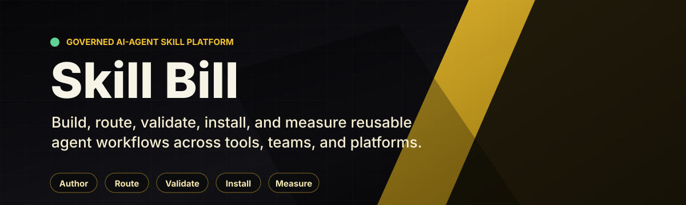
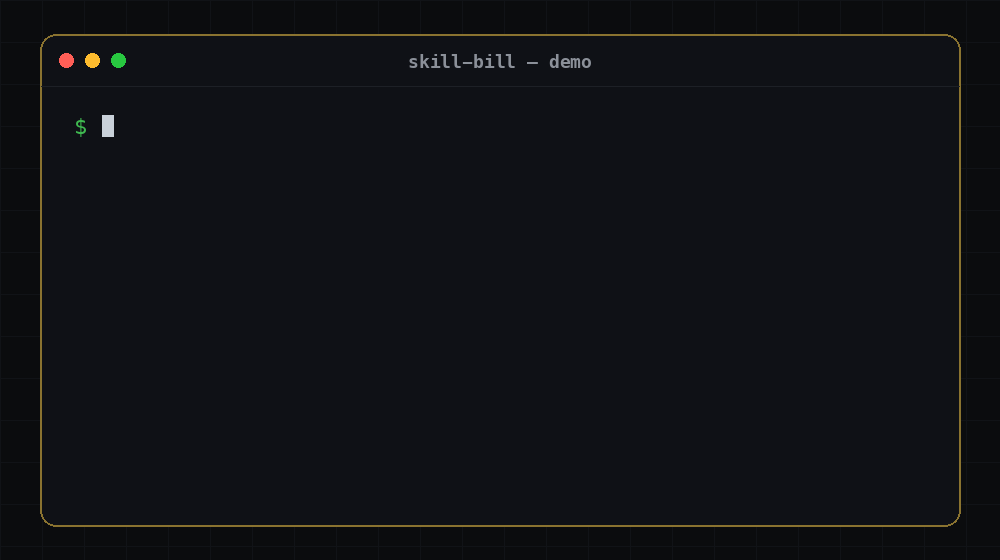

# Skill Bill


[](LICENSE)


Skill Bill takes feature work from an issue and acceptance criteria through planning, implementation, simplification, review, and a PR. A local runtime saves progress between phases, so interrupted work can continue from durable state.

Use it with Claude Code, Codex, or Cursor. You can run the full feature workflow or use individual review and quality-check skills. You review the resulting changes before merging. The project is pre-1.0.

[Quickstart](#quickstart) · [Workflow](#feature-workflow) · [Skills](#skills) · [Platform packs](#platform-packs) · [IDE integrations](#agents-and-ide-integrations) · [Execution matrix](#execution-matrix) · [Documentation](#learn-more)

## Quickstart

Install and authenticate your coding agent's CLI, then install Skill Bill:

```bash
curl -fsSL https://raw.githubusercontent.com/Sermilion/skill-bill/main/install.sh | bash
```

Choose your agents, platform packs, and telemetry level when prompted. The installer downloads a self-contained runtime, renders the selected skills, links them into agent directories, and registers the MCP server. Prebuilt installs need no system JDK or Gradle.

Check the installation:

```bash
skill-bill version
skill-bill doctor
```

Open your coding agent in the target repository and start a feature:

```text
/bill-feature APP-123 Add CSV export for the filtered orders list
```

Provide observable acceptance criteria and constraints. Skill Bill checks for existing work, prepares missing spec artifacts, and presents the execution plan for confirmation before launching. Use `/bill-feature-spec` to prepare a spec without starting implementation, or `/bill-code-review uncommitted` to review existing changes. These examples use slash notation; use your agent's skill invocation syntax.

<details>
<summary>Install requirements, PATH setup, and source builds</summary>

Prebuilt targets are `macos-arm64`, `macos-x64`, `linux-x64`, and `windows-x64`. The installer needs Bash, `curl`, `tar`, `unzip`, and either `shasum` or `sha256sum` to download and checksum-verify the release bundle and runtime images. On Windows, use a Bash environment with symlink support. The installer reports how to enable it when unavailable.

Feature work also needs the target project's build tools and credentials for any Git push or PR creation.

To inspect the installer before running it:

```bash
curl -fsSL https://raw.githubusercontent.com/Sermilion/skill-bill/main/install.sh -o install.sh
less install.sh
bash install.sh
```

If `skill-bill` is not found, add its launcher directory to your `PATH`. For the default directory, add this to your Bash or Zsh startup file:

```bash
export PATH="$HOME/.local/bin:$PATH"
```

A full local checkout builds from source by default. Contributors can make that choice explicit:

```bash
git clone https://github.com/Sermilion/skill-bill.git
cd skill-bill
./install.sh --from-source
```

Source builds require JDK 21 or newer. Set `SKILL_BILL_JAVA_HOME` if the installer cannot find a suitable JDK. Unsupported prebuilt hosts fall back to the source path and need its prerequisites. Use `bash install.sh --release <tag>` to select a published release; `--from-source` ignores release selection.

Runtime files and rendered skills live under `~/.skill-bill/`. User configuration lives at `~/.config/skill-bill/config.json` and survives reinstalling. `SKILL_BILL_CONFIG_PATH` overrides that location. See [Getting Started](docs/getting-started.md) for install paths and troubleshooting.

</details>

To update later:

```bash
skill-bill update-check
skill-bill update
```

## Feature workflow

`/bill-feature <issue-key>` prepares the spec, asks for confirmation, and launches the goal runtime. A small feature uses one subtask. Larger work can use dependency-ordered subtasks, each with a fresh execution context and durable handoff artifacts.

Each subtask follows these stages:

1. Pre-plan and plan the implementation using repository instructions and relevant durable artifacts.
2. Implement the plan, then run a mandatory simplification pass scoped to the subtask's changes.
3. Audit the acceptance criteria against the current code and tests, repairing gaps.
4. Run inline code review, verify findings, and apply bounded repairs.
5. Run the selected quality phase, then record relevant boundary history.
6. Commit and push the subtask. The goal prepares the PR after its subtasks complete.

The quality phases have different purposes:

| Phase or command | Checks |
| --- | --- |
| `validate` | An agent discovers and runs the project's required checks from repository instructions, build configuration, scripts, and CI. The runtime advances only when the agent reports that those checks passed. |
| `build` | Goal children selected for build run the dominant pack's declared build command and cache-bypassing confirmation. This proves buildability and does not run the full test suite. |
| Standalone quality check | `/bill-code-check` runs the pack's full collect-all quality gate and repairs findings. |

Specs live under `.feature-specs/`, with a parent spec, executable subtask specs, and a decomposition manifest. Local specs are the default; optional Linear-backed preparation records issues and supports spec rehydration. The default commit model leaves one commit per completed subtask on the feature branch.

The runtime saves phase outputs and continuation state in a local database. Resuming uses those records and the current repository. Invalid contracts or ambiguous continuation records stop the run with an explicit error.

<details>
<summary>Watch an illustrated feature run</summary>



This [scripted playback](docs/assets/generate_demo_gif.py) illustrates interruption and continuation. It is not a recording of the current runtime; the stages above describe current behavior.

</details>

### Inspect, pause, and continue

Run these from the repository that owns the goal:

| Command | Effect |
| --- | --- |
| `/bill-monitor APP-123` | Read-only goal snapshot inside an agent session |
| `skill-bill goal status APP-123` | Read-only goal state and subtask details |
| `skill-bill work status --format json` | Repository work snapshot used by the IDE integrations |
| `skill-bill goal pause APP-123` | Request a pause after the current subtask |
| `skill-bill goal stop APP-123` | Record an operator stop and terminate the running goal |
| `skill-bill goal resume APP-123` | Clear a durable pause without launching work |

To continue a paused goal from the CLI, clear its pause and launch it with an explicit agent:

```bash
skill-bill goal resume APP-123
skill-bill goal APP-123 --agent claude
```

Use the agent ID for your installed CLI, such as `claude`, `codex`, or `cursor`. `/bill-feature APP-123` also performs continuation preflight and presents the applicable launch gate. Recovery can use another compatible agent because workflow state belongs to Skill Bill.

## Review and quality checks

Name the work you want reviewed:

```text
/bill-code-review pr
/bill-code-review last
/bill-code-review uncommitted mode:inline
/bill-code-review staged mode:delegated
```

Review also accepts `unstaged` or a commit revision. Invoking `/bill-code-review` without arguments prints help and does not start a review.

`inline` is the default. It runs one review worker over the routed areas at reduced depth. `auto` also resolves to inline. `delegated` is the experimental full-depth mode, with separate specialist workers, and requires explicit `mode:delegated` on a standalone review. Feature and goal workflows accept `code-review:auto|inline` and use inline review. A required worker that cannot launch blocks the review rather than silently reducing its depth.

For the pack's full quality gate:

```text
/bill-code-check
```

The skill selects the dominant platform pack, runs its `validation_gate.collect_all_full_gate_command`, fixes the reported findings in the same session, and runs the pack's cache-bypassing confirmation. A missing gate is an error; the skill does not substitute another pack's commands.

## Skills

These are the user-facing entry points. Stack-specific review skills and the inline worker are internal.

| Skill | Purpose |
|-------|---------|
| `/bill-boundary-decisions` | Record architectural and implementation decisions in `agent/decisions.md` |
| `/bill-boundary-history` | Record reusable feature history in `agent/history.md` |
| `/bill-code-check` | Run the dominant pack's full quality gate and repair findings |
| `/bill-code-review` | Review a PR, commit, or working-tree change with inline or delegated depth |
| `/bill-feature` | Prepare or resume feature work, confirm the plan, and launch the goal runtime |
| `/bill-feature-guard` | Guard an implementation with a feature flag |
| `/bill-feature-guard-cleanup` | Remove a rolled-out feature flag and its legacy path |
| `/bill-feature-spec` | Prepare a parent spec, executable subtask specs, and a manifest without implementing |
| `/bill-feature-verify` | Verify a PR against a task spec or design doc |
| `/bill-monitor` | Inspect one goal with a read-only status snapshot |
| `/bill-pr-description` | Generate a PR title, description, and QA steps |
| `/bill-pr-review-fix` | Triage PR feedback, then apply selected fixes, reply, and push after approval |
| `/bill-unit-test-value-check` | Identify tests that cannot catch a realistic regression |
| `/bill-release` | Prepare a changelog, confirm the requested semver bump, and push an annotated tag |
| `/bill-update-check` | Compare the installed runtime version with GitHub releases |

## Platform packs

Platform packs live under `platform-packs/<slug>/`. Their manifests declare routing signals, review areas, native workers, add-ons, and quality commands. Discovery and routing use those declarations, so teams can add or replace packs without editing a hard-coded platform list.

| Pack | Scope |
| --- | --- |
| `generic` | Review fallback for unsupported, documentation-only, and unresolved paths; no full quality gate |
| `go` | Go modules and workspaces, services, libraries, and CLIs |
| `ios` | Native iOS, Swift, SwiftUI/UIKit, and Xcode/SPM projects |
| `kotlin` | Kotlin/JVM and the baseline review layer for KMP |
| `kmp` | Android and Kotlin Multiplatform, composed with the Kotlin baseline |
| `php` | PHP applications, services, and Composer projects |
| `python` | Python applications, libraries, services, and CLIs |
| `rust` | Rust crates and Cargo workspaces |
| `typescript` | TypeScript and TSX applications, libraries, and services |

The ten review areas are `architecture`, `performance`, `platform-correctness`, `security`, `testing`, `api-contracts`, `persistence`, `reliability`, `ui`, and `ux-accessibility`. KMP declares seven of its own and takes `performance`, `testing`, and `api-contracts` from Kotlin. KMP has its own quality gate with no Kotlin fallback. The other shipped packs each declare all ten review areas.

Concrete path ownership takes precedence over the generic review fallback. Content signals break ties between equal positive path matches. The fallback owner is manifest-declared and replaceable; declaring more than one fails validation.

Pack review skills install as internal sidecars of `/bill-code-review`. Invoke the parent skill; the stack-specific skills are not separate user commands. Pack validation checks specialist substance as well as manifest shape. See the [source-generation guide](docs/skill-source-generation.md) and [review substance standard](orchestration/review-orchestrator/platform-pack-substance-standard.md) for authoring requirements.

## Agents and IDE integrations

The installer supports Claude Code, Codex, Cursor, and JetBrains Junie. It generates each provider's skill and native-agent files from shared sources and registers the local MCP server. Runtime review launch support depends on the provider's isolation capabilities. Claude, Codex, and Cursor have governed review launch adapters; Junie's adapter currently rejects governed review launches that require tool and MCP isolation.

Two separately packaged IDE integrations show repository work status, planning progress, the active phase, and elapsed time:

- [IntelliJ plugin](intellij-plugin/README.md), distributed as a plugin ZIP under `plugin-v*` releases.
- [VS Code extension](vscode-extension/README.md), distributed as a VSIX under `extension-v*` releases.

Both offer stop and pause-after-subtask controls. Launch and resume stay in the CLI or agent session. Install the plugins from their release artifacts; they are separate from the Skill Bill runtime installer. Their READMEs include compatibility requirements and source build instructions.

## Execution matrix

Use `execution_matrix` to choose the model and effort for feature-task phases, including goal children. Add it to your machine-wide `~/.config/skill-bill/config.json`, or the file selected by `SKILL_BILL_CONFIG_PATH`. Merge it into the existing JSON object so your telemetry and other settings remain intact. These preferences apply across repositories; `.skill-bill/config.yaml` does not own them.

The matrix selects a model for the agent already assigned to a phase. It does not switch agents. You can configure several agents in one file and keep only the entries you use.

Each example below is a complete JSON object for one agent. To configure several agents, combine their entries under the same `execution_matrix.agents` object. Model availability depends on your provider and account; use model IDs accepted by your installed CLI.

### Claude Code

The `claude` entry accepts model aliases or full model IDs. The runtime forwards `effort` through Claude's `--effort` option.

```json
{
  "execution_matrix": {
    "agents": {
      "claude": {
        "reasoning": { "model": "opus", "effort": "high" },
        "implementation": { "model": "sonnet", "effort": "medium" }
      }
    }
  }
}
```

When using a custom `ANTHROPIC_BASE_URL`, the adapter lets `ANTHROPIC_MODEL` override a Claude model name or alias when that environment variable is set.

### Codex

The `codex` entry uses a model ID and optional reasoning effort. The runtime passes these through `--model` and `--config model_reasoning_effort=...`.

```json
{
  "execution_matrix": {
    "agents": {
      "codex": {
        "reasoning": { "model": "gpt-6-astra", "effort": "high" },
        "implementation": { "model": "gpt-5.6-sol", "effort": "medium" }
      }
    }
  }
}
```

### Cursor

The `cursor` entry uses model IDs from `agent --list-models`. This example selects a reasoning model with effort encoded in its ID and Composer for implementation.

```json
{
  "execution_matrix": {
    "agents": {
      "cursor": {
        "reasoning": { "model": "claude-opus-5-thinking-high" },
        "implementation": { "model": "composer-2.5" }
      }
    }
  }
}
```

For Cursor, a separate `effort` field becomes a model parameter, such as `model[effort=high]`. If the model already contains an `[effort=...]` parameter, the values must agree. For parameterized models with other options, put the complete model string in `model` and omit `effort`.

### Junie

Junie's runtime adapter does not support model or effort overrides. Omit `junie` from `execution_matrix.agents`. Assigning a directive to a Junie phase fails before launch.

<details>
<summary>Default phase tiers, per-phase overrides, and precedence</summary>

### Phase tiers and overrides

The default tier assignments are:

| Tier | Phases |
| --- | --- |
| `reasoning` | `plan`, `review`, `verify_findings`, `audit`, `validate` |
| `implementation` | `preplan`, `implement`, `simplify`, `implement_fix`, `build`, `write_history`, `commit_push`, `pr` |

These are model defaults for agent launches. They do not make runtime-owned operations, such as goal-subtask commit and push, launch an agent.

Use `phase_tiers` to move a phase to another tier for all configured agents. To override one phase for one agent, put the phase ID beside that agent's tier entries. For example, this moves `preplan` to the reasoning tier and gives Codex review its own effort setting:

```json
{
  "execution_matrix": {
    "phase_tiers": {
      "preplan": "reasoning"
    },
    "agents": {
      "codex": {
        "reasoning": { "model": "gpt-6-astra", "effort": "high" },
        "implementation": { "model": "gpt-5.6-sol", "effort": "medium" },
        "review": { "model": "gpt-6-astra", "effort": "xhigh" }
      }
    }
  }
}
```

Resolution order is an explicit `feature-task --phase-model phase=model@effort` assignment, then the agent's phase entry, then its tier entry. With no matching directive, Skill Bill leaves model selection to the provider's launch defaults. The `--phase-model` option belongs to the lower-level `skill-bill feature-task run` and `resume` commands, not `skill-bill goal` or `/bill-feature`.

Every directive requires a non-blank `model`. Omit `effort` to leave it unspecified; an empty string or `null` is invalid. Unknown fields, agent IDs, phase IDs, and tier names fail with the offending config path. The runtime validates this structure; the provider validates model availability and supported effort values.

</details>

## Customize and extend

Put repository-wide instructions in `AGENTS.md` and skill-specific guidance in `.agents/skill-overrides.md`. The [override example](.agents/skill-overrides.example.md) shows the section format. Boundary history and decisions live beside the code in area-owned `agent/history.md` and `agent/decisions.md` files.

Platform-pack add-ons supply stack-specific guidance after routing. [External add-on sources](docs/external-addons.md) let teams keep private guidance outside the shared repository.

Agent add-ons are separate, explicitly selected extensions. The shipped `execution-budget` add-on applies to Codex feature work and reinforces the user's stopping boundary, compact handoffs, and delegation constraints:

```text
/bill-feature APP-123 agent-addon:execution-budget
```

Its source is `agent-addons/<slug>/agent-addon.yaml` plus `content.md`. See [agent add-on authoring](docs/skill-source-generation.md#agent-add-on-authored-sources) for compatibility, precedence, staging, and resume behavior.

To author skills or packs, start with `skill-bill new`, then use `show`, `fill`, `edit`, `validate`, and `render`. Authored skill content lives in `content.md`. The installer generates `SKILL.md`, support pointers, and provider-specific native-agent files into staging; those generated files do not belong in source. Re-run `./install.sh` after changing skill sources, rendering, or support pointer generation.

See [Contributing](CONTRIBUTING.md), [source generation](docs/skill-source-generation.md), and the [scaffold payload contract](orchestration/shell-content-contract/SCAFFOLD_PAYLOAD.md) before changing these contracts. The runtime, IntelliJ plugin, and VS Code extension have separate builds.

## Telemetry

The default telemetry level is `anonymous`. The installer lets you choose `anonymous`, `full`, or `off`. Events go to the configured telemetry proxy, using the shipped relay by default. You can [self-host the proxy](docs/cloudflare-telemetry-proxy/README.md).

To disable transmission:

```bash
skill-bill telemetry disable
```

Some diagnostic events still queue locally while telemetry is off. [Telemetry Privacy](docs/telemetry-privacy.md) documents the fields, destinations, correlation identifiers, retention, and what happens if you enable telemetry later. Workflow state remains local and supports continuation independently of telemetry transmission.

## Learn more

- [Getting Started](docs/getting-started.md): installation, CLI commands, MCP tools, and recovery.
- [Getting Started for Teams](docs/getting-started-for-teams.md): rollout and project customization.
- [Capability Deep-dive](docs/capabilities.md): workflows, packs, memory, and governance.
- [Token Economy](docs/token-economy.md): bounded context and durable handoffs for long goals.
- [Review Telemetry](docs/review-telemetry.md): review measurements, learnings, and local statistics.
- [Runtime Architecture](runtime-kotlin/ARCHITECTURE.md): module ownership, persistence, and contract enforcement.
- [Observability Policy](docs/observability-policy.md): required records for failures and degraded behavior.
- [Teams Roadmap](docs/team-control-plane-roadmap.md): proposed hosted team controls and open product questions.

## License

Skill Bill is licensed under the [MIT License](LICENSE). See the
[licensing summary](docs/licensing.md) for details.
